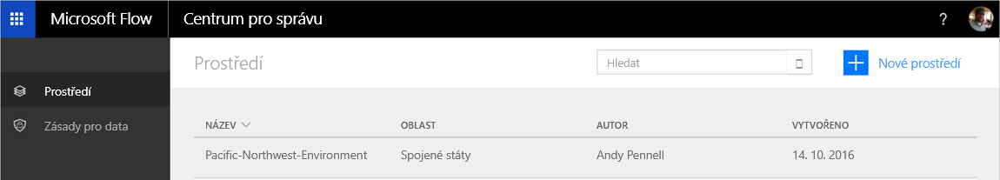
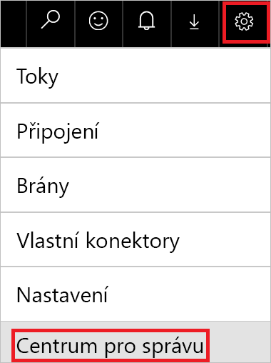

Vítejte v Centru pro správu!Welcome to the Admin center! Centrum pro správu je centrální umístění, ve kterém správci tenantů a správci prostředí spravují zásady pro data a prostředí dané organizace.The Admin center is the central location where tenant admins and environment admins manage an organization's data policies and environments. Všechny změny provedené v Centru pro správu jsou okamžitě dostupné uživatelům v organizaci.Any changes that you make in the Admin center are immediately available to users in the organization.

V tomto modulu se naučíte:In this module, you'll learn how to:

- Řešit potíže s tokyTroubleshoot flows.
- Import a export tokyImport and export flows.
- Sdílet tokyShare flows.
- Monitorovat tokyMonitor flows.

## Otevření Centra pro správuOpen the Admin center
Existují dva způsoby, jak otevřít Centrum pro správu.There are two ways to open the Admin center.

### 1. možnost: Výběr nastaveníOption 1: Select settings

1. Přejděte na [flow.microsoft.com](https://flow.microsoft.com) a přihlaste se pod účtem své organizace.Go to [flow.microsoft.com](https://flow.microsoft.com), and sign in by using your organizational account.
1. Vyberte tlačítko **Nastavení** (symbol ozubeného kola) a pak vyberte v nabídce **Centrum pro správu**.Select the **Settings** button (the gear symbol), and then select **Admin Center** on the menu.

    

    Otevře se Centrum pro správu.The Admin center is opened.

### 2. možnost: Otevření stránky admin.flow.microsoft.comOption 2: Open admin.flow.microsoft.com

- Přejděte na [admin.flow.microsoft.com](https://admin.flow.microsoft.com) a přihlaste se svým pracovním účtem.Go to [admin.flow.microsoft.com](https://admin.flow.microsoft.com), and sign in by using your work account.

## ProstředíEnvironments

*Prostředí* je prostor, kde můžete ukládat, spravovat a sdílet obchodní data, aplikace a toky vaší organizace.An *environment* is a space where you can store, manage, and share your organization's business data, apps, and flows. Slouží také jako kontejner k oddělení aplikací, které by mohly mít různé role, požadavky na zabezpečení nebo cílové skupiny.It also serves as a container to separate apps that might have different roles, security requirements, or target audiences.

Způsob, jakým používáte prostředí, závisí na vaší organizaci a aplikacích, které se pokoušíte zkompilovat.The way that you use environments depends on your organization and the apps that you're trying to build. Zde je několik příkladů:Here are some examples:

- Můžete vytvořit samostatná prostředí k seskupování testovacích a produkčních verzí svých aplikací.You can create separate environments to group the test and production versions of your apps.
- Můžete vytvořit samostatná prostředí, která odpovídají konkrétním týmům nebo oddělením ve vaší společnosti.You can create separate environments that correspond to specific teams or departments in your company. Každé prostředí obsahuje relevantní data a aplikace pro každý tým nebo oddělení.Each environment holds the relevant data and apps for each team/department.
- Můžete vytvořit samostatná prostředí pro různé globální pobočky vaší společnosti.You can create separate environments for different global branches of your company.
- Můžete kompilovat všechny svoje aplikace v jednom prostředí.You can build all your apps in a single environment.

## Zásady pro dataData policies

Pokud používáte Microsoft Flow, data jsou automaticky chráněna pomocí rolí zabezpečení, které má vaše organizace už zavedené.When you use Microsoft Flow, the data is automatically protected with whatever security roles your organization already has in place. Pomocí Microsoft Flow není možné získat přístup k informacím, ke kterým už uživatel nemá přístup v organizaci.It isn't possible to use Microsoft Flow to get access to information that the user doesn't already have access to in the organization. Některé organizace se můžou rozhodnout, že bude vhodné přidat další volitelnou vrstvu zabezpečení, která může aktivně blokovat toky, které porušují určité zásady.Some organizations may want to add an additional, optional layer of security that can proactively block flows that violate certain policies.
