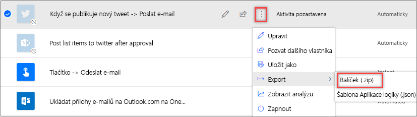

Můžete exportovat a pak importovat tok tak, aby ho ostatní mohli používat.You can export and then import a flow so that others can use it.

## Export tokuExport a flow

1. Přejděte na Microsoft Flow a přihlaste se pod účtem své organizace.Go to Microsoft Flow, and sign in by using your organizational account.
1. V levém podokně vyberte **Moje toky**.In the left pane, select **My flows**.
1. Pro tok, který chcete exportovat, vyberte tlačítko **Více příkazů** (tří svislé tečky), vyberte **Exportovat** a pak vyberte **Balíček (.zip)**.For the flow that you want to export, select the **More commands** button (the three vertical dots), select **Export**, and then select **Package (.zip)**.

    

1. Zadejte informace o balíčku:Fill in information about the package:

    - **Název**: Zadejte název toku.**Name**: Enter a name for the flow.
    - **Prostředí**: Zadejte prostředí pro příslušný tok.**Environment**: Enter the environment for the flow.
    - **Popis**: Zadejte popis toku.**Description**: Enter a description of the flow.
    - **Zkontrolovat obsah balíčku**: Vyberte možnosti exportu a přidejte komentáře s pokyny nebo přidejte poznámky k verzi.**Review package content**: Select export options, and add comments to provide instruction or add version notes.

1. Vyberte **Exportovat** a exportujte soubor zip.Select **Export** to export the zip file. Potom můžete vybrat složku, do které chcete soubor stáhnout.You can then select the folder to download to.

Při exportu toku se do balíčku exportují také závislé prostředky pro váš tok.When you export a flow, the dependent resources for your flow are also exported into the package.

## Import tokuImport a flow

Jakmile byl tok exportován, může ho každý uživatel, kterému pošlete soubor zip, naimportovat.After a flow has been exported, anyone that you send the zip file to can import it.

1. Přejděte na Microsoft Flow a přihlaste se pod účtem své organizace.Go to Microsoft Flow, and sign in by using your organizational account.
1. V levém podokně vyberte **Moje toky**.In the left pane, select **My flows**.
1. Vyberte **Importovat**.Select **Import**.

    

1. Na stránce **Importovat balíček** vyberte **Nahrát** a pak v dialogovém okně vyberte soubor zip, který jste exportovali.On the **Import package** page, select **Upload**, and then, in the dialog box, select the zip file that you exported.
1. Zpět na stránce **Importovat balíček** vyberte **Importovat**.Back on the **Import package** page, select **Import**.

    - V nastavení toku můžete vybrat, jestli chcete vytvořit nový tok nebo aktualizovat stávající tok pomocí definice toku z balíčku.In the flow settings, you can select whether to create a new flow or update an existing one with the flow definition from the package.
    - Jako součást procesu importu je také nutné vybrat připojení, která jsou potřeba k nastavení toku.You must also select the connections that are required to set up the flow as part of the import process.
    - Tlačítko **Importovat** by mělo být k dispozici po provedení všech požadovaných nastavení.The **Import** button should become available after you've set all the required settings.

1. Po dokončení importu toku vyberte **Uložit Microsoft Flow**.After the flow is completely imported, select **Save Microsoft Flow**.
