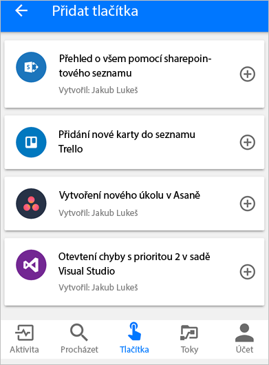

V mobilní aplikaci Microsoft Flow můžete sdílet toky aktivované tlačítkem s dalšími uživateli nebo skupinami ve vaší organizaci.In the Microsoft Flow mobile app, you can share button flows with other users or groups in your organization. Uživatelé nebo skupiny, s kterými sdílíte tlačítko, ho potom můžou používat stejným způsobem, kterým používají vlastní tlačítka.The users or groups that you share a button with can then run it the same way they run their own buttons.

Můžete také sdílet odkaz na tlačítka, která s vámi sdílí někdo jiný.You can also share a link to buttons that another person shared with you.

Sdílení tlačítka můžete kdykoliv ukončit.You can stop sharing your buttons at any time.

Snímky obrazovky v této lekci jsou pořízené na zařízení Google Android.The screenshots in this unit were taken on a Google Android device. Pokud používáte Apple iPhone, můžou se zobrazené položky lišit, ale funkce jsou stejné.If you're using an Apple iPhone, what you see might differ, but the functionality is the same.

## PožadavkyPrerequisites

Ke sdílení tlačítek budete potřebovat:To share buttons, you need:

* Účet, který má přístup k [Microsoft Flow](https://flow.microsoft.com)An account that has access to [Microsoft Flow](https://flow.microsoft.com).
* Tok ke sdíleníA flow to share.
* Mobilní zařízení s mobilní aplikací Microsoft Flow pro [Android](https://aka.ms/flowmobiledocsandroid), [Apple iOS](https://aka.ms/flowmobiledocsios) nebo [Windows Phone](https://aka.ms/flowmobilewindows)A mobile device that has the Microsoft Flow mobile app for [Android](https://aka.ms/flowmobiledocsandroid), [Apple iOS](https://aka.ms/flowmobiledocsios), or [Windows Phone](https://aka.ms/flowmobilewindows).
* Osoba nebo skupina ve vaší organizaci, s kterou budete tlačítko sdíletA person or group in your organization to share your button with.

## Sdílení tlačítkaShare a button

Tlačítko se dá sdílet pomocí karty **Tlačítka** v mobilní aplikaci Microsoft Flow.You share a button by using the **Buttons** tab of the Microsoft Flow mobile app.

1. Spusťte mobilní aplikaci Microsoft Flow.Start the Microsoft Flow mobile app.
1. Na kartě **Tlačítka** vyberte symbol osoby vedle tlačítka, které chcete sdílet.On the **Buttons** tab, select the person symbol next to the button that you want to share.

    

1. Na stránce **Uživatelé** vyberte **Pozvat další**.On the **Button users** page, select **Invite others**.

    

1. Vyhledejte a vyberte osobu nebo skupinu, s kterou chcete sdílet tlačítko.Search for and select the person or group that you want to share the button with.

    

1. Na stránce **Pozvat další** vyberte **Odeslat**.On the **Invite others** page, select **Send**.

    

1. Na stránce s oznámením, že akce sdílení tlačítka proběhla úspěšně, vyberte **Hotovo**.On the page that states that the button sharing action was successful, select **Done**.

    

## Jak vyžadovat, aby uživatelé používali vlastní připojeníRequire users to use their own connections

Když sdílíte tlačítko s někým jiným, můžete buď nechat, aby používal všechna připojení, která používá tlačítko, nebo vyžadovat, aby používal svoje vlastní připojení.When you share a button with other people, you can either let them use all the connections that the button uses or require that they use their own connections. Pomocí tohoto postupu nastavíte požadavek, aby osoby, s kterými sdílíte tlačítko, používaly svoje vlastní připojení.Follow these steps to require the people that you share your button with to use their own connections.

> [!NOTE]
> Pokud necháte ostatní používat vaše připojení, nebudou mít přístup k přihlašovacím údajům vašeho připojení.If you let other people use your connections, they can't access the credentials in your connection. Nebudou moct ani tato připojení použít v žádném jiném toku.They also can't reuse those connections in any other flow.

1. Na stránce, která se zobrazí hned po nasdílení tlačítka, vyberte **Spravovat připojení**.On the page that appears immediately after you share a button, select **Manage connections**.
1. Vyberte **Upravit** u tlačítka, které chcete spravovat.Select **Edit** for the button that you want to manage.
1. Vyberte **Poskytnuto uživatelem** nebo svoji e-mailovou adresu, abyste mohli určit, čí připojení se musí ve sdíleném tlačítku používat.Select **Provided by user** or your email address to specify whose connections must be used in the shared button.

    

    Vybrané možnosti můžete kdykoliv zobrazit nebo změnit.You can view or change your selection at any time.

    1. Na kartě **Toky** vyberte tok, který jste nasdíleli.On the **Flows** tab, select the flow that you shared.
    1. Na stránce **Uživatelé a připojení** vyberte na kartě **Připojení** možnost **Upravit** u tlačítka, které chcete spravovat.On the **Users and connections** page, on the **Connections** tab, select **Edit** for the button that you want to manage.

    

## Zobrazení seznamu uživatelů tlačítkaView the list of button users

Pomocí následujících kroků můžete zobrazit všechny uživatele nebo skupiny, s kterými se tlačítko sdílí.You can view all users or groups that a button is shared with by following these steps.

1. Na kartě **Tlačítka** vyberte symbol osoby vedle tlačítka pro tok, které chcete zobrazit.On the **Buttons** tab, select the person symbol next to the button for the flow that you want to view.

    

1. Na stránce **Uživatelé** najdete všechny skupiny nebo uživatele, s kterými se tlačítko sdílí.On the **Button users** page, view all groups or users that the button is shared with.

    

## Ukončení sdílení tlačítkaStop sharing a button

Pomocí následujících kroků můžete ukončit sdílení tlačítka.You can stop sharing a button by following these steps.

1. Na kartě **Tlačítka** vyberte symbol osoby vedle tlačítka, které už nechcete sdílet.On the **Buttons** tab, select the person symbol next to the button that you no longer want to share.

    

1. Na stránce **Uživatelé** vyberte uživatele nebo skupinu, s kterou chcete ukončit sdílení tlačítka.On the **Button users** page, select the user or group that you want to stop sharing the button with.

    

1. Na stránce tohoto uživatele vyberte **Odebrat uživatele**.On the user's page, select **Remove user**.

    

1. Počkejte na dokončení akce.Wait for the removal action to be finished. Seznam na stránce **Uživatelé** se aktualizuje a odebraný uživatel nebo skupina už v seznamu nebude.The list on the **Button users** page is refreshed, and the user or group that you removed is no longer listed.

    

## Monitorování historie spuštěníMonitor the run history

Můžete si zobrazit celou historii spuštění, i pro spuštění osobou, s kterou je tlačítko sdílené.You can view the whole run history, even for runs started by a person that a button is shared with.

1. Spusťte mobilní aplikaci Microsoft Flow.Start the Microsoft Flow mobile app.
1. Vyberte kartu **Aktivita**, na které najdete historii spuštění.Select the **Activity** tab to view the run history.

## Použití sdílených tlačítekUse shared buttons

Předtím, než budete moct spustit tlačítko, které s vámi někdo sdílí, je třeba ho přidat na vaši kartu **Tlačítka** ze stránky **Přidat tlačítka**.Before you can run a button that someone has shared with you, you must add it to your **Buttons** tab from the **Add buttons** page.

1. Na kartě **Tlačítka** vyberte možnost **Získat více** (nebo banner **Jsou k dispozici nová tlačítka**, pokud se zobrazí).On the **Buttons** tab, select **Get more** (or the **New buttons are available** banner if it appears).

    

1. Vyberte tlačítko, které chcete použít.Select the button to use.

    Tlačítko se hned přidá na kartu **Tlačítka**. Pak můžete tlačítko spustit z karty **Tlačítka**, stejně jako jakékoliv jiné tlačítko, který je tam uvedené.The button is immediately added to the **Buttons** tab. You can then run the button from the **Buttons** tab, just like any other button that's listed there.

    

## Opětovné sdílení tlačítkaRe-share a button

Můžete sdílet odkaz na tlačítko, které s vámi někdo sdílí.You can share a link to a button that has been shared with you.

1. Na kartě **Tlačítka** vyberte tlačítko **Víc příkazů** (**...**) vedle tlačítka, které chcete sdílet.On the **Buttons** tab, select the **More commands** button (**...**) next to the button that you want to share.

    

1. Vyberte **Sdílet odkaz na tlačítko**.Select **Share button link**.

    

1. Vyberte aplikaci, kterou chcete použít ke sdílení tlačítka.Select the app that you want to use to share the button.
1. Podle zobrazeného postupu odešlete tlačítko osobě, se kterou ho chcete sdílet.Follow the steps for sending a button to a person that you want to share it with.

## Ukončení používání sdíleného tlačítkaStop using a shared button

Pokud už nechcete používat tlačítko, které s vámi někdo sdílel, můžete ho odebrat.If you no longer want to use a button that was shared with you, you can remove it.

1. Na kartě **Tlačítka** vyberte tlačítko **Víc příkazů** (**...**) vedle tlačítka, které už nechcete používat.On the **Buttons** tab, select the **More commands** button (**...**) next to the button that you no longer want to use.

    

1. Vyberte **Odebrat**.Select **Remove**.

> [!NOTE]
> Jakmile odeberete sdílené tlačítko, můžete ho přidat zpátky tak, že vyberete **Získat více** na kartě **Tlačítka**.After you remove a shared button, you can add it back by selecting **Get more** on the **Buttons** tab.
