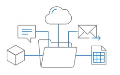
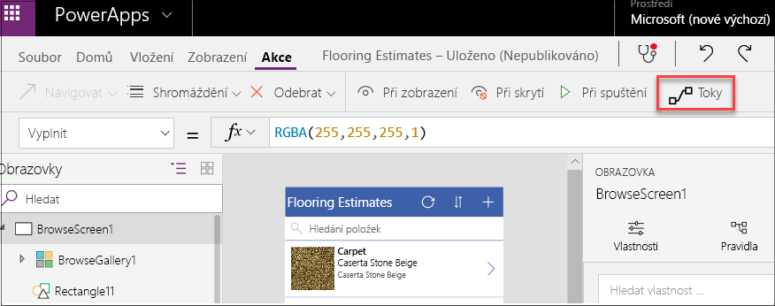
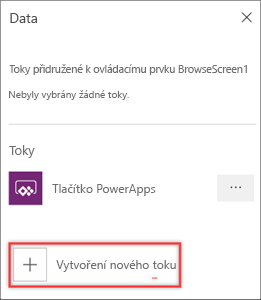
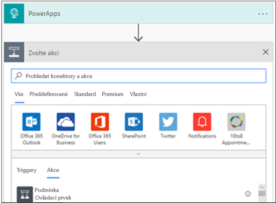
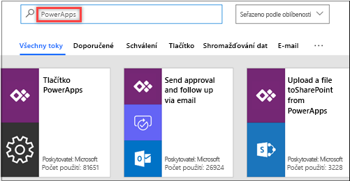
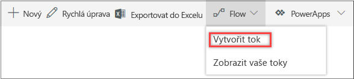
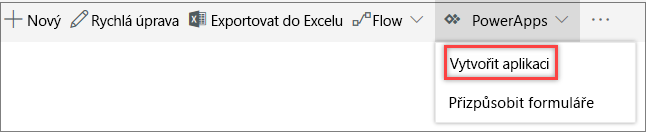

Data, která jsou hnacím motorem obchodních procesů, jsou často uložená v oddělených systémech, ke kterým se obtížně připojuje a které mají obtížnou navigaci.The data that fuels business processes is often buried in separate systems that are difficult to connect to and navigate. To je i jeden z důvodů, proč jsou obchodní procesy čím dál složitější a pro uživatele jsou zdrojem nekonečných starostí.This is one reason why business processes don't stop becoming complex, and why people rarely stop worrying about them. 

Microsoft Dynamics 365 s Microsoft Flow, Microsoft PowerApps a Microsoft SharePoint celé řešení zjednodušují.But Microsoft Dynamics 365 with Microsoft Flow, Microsoft PowerApps, and Microsoft SharePoint makes it all easier. Společně tyto aplikace a služby nabízejí tyto výhody:Together, these apps and services provide these advantages:

- Na data můžete jednoduše klepnout.The data can easily be tapped. 
- Důležitá obchodní rozhodnutí můžou být rychlejší a inteligentnější.Critical business decisions can be made more quickly and more intelligently.
- Lidé se nemusí tolik starat o svá data, ale můžou se soustředit na rozvoj své činnosti.People can worry less about what their data is doing and concentrate more on moving their business forward.

V této lekci získáte přehled o:This unit gives an overview of:

- Integraci Microsoft Flow do PowerAppsIntegration of Microsoft Flow with PowerApps.
- Integraci Microsoft Flow a PowerApps do SharePointu kvůli jednoduchému sdílení dat v seznamech.Integration of Microsoft Flow and PowerApps with SharePoint for easy sharing of data in lists.

## Přidání toku v PowerAppsAdd a flow in PowerApps

Přidání toku v aplikaci PowerApps je úplně jednoduché.Adding a flow to a PowerApps application is very straightforward.

1. Přejděte na [https://web.powerapps.com](https://web.powerapps.com) a přihlaste se pod účtem své organizace.Go to [https://web.powerapps.com](https://web.powerapps.com), and sign in by using your organizational account.
1. Otevřete aplikaci na úpravy.Open your app for editing.
1. Na panelu nástrojů vyberte na kartě **Akce** možnost **Toky**.On the **Action** tab, select **Flows** on the toolbar.

    

1. V dialogovém okně **Data** vyberte **Vytvořit nový tok**.In the **Data** dialog box, select **Create a new flow**.

    

    Microsoft Flow se spustí a zobrazí začátek nového toku, ve kterém je triggerem PowerApps.Microsoft Flow is started and shows the beginning of a new flow where PowerApps is a trigger. 

    

Další informace o vytváření toků najdete v tématu [Vytvoření toku ze šablony ve službě Microsoft Flow](https://docs.microsoft.com/flow/get-started-logic-template).For more about how to create flows, see [Create a flow from a template in Microsoft Flow](https://docs.microsoft.com/flow/get-started-logic-template).

## Přidání aplikace PowerApps z Microsoft FlowAdd a PowerApps application from Microsoft Flow

Nebo můžete postupovat opačně.You can also go in the other direction. Můžete spustit Microsoft Flow a vybrat šablonu, kterou přidáte aplikaci z PowerApps.You can start in Microsoft Flow and then select a template to add an app from PowerApps.

1. Spusťte Microsoft Flow a přihlaste se pomocí účtu organizace.Launch Microsoft Flow and sign in using your organizational account.
1. V levém podokně vyberte **Šablony**.In the left pane, select **Templates**.
1. Vyberte některou z mnoha šablon PowerApps.Select one of the many PowerApps templates.

    Pokud si chcete prohlédnout všechny dostupné šablony PowerApps, zadejte do vyhledávání *PowerApps*.To see all the PowerApps templates that are available, you can enter search for *PowerApps*.

    

    Když se šablona otevře, můžete začít vytvářet tok.The template is opened, and you can start building your flow.

Další informace o vytváření aplikací v PowerApps najdete v článku [Vytvoření aplikace plátna ze šablony v PowerApps](https://docs.microsoft.com/powerapps/maker/canvas-apps/get-started-test-drive).For more about how to create apps by using PowerApps, see [Create a canvas app from a template in PowerApps](https://docs.microsoft.com/powerapps/maker/canvas-apps/get-started-test-drive).

## Integrace SharePointu do Microsoft FlowIntegration of SharePoint with Microsoft Flow

U zákazníků pravidelně dochází k výměně dat mezi seznamy SharePointu a jinými systémy, které podporují obchodní procesy.Customers regularly exchange data between SharePoint lists and other systems to support business processes. Díky důsledné integraci Microsoft Flow do seznamů SharePointu budou tyto scénáře ještě výkonnější.These scenarios become more powerful through the deep integration of Microsoft Flow with SharePoint lists. 

Microsoft Flow automatizuje výměnu pracovních postupů a dat mezi SharePointem a různými službami poskytovanými Microsoftem nebo třetí stranou.Microsoft Flow automates the exchange of workflows and data between SharePoint and a variety of Microsoft and third-party services. Toky teď můžete vytvářet a spouštět přímo ze seznamu SharePointu a data v SharePointu ukládat i měnit.You can now create and start flows directly from a SharePoint list, and store and change that data in SharePoint.

1. V seznamu SharePointu vyberte nahoře na panelu nástrojů **Tok** a pak vyberte **Vytvořit tok**.From a SharePoint list, select **Flow** on the top toolbar, and then select **Create a flow**.

    

2. V podokně **Vytvořit tok** vyberte šablonu, kterou chcete použít.In the **Create a flow** pane, select the template to use.

    Spustí se služba Microsoft Flow, ve které vytvoříte tok.Microsoft Flow is started, and you can finish creating the flow.

## Integrace SharePointu do PowerAppsIntegration of SharePoint with PowerApps

V PowerApps se můžete během několika minut připojit k obchodní aplikaci na libovolném zařízení, tuto aplikaci vytvořit nebo ji sdílet.PowerApps lets you connect to, create, and share business apps on any device in minutes. Přímo ze seznamu SharePointu můžete vytvářet efektivní mobilní formuláře a aplikace bez napsání jediného řádku kódu.You can build efficient mobile forms and apps directly from a SharePoint list, without writing a line of code. 

PowerApps a Microsoft Flow sdílejí společné konektorové rozhraní. Díky němu můžete spojovat desítky zdrojů dat, které jsou uložené místně nebo v cloudu.PowerApps and Microsoft Flow share a common connector framework that lets you weave in dozens of data sources that are located on premises or in the cloud. Mezi tyto zdroje dat patří Microsoft Exchange, Microsoft SQL Server, Microsoft Dynamics, Salesforce, Google, MailChimp, Twitter a Wunderlist.These data sources include Microsoft Exchange, Microsoft SQL Server, Microsoft Dynamics, Salesforce, Google, MailChimp, Twitter, and Wunderlist.

1. V seznamu SharePointu vyberte nahoře na panelu nástrojů **PowerApps** a pak vyberte **Vytvořit aplikaci**.From a SharePoint list, select **PowerApps** on the top toolbar, and then select **Create an app**.

    

2. V podokně **Vytvořit aplikaci** zadejte název aplikace a vyberte **Vytvořit**.In the **Create an app** pane, enter a name for your app, and then select **Create**.

    Spustí se služba Microsoft Flow, ve které vytvoříte aplikaci.PowerApps is started, and you can finish creating the app.
