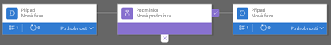

Tato lekce ukazuje, jak vytvořit tok obchodního procesu pomocí Microsoft PowerApps.This unit shows how to create a business process flow by using Microsoft PowerApps.

Další informace o tom, jak vytvořit tok mobilní úlohy, najdete v tématu [Vytvoření toku mobilní úlohy](https://docs.microsoft.com/dynamics365/customer-engagement/customize/create-mobile-task-flow).For more about how to create a mobile task flow, see [Create a mobile task flow](https://docs.microsoft.com/dynamics365/customer-engagement/customize/create-mobile-task-flow).

Když uživatel spustí tok obchodního procesu, řádek procesu v horní části stránky zobrazuje fáze a kroky daného procesu.When a user starts a business process flow, the process bar at the top of the page shows the stages and steps of the process.

> [!TIP]
> Když vytváříte definici toku obchodního procesu, můžete definovat, kdo bude mít oprávnění vytvořit, číst, aktualizovat nebo odstranit instance toku obchodního procesu.When you create a business process flow definition, you can define who has privileges to create, read, update, or delete instances of the business process flow. Například u procesů souvisejících se službami můžete pracovníkům služeb pro zákazníky udělit úplný přístup, který umožňuje změnit instanci toku obchodního procesu.For example, for service-related processes, you might give customer service reps full access to change the business process flow instance. Obchodním zástupcům však můžete udělit přístup k instanci jen pro čtení, aby mohli u svých zákazníků monitorovat poprodejní aktivity.But you might give sales reps just read-only access to the instance, so that they can monitor post-sales activities for their customers. Pokud pro vytvořenou definici toku obchodního procesu chcete nastavit zabezpečení, vyberte na panelu akcí **Povolit role zabezpečení**.To set security for a business process flow definition that you create, select **Enable Security Roles** on the action bar.

## Vytvoření toku obchodního procesuCreate a business process flow

1. Spusťte Microsoft Flow a přihlaste se pomocí účtu organizace.Launch Microsoft Flow and sign in using your organizational account.
1. V levém podokně vyberte **Toky**.In the left pane, select **Flows**.
1. Na horním panelu vyberte **Toky obchodního procesu**.On the top bar, select **Business process flows**.
1. Napravo vyberte **Vytvořit z prázdné**.On the right, select **Create from Blank**.
1. V podokně **Vytvořit tok obchodního procesu** vyplňte povinná pole:In the **Create business process flow** pane, fill in the required fields:

    - **Zobrazovaný název:** Zobrazovaný název procesu nemusí být jedinečný, ale měl by být smysluplný pro uživatele, kteří budou proces vybírat.**Display name**: The display name of the process doesn't have to be unique, but it should be meaningful for people who must choose a process. Tento název můžete později změnit.You can change this name later.
    - **Název:** Jedinečný název, který vychází ze zobrazovaného názvu.**Name**: A unique name that's based on the display name. Název můžete změnit při vytváření procesu, ale nemůžete ho změnit po jeho vytvoření.You can change the name when you create the process, but you can't change it after the process has been created.
    - **Entita Common Data Service:** Vyberte entitu, na které bude daný proces založen.**Common Data Service entity**: Select the entity to base the process on.

        Vybraná entita ovlivní pole dostupná pro kroky, které můžete přidat do první fáze toku procesu.The entity that you select affects the fields that are available for steps that can be added to the first stage of the process flow. Pokud požadovanou entitu nemůžete najít, zkontrolujte, jestli je v definici entity u dané entity nastavená možnost **Toky obchodního procesu (pole budou vytvořena)**.If you can't find the entity that you want, make sure that the **Business process flows (fields will be created)** option is set for the entity in the entity definition. Po uložení procesu nemůžete entitu změnit.You can't change the entity after you save the process.

1. Vyberte **OK**.Select **OK**.

    Vytvoří se nový proces a spustí se návrhář toků obchodního procesu.The new process is created, and the business process flow designer is started. Stránka návrháře má tři části:The designer page has three sections:

    - Na levé straně se už vytvořila jedna fáze s názvem *Účet – Nová fáze*.On the left, a single stage named *Account New Stage* has already been created for you.
    - Pod touto fází je minimapa, která umožňuje zobrazit celý proces nebo rychle přejít k části tohoto procesu.Beneath this stage is the mini map, which lets you see the whole process or quickly go to a part of the process.
    - Na pravé straně jsou součásti, které můžete přetáhnout do návrháře.On the right are components that you can drag to the designer. Můžete také nastavit vlastnosti pro vytvoření toku obchodního procesu.You can also set properties to create a business process flow.

    

1. Přidejte fáze, aby uživatelé mohli v procesu pokračovat z jedné fáze do další:Add stages, so that users can proceed from one business stage to another in the process:

    1. Přetáhněte součást **Fáze** z karty **Součásti** na symbol plus (**+**) v návrháři.Drag the **Stage** component from the **Components** tab to the plus sign (**+**) in the designer.

        

    2. Vyberte danou fázi a pak vpravo na kartě **Vlastnosti** nastavte vlastnosti:Select the stage, and then, on the **Properties** tab on the right, set the properties:

        1. Zadejte zobrazovaný název.Enter a display name.
        2. Volitelné: Vyberte pro danou fázi kategorii (například **Kvalifikace** nebo **Vývoj**).Optional: Select a category for the stage (for example, **Qualify** or **Develop**). Tato kategorie se zobrazí v řádku procesu jako šipka.This category appears as a chevron on the process bar.

            

        3. Po dokončení nastavení vlastností vyberte **Použít**.When you've finished setting the properties, select **Apply**.

1. Přidání kroků do jednotlivých fází:Add steps to each stage:

    > [!TIP]
    > Pokud chcete zobrazit kroky ve fázi, vyberte v pravém dolním rohu fáze **Podrobnosti**.To see the steps in a stage, select **Details** in the lower-right corner of the stage.

    1. Přetáhněte součást **Krok** z karty **Součásti** do fáze.Drag the **Step** component from the **Components** tab to the stage.

        

    2. Vyberte příslušný krok a na kartě **Vlastnosti** nastavte vlastnosti:Select the step, and then, on the **Properties** tab, set the properties:

        1. Zadejte zobrazovaný název pro daný krok.Enter a display name for the step.
        2. Pokud mají mít uživatelé možnost zadat data, aby se krok dokončil, vyberte v rozevíracím seznamu příslušné pole.If users should be able to enter data to finish a step, select the appropriate field in the drop-down list.
        3. Pokud uživatelé musí před pokračováním do další fáze procesu vyplnit vybrané pole, aby se krok dokončil, vyberte **Požadováno**.If users must fill in the selected field to finish the step before they can proceed to the next stage of the process, select **Required**.
        4. Až to budete mít, vyberte **Použít**.When you've finished, select **Apply**.

1. Přidejte do procesu větev (podmínku):Add a branch (condition) to the process:

    1. Přetáhněte součást **Podmínka** z karty **Součásti** na symbol plus (**+**) mezi dvěma fázemi.Drag the **Condition** component from the **Components** tab to the plus sign (**+**) between two stages.

        

    2. Vyberte danou podmínku a na kartě **Vlastnosti** nastavte vlastnosti.Select the condition, and then, on the **Properties** tab, set the properties. Až to budete mít, vyberte **Použít**.When you've finished, select **Apply**.

1. Přidejte do procesu pracovní postup:Add a workflow to the process:

    1. Přetáhněte součást **Pracovní postup** z karty **Součásti** do určité fáze nebo na položku **Globální pracovní postup**:Drag the **Workflow** component from the **Components** tab to either a specific stage or the **Global Workflow** item:

        - Pokud se má pracovní postup aktivovat, když proces přejde do určité fáze nebo určitou fázi opustí, přetáhněte součást **Pracovní postup** do této fáze.Drag the **Workflow** component to a specific stage if the workflow should be triggered when the process enters or exits that stage. Součást **Pracovní postup** musí být založená na stejné primární entitě jako daná fáze.The **Workflow** component must be based on the same primary entity as the stage.
        - Pokud se má pracovní postup aktivovat, když se proces aktivuje nebo archivuje (když se tedy jeho stav změní na **Dokončeno** nebo **Přerušeno**), přetáhněte součást **Pracovní postup** na položku **Globální pracovní postup**.Drag the **Workflow** component to the **Global Workflow** item if the workflow should be triggered when the process is activated or archived (that is, when the status changes to **Completed** or **Abandoned**). Součást **Pracovní postup** musí být založená na stejné primární entitě jako daný proces.The **Workflow** component must be based on the same primary entity as the process.

    2. Vyberte danou podmínku a na kartě **Vlastnosti** nastavte vlastnosti:Select the condition, and then, on the **Properties** tab, set the properties:

        1. Zadejte zobrazovaný název.Enter a display name.
        2. Zvolte, kdy se má pracovní postup aktivovat.Select when the workflow should be triggered.
        3. Vyhledejte existující aktivní pracovní postup na vyžádání, který odpovídá entitě fáze, nebo vytvořte pracovní postup výběrem možnosti **Nový**.Search for an existing on-demand active workflow that matches the stage entity, or create a workflow by selecting **New**.
        4. Až to budete mít, vyberte **Použít**.When you've finished, select **Apply**.

1. Pokud chcete tok obchodního procesu ověřit, vyberte na panelu akcí **Ověřit** .To validate the business process flow, select **Validate**  on the action bar.
1. Pokud chcete uložit proces jako koncept a dále na něm pracovat, vyberte na panelu akcí **Uložit**.To save the process as a draft while you continue to work on it, select **Save** on the action bar.

    > [!IMPORTANT]
    > Koncept procesu nemůže nikdo používat.No one can use a process while it's a draft.

1. Pokud chcete proces aktivovat a zpřístupnit ho pro váš tým, vyberte na panelu akcí **Aktivovat**.To activate the process and make it available to your team, select **Activate** on the action bar.
1. Pokud chcete definovat, kdo bude mít oprávnění vytvořit, číst, aktualizovat nebo odstranit instanci toku obchodního procesu, vyberte na panelu akcí **Upravit role zabezpečení** .To define who has privileges to create, read, update, or delete the business process flow instance, select **Edit Security Roles**  on the action bar. Například u procesů souvisejících se službami můžete pracovníkům služeb pro zákazníky udělit úplný přístup, který umožňuje změnit instanci toku obchodního procesu.For example, for service-related processes, you might give customer service reps full access to change the business process flow instance. Obchodním zástupcům však můžete udělit přístup k instanci jen pro čtení, aby mohli u svých zákazníků monitorovat poprodejní aktivity.But you might give sales reps just read-only access to the instance, so that they can monitor post-sales activities for their customers.

    1. V podokně **Role zabezpečení** vyberte název role, aby se otevřela stránka podrobností pro tuto roli.In the **Security Roles** pane, select the name of a role to open the details page for that role.
    1. Na kartě **Toky obchodního procesu** vyberte možnosti pro přiřazení oprávnění odpovídajících příslušné roli k toku obchodního procesu.On the **Business Process Flows** tab, select options to assign the role appropriate privileges for the business process flow.

        > [!NOTE]
        > Ve výchozím nastavení mají přístup k novým tokům obchodního procesu jenom role zabezpečení Správce systému a Úpravce systému.By default, the System Administrator and System Customizer security roles have access to new business process flows.

        

    1. Vyberte **Uložit**.Select **Save**.

> [!TIP]
> Při práci na toku obchodního procesu v návrháři mějte na paměti tyto tipy:Keep these tips in mind as you work on your business process flow in the designer:
> 
> - Pokud chcete pořídit snímek všech položek v návrháři toků obchodního procesu, vyberte na panelu akcí **Snímek**.To take a snapshot of everything in the business process flow designer, select **Snapshot** on the action bar. Tato možnost je užitečná, když chcete proces sdílet se členem týmu a získat od něho komentáře týkající se procesu.This option is useful if you want to share and get comments about the process from a team member.
> - K rychlému přechodu na jiné části procesu použijte minimapu.Use the mini map to quickly go to different parts of the process. Tato možnost je užitečná, když máte složitý proces, který se nevejde na obrazovku.This option is useful when you have a complicated process that scrolls off the screen.
> - Pokud chcete přidat popis obchodního procesu, v levém horním rohu stránky pod názvem procesu vyberte **Podrobnosti**.To add a description of the business process, select **Details** under the process name in the upper-left corner of the page. Můžete zadat až 2 000 znaků.You can enter up to 2,000 characters.

## Úpravy toku obchodního procesuEdit a business process flow

Po vytvoření toku obchodního procesu ho můžete upravit.You can edit the business process flow after it has been created.

1. Na hlavní stránce PowerApps v levém podokně vyberte **Toky**.On the PowerApps main page, select **Flows** in the left pane.
1. V seznam procesů vyberte tok obchodního procesu, který jste vytvořili, a pak vyberte tlačítko **Upravit**.In the list of processes, select the business process flow that you created, and then select the **Edit** button.

Při úpravách fází toku obchodního procesu je potřeba mít na paměti následující body:Keep the following points in mind when you edit the stages of a business process flow:

- Toky obchodního procesu můžou mít až 30 fází.Business process flows can have up to 30 stages.
- Můžete přidat nebo změnit následující vlastnosti fáze:You can add or change the following properties of a stage:

    - **Název fáze:** Po vytvoření fáze lze název fáze změnit.**Stage Name**: You can change the stage name after you create the stage.
    - **Entita:** Entitu pro každou fázi s výjimkou první fáze lze změnit.**Entity**: You can change the entity for any stage except the first one.
    - **Kategorie fáze:** Kategorie umožňuje seskupení fází podle typu akce.**Stage Category**: A category lets you group stages by the type of action. Je užitečná pro sestavy, které seskupí záznamy podle fází, ve kterých se nacházejí.It's useful for reports that will group records by the stage that they're in. Možnosti pro kategorii fáze pocházejí z globální sady možností Kategorie fáze.The options for the stage category come from the Stage Category global option set. K této globální sadě možností můžete přidat další možnosti a můžete změnit popisky existujících možností.You can add more options to this global option set and change the labels of existing options. Možnosti lze také odstranit, ale doporučujeme existující možnosti ponechat.You can also delete options, but we recommend that you keep the existing options. Pokud nějakou možnost odstraníte, nebudete ji moct později přidat zpět.If you delete an option, you won't be able to add it back later. Pokud nechcete, aby se nějaká možnost používala, změňte její popisek na *Nepoužívat*.If you don't want an option to be used, change the label to *Do not use*.
    - **Vztah:** Pokud je předchozí fáze v procesu založená na jiné entitě než aktuální fáze, zadejte vztah.**Relationship**: Enter a relationship when the preceding stage in the process is based on a different entity than the current stage. Pro aktuální fázi vyberte **Select relationships** (Vybrat vztahy) a pak určete vztah, který se má použít při přechodu toku mezi těmito dvěma fázemi.For the current stage, select **Select relationships**, and then specify the relationship that should be used when the flow moves between the two stages. Doporučujeme vztahy zadávat, protože poskytují následující výhody:We recommend that you specify relationships, because they provide the following benefits:

        - Pro vztahy se často definuje mapování atributů.Attribute maps are often defined for relationships. Mapování atributů automaticky přenáší data mezi záznamy.These attribute maps automatically carry over data between records. Pomáhá tím minimalizovat množství dat, které je potřeba zadat.Therefore, they help minimize the amount data entry that's required.
        - Pokud pro záznam v řádku procesu vyberete **Další fáze**, zobrazí se všechny záznamy, které používají daný vztah, v toku procesu.When you select **Next Stage** on the process bar for a record, any records that use the relationship are listed in the process flow. Podporuje se tedy opakované použití záznamů v procesu.Therefore, the reuse of records in the process is promoted. Kromě toho můžete pomocí pracovních postupů automatizovat vytváření záznamů.In addition, you can use workflows to automate the creation of records. Uživatelé pak místo vytvoření záznamu musí jenom vybrat pracovní postup.Users then just have to select the workflow instead of creating a record. Proces je tedy jednodušší.Therefore, the process is streamlined.

    - **Nastavení pořadí toků procesu:** Pokud máte pro určitou entitu (typ záznamu) více než jeden tok obchodního procesu, je nutné zadat, který proces se k novým záznamům automaticky přiřadí.**Set Process Flow Order**: If you have more than one business process flow for an entity (record type), you must specify which process is automatically assigned to new records. Na panelu akcí vyberte **Seřadit tok procesu**.On the action bar, select **Order Process Flow**. U nových záznamů nebo záznamů, ke kterým už tok procesu není přiřazen, se použije první tok obchodního procesu, ke kterému má uživatel přístup.For new records or records that don't already have a process flow associated with them, the first business process flow that a user has access to will be used.
    - **Povolit role zabezpečení**: Přístup uživatelů k toku obchodního procesu závisí na oprávněních, která jsou pro daný tok obchodního procesu definována v roli zabezpečení, která je přiřazena příslušnému uživateli.**Enable Security Roles**: A user's access to a business process flow depends on the privileges that are defined for the business process flow in the security role that's assigned to the user. Ve výchozím nastavení můžou nový tok obchodního procesu zobrazit jenom role zabezpečení Správce systému a Úpravce systému.By default, only the System Administrator and System Customizer security roles can view a new business process flow.
