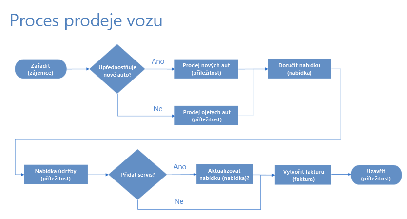
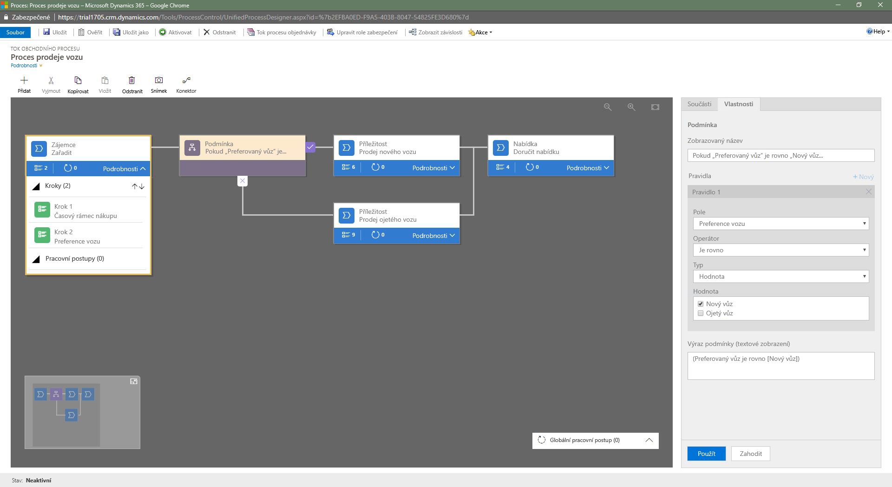
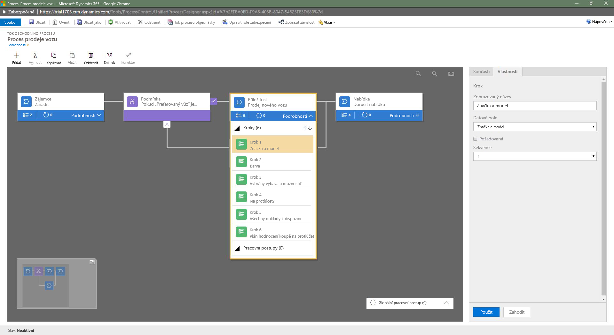
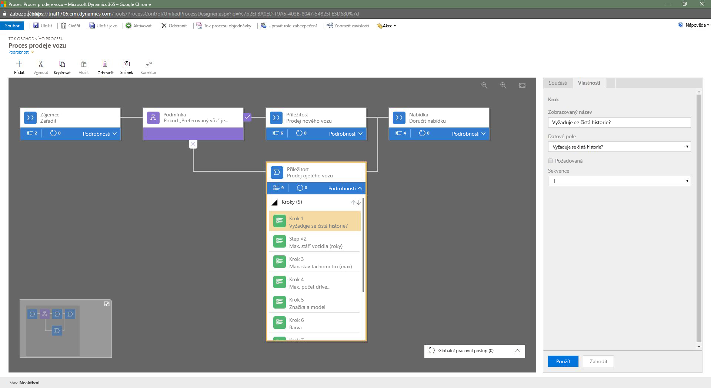
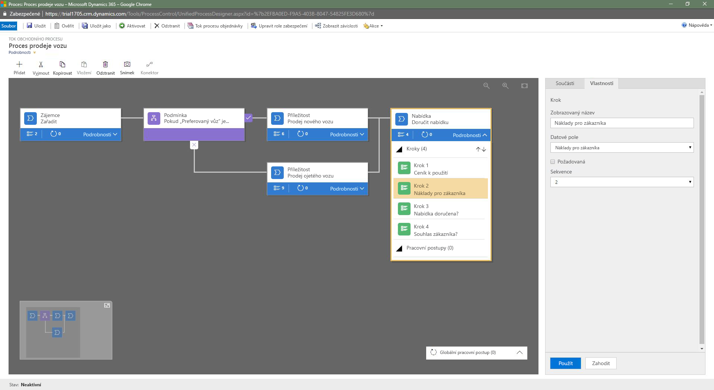
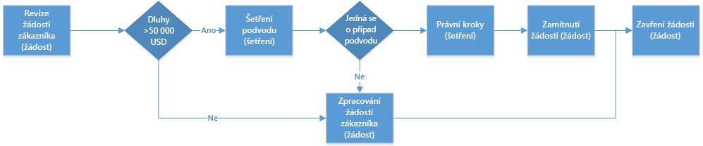
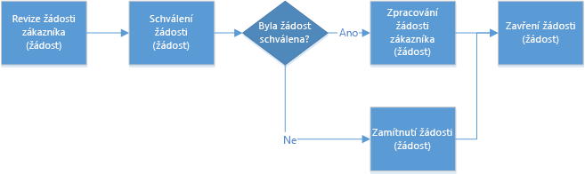
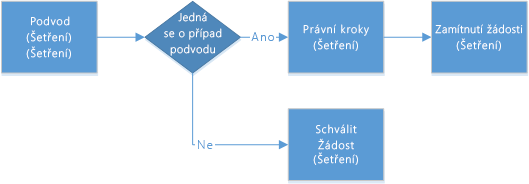

Toky obchodních procesů vás vedou různými fázemi prodejních, marketingových nebo servisních procesů směrem k dokončení.Business process flows guide you through the different stages of sales, marketing, or service processes, toward completion. V případě jednoduchého procesu je vhodné použít lineární tok obchodního procesu.For a simple process, a linear business process flow is a good option. Ve složitějších scénářích můžete použít rozšířený tok obchodního procesu, který se větví do různých směrů podle podmínek toku.But in more complex scenarios, you can use an enhanced business process flow that branches into different directions, depending on conditions within the flow.

Větve se vybírají automaticky v reálném čase podle pravidel definovaných v definici procesu.Branches are automatically selected in real time, based on rules that are defined in the process definition.

- Pokud máte oprávnění **vytvářet** toky obchodních procesů, můžete k vytvoření toku obchodního procesu s několika větvemi použít logiku `If-Else`.If you have **Create** permissions on business process flows, you can use `If-Else` logic to create business process flow that have multiple branches.
- Podmínku větvení můžete vytvořit z několika logických výrazů, které používají kombinaci operátorů `AND` nebo `OR`.The branching condition can be formed from multiple logical expressions that use a combination of `AND` or `OR` operators.

Třeba v procesu prodeje automobilů můžete nastavit jeden tok obchodních procesů, který začíná společnou fází kvalifikace a pak se na základě pravidla rozdělí do dvou samostatných větví:For example, for the process of selling cars, you can set up a single business process flow that starts with a common qualification stage but then splits into separate branches, based on a rule:

- Jedna větev řeší případ zákazníka, který dává přednost novému nebo ojetému vozu.One branch manages the case of a customer who prefers a new car or a pre-owned car.
- Druhá větev řeší případ zákazníka s rozpočtem nad nebo pod 20 000 USD.Another branch manages the case of a customer whose budget is above or below $20,000.
- Třetí větev může být pro prodej nových nebo ojetých vozů.A third branch might be for selling new cars or pre-owned cars.

Na následujícím diagramu je tok obchodního procesu, který má větve.The following diagram shows a business process flow that has branches.

## Pokyny pro toky obchodních procesů s více větvemiGuidelines for business process flows that have branches

Při návrhu toku obchodního procesu s více větvemi je potřeba mít na paměti následující body:Keep the following points in mind when you design a business process flow that has branches:

- Účastníky procesu může být maximálně pět jedinečných entit.A process can span a maximum of five unique entities.
- Proces může mít maximálně 30 fází a každá z nich může mít maximálně 30 kroků.You can use a maximum of 30 stages per process and a maximum of 30 steps per stage.
- Žádná větev nesmí být hlubší než pět úrovní.Each branch can be no more than five levels deep.
- Pravidla větvení musí být založená na krocích fáze, která jim bezprostředně předchází.Branching rules must be based on the steps in the stage that immediately precedes them.
- Pokud chcete v pravidle kombinovat více podmínek, použijte operátor `AND` nebo `OR`, ale nepoužívejte oba.You can combine multiple conditions in a rule by using the `AND` operator or the `OR` operator, but not both.
- Při definici procesního toku můžete vybrat vztah entit.When you define a process flow, you can optionally select an entity relationship. V tomto vztahu entit musí jít o relaci entit typu 1:N.This entity relationship must a one-to-many (1:N) relationship.
- Stejný datový záznam může být současně použit ke spuštění několika aktivních procesů.More than one active process can run concurrently on the same data record.
- Při slučování větví musí být všechny vedlejší větve sloučeny do stejné fáze nebo každá vedlejší větev musí proces ukončit.When branches are merged, either all the peer branches must be merged to a single stage, or each peer branch must end the process. Vedlejší větev se nesmí sloučit s jinými větvemi a současně ukončit proces.A peer branch can't merge with other branches and end the process at the same time.

> [!NOTE]
> - Entita použitá v procesu může být několikrát opakovaně navštívená (to znamená, že může existovat několik uzavřených smyček entit).An entity that's used in the process can be revisited multiple times (that is, there can be multiple closed entity loops).
> - Proces se může vrátit do předchozí fáze bez ohledu na typ entity.A process can go back to the previous stage, regardless of the entity type. Pokud je například aktivní fáze zaznamenané nabídky **Podání nabídky**, můžou uživatelé procesu zaznamenanou příležitost z aktivní fáze přesunout zpět do fáze **Návrhu**.For example, if the active stage is **Deliver Quote** on a quote record, process users can move the active stage back to the **Propose** stage on an opportunity record.

## Příklad kontaktování zákazníka v Dynamics 365: Procesní tok prodeje vozu, který má dvě větveDynamics 365 customer engagement example: Car selling process flow that has two branches

Pojďme se podívat na příklad toku obchodního procesu, který má dvě větve.Let's look at an example of a business process flow that has two branches. V tomto příkladu se tok obchodního procesu používá k prodeji nových nebo ojetých vozů.In this example, the business process flow is used for sales of new and pre-owned cars.

Napřed vytvoříte proces, který má název **Proces prodeje vozu**.First, we'll create a process named **Car Sales Process**.

1. Spusťte Microsoft Flow a přihlaste se pomocí účtu organizace.Launch Microsoft Flow and sign in using your organizational account.
1. V levém podokně vyberte **Toky**.In the left pane, select **Flows**.
1. Na horním panelu vyberte **Toky obchodního procesu**.On the top bar, select **Business process flows**.
1. Napravo vyberte **Vytvořit z prázdné**.On the right, select **Create from Blank**.
1. V podokně **Vytvořit tok obchodního procesu** vyplňte povinná pole:In the **Create business process flow** pane, fill in the required fields:

    - **Zobrazovaný název:** Zadejte *Proces prodeje vozu*.**Display name**: Enter *Car sales process*.
    - **Název**: Jedinečný název, který vychází ze zadaného zobrazovaného názvu.**Name**: A unique name that's based on the display name that you entered. Název můžete změnit při vytváření procesu, ale nemůžete ho změnit po jeho vytvoření.You can change the name when you create the process, but you can't change it after the process has been created.
    - **Entita Common Data Service:** Vyberte entitu *Zájemce*.**Common Data Service entity**: Select the *Lead* entity.

        Vybraná entita ovlivní pole dostupná pro kroky, které můžete přidat do první fáze toku procesu.The entity that you select affects the fields that are available for steps that can be added to the first stage of the process flow. Pokud nemůžete najít entitu Zájemce, zkontrolujte, jestli je v definici příslušné entity nastavená možnost **Toky obchodního procesu (pole budou vytvořena)**.If you can't find the Lead entity, make sure that the **Business process flows (fields will be created)** option is set for that entity in the entity definition. Po uložení procesu nemůžete entitu změnit.You can't change the entity after you save the process.

1. Vyberte **OK**.Select **OK**.
1. Přidejte první fázi procesu. Pojmenujte ji *Kvalifikace* a přidejte do ní dva kroky: *Časový rámec nákupu* a *Preferovaný vůz*.Add the first stage to the process, name the stage *Qualify*, and add two steps to it: *Purchase Time frame* and *Car Preference*.
1. Po společné fázi Kvalifikace rozdělte proces do dvou samostatných větví tím, že do něj přidáte komponentu **Podmínka**:After the common Qualify stage, split the process into two separate branches by adding a **Condition** component:

    1. Nastavte podmínku s pravidly, která odpovídají vašim obchodním požadavkům.Set up the condition with rules that meet your business requirements.
    1. Přidejte první větev, která se spustí při splnění podmínky. Do cesty **Ano** komponenty **Podmínka** přidejte komponentu **Fáze**.To add the first branch, which will be run when the condition is satisfied, add a **Stage** component to the **Yes** path of the **Condition** component.
    1. Přidejte druhou větev, která se spustí při nesplnění podmínky. Do cesty **Ne** komponenty **Podmínka** přidejte komponentu **Fáze**.To add the second branch, which will be run when condition isn't satisfied, add a **Stage** component to the **No** path of the **Condition** component.

    > [!TIP]
    > Pokud chcete vytvořit složitější větvení, můžete přidat do cesty **Ne** stávající komponenty **Podmínka** další komponentu **Podmínka**.To create more complex branching, you can add another a **Condition** component to the **No** path of an existing **Condition** component.

    

    Pokud je **Preferovaný vůz** = **Nový**, proces vyústí do fáze **Prodej nového vozu** (viz obrázek).If **Car preference** = **New**, the process branches out to the **New Car Sales** stage, as shown here.

    

    Jinak proces vede do fáze **Prodej ojetého vozu**, což je druhá větev (viz obrázek).Otherwise, the process goes to the **Pre-Owned Car Sales** stage in the second branch, as shown here.

    

    Po dokončení všech kroků ve fázi **Prodej nového vozu** nebo ve fázi **Prodej ojetého vozu** se proces vrátí do hlavního toku, a to do fáze **Podání nabídky**.After all the steps in either the **New Car Sales** stage or the **Pre-Owned Car Sales** stage are finished, the process returns to the main flow, at the **Deliver Quote** stage.

    

## Příklad jak zabránit zpřístupnění informacíPrevent information disclosure example 

Pokud uživatelům nechcete dovolit, aby mohli zobrazit určité informace o procesním toku, je potřeba zvážit několik věcí.There are a few things that you need to consider to prevent people from seeing specific information about a process flow.

V této části použijeme příklad toku obchodního procesu s větvemi na zpracování žádosti o úvěr v bance.This section uses the example of a business process flow that has branches for processing a loan request at a bank. V následujícím diagramu jsou vlastní entity, které se ve fázích používají, zobrazené v závorkách.In the following diagram, the custom entities that are used in the stages are shown in parentheses.

V tomto scénáři potřebuje mít úvěrový pracovník banky přístup k zaznamenané žádosti, ale nesmí vidět vyšetřování žádosti.In this scenario, the bank loan officer needs access to the Request record, but she shouldn't have any visibility into the investigation of the request. Na první pohled se zdá, že můžeme tomuto požadavku lehce vyhovět tím, že bankovnímu úředníkovi přiřadíme roli zabezpečení, která nemá přístup k vyšetřovací entitě.At first glance, it looks as though we can easily meet this requirement by assigning the loan officer a security role that doesn't grant access to the Investigation entity. Při bližším pohledu na příklad ale zjistíme, že to není tak jednoduché.But let's look at the example in more detail to see whether things will really be that easy.

Řekněme, že si zákazník v bance podá žádost o úvěr vyšší než 60 000 USD.Let's say that a customer submits a loan request for more than $60,000 to the bank. Tady je celkový přehled fází a větví:Here is a high-level view of the stages and branches:

- V první fázi úvěrový pracovník zkontroluje žádost.In the first stage, the loan officer reviews the request.
- Pravidlo větvení kontroluje, jestli dlužná částka přesahuje 50 000 USD.A branching rule checks whether the amount that's owed to the bank will exceed $50,000. Pokud je pravidlo větvení splněné, je další fází procesu prošetřování žádosti, jestli se nejedná o podvod.If this branching rule is satisfied, the next stage in the process is to investigate whether the request is fraudulent.
- Pokud se zjistí, že se jedná o podvod, pokračuje proces právními kroky proti žadateli.If it's determined that the request is fraudulent, the process moves on to taking legal action against the requestor.
- Úvěrový pracovník nevidí obě fáze prošetřování, protože nemá přístup k vyšetřovací entitě.The loan officer shouldn't have visibility into the two investigative stages, because she doesn't have access to the Investigation entity.
- Pokud ale otevře zaznamenanou žádost, vidí celý proces od začátku do konce.But if the loan officer opens the Request record, she can see the entire end-to-end process. Nejenže pozná fázi vyšetřování podvodu, ale dokáže také zjistit výsledek šetření, protože vidí v procesu fázi právních kroků.Not only will she be able to see the Fraud Investigation stage, but she'll also be able to identify the outcome of the investigation, because she can see the Legal Action stage in the process.
- Úvěrový pracovník si může zobrazit náhled kroků vyšetřovací fáze, pokud ji zvolí.The loan officer can preview the steps in the investigative stages by choosing the stage. Nevidí data ani stav dokončení určitého kroku, ale dokáže zjistit možné akce podniknuté proti žadateli ve fázích vyšetřování podvodu a právních kroků.Although she won't be able to see the data or the step completion status, she'll be able to identify the potential actions that were taken against the requestor during the Fraud Investigation and Legal Action stages.

V tomto procesním toku vidí úvěrový pracovník fáze vyšetřování podvodu a právních kroků. A právě tato možnost představuje nedovolené zpřístupnění informací.In this process flow, the loan officer will be able to see the Fraud Investigation and Legal Action stages, and this ability constitutes improper information disclosure.

Věnujte proto mimořádnou pozornost informacím, které můžou být zpřístupněny při větvení.Pay special attention to the information that might become disclosed because of branching. Abychom v našem příkladu zabránili zpřístupnění informací, rozdělíme proces do dvou samostatných procesů: jeden pro zpracování žádosti a druhý pro vyšetřování podvodu.In our example, to prevent information disclosure, split the process into two separate processes: one for the request processing and one for the fraud investigation. Pak bude proces úvěrového pracovníka vypadat takto:The process for the loan officer will then look like this.

Proces vyšetřování bude samostatný a bude mít následující fáze:The process for the investigation will be self-contained and will include the following stages.

Budete také muset poskytnout pracovní postup, který synchronizuje rozhodnutí o schválení/zamítnutí žádosti z vyšetřovacího záznamu se zaznamenanou žádostí.You'll have to provide a workflow to synchronize the Approve/Deny decision from the Investigation record to the Request record.
