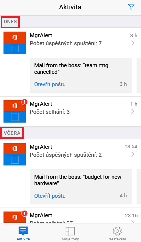
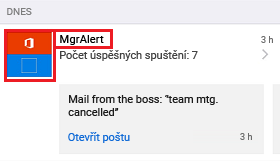
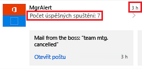
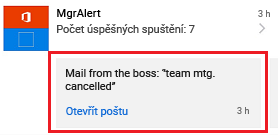
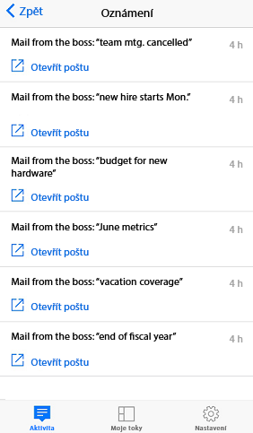
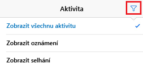
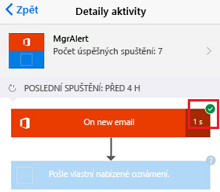
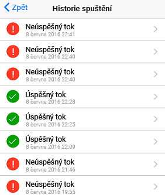

Můžete si prohlédnout přehled s počtem úspěšných nebo neúspěšných opakování každého toku dnes, včera nebo v minulých dnech.You can view a summary of the number of times that each flow succeeded or failed today, yesterday, and on previous days. Můžete si také prohlédnout podrobnosti o každém spuštění, třeba kdy byl tok spuštěn, jak dlouho trval každý krok, a pokud se krok nepodařil, jaký byl důvod.You can also explore details about each run, like when it ran, how long each step took, and, if a step failed, why it failed.

## PožadavkyPrerequisites

* Nainstalujte si mobilní aplikaci Microsoft Flow na podporované zařízení se systémem [Google Android](https://aka.ms/flowmobiledocsandroid), [Apple iOS](https://aka.ms/flowmobiledocsios) nebo [Windows Phone](https://aka.ms/flowmobilewindows).Install the Microsoft Flow mobile app for [Google Android](https://aka.ms/flowmobiledocsandroid), [Apple iOS](https://aka.ms/flowmobiledocsios), or [Windows Phone](https://aka.ms/flowmobilewindows) on a supported device. Snímky obrazovky v této lekci pocházejí z verze aplikace pro Apple iPhone, ale mobilní aplikace pro Android a Windows Phone jsou podobné.The screenshots in this unit were taken on the Apple iPhone version of the app, but the mobile app for Android and Windows Phone are similar.
* Pokud ještě nemáte tok, můžete ho vytvořit na [webu Microsoft Flow](https://flow.microsoft.com/).If you don't already have a flow, create one on the [Microsoft Flow website](https://flow.microsoft.com/). Kvůli snadnějšímu testování použijte tok, který můžete aktivovat sami, abyste nemuseli čekat na externí událost.For easier testing, use a flow that you can trigger yourself instead of waiting for an external event.

Tok v tomto výukovém kurzu se spustí, když dostanete z určité adresy e-mail.The flow in this tutorial runs when you receive email from a specific address.

> [!TIP]
> Při testování můžete k nastavení toku použít vlastní e-mailovou adresu.For testing, you can set up the flow with your personal email address. Až bude tok připravený ke skutečnému použití, můžete ho nastavit na jinou adresu (třeba na adresu svého vedoucího).Then, when the flow is ready for real use, you can set it up with a different address (for example, your manager's).

Když se tok spustí, posílá na váš telefon vlastní nabízená oznámení.When the flow runs, it sends a custom push notification to your phone.

## Zobrazení souhrnných informací o aktivitěShow a summary of activity

1. Pokud jste tok ještě nespustili, aktivujte spuštění, aby se vygenerovala data.If your flow hasn't run before, trigger a run to generate data.

    Zobrazení dat v aplikaci může chvíli trvat.It might take some time for the data to appear in the app.

1. Spusťte mobilní aplikaci.Start the mobile app.

    Ve výchozím nastavení se zobrazí karta **Aktivita**.By default, the **Activity** tab is shown. Na této kartě jsou data uspořádaná po dnech. Dnešní data se zobrazují nahoře.This tab organizes data by day, and today's data appears at the top.

    

    Každý záznam obsahuje název toku a ikony, které odpovídají aktivovaným událostem a akcím toku.Each entry shows the name of the flow and icons that correspond to the flow's trigger events and actions.

    

    Pokud se v daném dni tok aspoň jednou úspěšně spustil, zobrazí se v záznamu počet úspěšných spuštění a čas posledního úspěšného spuštění.If at least one run of a flow has succeeded in a day, an entry shows the number of successful runs and the time of the most recent success. Pokud se tok nepodařilo spustit, zobrazí se jiný záznam s podobnými informacemi.A different entry shows similar information if a flow has failed.

    

    Pokud tok posílá nabízená oznámení, zobrazí se při úspěšném spuštění dole v záznamu text posledního oznámení.If a flow sends push notifications, the text of the most recent notification appears at the bottom of the entry for successful runs.

    

1. Pokud se v jednom dni odeslalo více nabízených oznámení, potáhněte oznámení prstem doleva, aby se zobrazila oznámení až ze tří posledních spuštění.If multiple push notifications were sent in a day, swipe left on the notification to view notifications from up to three previous runs. Pokud se v jednom dni odeslalo více než čtyři oznámení, potáhněte prstem doleva, až se zobrazí **Zobrazit více**. Když tuto možnost vyberete, zobrazí se seznam všech oznámení.If more than four notifications were sent in a day, swipe left until **See more** appears, and then select it to view a list of all notifications.

    

1. Když se chcete vrátit k souhrnným informacím o aktivitě, vyberte **Zpět**.select **Back** to return to the activity summary.
1. Pokud chcete souhrn aktivit filtrovat, vyberte v pravém horním rohu tlačítko **Filtr** (symbol trychtýře).To filter the activity summary, select the **Filter** button (the funnel symbol) in the upper-right corner.

    Můžete zobrazit všechny záznamy, jenom záznamy o neúspěších nebo jenom záznamy, které zahrnují nabízená oznámení.You can show all entries, only the failure entries, or only the entries that include push notifications.

    

## Zobrazení podrobností o spuštěníShow details of a run

1. V souhrnu aktivit vyberte záznam. Zobrazí se podrobnosti o posledním spuštění.In the activity summary, select an entry to show details for the most recent run.

    U každé události a akce je symbol, ze kterého poznáte, jestli byla úspěšná nebo neúspěšná.For each event and action, a symbol indicates whether the event or action succeeded or failed. Pokud byla událost nebo akce úspěšná, zobrazí se také, jak dlouho trvala (v sekundách).If it succeeded, the amount of time that it took (in seconds) also appears.

    

1. Pokud chcete zobrazit seznam všech spuštění toku, klepněte na **Historie spuštění**.Tap **Run history** to list all runs of the flow. Potom vyberte určitý běh, abyste si mohli prohlédnout jeho podrobnosti.Then select a specific run to view its details.

    
