V této lekci se naučíte vytvářet obchodní scénář, který používá schválení.In this unit, you'll learn how to build a business-friendly scenario that uses approvals.

V tomto scénáři může každý, kdo má přístup k seznamu Microsoft SharePointu, přidávat tweety bez jakékoli znalosti Twitteru.In this scenario, anyone who has access to the Microsoft SharePoint list can contribute tweets without knowing anything about Twitter. Tým pro sociální média pak může tyto tweety schválit nebo odmítnout.The social media team can then approve or reject those tweets. Tento tým bude mít kontrolu nad účtem a obsahem, který se dostane k zákazníkům.Therefore, that team remains in control of the account and the content that goes out to customers.

## 1. krok: Vytvoření sharepointového seznamu pro tweetyStep one: Create a SharePoint list for tweets

Použijete šablonu, která spustí schvalovací proces vždy, když se v určitém seznamu vytvoří nová položka.You'll use a template that starts an approval process whenever a new item is created in a specific list. Pokud je položka schválená, zveřejní se tweet na Twitteru.If the item is approved, a tweet is posted to Twitter. V této lekci změníte postup tím, že přidáte kroky, které v seznamu SharePointu aktualizují odpověď na schválení, vyznačí schválení nebo neschválení položky a přidají komentáře, které schvalovatel přidal k navrhovanému tweetu.For this unit, you'll change the process by adding steps that update a SharePoint list with the approval response, indicate whether the item was approved, and add any comments that the approver added to the proposed tweet.

Nejdříve vytvoříme sharepointový seznam.First, let's create the SharePoint list.

1. Na webu SharePoint vytvořte sharepointový seznam s názvem *ContosoTweets*.On your SharePoint site, create a SharePoint list named *ContosoTweets*.
1. Otevřete seznam a vyberte **Přidat sloupec**.Open the list, and select **Add column**.
1. Volbou **+ Přidat sloupec** přidejte následující sloupce.Select **+ Add column** to add the following columns. Po vytvoření každého sloupce vyberte **Uložit**.Select **Save** after you create each column.

    - Přidejte sloupec typu *Více řádků textu* s názvem *TweetContent*.Add a column of the *Multiple lines of text* type that's named *TweetContent*. V tomto sloupci bude obsah tweetů, které se budou později schvalovat.This column will hold the content of the tweets that will be approved later.
    - Přidejte sloupec typu *Datum a čas* s názvem *TweetDate*.Add a column of the *Date and Time* type that's named *TweetDate*. Pokud chcete vybrat typ *Datum a čas*, vyberte **Další**.To select the *Date and Time* type, select **More**.
    - Přidejte sloupec typu *Ano/Ne* a pojmenujte ho *ApprovalStatus*.Add a column of the *Yes/No* type that's named *ApprovalStatus*. Schvalovatel pak výběrem možnosti **Ano** nebo **Ne** tweet schválí nebo zamítne.The approver can then select **Yes** or **No** to approve or reject the tweet.
    - Přidejte sloupec typu *Jeden řádek textu* a pojmenujte ho *ApproverComments*.Add a column of the *Single line of text* type that's named *ApproverComments*. Schvalovatel pak může přidat komentář o stavu schvalování.The approver can then add a comment about the approval status.

    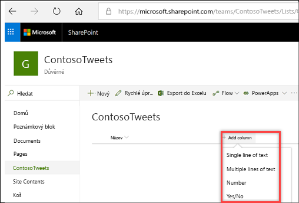

1. Zkopírujte adresu URL sharepointového seznamu.Copy the URL of the SharePoint list. Použijete ho při vytváření toku.You'll use it when you create the flow.

## 2. krok: Vytvoření toku žádosti o schváleníStep two: Create an approval request flow

1. Přihlaste se k [Microsoft Flow](https://ms.flow.microsoft.com) a pak vyberte **Schválení**.Sign in to [Microsoft Flow](https://ms.flow.microsoft.com), and then select **Approvals**.
1. Vyberte **Vytvořit tok schválení**, posuňte se dolů a vyberte šablonu **Po schválení publikovat položky seznamu na Twitter**.Select **Create approval flow**, and then scroll down and select the **Post list items to Twitter after approval** template.

    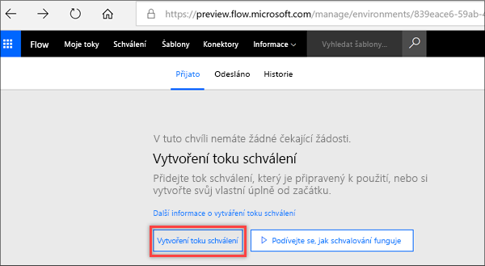

1. Ujistěte se, že přihlašovací údaje účtů pro **SharePoint**, **Schválení** a **Twitter** jsou správné, a pak vyberte **Pokračovat**.Make sure that your account credentials for **SharePoint**, **Approvals**, and **Twitter** are correct, and then select **Continue**.

    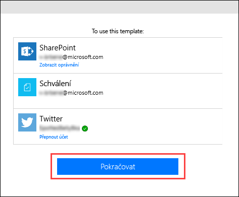

1. Vraťte se do Microsoft Flow a v akci **Když je vytvořena nová položka** zadejte následující hodnoty:Back in Microsoft Flow, in the **When a new item is created** action, enter the following values:

    * **Site Address** (Adresa webu): Zadejte adresu URL sharepointového webu vašeho týmu.**Site Address**: Enter the URL of your team's SharePoint site.
    * **List Name** (Název seznamu): Vyberte *ContosoTweets*.**List Name**: Select *ContosoTweets*.

    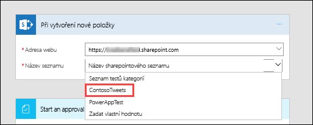

1. V akci **Zahájit schválení** vyberte **Upravit**, aby se zobrazila všechna pole.In the **Start an approval** action, select **Edit** to show all the fields.

    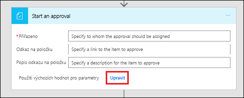

1. Do pole **Název** zadejte *Nový tweet pro* a ze seznamu dynamického obsahu vyberte **Title** (Název).In the **Title** field, enter *New tweet for*, and then select **Title** in the dynamic content list.

    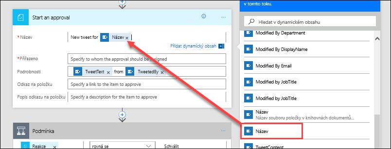

1. V poli **Přiřazeno** zadejte a vyberte své jméno nebo jméno testovacího uživatele.In the **Assigned to** field, enter and select either your name or the name of a test user.

    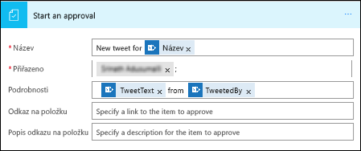

1. Z pole **Podrobnosti** odeberte výchozí položky a ze seznamu dynamického obsahu přidejte **TweetContent** (Obsah tweetu), **TweetDate** (Datum tweetu) a **Created by DisplayName** (Zobrazované jméno autora).In the **Details** field, remove the default items, and add **TweetContent**, **TweetDate**, and **Created by DisplayName** from the dynamic content list. Přidejte slova *z* a *od uživatele*, aby byl obsah čitelnější (viz níže).Add the words *on* and *by* to make the content more readable, as shown here.

    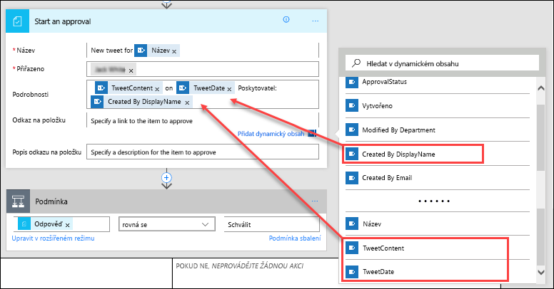

1. Do pole **Odkaz na položku** vložte adresu URL sharepointového seznamu, kterou jste si zkopírovali v předchozím postupu.In the **Item Link** field, paste the URL of your SharePoint list, which you copied in the previous procedure. Do pole **Popis odkazu na položku** zadejte *Seznam tweetů Contoso*.In the **Item Link Description** field, enter *Contoso Tweet List*.

    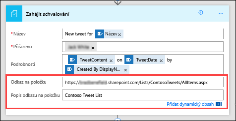

1. V akci **Podmínka** najeďte kurzorem na pole **POKUD ANO**, vyberte znaménko plus (**+**) a vyberte **Přidat akci**.In the **Condition** action, hover over the **IF YES** box, select the plus sign (**+**), and then select **Add an action**.

    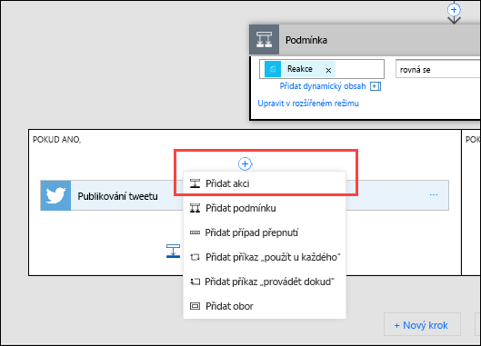

1. Vyhledejte *aktualizovat položku*, vyberte konektor **SharePoint** a vyberte akci **SharePoint – Aktualizovat položku**.Search for *update item*, select the **SharePoint** connector, and then select the **SharePoint – Update item** action.

    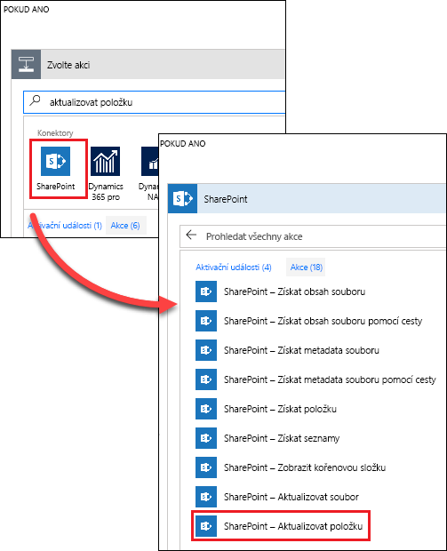

1. Do pole **Adresa webu** znovu zadejte adresu URL sharepointového týmového webu.In the **Site Address**, enter the URL of the team's SharePoint site again. V poli **Název seznamu** znovu vyberte *ContosoTweets*.In the **List Name** field, select *ContosoTweets* again. Do pole **Id** přidejte **ID** ze seznamu dynamického obsahu.In the **Id** field, add **ID** from the dynamic content list. Pole **Id** se používá ke spojení se skutečným požadavkem na tweet v seznamu SharePointu.The **Id** field is used to match the actual tweet request in the SharePoint list.

    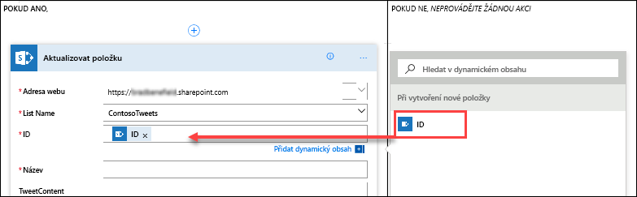

1. Vyberte pole **Název** a v seznamu dynamického obsahu vyhledejte *Title* (Název).Select the **Title** field, and then, in the dynamic content list, search for *title*. Z akce **Když je vytvořena nová položka** přidejte **Title** (Název).Add **Title** from the **When a new item is created** action.

    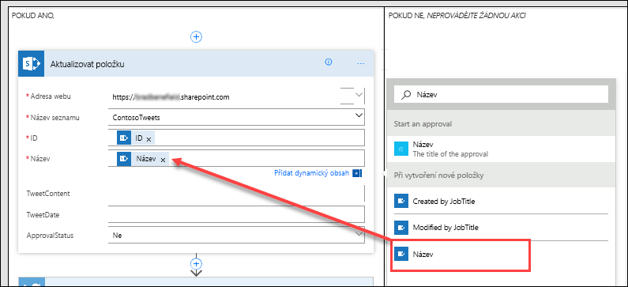

1. V poli **ApprovalStatus** (StavSchválení) vyberte *Ano*.In the **ApprovalStatus** field, select *Yes*. Pak vyberte **ApproverComments** (KomentářSchvalovatele) a ze seznamu dynamického obsahu přidejte **Comments** (Komentáře).Then select the **ApproverComments** field, and add **Comments** from the dynamic content list.

    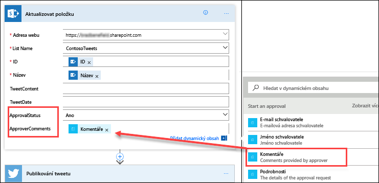

1. Na konci pole **POKUD NE, NEDĚLAT NIC** vyberte **Přidat akci**.Near the bottom of the **IF NO, DO NOTHING** box, select **Add an action**.

    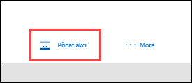

1. Opakujte kroky 11 až 14, abyste vytvořili akci **SharePoint – Aktualizovat položku**.Repeat steps 11 through 14 to create a **SharePoint – Update item** action. Nastavte stejné hodnoty, jako jste nastavili u podmínky **POKUD ANO**.Set the same values that you set for the **IF YES** condition. Jediný rozdíl bude, že tentokrát nastavíte pole **ApprovalStatus** (StavSchválení) na *Ne*.The only difference is that you set the **ApprovalStatus** field to *No* this time.

    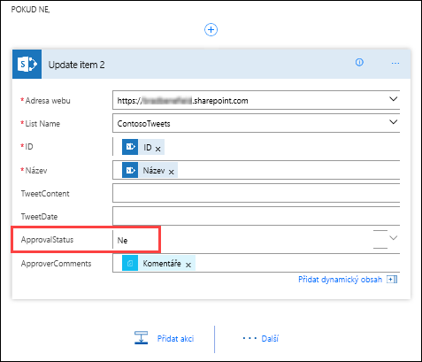

1. Vyberte akci **Publikovat tweet** a vyberte **Upravit**.Select the **Post a tweet** action, and select **Edit**. Vyberte pole **Text Tweetu** a ze seznamu dynamického obsahu vyberte **TweetContent** (ObsahTweetu).Then select the **Tweet text** field, and add **TweetContent** from the dynamic content list. Tímto krokem vytvoříte skutečný tweet, který se po schválení zveřejní na Twitteru.This step will create the actual tweet and then post it to Twitter when it's approved.

    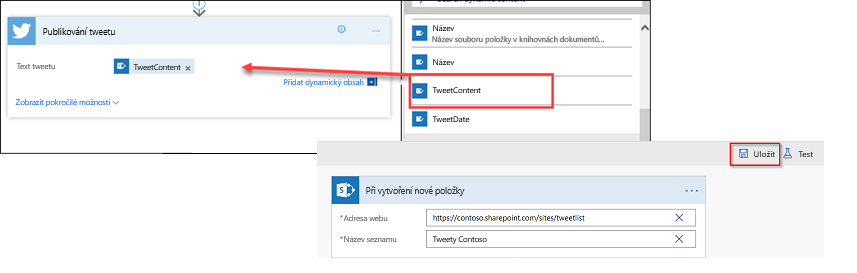

1. Vyberte **Uložit**.Select **Save**.

Blahopřejeme!Congratulations! Právě jste vytvořili první tok.You just created your first flow.

V této lekci jsme si ukázali jen jeden způsob, jak může Microsoft Flow pomoci vašemu týmu zvýšit produktivitu.This unit showed just one way that Microsoft Flow can empower your team to be more productive. Tým může přispívat svými nápady, relevantními novinkami nebo pokyny k produktům, ale vy máte kontrolu nad zveřejňovanými tweety pro zákazníky.Your team can contribute ideas, relevant news, or product guidance, but you maintain control over what's tweeted out to customers.

V další lekci uvidíte, jak to funguje, když schvalovatel dostane novou žádost s návrhem tweetu.In the next unit, you'll see what it looks like when an approver receives a new request for a proposed tweet.
