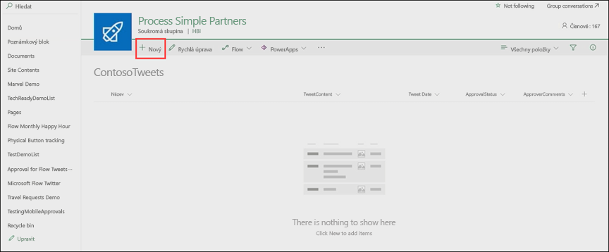
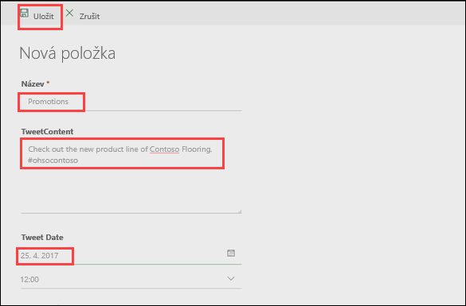
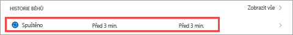
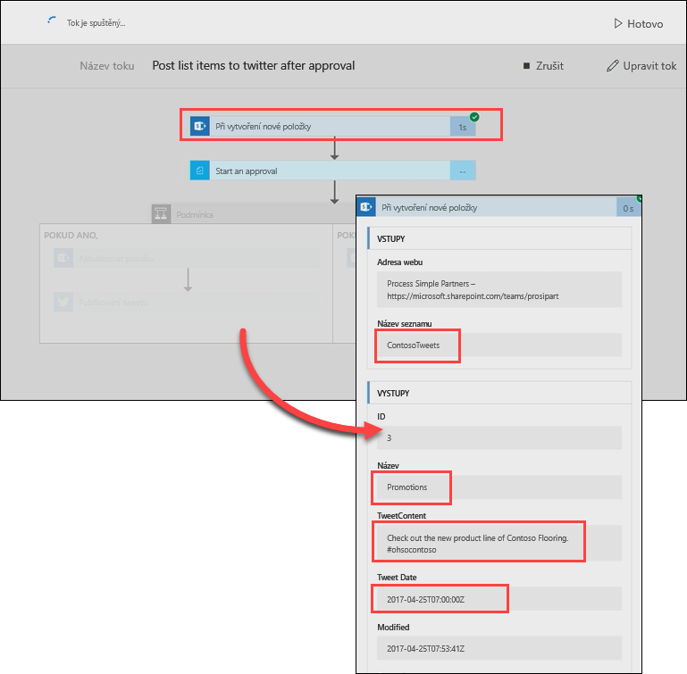
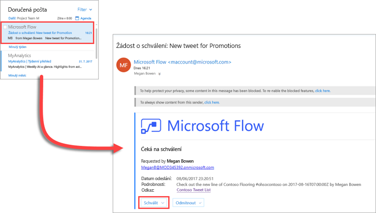
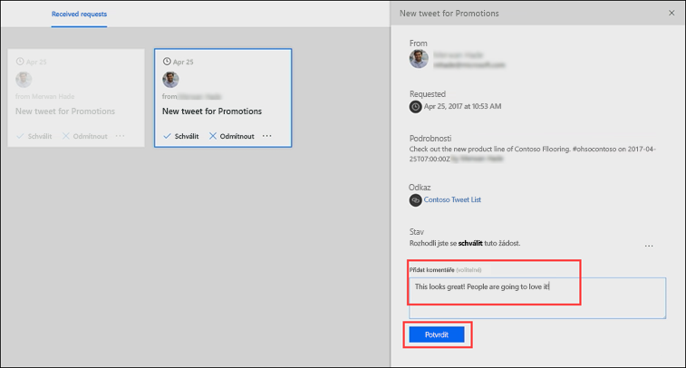
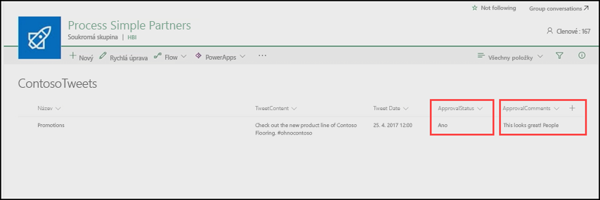

V předchozí lekci jste se naučili, jak vytvořit schvalovací proces pro tweety, které jsou uložené v seznamu Microsoft SharePointu.In the previous unit, you learned how to build an approval process for tweets that are stored in a Microsoft SharePoint list. V této lekci zjistíte, jak to vypadá, když schvalovatel dostane novou žádost o schválení.In this unit, you'll see what the experience looks like when an approver receives a new approval request. 

## 1. krok: Změna sharepointového seznamuStep one: Change the SharePoint list

Nejdřív potřebujeme do sharepointového seznamu přidat položku.First, we need to add an item to our SharePoint list. Pak můžeme zpracovat žádost o schválení této položky.We can then process an approval request for that item.

1. V SharePointu otevřete seznam **ContosoTweets** (TweetyContoso), který jste nastavili v předchozí lekci, a pak vyberte **Nový**, abyste vytvořili novou položku seznamu (tweet).In SharePoint, open the **ContosoTweets** list that you set up in the previous unit, and then select **New** to create a list item (tweet).

    

2. Zadejte následující hodnoty a vyberte **Uložit**:Enter the following values, and then select **Save**:

    - **Název**: Zadejte *Propagace*.**Title**: Enter *Promotions*.
    - **TweetContent** (ObsahTweetu): Zadejte *Podívejte se na novou řadu podlah Contoso #ohsocontoso*.**TweetContent**: Enter *Check out the new line of Contoso Flooring #ohsocontoso*. Všimněte si, že tweet začíná hashtagem (znak #).Notice that the tweet starts with a hashtag (number sign).
    - **Datum tweetu**: Zadejte dnešní datum.**Tweet Date**: Enter today's date.

    

## 2. krok: Změna tokuStep two: Change the flow

1. V Microsoft Flow vyberte **Moje toky**.In Microsoft Flow, select **My flows**.
2. Vyberte tok **Po schválení publikovat položky seznamu na Twitter**, který jste nastavili v předchozí lekci, a pak v části **Historie spuštění** vyberte spuštěný tok.Select the **Post list items to Twitter after approval** flow that you set up in the previous unit, and then, under **Run history**, select the flow that's running.

    

3. Vyberte trigger **Když je vytvořena nová položka**.Select the **When a new item is created** trigger. Ujistěte se, že se zobrazují informace o právě vytvořené položce seznamu.Make sure that the information for the list item that you just created is shown.

    

4. V Microsoft Outlooku otevřete e-mail automatického schválení v doručené poště a pak vyberte **Schválit**.In Microsoft Outlook, open the automated approval mail in the inbox, and then select **Approve**.

    

5. Ve schvalovacím centru zobrazte podrobnosti žádosti, přidejte komentář a pak vyberte **Potvrdit**.In the Approval Center, view the details of the request, add a comment, and then select **Confirm**.

    

6. V SharePointu aktualizujte seznam **ContosoTweets**.In SharePoint, refresh the **ContosoTweets** list. Ujistěte se, že pole **ApprovalStatus** (StavSchválení) je nastavené na *Ano* a že se zobrazuje komentář, který jste právě zadali.Make sure that the **ApprovalStatus** field is set to *Yes*, and that the comment that you just entered is shown.

    

V této lekci jste viděli postup z pohledu schvalovatele od přijetí e-mailu s žádostí o schválení až po zpracování žádosti ve Schvalovacím centru.In this unit, you saw the experience from the approver's point of view, from receiving an approval request email to processing the request in the Approval Center.
