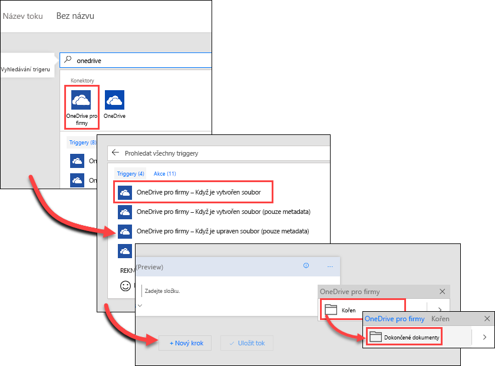
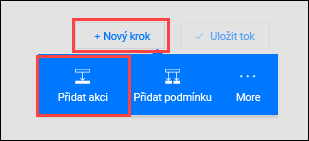
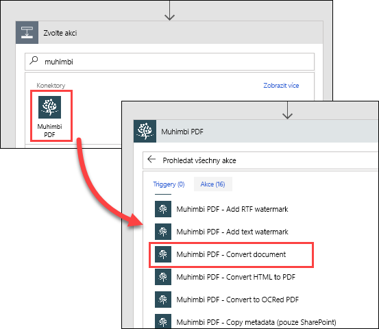
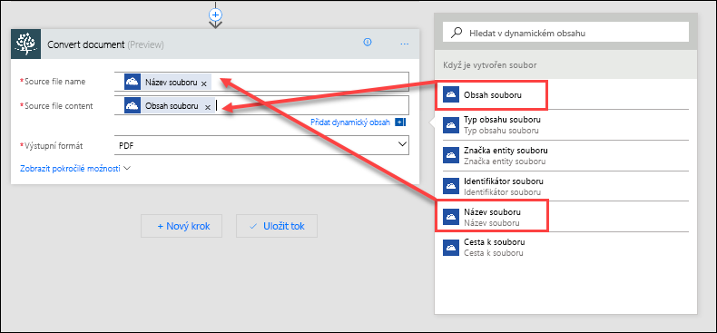
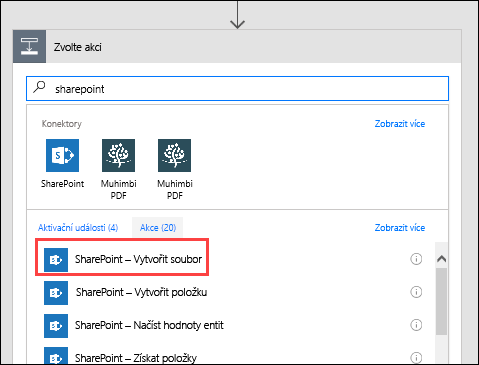
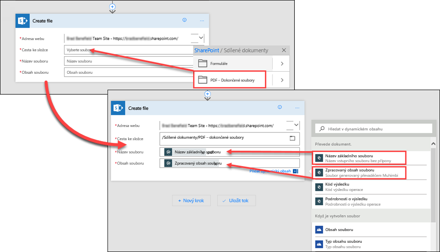

V této lekci uvidíte, jak Contoso Flooring pomocí Microsoft Flow automaticky převádí dokumenty na standardní formát a pak je ukládá do Microsoft SharePointu Online.In this unit, you'll see how Contoso Flooring uses Microsoft Flow to automatically convert documents to a standard format and then store them in Microsoft SharePoint Online. Vytvoříte tok, který zjistí, že do složky OneDrivu pro firmy byl přidán nový soubor.You'll create a flow that detects when a new file has been added to a Microsoft OneDrive for Business folder. Tok potom převede tento soubor do formátu PDF a uloží ho do složky SharePointu Online.The flow then converts that file to a PDF and stores it in a SharePoint Online folder.

## PožadavkyPrerequisites

Pro tento scénář potřebujete účet Muhimbi (služba pro převod PDF).For this scenario, you need an account with Muhimbi, a PDF conversion service. Pokud ještě účet Muhimbi nemáte, můžete si zaregistrovat [zkušební verzi na 30 dnů zdarma](http://www.muhimbi.com/Products/PDF-Converter-for-SharePoint/Products-PDF-Converter-for-SharePoint-Free-Trial.aspx).If you don't already have a Muhimbi account, you can sign up for a [free 30-day trial](http://www.muhimbi.com/Products/PDF-Converter-for-SharePoint/Products-PDF-Converter-for-SharePoint-Free-Trial.aspx).

## Vytvoření zdrojové a cílové složkyCreate the source and target folders

Nejprve musíte vytvořit zdrojovou a cílovou složku ve OneDrivu pro firmy a v SharePointu Online.First, you must create the source and target folders in OneDrive for Business and SharePoint Online.

1. Ve OneDrivu pro firmy v části **Soubory** vytvořte složku s názvem **Dokončené dokumenty**.In OneDrive for Business, under **Files**, create a folder named **Finished Documents**.
2. V SharePointu Online v části **Sdílené dokumenty** vytvořte složku s názvem **PDF – dokončené soubory**.In SharePoint Online, in **Shared Documents**, create a folder named **PDF – Finished files**.

## Vytvoření tokuCreate the flow

1. V Microsoft Flow vyberte **Moje toky** a pak vyberte **Vytvořit z prázdné**.In Microsoft Flow, select **My Flows**, and then select **Create from blank**.

    

2. Vyberte **Prohledat stovky konektorů a triggerů**.Select **Search hundreds of connectors and triggers**.
3. Do vyhledávacího pole zadejte *onedrive*, vyberte konektor **OneDrive pro firmy** a pak vyberte trigger **OneDrive pro firmy – Když je vytvořen soubor**.In the search field, enter *onedrive*, select the **OneDrive for Business** connector, and then select the **OneDrive for Business - When a file is created** trigger. V poli **Složka** vyberte tlačítko složky a pak vyberte složku **Dokončené dokumenty**, kterou jste vytvořili v předchozím kroku.In the **Folder** field, select the folder button, and then select the **Finished Documents** folder that you created in the previous step.

    

4. Vyberte **Nový krok** a pak vyberte **Přidat akci**.Select **New step**, and then select **Add an action**.

    

5. Do vyhledávacího pole zadejte *muhimbi*, vyberte konektor **Muhimbi PDF** a pak vyberte akci **Muhimbi PDF – Convert document** (Převést dokument).In the search box, enter *muhimbi*, select the **Muhimbi PDF** connector, and then select the **Muhimbi PDF – Convert document** action.

    

6. Pokud vás Microsoft Flow vyzve k přihlášení k Muhimbi, přihlaste se.If Microsoft Flow prompts you to sign in to Muhimbi, sign in. Pokud předplatné Muhimbi nemáte, můžete použít [zkušební verzi na 30 dnů zdarma](http://www.muhimbi.com/Products/PDF-Converter-for-SharePoint/Products-PDF-Converter-for-SharePoint-Free-Trial.aspx).If you don't have a subscription to Muhimbi, you can use a [free 30-day trial](http://www.muhimbi.com/Products/PDF-Converter-for-SharePoint/Products-PDF-Converter-for-SharePoint-Free-Trial.aspx).
7. V akci **Convert document** (Převést dokument) nastavte následující hodnoty:In the **Convert document** action, set the following values:

    * **Source file name** (Název zdrojového souboru): V seznamu dynamického obsahu vyberte **Název souboru**.**Source file name**: In the dynamic content list, select **File name**.
    * **Source file content** (Obsah zdrojového souboru): V seznamu dynamického obsahu vyberte **Obsah souboru**.**Source file content**: In the dynamic content list, select **File content**.
    * **Output format** (Výstupní formát): Vyberte *PDF*.**Output format**: Select *PDF*.

    

    Zatím jste pro tok nastavili tyto kroky:So far, you've set up these steps for your flow:

    1. Tok se aktivuje vždy, když se do určité složky OneDrivu pro firmy přidá nový soubor.The flow is triggered whenever a new file is added to a specific OneDrive for Business folder.
    2. Služba Muhimbi převede daný soubor do formátu PDF.The Muhimbi service converts that file to PDF.

    Jako poslední krok přidáte akci, která přesune daný dokument PDF do složky SharePointu Online, kde k němu tým bude mít přístup.For the final step, you'll add an action that moves the PDF document to a SharePoint Online folder where the team can access it.

8. Vyberte **Nový krok** a pak vyberte **Přidat akci**.Select **New step**, and then select **Add an action**.
9. Do vyhledávacího pole zadejte *sharepoint* a pak vyberte akci **SharePoint – Vytvořit soubor**.In the search field, enter *sharepoint*, and then select the **SharePoint – Create file** action.

    

10. V akci **Vytvořit soubor** nastavte následující hodnoty:In the **Create file** action, set the following values:

    * **Adresa webu**: Zadejte adresu URL vašeho sharepointového webu.**Site address**: Enter the URL of your SharePoint site.
    * **Cesta ke složce**: Vyberte tlačítko složky a přejděte ke složce **PDF – dokončené soubory**.**Folder path**: Select the folder button, and browse to the **PDF - Finished files** folder.
    * **Název souboru**: V seznamu dynamického obsahu v části **Convert document** (Převést dokument) vyberte **Base file name** (Základní název souboru).**File name**: In the dynamic content list, under **Convert document**, select **Base file name**. Pak zadejte *.pdf*, aby se soubor na SharePointu uložil s příponou názvu souboru .pdf.Then enter *.pdf* so that the file will be saved with the .pdf file name extension in SharePoint.
    * **Obsah souboru**: V seznamu dynamického obsahu v části **Convert document** (Převést dokument) vyberte **Processed file content** (Zpracovaný obsah souboru).**File content**: In the dynamic content list, under **Convert document**, select **Processed file content**.

    

11. Uložte práci výběrem možnosti **Vytvořit tok** v horní části stránky.Select **Create flow** at the top of the page to save your work.

## Testování tokuTest the flow

1. Pokud chcete tok otestovat, přidejte nový soubor do složky **Dokončené dokumenty** ve OneDrivu pro firmy.To test the flow, add a new file to your **Finished Documents** folder in OneDrive for Business.
2. V Microsoft Flow vyberte **Moje toky** a pak výběrem nového toku zobrazte historii spuštění.In Microsoft Flow, select **My flows**, and then select the new flow to view the run history. Ve výchozím nastavení je tok nastavený tak, aby se spouštěl každých pět minut.By default, the flow is set up to run every five minutes.
3. Po spuštění toku se ujistěte, jestli se daný soubor převedl do formátu PDF a uložil do složky **PDF – dokončené soubory** na SharePointu.After the flow runs, make sure that the file was converted to a PDF and saved to the **PDF – Finished files** folder in SharePoint.
