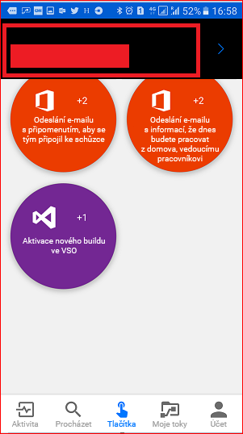

Můžete vytvořit tlačítkové toky, které používají informace, jako jsou data GPS (Global Positioning System), informace o datu nebo e-mail.You can build button flows that use information like Global Positioning System (GPS) data, date information, or email. Tyto informace jsou dostupné jako *tokeny triggerů*.This information is available as *trigger tokens*. Tokeny triggerů jsou datové body. Tyto datové body jsou známé zařízení, na kterém tlačítkový tok běží, a jsou pro něj dostupné.Trigger tokens are data points that are known and available to the device that a button flow is running on. Tyto tokeny se mění podle okolností, jako je aktuální čas nebo aktuální geografická poloha zařízení.These tokens change, based on factors like the current time or the current geographic location of the device.

Pokud například spustíte na telefonu tlačítkový tok, telefon pravděpodobně pozná, jaký je na aktuálním místě čas, datum a jaká je vaše aktuální adresa.For example, if you run a button flow on a phone, the phone probably knows the time at your current location, the date, and your current address. Jinými slovy je při spuštění tlačítkového toku známý čas, datum a adresa v místě, kde se telefon nachází.In other words, the time and date, and the address where the phone is located, are all determined when the button flow runs. Tyto údaje jsou automaticky dostupné a použitelné v každém tlačítkovém toku, který se na zařízení spouští.They're automatically available for use in any button flows that are run on the device.

Tyto tokeny triggerů můžete použít k vytváření užitečných toků, které minimalizují opakující se úkoly, jako je poskytování informací o vaší poloze někomu jinému nebo sledování času vynaloženého na určitý úkol nebo servisní hovor.You can use these trigger tokens to build useful flows that minimize repetitive tasks like providing your location to someone or tracking how much time you spent on a particular job/service call.

### Seznam tlačítkových tokenů triggerůList of button trigger tokens

Tady je seznam tlačítkových tokenů triggerů, které jsou dostupné při vytváření tlačítkových toků.Here's the list of button trigger tokens that are available to you when you create button flows.

| ParametrParameter | PopisDescription |
| --- | --- |
| MěstoCity | Město, kde se nachází zařízení, na kterém je spuštěný tok.The city where the device that's running the flow is located. |
| Země/oblastCountry/Region | Země nebo oblast, kde se nachází zařízení, na kterém je spuštěný tok.The country/region where the device that's running the flow is located.|
| Celá adresaFull address | Celá adresa, kde se nachází zařízení, na kterém je spuštěný tok.The full address where the device that's running the flow is located. |
| Zeměpisná šířkaLatitude | Zeměpisná šířka, kde se nachází zařízení, na kterém je spuštěný tok.The latitude where the device that's running the flow is located. |
| Zeměpisná délkaLongitude | Zeměpisná délka, kde se nachází zařízení, na kterém je spuštěný tok.The longitude where the device that's running the flow is located. |
| PSČPostalCode | Poštovní směrovací číslo, kde se nachází zařízení, na kterém je spuštěný tok.The postal code where the device that's running the flow is located. |
| StátState | Stát, kde se nachází zařízení, na kterém je spuštěný tok.The state where the device that's running the flow is located. |
| UliceStreet | Ulice, kde se nachází zařízení, na kterém je spuštěný tok.The street where the device that's running the flow is located. |
| Časové razítkoTimestamp | Čas v oblasti, kde se nachází zařízení, na kterém je spuštěný tok.The time in the area where the device that's running the flow is located. |
| DatumDate | Datum v oblasti, kde se nachází zařízení, na kterém je spuštěný tok.The date in the area where the device that's running the flow is located. |
| Uživatelské jménoUser name | Uživatelské jméno osoby přihlášené k zařízení, na kterém je spuštěný tok.The user name of the person who's signed in to the device that's running the flow. |
| E-mail uživateleUser email | E-mailová adresa osoby, která je přihlášená k zařízení, na kterém je spuštěný tok.The email address of the person who's signed in to the device that's running the flow. |

## Vytvoření tlačítkového toku, který používá tokeny triggerůCreate a button flow that uses trigger tokens

Při vytváření tlačítka můžete použít tokeny triggerů k přidání různých rozšiřujících funkcí.When you create a button, you can use trigger tokens to add rich functionality to it.

Pojďme vytvořit tlačítkový tok na zařízení se systémem Google Android.Let's create a button flow on a Google Android device. Tlačítkový tok bude používat tokeny triggerů k odeslání data a vaší celé adresy v e-mailu, kterým nadřízeného informujete o práci z domu.The button flow will use trigger tokens to send the date and your full address in a "Working from home" email to your boss.

Postupy v této lekci znázorňují snímky obrazovky zařízení s Androidem, ale na zařízeních se systémy Apple iOS a Windows Phone je prostředí podobné.Although the procedures in this unit show screenshots from an Android device, the experience is similar on Apple iOS and Windows Phone devices.

### PožadavkyPrerequisites

* Pracovní nebo školní e-mailová adresa nebo [účet Microsoft](https://account.microsoft.com/about?refd=www.microsoft.com), který má přístup k Microsoft FlowA work or school email address, or a [Microsoft account](https://account.microsoft.com/about?refd=www.microsoft.com) that has access to Microsoft Flow
* Mobilní aplikace Microsoft Flow pro [Android](https://aka.ms/flowmobiledocsandroid), [iOS](https://aka.ms/flowmobiledocsios) nebo [Windows Phone](https://aka.ms/flowmobilewindows)The Microsoft Flow mobile app for [Android](https://aka.ms/flowmobiledocsandroid), [iOS](https://aka.ms/flowmobiledocsios), or [Windows Phone](https://aka.ms/flowmobilewindows)

### Vytvoření toku aktivovaného tlačítkemCreate the button flow

1. Spusťte mobilní aplikaci Microsoft Flow a přihlaste se pomocí účtu organizace.Launch the Microsoft Flow mobile app and sign in using your organizational account.
1. Vyberte **Procházet**.Select **Browse**.

    

1. V kategorii **Tlačítko** vyberte službu **Odeslání e-mailu s informací, že dneska budete pracovat z domova, vedoucímu pracovníkovi**.Under the **Button** category, select the **Send a 'Working from home today' email to your manager** service.

    

1. Vyberte **Použít tuto šablonu**.Select **Use this template**.

    

1. Na kartě **Odeslat e-mail** vyberte **Upravit**.On the **Send an email** card, select **Edit**.

    

1. Vyberte pole **Předmět** a zadejte *Dnes pracuji z domova*.Select the **Subject** field, and enter *WFH today*. Všimněte si, že po výběru pole **Předmět** se zobrazil seznam tokenů.Notice that when you selected the **Subject** field, a list of tokens appeared. V dalším kroku použijete jeden z těchto tokenů k přidání data do předmětu e-mailu.In the next step, you'll use one of these tokens to add the date to the subject of the email.

    

1. S kurzorem stále v poli **Předmět** procházejte seznam tokenů a vyberte **Datum**.While the cursor is still in the **Subject** field, scroll through the list of tokens, and select **Date**. Všimněte si, že token Datum se teď zobrazuje v poli **Předmět**.Notice that the date token now appears in the **Subject** field.

    

1. Přejděte k poli **Text** a vyberte výchozí zprávu, abyste tam mohli přidat tokeny.Scroll to the **Body** field, and select the default message so that you can add tokens there.

    

1. Vyberte token **Úplná adresa** a pak vyberte **Vytvořit**.Select the **Full address** token, and then select **Create**.

    

1. Vyberte **Hotovo**.Select **Done**. Tok aktivovaný tlačítkem je teď vytvořený.Your button flow is now created.

    

## Spuštění toku aktivovaného tlačítkemRun the button flow

> [!NOTE]
> Tento tok aktivovaný tlačítkem odešle e-mail s vaší aktuální polohou.This button flow will send your current location via email.

1. V dolní části okna vyberte kartu **Tlačítka**.Select the **Buttons** tab at the bottom of the window. Zobrazí se seznam tlačítek, k jejichž použití máte oprávnění.You'll see a list of the buttons that you have permissions to use. Vyberte tlačítko zastupující tok aktivovaný tlačítkem, který jste právě vytvořili:Select the button that represents the button flow that you just created:

    

1. Výběrem možnosti **Povolit** umožněte, aby tento tok aktivovaný tlačítkem měl přístup k informacím o poloze zařízení.Select **Allow** to let the button flow access your device's location information.

    

    Za malou chvíli si můžete všimnout, že se e-mail odeslal vašemu nadřízenému.In a few moments, you'll notice that the email was sent to your boss.

    

Blahopřejeme!Congratulations! Právě jste vytvořili tok aktivovaný tlačítkem, který používá tokeny triggeru **Datum** a **Úplná adresa**.You just created a button flow that uses both the **Date** and **Full address** trigger tokens.
