Toky aktivované tlačítkem můžete přizpůsobit tak, že umožníte uživateli zadávat určité podrobnosti po spuštění daného toku.You can customize button flows by letting the user provide specific details that will be used when the flow runs.

Tok aktivovaný tlačítkem můžete vytvořit na webu Microsoft Flow nebo v mobilní aplikaci pro Microsoft Flow.You can create a button flow either on the Microsoft Flow website or in the mobile app for Microsoft Flow. V této lekci použijete web.For this unit, you'll use the website.

## PožadavkyPrerequisites

Musíte mít účet na webu Microsoft Flow.You must have an account on the Microsoft Flow website.

## Otevření šablonyOpen the template

1. Spusťte Microsoft Flow a přihlaste se pomocí účtu organizace.Launch Microsoft Flow and sign in using your organizational account.
2. Do pole pro vyhledání šablony zadejte *Visual Studio*.In the template search box, enter *Visual Studio*.
3. Vyberte šablonu **Otevření chyby s prioritou 2 v sadě Visual Studio**.Select the **Open a Priority 2 Bug in Visual Studio** template.

    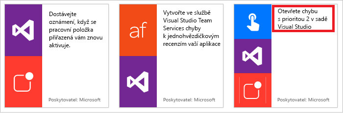

3. Vyberte **Použít tuto šablonu**.Select **Use this template**.

    Šablona **Otevření chyby s prioritou 2 v sadě Visual Studio** používá Visual Studio Team Services (VSTS) a služby nabízených oznámení.The **Open a Priority 2 Bug in Visual Studio** template uses the Visual Studio Team Services (VSTS) and the Push notification services. Pokud nemáte připojení k těmto službám, musíte se k nim přihlásit.If you don't have a connection to those services, you must sign in to them. Tlačítko **Přihlásit se** se zobrazuje jenom v případě, že je potřeba přihlásit se ke službě.The **Sign in** button appears only if you must sign into a service.

4. Po přihlášení ke všem požadovaným službám vyberte **Pokračovat**.After you've signed in to all the required services, select **Continue**.

    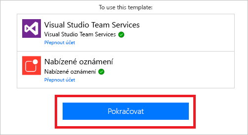

## Přizpůsobení vstupu uživateleCustomize the user input

V dalším kroku změníme tok tak, že přidáme pole, pomocí kterých můžou uživatelé určit změny v chybě VSTS.Next, we'll change the flow by adding fields that users can use to specify changes to the VSTS bug.

1. Na kartě triggeru vyberte **Upravit**.On the trigger card, select **Edit**.

    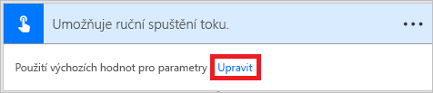

2. Výběrem znaménka plus (**+**) rozbalte stránku, abyste mohli přidat vlastní vstupní pole.Select the plus sign (**+**) to expand the page so that you can add custom input fields.

    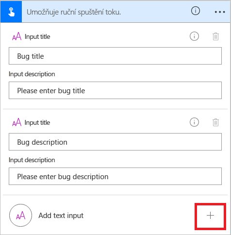

3. Pro každé vlastní pole, které by mělo být k dispozici, když někdo spustí daný tok, zadejte hodnoty do polí **Název vstupu** a **Popis vstupu**.For each custom field that should be available when someone runs your flow, enter values in the **Input title** and **Input description** field.

    V tomto příkladu vytvoříte dvě vlastní vstupní pole (**Postup pro zopakování chyby** a **Závažnost chyby**).In this example, you'll create two custom input fields (**Bug repro steps** and **Bug severity**). Potom každý, kdo tento tok použije, může zadat postup pro zopakování chyby a také ohodnotit závažnost chyby.Then, anyone who uses the flow can enter the steps to reproduce the bug, and they can also rate the severity of the bug.

    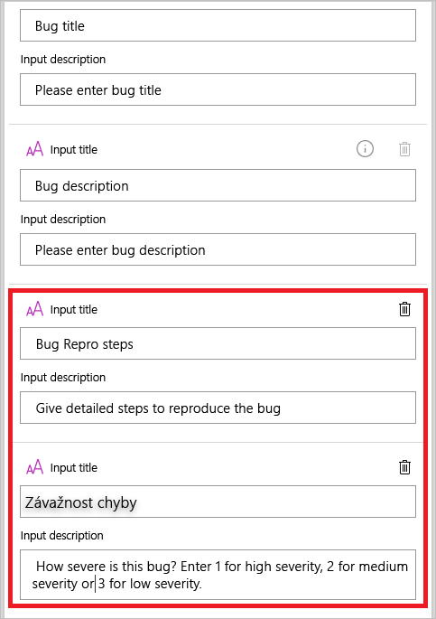

## Přizpůsobení chybyCustomize the bug

V dalším kroku přizpůsobíme chybu VSTS.Next, we'll customize the VSTS bug.

1. Na kartě **Create a new work item** (Vytvořit novou pracovní položku) vyberte záhlaví, aby se tato karta rozbalila.On the **Create a new work item** card, select the title bar to expand the card.

    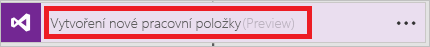

2. Vyberte možnosti, které odpovídají vašemu prostředí VSTS, a pak vyberte **Upravit**.Make the selections that are appropriate for your VSTS environment, and then select **Edit**.

    Pokud se například chcete připojit k myinstance.visualstudio.com, zadejte *myinstance*.For example, to connect to myinstance.visualstudio.com, enter *myinstance*.

    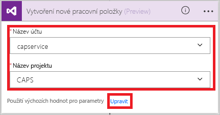

3. Vyberte **Zobrazit pokročilé možnosti**, aby se zobrazila další pole pro tuto kartu.Select **Show advanced options** to show the other fields for this card.

    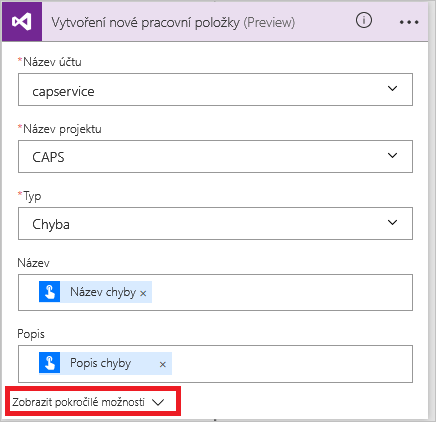

4. V poli **Název** umístěte kurzor před token **Název chyby**, zadejte *Závažnost:*, pak mezeru a vyberte token **Závažnost chyby**.In the **Title** field, put the cursor before the **Bug title** token, enter *Severity:* followed by a space, and then select the **Bug severity** token. Pak mezi tyto dva tokeny zadejte mezeru, dvě pomlčky (*--*) a další mezeru.Then, between the two tokens, enter a space, two hyphens (*--*), and another space.
5. V poli **Popis** umístěte kurzor před token **Popis chyby**, stisknutím klávesy Enter začněte nový řádek a pak vyberte token **Postup pro zopakování chyby**.In the **Description** field, put the cursor after the **Bug description** token, press Enter to start a new line, and then select the **Bug repro steps** token.

    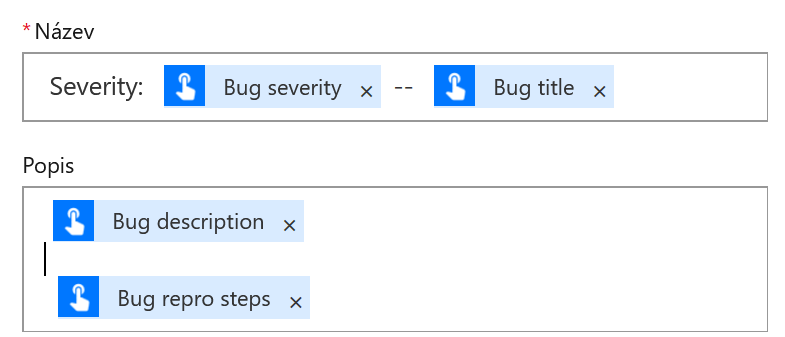

## Přizpůsobení nabízeného oznámeníCustomize the push notification

V dalším kroku změníme nabízené oznámení, které se zobrazuje na vašem telefonu.Next, we'll change the push notification that you'll get on your phone.

1. Na kartě **Send a push notification** (Poslat nabízené oznámení) vyberte záhlaví, aby se tato karta rozbalila.On the **Send a push notification** card, select the title bar to expand the card.
2. V seznamu tokenů dynamického obsahu vyberte **Zobrazit více** a pak do pole **Odkaz** přidejte token **URL**.In the list of dynamic content tokens, select **See more**, and then add the **URL** token to the **Link** field.
3. Do pole **Popisek odkazu** přidejte token **ID**.In the **Link label** field, add the **Id** token.

    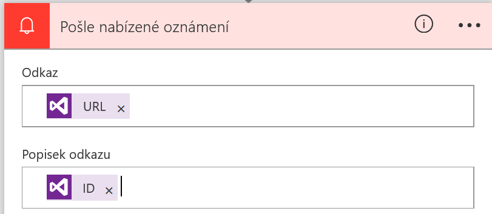

4. Vytvořte daný tok výběrem možnosti **Vytvořit tok**.Select **Create flow** to create the flow.

## Spuštění tokuRun the flow

Teď pomocí mobilní aplikace pro Microsoft Flow spustíte tok aktivovaný tlačítkem, který jste právě vytvořili.You'll now use the mobile app for Microsoft Flow to run the button flow that you just created. Provedete celý uživatelský vstup, který je potřeba k vytvoření chyby, která má název, popis, postup pro zopakování a úroveň závažnosti.You'll provide all the user input that's needed to create a bug that has a title, a description, repro steps, and a severity level.

1. V mobilní aplikaci pro Microsoft Flow vyberte v dolní části okna kartu **Tlačítka** a pak vyberte tlačítko **Create a bug report with steps** (Vytvoření sestavy chyb pomocí postupu).In the mobile app for Microsoft Flow, select the **Buttons** tab at the bottom of the window, and then select the **Create a bug report with steps** button.

    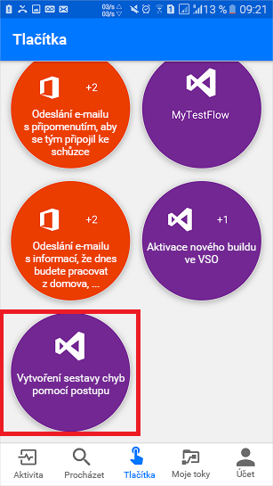

2. Zadejte název pro chybu, kterou oznamujete, a vyberte **Další**.Enter a title for the bug that you're reporting, and then select **Next**.

    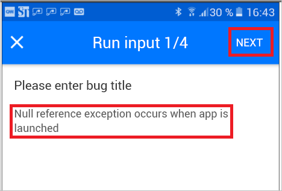

3. Zadejte popis chyby, kterou oznamujete, a vyberte **Další**.Enter a description of the bug that you're reporting, and then select **Next**.

    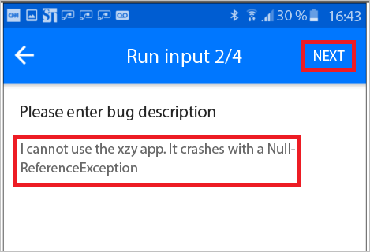

4. Zadejte postup pro zopakování chyby, kterou oznamujete, a vyberte **Další**.Enter the steps to reproduce the bug that you're reporting, and then select **Next**.

    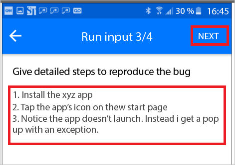

5. Zadejte závažnost chyby, kterou oznamujete, a vyberte **Hotovo**.Enter the severity of the bug that you're reporting, and then select **Done**.

    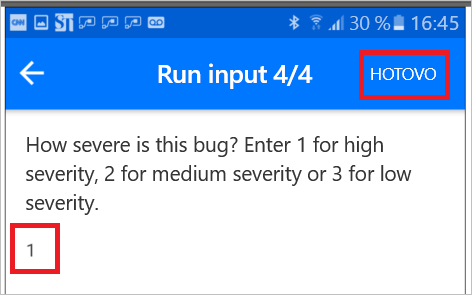

    Tok se spustí.The flow runs.

6. Vyberte v dolní části okna kartu **Aktivita**, aby se zobrazily výsledky.Select the **Activity** tab at the bottom of the window to view the results.

    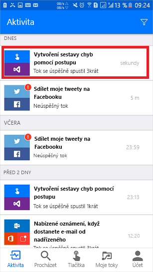

7. Pokud chcete zobrazit podrobné výsledky spuštění toku, vyberte krok **Vytvoření nové pracovní položky**.To view the detailed results of the flow run, select the **Create a new work item** step.

    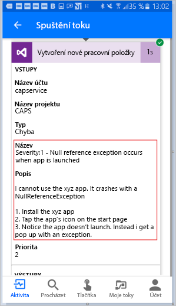
