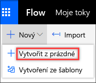

Můžete také vytvořit tok, který provádí jednu nebo více úloh (třeba posílá sestavu e-mailem) podle konkrétního plánu:You can create a flow that performs one or more tasks (for example, sending a report by email) on a specific schedule:

* Jednou denně, každou hodinu nebo minutuOnce a day, an hour, or a minute
* Ve stanovený denOn a date that you specify
* Po několika dnech, hodinách nebo minutách, které zadáteAfter a number of days, hours, or minutes that you specify

## Vytvoření tokuCreate the flow

1. Spusťte Microsoft Flow a přihlaste se pomocí účtu organizace.Launch Microsoft Flow and sign in using your organizational account.
1. V levém podokně vyberte **Moje toky**.In the left pane, select **My flows**.
1. Vyberte **Nový** a pak vyberte **Vytvořit z prázdné**.Select **New**, and then select **Create from blank**.

    

1. V poli **Prohledat všechny konektory a triggery** zadejte *Opakování* a vyberte trigger **Plán – opakování**.In the **Search all connectors and triggers** field, enter *Recurrence*, and then select the **Schedule - Recurrence** trigger.

    

1. V dialogovém okně **Opakování** zadejte, jak často se má tok spouštět.In the **Recurrence** dialog box, specify how often the flow should run.

    Pokud třeba chcete tok spouštět každý druhý týden, zadejte do pole *Interval* hodnotu **2** a do pole *Frekvence* zadejte **Týden**.For example, if you want the flow to run every two weeks, enter *2* in the **Interval** field, and select *Week* in the **Frequency** field.

    

## Zadání pokročilých možnostíSpecify advanced options

1. Postupujte podle pokynů v předchozí části a pak vyberte **Zobrazit pokročilé možnosti**.Follow the steps in the previous section, and then select **Show advanced options**.

    > [!NOTE]
    > Pokročilé možnosti závisí na hodnotách polí **Interval** a **Frekvence**.The advanced options vary, depending on the value of the **Interval** and **Frequency** fields. Pokud dialogové okno, které vidíte, neodpovídá následujícímu obrázku, ověřte, že jsou v polích **Interval** a **Frekvence** nastavené stejné hodnoty jako na obrázku.If the dialog box that you see doesn't match the graphic that follows, make sure that the **Interval** and **Frequency** fields are set to the same values that are shown in the graphic.

2. Vyberte časové pásmo a zjistěte, jestli hodnota v poli **Čas spuštění** odpovídá místnímu časovému pásmu, koordinovanému světovému času (UTC) nebo jinému časovému pásmu.Select a time zone to specify whether the value of the **Start time** field reflects a local time zone, Universal Coordinated Time (UTC), or another time zone.
3. Zadejte čas spuštění v tomto formátu: *YYYY-MM-DDTHH:MM:SSZ*Specify a start time in this format: *YYYY-MM-DDTHH:MM:SSZ*
4. Pokud jste v poli *Frekvence* vybrali **Den**, zadejte čas, kdy se má tok spustit.If you selected *Day* in the **Frequency** field, specify the time of day when the flow should run.

    Pokud jste vybrali *Týden*, zadejte den nebo dny v týdnu a jeden nebo více časů, kdy se má tok spustit.If you selected *Week*, specify the day or days of the week when the flow should run, and the time or times of day when the flow should run.

    Nastavte tok třeba podle následujícího obrázku. Nezačne dříve než v pondělí 1. ledna 2018 v poledne (pacifického času) a bude se spouštět každý druhý týden v úterý v 17:30 (pacifického času).For example, set up the flow as shown in the following graphic to start it no earlier than noon (Pacific time) on Monday, January 1, 2018, and to run it every two weeks, at 5:30 PM (Pacific time) on Tuesday.

    

6. Přidejte akci nebo akce, které má tok provést.Add the action or actions that the flow should take.

## Zpoždění tokuDelay the flow

V dalším kroku se naučíte, jak tok zpozdit.Next, you'll learn how to delay the flow.

1. Na horním navigačním panelu vyberte **Moje toky** a pak vyberte **Vytvořit z prázdné**.On the top navigation bar, select **My flows**, and then select **Create from blank**.
1. Do pole **Prohledat všechny konektory a triggery** zadejte *Twitter* a vyberte **Twitter – Když se publikuje nový tweet**.In the **Search all connectors and triggers** field, enter *Twitter*, and then select **Twitter - When a new tweet is posted**. Dokončete kroky toku.Finish the steps in the flow.
1. Vyberte **Nový krok**.Select **New step**.
1. V seznamu akcí vyberte **Zpoždění** nebo **Zpoždění do**.In the list of actions, select either **Delay** or **Delay until**.

    

1. V závislosti na vybrané akci proveďte jeden z následujících kroků:Follow one of these steps, depending on the action that you just selected:

    * Pokud jste vybrali **Zpoždění**, zadejte časové jednotky, třeba sekundy, minuty nebo hodiny, a jejich počet.If you selected **Delay**, specify a count and a unit of time, like second, minute, or hour.

        

    * Pokud jste vybrali **Zpoždění do**, zadejte datum v tomto formátu: *YYYY-MM-DDTHH:MM:SSZ*If you selected **Delay until**, specify a date in this format: *YYYY-MM-DDTHH:MM:SSZ*

        
