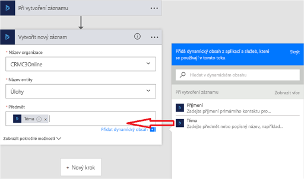

Můžete také vytvářet toky, které se spustí, když v Microsoft Dynamicsu 365 (nebo v jiné službě) nastane nějaká událost.You can create flows that start when an event occurs in Microsoft Dynamics 365 or some other service. Tyto toky následně provedou akci v Dynamicsu 365 nebo v jiné službě.These flows then perform an action in Dynamics 365 or some other service.

V Microsoft Flow můžete mezi svými oblíbenými aplikacemi a službami nastavit automatické pracovní postupy, které synchronizují soubory, posílají oznámení, shromažďují data apod.In Microsoft Flow, you can set up automated workflows between your favorite apps and services to sync files, get notifications, collect data, and more.

V této lekci si ukážeme vytvoření dvou toků:In this unit, we'll look to build two flows:

- První tok vytvoří úkol v Dynamicsu 365, když se v jiné instanci Dynamicsu 365 vytvoří zájemce.The first flow creates a task in Dynamics 365 when a lead is created in another instance of Dynamics 365.
- Druhý tok zkopíruje při vytvoření úlohy v Dynamicsu 365 vytvořenou položku seznamu na web Wunderlist.The second flow copies a list item to the Wunderlist website when a task is created in Dynamics 365.

Další příklady toků, které můžete vytvářet v Dynamicsu 365:Here are some other examples of flows that you can create by using Dynamics 365:

* Vytvoření položky seznamu v Microsoft SharePointu při vytvoření objektu v Dynamicsu 365Create a list item in Microsoft SharePoint when an object is created in Dynamics 365.
* Vytváření záznamů o zájemcích v Dynamicsu 365 z tabulky v Microsoft Excelu.Create Dynamics 365 lead records from a Microsoft Excel table.
* Kopírování účtů z Dynamicsu 365 do zákazníků Microsoft Dynamicsu 365 for Finance and Operations.Copy Dynamics 365 accounts to customers in Microsoft Dynamics 365 for Finance and Operations.

> [!IMPORTANT]
> Pokud chcete volat trigger toku, musí mít entita aplikace Dynamics 365 Customer Engagement, která se v toku používá, zapnuté sledování změn.To invoke a flow trigger, the Dynamics 365 customer engagement entity that's used with the flow must have change tracking turned on. Další informace o zapnutí sledování změn najdete v článku [Povolení sledování změn za účelem řízení synchronizace dat](https://docs.microsoft.com/dynamics365/customer-engagement/admin/enable-change-tracking-control-data-synchronization).For more about how to turn on change tracking, see [Enable change tracking to control data synchronization](https://docs.microsoft.com/dynamics365/customer-engagement/admin/enable-change-tracking-control-data-synchronization).

## První příklad: Vytvoření úkolu ze zájemceExample one: Create a task from a lead

V tomto příkladu si ukážeme, jak vytvořit úkol v Dynamicsu 365 pokaždé, když se v jiné instanci Dynamicsu 365 vytvoří zájemce.This example shows how to create a task in Dynamics 365 whenever a lead is created in another instance of Dynamics 365.

1. Přihlaste se k [Microsoft Flow](https://ms.flow.microsoft.com) pomocí účtu své organizace.Sign in to [Microsoft Flow](https://ms.flow.microsoft.com) by using your organizational account.
1. V levém podokně vyberte **Moje toky**.In the left pane, select **My flows**.
1. Vyberte **Nový** a pak vyberte **Vytvořit z prázdné**.Select **New**, and then select **Create from blank**.

    

1. V seznamu triggerů toků vyberte **Dynamics 365 – Při vytvoření záznamu**.In the list of flow triggers, select **Dynamics 365 - When a record is created**.
1. Pokud se zobrazí výzva k přihlášení do Dynamicsu 365, přihlaste se.If you're prompted to sign in to Dynamics 365, sign in.
1. V poli **Název organizace** vyberte instanci Dynamicsu 365, které má tok naslouchat.In the **Organization Name** field, select the Dynamics 365 instance where the flow should listen.
1. V poli **Název entity** vyberte entitu, které má tok naslouchat.In the **Entity Name** field, select the entity to listen to. Tato entita bude fungovat jako trigger, který spouští tok.This entity will act as a trigger that starts the flow.

    V této lekci vyberte entitu **Zájemci**.For this unit, select the **Leads** entity.

    

    > [!IMPORTANT]
    > Aby mohla entita Dynamicsu 365 aktivovat tok, musí mít definice entity zapnuté sledování změn.For the flow to be triggered on the Dynamics 365 entity, the entity definition must have change tracking turned on. Další informace viz [Povolení sledování změn za účelem řízení synchronizace dat](https://docs.microsoft.com/dynamics365/customer-engagement/admin/enable-change-tracking-control-data-synchronization).See [Enable change tracking to control data synchronization](https://docs.microsoft.com/dynamics365/customer-engagement/admin/enable-change-tracking-control-data-synchronization).

1. Vyberte **Nový krok** a pak vyberte **Přidat akci**.Select **New step**, and then select **Add an action**.
1. Vyberte **Dynamics 365 – Vytvořit nový záznam**.Select **Dynamics 365 – Create a new record**.
1. V poli **Název organizace** vyberte instanci Dynamicsu 365, ve které má tok vytvořit nový záznam.In the **Organization Name** field, select the Dynamics 365 instance where the flow should create the record. Nemusí jít o stejnou instanci, která aktivovala událost.Note that this instance doesn't have to be the same instance that the event is triggered from.
1. V poli **Název entity** vyberte entitu, která vytvoří záznam, když dojde k události.In the **Entity Name** field, select the entity that will create a record when the event occurs.

    V této lekci vyberte entitu **Úlohy**.For this unit, select the **Tasks** entity.

1. Zobrazí se pole **Předmět**.A **Subject** field appears. Když ho vyberete, zobrazí se podokno dynamického obsahu, kde můžete vybrat následující pole:When you select it, a dynamic content pane appears, where you can select the following fields:

    * **Příjmení:** Pokud toto pole vyberete, vloží se do pole **Předmět** při vytvoření úlohy příjmení zájemce.**Last Name**: If you select this field, the last name of the lead will be inserted into the **Subject** field of the task when it's created.
    * **Téma:** Pokud toto pole vyberete, vloží se do pole **Předmět** při vytvoření úlohy pole **Téma** zájemce.**Topic**: If you select this field, the **Topic** field for the lead will be inserted into the **Subject** field of the task when it's created.

    Pro tuto lekci vyberte **Téma**.For this unit, select **Topic**.

    

    > [!TIP]
    > V podokně dynamického obsahu vyberte **Zobrazit další**. Zobrazí se další pole související s danou entitou.In the dynamic content pane, select **See more** to see more fields that are associated with the entity. Do pole **Předmět** můžete v úloze také vložit například pole **Název společnosti**, **Zákazník**, **Popis** nebo **E-mail** s údaji zájemce.For example, you can also insert the **Company Name**, **Customer**, **Description**, or **Email** field for the lead into the **Subject** field for the task.

1. Vyberte **Uložit**.Select **Save**.

## Druhý příklad: Vytvoření úkolu ve Wunderlistu z úlohy Dynamics 365Example two: Create a Wunderlist task from a Dynamics 365 task

V tomto příkladu si ukážeme, jak vytvořit úkol ve [Wunderlistu](https://www.wunderlist.com) z každé úlohy vytvořené v aplikaci Dynamics 365.This example shows how to create a task in [Wunderlist](https://www.wunderlist.com) whenever a task is created in Dynamics 365. Wunderlist je internetová služba, kterou můžete použít k vytváření seznamů úkolů, přidávání připomenutí a sledování pochůzek.Wunderlist is an internet-based service that you can use to create to-do lists, add reminders, and track errands.

1. Přihlaste se k [Microsoft Flow](https://ms.flow.microsoft.com) pomocí účtu své organizace.Sign in to [Microsoft Flow](https://ms.flow.microsoft.com) by using your organizational account.
1. V levém podokně vyberte **Moje toky**.In the left pane, select **My flows**.
1. Vyberte **Nový** a pak vyberte **Vytvořit z prázdné**.Select **New**, and then select **Create from blank**.

    

1. V seznamu triggerů toků vyberte **Dynamics 365 – Při vytvoření záznamu**.In the list of flow triggers, select **Dynamics 365 - When a record is created**.
1. V poli **Název organizace** vyberte instanci Dynamicsu 365, které má tok naslouchat.In the **Organization Name** field, select the Dynamics 365 instance where the flow should listen.
1. V poli **Název entity** vyberte entitu, které má tok naslouchat.In the **Entity Name** field, select the entity to listen to. Tato entita bude fungovat jako trigger, který spouští tok.This entity will act as a trigger that starts the flow.

    V této lekci vyberte entitu **Úlohy**.For this unit, select the **Tasks** entity.

1. Vyberte **Nový krok**.Select **New step**.
1. Do vyhledávacího pole zadejte *vytvořit úkol* a pak vyberte **Wunderlist – Vytvořit úkol**.In the search field, enter *create a task*, and then select **Wunderlist – Create a task**.
1. V poli **ID seznamu** vyberte *doručená pošta*.In the **List ID** field, select *inbox*.
1. Do pole **Název** přidejte z podokna dynamického obsahu **Subject** (Předmět).In the **Title** field, add **Subject** from the dynamic content pane.
1. Vyberte **Uložit**.Select **Save**.

## Omezení logiky založené na triggerechLimitations of trigger-based logic

Triggery, jako je **Při vytvoření záznamu**, **Při aktualizaci záznamu** nebo **Při odstranění záznamu** spustí tok do několika minut od výskytu události.Triggers like **When a record is created**, **When a record is updated**, and **When a record is deleted** will start your flow within a few minutes after the event occurs. Ve výjimečných případech může aktivace toku trvat až dvě hodiny.But in rare cases, it might take up to two hours for your flow to be triggered.

Jakmile nastane aktivační událost, oznámí se to toku. Ten se ale spustí s daty, která existují v okamžiku zahájení akce.When the trigger occurs, the flow receives a notification, but the flow runs on the data that exists when the action runs. Pokud se třeba tok aktivuje při vytvoření nového záznamu, a vy tento záznam před spuštěním toku dvakrát aktualizujete, spustí se tok jen jednou s nejnovějšími daty.For example, if your flow is triggered when a new record is created, and you update the record twice before the flow runs, your flow runs only once with the latest data.

## Zadání pokročilých možnostíSpecify advanced options

Když do toku přidáte krok, můžete vybrat **Zobrazit pokročilé možnosti** a přidat filtr nebo dotaz order-by, který určuje způsob filtrování dat v toku.When you add a step to a flow, you can select **Show advanced options** to add a filter or order-by query that controls how the data is filtered in the flow.

Filtrovací dotaz můžete třeba použít k načtení pouze těch kontaktů, které jsou aktivní, a můžete seřadit podle příjmení.For example, you can use a filter query to retrieve only active contacts, and you can order them by last name. Zadejte filtrovací dotaz `statuscode eq 1` protokolu OData a v podokně dynamického obsahu vyberte **Last Name** (Příjmení).Enter the `statuscode eq 1` Open Data Protocol (OData) filter query, and select **Last Name** in the dynamic content pane. Další informace o dotazech používaných k filtrování a řazení najdete v tématech [MSDN: $filter](https://msdn.microsoft.com/library/gg309461.aspx#Anchor_1) a [MSDN: $orderby](https://msdn.microsoft.com/library/gg309461.aspx#Anchor_2).For more about filter and order by queries, see [MSDN: $filter](https://msdn.microsoft.com/library/gg309461.aspx#Anchor_1) and [MSDN: $orderby](https://msdn.microsoft.com/library/gg309461.aspx#Anchor_2).

### Osvědčené postupy u pokročilých možnostíBest practices for advanced options

Když přidáte do pole hodnotu, musíte dodržet typ pole bez ohledu na to, jestli ji zadáte nebo vyberete v podokně dynamického obsahu.When you add a value to a field, you must match the field type, regardless of whether you enter a value or select a value in the dynamic content pane.

| Typ poleField type | Způsob použitíHow to use | Kde ji najduWhere to find | NázevName | Datový typData type |
| --- | --- | --- | --- | --- |
| Textová poleText fields | Textová pole vyžadují jeden řádek textu nebo dynamický obsah textového pole.Text fields require a single line of text or dynamic content that's a text-type field. Příkladem jsou pole **Kategorie** a **Podkategorie**.Examples include the **Category** and **Sub-Category** fields. | **Nastavení** \> **Vlastní nastavení** \> **Přizpůsobit systém** \> **Entity** \> **Úloha** > **Pole****Settings** \> **Customizations** \> **Customize the System** \> **Entities** \> **Task** > **Fields** | categorycategory | Jeden řádek textuSingle Line of Text |
| Pole typu integerInteger fields | Některá pole vyžadují integer nebo dynamický obsah pole typu integer.Some fields require an integer or dynamic content that's an integer-type field. Příkladem jsou pole **Procento dokončení** a **Doba trvání**.Examples include the **Percent Complete** and **Duration** fields. | **Nastavení** \> **Vlastní nastavení** \> **Přizpůsobit systém** \> **Entity** \> **Úloha** \> **Pole****Settings** \> **Customizations** \> **Customize the System** \> **Entities** \> **Task** \> **Fields** | percentcompletepercentcomplete | Celé čísloWhole Number |
| Datová poleDate fields | Některá pole vyžadují datum zadané ve formátu *mm/dd/rrrr* nebo dynamický obsah pole typu datum.Some fields require a date that's entered in *mm/dd/yyyy* format or dynamic content that's a date-type field. Příkladem jsou pole **Vytvořeno**, **Počáteční datum**, **Skutečný začátek**, **Čas posledního blokování**, **Skutečné ukončení** a **Termín splnění**.Examples include the **Created On**, **Start Date**, **Actual Start**, **Last on Hold Time**, **Actual End**, and **Due Date** fields. | **Nastavení** \> **Vlastní nastavení** \> **Přizpůsobit systém** \> **Entity** \> **Úloha** \> **Pole****Settings** \> **Customizations** \> **Customize the System** \> **Entities** \> **Task** \> **Fields** | createdoncreatedon | Datum a časDate and Time |
| Pole, která vyžadují ID záznamu i typ vyhledáváníFields that require both a record ID and a lookup type | Některá pole, která odkazují na jiný záznam entity, vyžadují ID záznamu i typ vyhledávání.Some fields that reference another entity record require both the record ID and the lookup type. | **Nastavení** \> **Vlastní nastavení** \> **Přizpůsobit systém** \> **Entity** \> **Účet**\>**Pole****Settings** \> **Customizations** \> **Customize the System** \> **Entities** \> **Account** \> **Fields** | accountidaccountid | Primární klíčPrimary Key |
