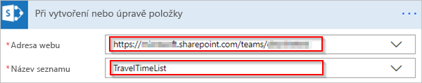
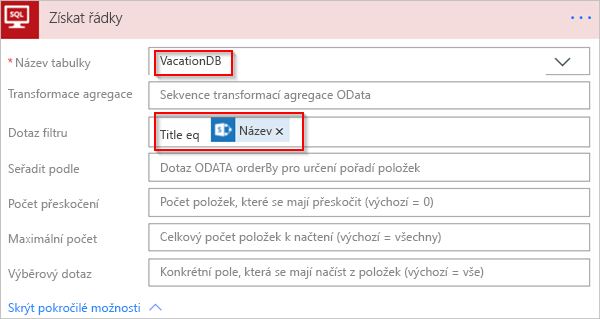
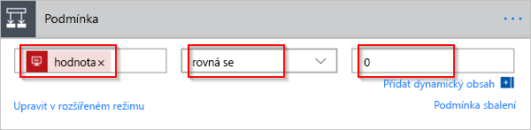
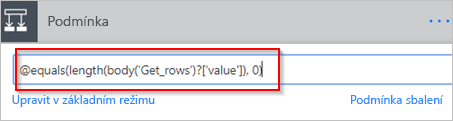
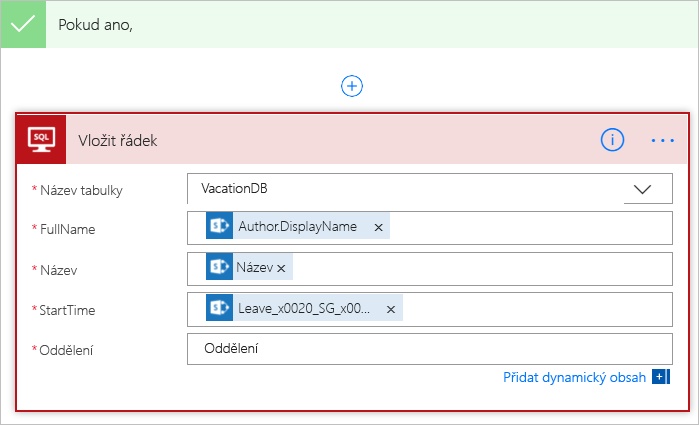
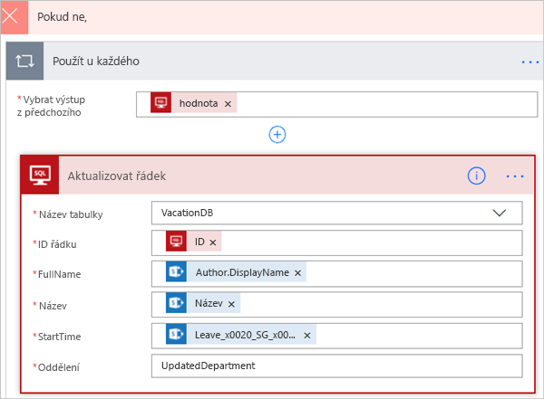

Tato lekce ukazuje, jak vytvořit tok, který monitoruje nové nebo změněné položky ve zdroji a pak tyto změny zkopíruje do cíle.This unit shows how to create a flow that monitors a source for new or changed items, and then copies those changes to a destination. Tok tohoto typu byste mohli vytvořit, pokud uživatelé zadávají data v jednom umístění, ale váš tým potřebuje tato data v jiném umístění nebo formátu.You might create a flow of this type if your users enter data in one location, but your team needs that data in a different location or format.

V této lekci zkopírujete data ze [seznamu Microsoft SharePointu](https://support.office.com/article/SharePoint-lists-I-An-introduction-f11cd5fe-bc87-4f9e-9bfe-bbd87a22a194) (zdroj) do tabulky [Microsoft Azure SQL Database](https://docs.microsoft.com/azure/sql-database/sql-database-technical-overview) (cíl).In this unit, you'll copy data from a [Microsoft SharePoint list](https://support.office.com/article/SharePoint-lists-I-An-introduction-f11cd5fe-bc87-4f9e-9bfe-bbd87a22a194) (the source) to a [Microsoft Azure SQL Database](https://docs.microsoft.com/azure/sql-database/sql-database-technical-overview) table (the destination).

Mějte na paměti, že můžete kopírovat data do více než [150 služeb](https://flow.microsoft.com/connectors/), které Microsoft Flow podporuje.Keep in mind that you can copy data over more than [150 services](https://flow.microsoft.com/connectors/) that Microsoft Flow supports.

> [!IMPORTANT]
> Změny provedené v cíli se nekopírují zpět do zdroje, protože obousměrná synchronizace není podporována.Changes that you make in the destination aren't copied back to the source, because two-way synchronization isn't supported. Pokud se pokusíte nastavit obousměrnou synchronizaci, vytvoříte nekonečnou smyčku, ve které se změny odesílají mezi zdrojem a cílem do nekonečna.If you try to set up two-way synchronization, you'll create an infinite loop where changes are sent endlessly between the source and destination.

## PožadavkyPrerequisites

* Přístup ke zdroji a cíli dat.Access to a data source and a destination. Tato lekce nezahrnuje postup pro vytvoření zdroje a cíle.This unit doesn't include the steps to create the source and destination.
* Přístup k [Microsoft Flow](https://flow.microsoft.com).Access to [Microsoft Flow](https://flow.microsoft.com).
* Základní znalosti o tom, jak jsou vaše data uložená.A basic understanding of how your data is stored.
* Znalost principů vytváření toků.Familiarity with the basics of creating flows. V této lekci se předpokládá, že víte, jak se tyto akce provádějí.For this unit, it's assumed that you know how to perform these actions.

> [!TIP]
> Názvy sloupců ve zdroji a cíli se nemusejí shodovat, ale při vložení nebo aktualizaci položky je nutné zadat data pro všechny požadované sloupce.Column names in the source and destination don't need to match, but you must provide data for all required columns when you insert or update an item. Microsoft Flow určí požadovaná pole za vás.Microsoft Flow identifies the required fields for you.

## Stručný přehled krokůQuick overview of the steps

Pokud jste s Microsoft Flow obeznámeni, zkopírujte data z jednoho zdroje dat do druhého pomocí těchto rychlých kroků.If you're comfortable with Microsoft Flow, use these quick steps to copy data from one data source to another.

1. Určete zdroj, který budete monitorovat, a cíl, do kterého zkopírujete změněná data.Identify the source that you'll monitor and the destination that you'll copy changed data to. Ověřte, že máte přístup ke zdroji i k cíli.Confirm that you have access to both the source and the destination.
2. Určete alespoň jeden sloupec, který jednoznačně identifikuje položky ve zdroji a cíli.Identify at least one column that uniquely identifies items in the source and destination. V následujícím příkladu použijeme sloupec **Název**, ale můžete použít libovolné sloupce.In the example that follows, we use the **Title** column, but you can use any columns.
3. Nastavte trigger, který monitoruje změny ve zdroji.Set up a trigger that monitors the source for changes.
4. Prohledáním cíle zkontrolujte, jestli změněná položka existuje.Search the destination to check whether the changed item exists.
5. Použijte podmínku, jako je tato:Use a condition like this:

    * Pokud nová nebo změněná položka v cíli neexistuje, vytvořte ji.If the new or changed item doesn't exist in the destination, create it.
    * Pokud nová nebo změněná položka v cíli existuje, aktualizujte ji.If the new or changed item exists in the destination, update it.

6. Aktivujte tok a pak ověřte, že nové nebo změněné položky se kopírují ze zdroje do cíle.Trigger your flow, and then confirm that new or changed items are being copied from the source to the destination.

> [!NOTE]
> Pokud jste dosud nevytvořili připojení ke službě SharePoint nebo SQL Database, postupujte po zobrazení výzvy k přihlášení podle pokynů.If you haven't previously created a connection to SharePoint or SQL Database, follow the instructions when you're prompted to sign in.

Tady je podrobný postup pro vytvoření toku.Here are the detailed steps to create the flow.

## Monitorování změn ve zdrojiMonitor the source for changes

Nejprve nastavíme web SharePointu pro monitorování změn.First, we'll set up the SharePoint site to monitor changes.

1. Spusťte Microsoft Flow a přihlaste se pomocí účtu organizace.Launch Microsoft Flow and sign in using your organizational account.
1. V levém podokně vyberte **Moje toky**.In the left pane, select **My flows**.
1. Vyberte **Nový** a pak vyberte **Vytvořit z prázdné**.Select **New**, and then select **Create from blank**.

    

1. V seznamu triggerů vyberte trigger **SharePoint – Při vytvoření nebo úpravě položky**.In the list of triggers, select the **SharePoint - When an item is created or modified** trigger.
1. Na kartě **Při vytvoření nebo úpravě položky** zadejte adresu webu a pak vyberte název sharepointového seznamu, ve kterém váš tok monitoruje nové nebo aktualizované položky.On the **When an item is created or modified** card, enter the site address, and then select the name of the SharePoint list that your flow monitors for new or updated items.

    

## Vyhledání cíle nové nebo změněné položkySearch the destination for the new or changed item

V dalším kroku vyhledáme cíl nové nebo změněné položky pomocí akce **SQL Server – Získat řádky**.Next, we'll use the **SQL Server - Get rows** action to search the destination for the new or changed item.

1. Vyberte **Nový krok**.Select **New step**.
1. V části **Zvolte akci** vyhledejte *Získat řádky* a pak vyberte **SQL Server – Získat řádky**.Under **Choose an action**, search for *Get rows*, and then select **SQL Server - Get rows**.
1. V seznamu **Název tabulky** vyberte tabulku, kterou chcete monitorovat.In the **Table name** list, select the table to monitor.
1. Vyberte **Zobrazit pokročilé možnosti**.Select **Show advanced options**.
1. Do pole **Dotaz filtru** zadejte *Title eq* (Název eq), mezeru a znak jednoduchých uvozovek (').In the **Filter Query** box, enter *Title eq* followed by a space and a single quotation mark ('). Pak v seznamu dynamického obsahu vyberte token **Název** a zadejte další znak jednoduchých uvozovek.Then select the **Title** token in the dynamic content list, and enter another single quotation mark.

    Tento krok předpokládá, že porovnáváte odpovídající názvy řádků ve zdroji a cíli.This step assumes that you're matching the titles of the rows in the source and destination.

    Karta **Získat řádky** by teď měla vypadat jako na tomto obrázku.The **Get rows** card should now look like this image.

    

## Kontrola, jestli byla nalezena nová nebo změněná položkaCheck whether the new or changed item was found

V dalším kroku zkontrolujeme, jestli byla nalezena nová nebo změněná položka.Next, we'll check whether the new or changed item was found.

1. Vyberte **Nový krok** a pak vyberte **Přidat podmínku**.Select **New step**, and then select **Add a condition**.
2. Na kartě **Podmínka** vyberte pole vlevo.On the **Condition** card, select the field on the left.

    Otevře se seznam **Přidá dynamický obsah z aplikací a konektorů, které se používají v tomto toku**.The **Add dynamic content from the apps and connectors used in this flow** list opens.

3. V kategorii **Získat řádky** vyberte **Hodnota**.In the **Get rows** category, select **value**.

    > [!TIP]
    > Ověřte, že jste vybrali **Hodnota** v kategorii **Získat řádky**.Confirm that you've selected **value** in the **Get rows** category. Nevybírejte **Hodnota** v kategorii **Při vytvoření nebo úpravě položky**.Don't select **value** in the **When an item is created or modified** category.

4. V poli uprostřed vyberte *rovná se*.In the field in the center, select *is equal to*.
5. Do pole vpravo zadejte *0* (nula).In the field on the right, enter *0* (zero).

    Karta **Podmínka** by teď měla vypadat jako na tomto obrázku.The **Condition** card should now look like this image.

    

6. Vyberte **Upravit v rozšířeném režimu**.Select **Edit in advanced mode**.
7. Po spuštění rozšířeného režimu se v poli zobrazí výraz `@equals(body('Get_rows')?['value'], 0)`.When advanced mode is started, you'll see the `@equals(body('Get_rows')?['value'], 0)` expression in the field. Upravte tento výraz přidáním funkce *length()*, do níž umístíte uvedenou funkci `body('Get_items')?['value']`.Edit this expression by adding *length()* around the `body('Get_items')?['value']` function. Celý výraz by teď měl vypadat takto: `@equals(length(body('Get_rows')?['value']), 0)`The entire expression should now look like this: `@equals(length(body('Get_rows')?['value']), 0)`

    Karta **Podmínka** by teď měla vypadat jako na tomto obrázku.The **Condition** card should now look like this image.

    

    > [!TIP]
    > Přidání funkce `length()` umožní toku zkontrolovat seznam **Hodnota** a určit, jestli obsahuje nějaké položky.The addition of the `length()` function lets the flow check the **value** list and check whether it has any items.

Když tok získá položky z cíle, jsou možné dva výsledky.When your flow gets items from the destination, there are two possible outcomes.

| VýsledekOutcome | Další krokNext step |
| --- | --- |
| Položka existuje.The item exists. | Aktualizujte položku.Update the item. |
| Položka neexistuje.The item doesn't exist. | Vytvořte novou položku.Create a new item. |

## Vytvoření položky v cíliCreate the item in the destination

Pokud položka v cíli neexistuje, vytvořte ji pomocí akce **SQL Server – Vložit řádek**.If the item doesn't exist in the destination, create it by using the **SQL Server - Insert row** action.

1. Ve větvi podmínky **Pokud ano** vyberte **Přidat akci**, vyhledejte *Vložit řádek* a pak vyberte **SQL Server – Vložit řádek**.On the **If yes** branch of the condition, select **Add an action**, search for *insert row*, and then select **SQL Server - Insert row**.
2. Na kartě **Vložit řádek** v seznamu **Název tabulky** vyberte tabulku, do které chcete vložit novou položku.On the **Insert row** card, in the **Table name** list, select the table to insert the new item into.

    Karta **Vložit řádek** se rozbalí a zobrazuje všechna pole ve vybrané tabulce.The **Insert row** card expands and shows all fields in the selected table. Pole označená hvězdičkou (\*) jsou povinná, a pokud má být řádek platný, musí být vyplněná.Fields that are marked with an asterisk (\*) are required and must be filled in for the row to be valid.

3. Vyberte každé pole, které chcete vyplnit, a zadejte data.Select each field that you want to fill in, and enter the data.

    Můžete zadat data ručně, vybrat jeden nebo více tokenů v podokně dynamického obsahu nebo zadat do polí libovolnou kombinaci textu a tokenů.You can manually enter the data, select one or more tokens in the dynamic content pane, or enter any combination of text and tokens into the fields.

    

> [!NOTE]
> Karty **Vložit řádek** a **Aktualizovat řádek** zobrazují názvy sloupců v tabulce SQL Database, která se používá v daném toku.The **Insert row** and **Update row** cards show the names of the columns in the SQL Database table that's being used in the flow. Karty na obrázcích v tomto postupu se proto můžou lišit od karet, které se zobrazují vám.Therefore, the cards that are shown in the images in this procedure might differ from the cards that you see. 

## Aktualizace položky v cíliUpdate the item in the destination

Pokud položka v cíli existuje, aktualizujte ji změnami.Next, if the item exists in the destination, update it with the changes.

1. Přidejte akci **SQL Server – Aktualizovat řádek** do větve podmínky **Pokud ne**.Add the **SQL Server - Update row** action to the **If no** branch of the condition.

    

1. Do pole **Název toku** v horní části stránky zadejte název pro váš tok.In the **Flow name** field at the top of the page, enter a name for your flow.
1. Uložte tok výběrem možnosti **Uložit**.Select **Save** to save the flow.

Při každé změně položky sharepointového seznamu (zdroj) se teď tok aktivuje.Now, whenever an item in your SharePoint list (the source) changes, your flow is triggered. Vloží novou položku nebo aktualizuje existující položku ve službě SQL Database (cíl).It either inserts a new item or updates an existing item in SQL Database (the destination).

> [!NOTE]
> Pokud dojde k odstranění položky ze zdroje, tok se neaktivuje.Your flow isn't triggered when an item is deleted from the source. Pokud je tento scénář pro vás důležitý, zvažte možnost přidání samostatného sloupce, který bude indikovat, že položku už nepotřebujete.If this scenario is important to you, consider adding a separate column that indicates when an item is no longer needed.
