Vítá vás Microsoft Flow!Welcome to Microsoft Flow! V tomto modulu se naučíte, jak vytvářet toky.In this module, you'll learn how to build flows.

Pokud s Microsoft Flow teprve začínáte, tento modul vám pomůže posunout se dále.If you're a beginner with Microsoft Flow, this module will get you going. Pokud už nějaké zkušenosti máte, tento modul propojí dosud získané znalosti a vyplní případné mezery.If you already have some experience, this module will tie concepts together and fill in the gaps.

## Cíle výukyLearning objectives
V tomto modulu:In this module, you will:
   - Zjistíte, co je Microsoft Flow a jak se používá.Learn what Microsoft Flow is and how it can be used
   - Vytvoříte tok, který automaticky ukládá e-mailové přílohy.Create a flow that automatically saves email attachments
   - Zjistíte, jak vytvořit tok aktivovaný tlačítkem, kterým pošlete připomenutí sami sobě.Learn how to create a button flow to send yourself a reminder
   - Vytvoříte tok, který posílá oznámení.Create a flow that sends you notifications
   - Vytvoříte tok, který kopíruje soubory.Create a flow that copies files
   - Vytvoříte tok, který se spouští podle plánu.Create a flow that runs on a schedule
   - Vytvoříte tok, který publikuje tweety.Create a flow that posts tweets
   - Vytvoříte tok, který může být používaný vaším týmem.Create a flow that your team can use

## Co je Microsoft Flow?What is Microsoft Flow?
Microsoft Flow je online služba pro vytváření pracovních postupů, která automatizuje různé akce v nejčastěji používaných aplikacích a službách.Microsoft Flow is an online workflow service that automates actions across the most common apps and services. Můžete třeba vytvořit tok, který přidá potenciálního zákazníka do Microsoft Dynamicsu 365 a vytvoří záznam v MailChimpu pokaždé, když někdo s více než 100 sledujícími tweetuje o vaší společnosti.For example, you can create a flow that adds a lead to Microsoft Dynamics 365 and a record in MailChimp whenever someone with more than 100 followers tweets about your company.

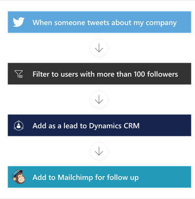

Po přihlášení se můžete připojit k více než 220 službám a můžete spravovat data v cloudu nebo místních zdrojích, jako je SharePoint nebo Microsoft SQL Server.When you sign up, you can connect to more than 220 services, and can manage data either in the cloud or in on-premises sources like SharePoint and Microsoft SQL Server. Seznam aplikací, které můžete v Microsoft Flow použít, se stále rozrůstá.The list of applications you can use with Microsoft Flow grows constantly.

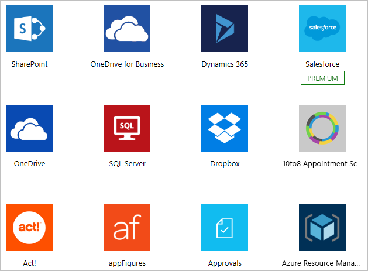

## K čemu slouží Microsoft Flow?What can you do with Microsoft Flow?

V Microsoft Flow můžete automatizovat pracovní postupy probíhající mezi vašimi oblíbenými aplikacemi a službami. Můžete synchronizovat soubory, dostávat oznámení, shromažďovat data a mnoho dalšího.You can use Microsoft Flow to automate workflows between your favorite applications and services, sync files, get notifications, collect data, and much more. 

Můžete automatizovat třeba tyto úlohy:For example, you can automate these tasks:

* Ihned reagovat na oznámení nebo e-maily s vysokou prioritou.Instantly respond to high-priority notifications or emails.
* Zaznamenat a sledovat nové potenciální zákazníky a dále s nimi pracovat.Capture, track, and follow up with new sales leads.
* Kopírovat všechny e-mailové přílohy do účtu OneDrivu pro firmy.Copy all email attachments to your OneDrive for Business account.
* Shromažďovat data o vaší firmě a sdílet tyto informace s vaším týmem.Collect data about your business, and share that information with your team.
* Automatizovat schvalovací pracovní postupy.Automate approval workflows.

Microsoft Flow se často používá, když chcete dostávat oznámení.A common use of Microsoft Flow is to receive notifications. Když třeba do Dynamicsu 365 nebo do Salesforce přibude potenciální zákazník, můžete hned dostat e-mail nebo si v telefonu přečíst nabízené oznámení.For example, you can instantly receive an email or a push notification on your phone whenever a sales lead is added to Dynamics 365 or Salesforce.

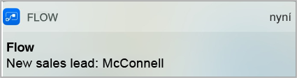

Microsoft Flow také můžete použít ke kopírování souborů.You can also use Microsoft Flow to copy files. Můžete třeba zajistit, aby se každý soubor přidaný do Dropboxu také automaticky zkopíroval do SharePointu, kde ho váš tým najde.For example, you can ensure that any file that's added to Dropbox is automatically copied to SharePoint, where your team can find it.

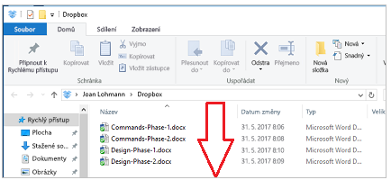 

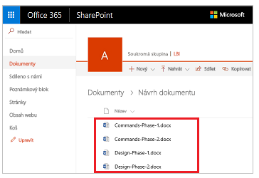 

Můžete sledovat, co lidé říkají o vaší firmě. Stačí vytvořit tok, který se spustí pokaždé, když někdo pošle tweet s určitým hashtagem.You can monitor what people are saying about your business by creating a flow that runs whenever someone sends a tweet with a certain hashtag. Tok může přidat podrobnosti o každém tweetu do databáze SQL Serveru, seznamu SharePointu nebo třeba do souboru Microsoft Excelu, který je hostovaný na OneDrivu pro firmy, podle toho, jaká služba vám více vyhovuje.The flow can add details about each tweet to a Facebook post, a SQL Server database, a SharePoint list, or even a Microsoft Excel file that's hosted on OneDrive for Business–-whichever service works for you. 

Můžete vytvářet akce, které připojí shromažďovaná data k Microsoft Power BI, budou sledovat trendy v těchto datech a budou klást otázky.You can create actions to connect the data you collect to Microsoft Power BI, spot trends in that data, and ask questions about it.

Následující příklad ukazuje tok, který uloží tweety s hashtagem #MicrosoftFlow do souboru v Excelu.The following example shows a flow that saves tweets with the hashtag #MicrosoftFlow to an Excel file.

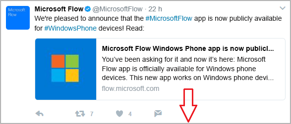

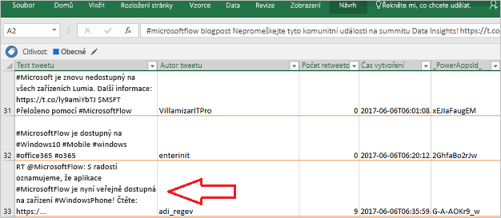

Můžete také automatizovat schvalovací kolečka například u žádostí o dovolenou, které jsou v seznamu SharePointu.Also, you can automate approval loops for things like vacation requests on a SharePoint list.

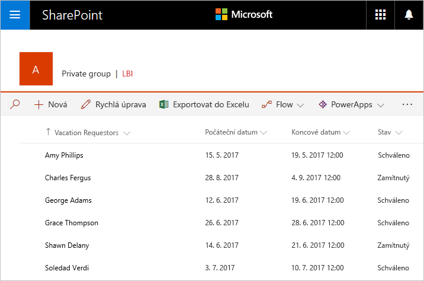

Další nápady najdete v seznamu šablon.For more ideas, browse our list of templates. Šablony usnadňují vytváření toků – stačí udělat jen pár změn v konfiguraci.Templates help you build flows by making a few configuration changes. Pomocí šablon můžete třeba jednoduše vytvořit toky, které vám pošlou předpověď počasí, pravidelně vám něco připomenou nebo vás upozorní v telefonu pokaždé, když vám nadřízený pošle e-mail.For example, you can use templates to easily build flows to send yourself weather forecasts, reminders at regular intervals, or phone notifications whenever your manager sends you mail.

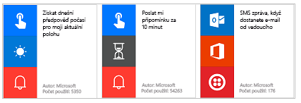

Napadá vás tok, který v seznamu není?Have an idea for a flow that you don't see in the list? Můžete si vytvořit vlastní tok úplně od začátku, a pokud chcete, můžete ho sdílet s komunitou.Create your own from scratch and, if you want, share it with the community!

## Kde můžu tok vytvořit a spravovat?Where can I create and administer a flow?

Vytvořit tok a plnit úkoly spojené s jeho správou můžete v prohlížeči. Pokud si stáhnete mobilní aplikaci Microsoft Flow, můžete tyto úkoly provádět na telefonu.You can create a flow and perform administrative tasks in a browser or, if you download the Microsoft Flow mobile app, on your phone.

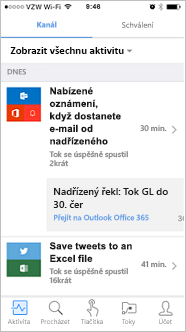

Tady jsou některé úlohy, které můžete provádět pomocí mobilní aplikace:Here are some of the tasks you can perform with the mobile app:

* Zapínat a vypínat toky bez ohledu na to, kde jste.Turn flows on or off from wherever you are.
* Podívat se, kdy tok selhal.See when a flow has failed.
* Kontrolovat podrobné sestavy o historii spuštění.Review detailed run history reports.
* Zobrazit a filtrovat spuštění podle typu oznámení.View and filter runs by notification type.

## Stručný přehled Microsoft FlowA brief tour of Microsoft Flow
Pojďme přejít k nástroji Microsoft Flow. Ukážeme si, jak ho používat.Let's jump into Microsoft Flow, and we'll show you around. Máme pro vás spoustu informací, ze kterých se dozvíte, jak Microsoft Flow používat.We have tons of information for you to learn about how to use Microsoft Flow.

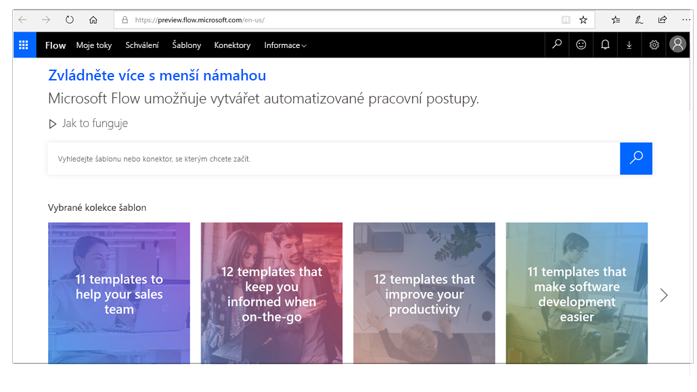

Při přihlášení k Microsoft Flow uvidíte tyto nabídky:When you sign in to Microsoft Flow, you'll find these menus:

* **Moje toky** – v této nabídce jsou vaše toky.**My flows**, where your flows reside.
* **Šablony** – tady se můžete podívat na nejoblíbenější šablony.**Templates**, where you can take a look at some of the most popular templates. Sem se také můžete podívat na nápady, jaké toky byste mohli vyzkoušet.These should give you some great ideas for flows you want to try.
* **Schválení** – v této nabídce můžete automatizovat a zjednodušit schvalovací proces.**Approvals**, where you can automate and streamline your approval process.
* **Konektory** (dříve Služby) – v této nabídce se můžete připojovat z jedné služby k jiné.**Connectors**, (formerly called Services), where you can connect from one service to another.
* **Data** – tady můžete přistupovat k entitám, připojením, vlastním konektorům a bránám.**Data**, where you can access entities, connections, custom connectors and gateways.
* **Řešení** – tady můžete spravovat vaše řešení.**Solutions**, where you can manage your solutions. 
* **Kurzy** – v této nabídce najdete informace, které vám pomůžou v Microsoft Flow rychle postupovat dopředu.**Learn**, where you can find information that will help you quickly ramp up on Microsoft Flow.

Teď se zaměřme na nabídku **?**For now, let's focus on the **?** vedle vašich přihlašovacích údajů, která má tyto možnosti:menu next to your login, which has these options:

* **Dokumentace** – v této nabídce najdete pokročilá témata.**Documentation** is where our advanced topics reside. Pokud chcete důkladně porozumět některé vlastnosti nebo funkci, tady najdete podrobné informace.If you want to really understand a feature or function, you can do a deep dive here to figure things out.
* **Učení** – povede vás při používání Microsoft Flowu od počátečních technik až po pokročilé scénáře.**Learn** has learning paths to guide you through using Microsoft Flow, all the way from beginning techniques to advanced scenarios.
* **Podpora** – tady najdete potřebnou pomoc.**Support** is a great landing place to find help.
* **Komunita** – můžete se zapojit nebo se zde dozvíte, jak používají Microsoft Flow ostatní.**Community** is a place to plug into and find out how other people use Microsoft Flow.
* **Váš názor** – můžete se obrátit na komunitu zkušených uživatelů. Tady můžete vývojářům a dalším zkušeným uživatelům posílat své komentáře a otázky.**Give Feedback** taps into a community of power users, and is where you can send comments and questions to developers and other experienced users.
* **Blog** – aktuální informace o nejnovějším vývoji a nejnovějších verzích v ekosystému Microsoft Flow.**Blog** keeps you up to date about the most recent developments and releases in the Microsoft Flow ecosystem.
* **Ceny** – tato nabídka vám pomůže vybrat správný plán pro vás nebo pro vaši firmu.**Pricing** can help you choose the right plan for you or your business.

## Co dále?What's next?
Už víte, co je Microsoft Flow a k čemu slouží. Teď se podíváme, z čeho se skládá tok.Now that you have a taste of what Microsoft Flow is and what it can do, let's take a look at what makes a flow.