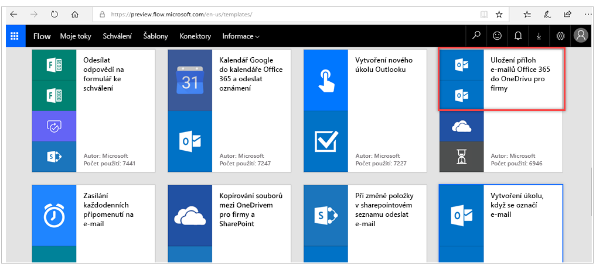
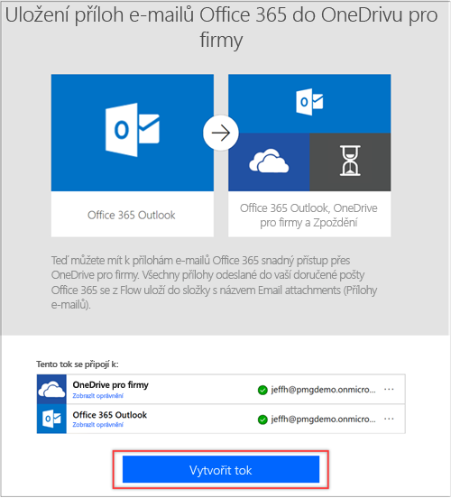
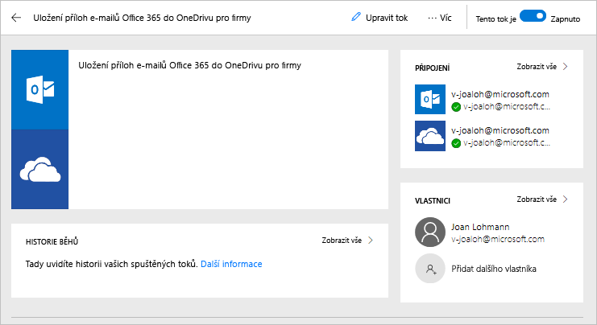
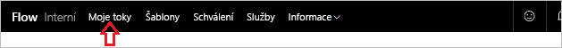
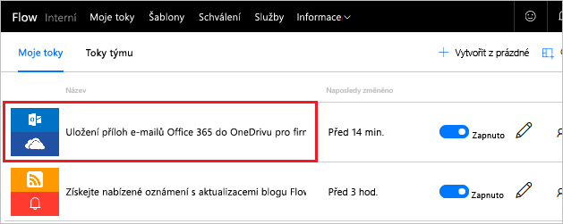
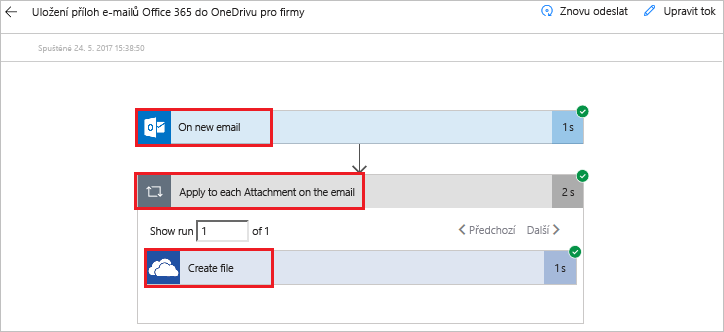
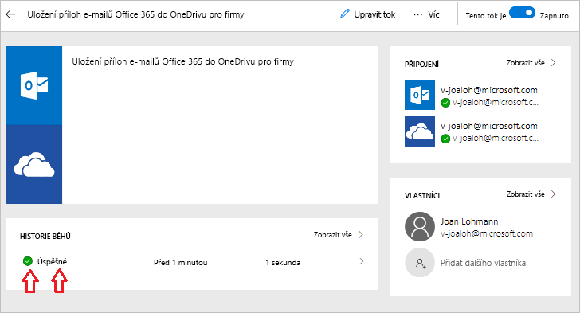
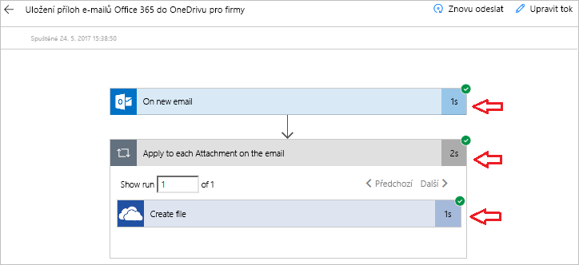

V této lekci se blíže seznámíte se službou Microsoft Flow a vytvoříte první tok.In this unit, you'll see more of Microsoft Flow as you build your first flow.

Hledání příloh prostřednictvím e-mailů může být časově náročné.It can be time consuming to search for attachments through email. Tok, který vytvoříte, šetří čas tím, že všechny e-mailové přílohy ukládá do složky v účtu Microsoft OneDrivu pro firmy.The flow that you'll build saves time by storing all your email attachments in a folder on your Microsoft OneDrive for Business account.

## Volba šablonyChoose a template
K dispozici je řada šablon, které zrychlí přípravu toku.Our many templates will get your flows flowing quickly. Pomohou vám účinněji propojit služby, které už používáte.They'll help you connect the services you're already using in more meaningful ways.

Přihlaste se ke službě [Microsoft Flow](https://ms.flow.microsoft.com) a vyberte nabídku **Šablony**.Sign in to [Microsoft Flow](https://ms.flow.microsoft.com), and select the **Templates** menu. Do služby Microsoft Flow se můžete zaregistrovat pomocí účtu Microsoft.You can sign up for Microsoft Flow with a Microsoft account.

Vyberte šablonu **Uložení příloh e-mailů Office 365 do OneDrivu pro firmy**.Select the **Save Office 365 email attachments to OneDrive for Business** template.

## Vytvoření tokuCreate the flow
**Uložení příloh e-mailů Office 365 do OneDrivu pro firmy** je jedna z našich šablon, které nasadíte jedním kliknutím. Můžete s ní odpovědět na otázky, které jsou potřeba k vytvoření toku, takže nemusíte napsat ani jeden řádek kódu.**Save Office 365 email attachments to OneDrive for Business** is one of our one-click templates, in which you can answer questions that are necessary to build the flow, so that you don't have to write a line of code.

Na obrázku šablony je popis, k čemu šablona slouží a co je potřeba, aby se dala úspěšně použít.On the template graphic, there's a description of what the template does and what it needs to succeed.

Zobrazí se výzva k zadání přihlašovacích údajů ke službám Microsoft Office 365 Outlook a Microsoft OneDrive pro firmy.You'll be asked to provide credentials for the Microsoft Office 365 Outlook and Microsoft OneDrive for Business services. Pokud obě služby používáte pravidelně, už jste k nim přihlášení.If you regularly use both services, you'll already be signed in.

1. Vyberte **Vytvořit tok**.Select **Create Flow**.

    

1. Na další stránce vám Microsoft Flow vytvoří tok.On the next page, Microsoft Flow creates the flow for you. 
    - Připojí se k vašemu pracovnímu e-mailu, aby mohl stáhnout všechny přílohy.It'll connect  to your work email to get any attachments. 
    - Potom ve vašem účtu OneDrivu pro firmy vytvoří složku, do které začne automaticky ukládat všechny přílohy poslané na vaši pracovní e-mailovou adresu.It will then create a folder on your OneDrive for Business account to automatically put every attachment that's sent to your work email address in that folder.

    

2. Vyberte nabídku **Moje toky**.Select the **My flows** menu.

    

3. Vyberte tok, který jste vytvořili, a podívejte se, jak funguje.Select the flow you just created to see how it works.

    

4. Pošlete e-mail s přílohou nebo nechte jiného uživatele, aby poslal e-mail s přílohou.Send an email with an attachment, or have another user send an email with an attachment. Měli byste pak vidět zelené zaškrtnutí, které signalizuje úspěšný tok.You then should see a green check mark, which indicates that the flow succeeded. 
5. Pokud se chcete podívat na definici toku, vyberte **Upravit**.Select **Edit** to see how the flow is defined.

     
 
6. Pokud se chcete podívat na historii a výsledky spuštění, vyberte **Úspěšné**.Select **Succeeded** to see the run history and the results.

    

    V uvedeném případě byly všechny části toku úspěšné.In this case, all parts of the flow were successful. 

    

## Důležité informace o Microsoft FlowImportant concepts in Microsoft Flow
Při vytváření toků mějte na paměti tyto skutečnosti:Keep these concepts in mind when building flows: 

- Každý tok má dvě hlavní části: *aktivační událost* a jednu nebo více *akcí*.Every flow has two main parts: a *trigger*, and one or more *actions*.
- Aktivační událost si můžete představit jako akci, která tok zahajuje.You can think of the trigger as the starting action for the flow. Aktivační událostí může být třeba nový e-mail, který přijde do vaší doručené pošty, nebo nová položka přidaná do seznamu SharePointu.The trigger can be something like a new email arriving in your inbox or a new item being added to a SharePoint list.
- Akce definují, co se má stát, pokud dojde k aktivační události.Actions are what you want to happen when a trigger is invoked. Aktivační událost nového e-mailu například zahájí akci spočívající ve vytvoření nového souboru na OneDrivu pro firmy.For example, the new email trigger will start the action of creating a new file on OneDrive for Business. K dalším příkladům akcí patří poslání e-mailu, zveřejnění tweetu nebo zahájení schválení.Other examples of actions include sending an email, posting a tweet, and starting an approval.

Tyto možnosti použijete později, až budete vytvářet vlastní toky úplně od začátku.These concepts will come into play later, when you build your own flows from scratch. 

V další lekci se podíváme na mobilní aplikaci Microsoft Flow a její možnosti.In the next unit, we'll look at the Microsoft Flow mobile app and its capabilities. 
