Samozřejmě máme aplikaci – mobilní aplikaci Microsoft Flow!Of course we have an app -- the Microsoft Flow mobile app! Z této aplikace máte přístup k těmto funkcím:From this app, you can access these features:

- Informační kanál o aktivitáchActivity Feed
- ProcházeníBrowsing
- TlačítkaButtons
- Správa tokůManaging Flows

Nejdříve si musíte mobilní aplikaci Microsoft Flow stáhnout a nainstalovat z obchodu s aplikacemi.First, you'll need to download and install the Microsoft Flow mobile app from your app store.

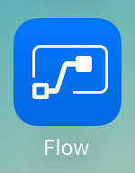

Po instalaci ji spusťte a přihlaste se.After it's installed, start it and sign in.

Při prvním spuštění aplikace uvidíte informační kanál o aktivitách.When you first start the app, you'll see the Activity Feed. V informačním kanálu o aktivitách uvidíte, co se děje s vašimi toky.The Activity Feed is the place to see what's happening with your flows. Nenabízí sice všechny funkce, které byste od počítače očekávali, ale zobrazí vám užitečné informace.It won't be the full experience you'd expect from your PC, but it will show you useful details.

Uvidíte třeba poslední aktivitu toku, jak je vidět tady.For example, you'll see a flow's last activity, as shown here. Můžete se podívat, jestli tok byl nebo nebyl úspěšný.You can see whether the flow succeeded or failed. Pokud úspěšný nebyl, uvidíte, při kterém kroku nastala chyba.If it failed, you'll see which step it failed on.

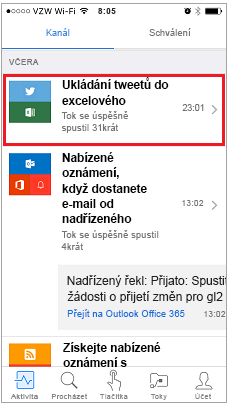

## Jak se spouští toky aktivované tlačítkemHow button flows are started
Tlačítka jsou toky, které se spouští ruční akcí.Buttons are flows that are started through a manual action. Můžete třeba vytvořit tlačítko, které vašemu nadřízenému pošle e-mail s informací, že *dneska budete pracovat z domova*.For example, you can create a button to send a *Working from home today* email to your manager. Pokud žijete daleko od pracoviště, můžete toto tlačítko využít ve dnech, kdy se nikam nedostanete přes dopravní zácpu!If you live far from your workplace, you can then use this button on days when the traffic is a mess!

- K použití některých z těchto toků vyberte **Tlačítka**.Select **Buttons** to use some of these flows.

    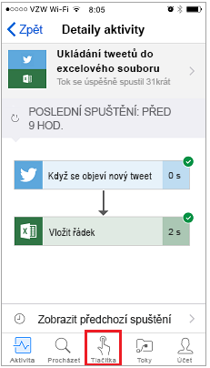

- Pomocí **Procházet** si můžete prohlédnout šablony pro další toky tlačítek, které můžete přidat do své kolekce.Select **Browse** to check out templates for more button flows that you can add to your collection.

    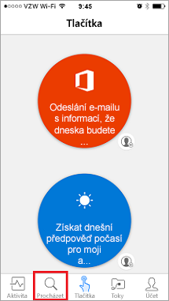

Abychom vám ukázali, jak tlačítka používat, použijeme šablonu **tlačítka Poslat mi připomínku za 10 minut**.To show you how you can use buttons, we'll use the **Send myself a reminder in 10 minutes button** template.

1. Vyberte **Tlačítka** a potom **Procházet**.Select **Buttons**, and then **Browse**.
2. Vyberte tok **tlačítka Poslat mi připomínku za 10 minut**.Select the **Send myself a reminder in 10 minutes button** flow.
3. Vyberte **Použít tuto šablonu**.Select **Use this template**.

    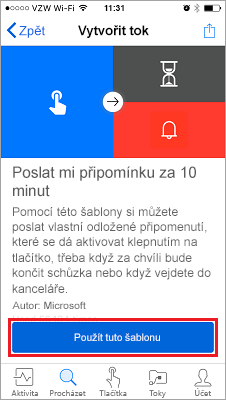

4. Vyberte **Vytvořit** a pak vyberte **Hotovo**.Select **Create**, and then select **Done**.

    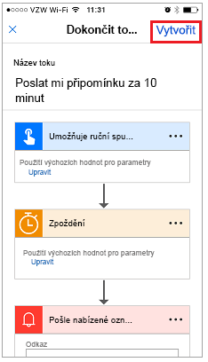

    Tok se uloží.The flow is saved.

    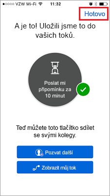

5. Výběrem **Tlačítka** si můžete nový tok zobrazit.Select **Buttons** to see the new flow. 

    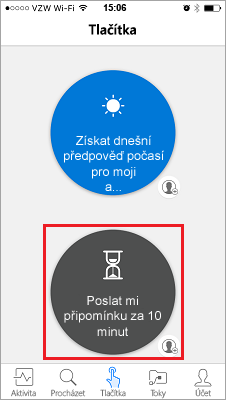

6. Vyberte tok.Select the flow. Za 10 minut se zobrazí připomenutí.In 10 minutes, you'll get a reminder.

Další tlačítka do kolekce přidáte snadno.It's simple to add more buttons to your collection.

## Úprava nebo odstranění tokuModify or delete a flow
Pokud chcete některý z toků změnit nebo odstranit, je to snadné.If you want to change or delete one of your flows, it's easy.

1. Vyberte **Toky**.Select **Flows**.

    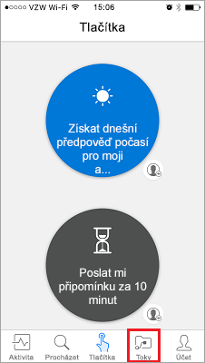

2. Vyberte některý z toků.Select one of your flows.

    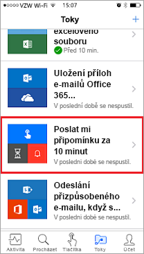

3. Vyberte jednu z možností:Select one of the options:

    * Pokud chcete tok povolit nebo zakázat, zapněte nebo vypněte možnost **Povolit tok**.To enable or disable the flow, turn the **Enable flow** option on or off.
    * Pokud chcete tok změnit, vyberte **Upravit tok**.To change the flow, select **Edit flow**. 
    * Pokud chcete získat představu o úspěšných a neúspěšných spuštěních toku, výběrem **Historie běhů** zobrazte historii toku.To get an idea of the successful and unsuccessful runs of the flow, select **Run history** to view the history of the flow.
    * Pokud chcete tok odstranit, vyberte **Odstranit tok**.To delete a flow, select **Delete flow**.

    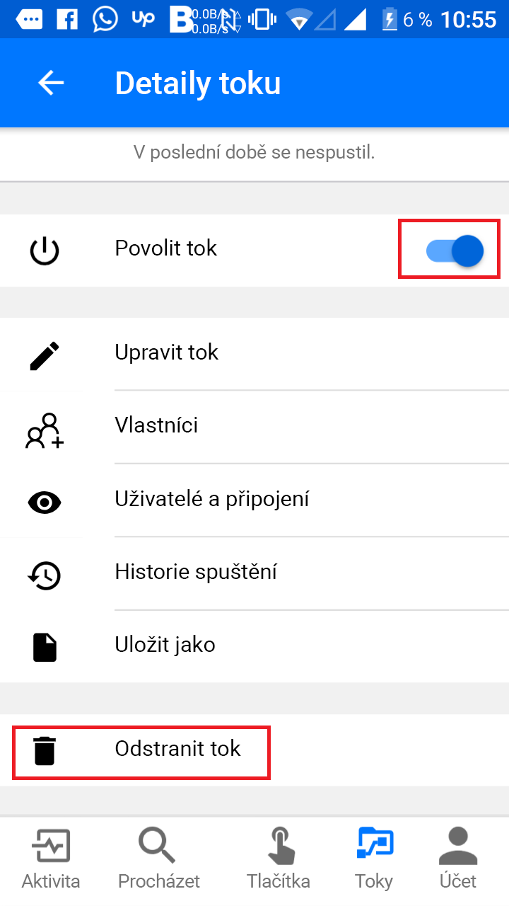

V další lekci zjistíte, jak vytvořit tlačítko toku pro tým.The next unit shows how to create a button flow for a team.
