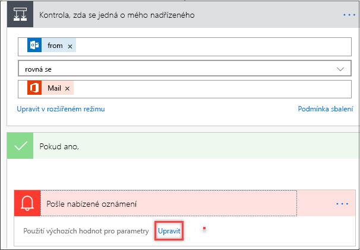
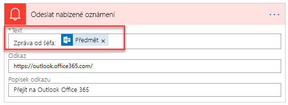

Microsoft Flow se běžně používá tak, že když se něco stane, dostanete oznámení.A common use of Microsoft Flow is to get a notification when something happens. Oznámení můžou být e-maily, textové zprávy nebo nabízená oznámení ve vašem telefonu.Notifications can be emails, text messages, or push notifications on your phone.

V této lekci vytvoříte tok, který vygeneruje nabízené oznámení, kdykoli vám od nadřízeného přijde e-mail.In this unit, you'll create a flow that generates a push notification whenever you receive an email from your manager.

## Získání mobilní aplikaceGet the mobile app

Je snadné vytvořit tok, který bude do vašeho mobilního zařízení posílat nabízená oznámení.It's easy to create a flow that sends push notifications to your mobile device. Mějte na paměti, že k příjmu nabízených oznámení potřebujete mobilní aplikaci Microsoft Flow.Keep in mind that you'll need the Microsoft Flow mobile app to receive push notifications. Tato mobilní aplikace je dostupná pro [Google Android](https://play.google.com/store/apps/details?id=com.microsoft.flow), [Apple iOS](https://itunes.apple.com/app/apple-store/id1094928825) a [Windows Phone](https://www.microsoft.com/p/microsoft-flow/9nkn0p5l9n84).The mobile app is available for [Google Android](https://play.google.com/store/apps/details?id=com.microsoft.flow), [Apple iOS](https://itunes.apple.com/app/apple-store/id1094928825), and [Windows Phone](https://www.microsoft.com/p/microsoft-flow/9nkn0p5l9n84).

Pokud používáte nepodporované mobilní zařízení, můžete místo nabízených oznámení používat zprávy SMS (Short Message Service) – to znamená textové zprávy.If you're using an unsupported mobile device, consider using Short Message Service (SMS) messages (that is, text messages) instead of push notifications to receive notifications.

## Vytvoření toku, který posílá nabízená oznámeníCreate a flow that sends push notifications

Microsoft Flow obsahuje mnoho šablon, které vám pomůžou začít s vytvářením toků.Microsoft Flow comes with many templates to get you started with creating flows. Vytvoříme tok pomocí šablony.Let's create a flow by using a template.

1. Přihlaste se k [Microsoft Flow](https://ms.flow.microsoft.com) pomocí účtu své organizace.Sign in to [Microsoft Flow](https://ms.flow.microsoft.com) by using your organizational account.
1. Vyberte **Moje toky**.Select **My flows**.
1. Vyberte **Nový** a pak **Vytvořit ze šablony**.Select **New**, and then select **Create from template**.

    

1. Posuňte se dolů a vyberte **Nabízené oznámení, když dostanete e-mail od nadřízeného**.Scroll down, and select **Get a push notification when you receive an email from your boss**.

    Tuto šablonu můžete rychle najít také tak, že do vyhledávacího pole zadáte *oznámení*.You can also quickly find this template by entering *notifications* in the search field.

1. Vyberte **Pokračovat**.Select **Continue**.

    V toku se zobrazí kroky sloužící k tomu, aby se před spuštěním toku získaly e-mailové profily vás a vašeho nadřízeného.In the flow, you'll see the steps that will be used to get your email profile and your boss's before the flow is started.

1. Posuňte se dolů ke konci kroků toku a najděte oddíl **Kontrola, jestli je to můj nadřízený**.Scroll to the bottom of the flow steps to find the **Check if it is my manager** section. E-mailové adresy vás a vašeho nadřízeného se automaticky vyplní ze zadaných profilových informací.Your email address and your manager's are automatically filled in from the profile information that you entered.
1. V oddílu **Odeslání nabízeného oznámení** vyberte **Upravit** a změňte text oznámení, které obdržíte, když vám od nadřízeného přijde e-mail.In the **Send a push notification** section, select **Edit** to change the text of the notification that you'll get when an email is received from your boss.

    

1. Pokud chcete změnit text e-mailu, zadejte do pole **Text** novou zprávu.To change the text of the email, in the **Text** field, enter a new message. Můžete také v seznamu vybrat pole dynamického obsahu.You can also select dynamic content fields in the list.

    

1. Abyste tok uložili a mohli ho otestovat, vyberte **Uložit**.Select **Save** to save and test the flow.
1. Pokud chcete tok změnit, vyberte **Upravit tok**.To change the flow, select **Edit flow**.

Když vám budou od nadřízeného chodit e-maily, budete na telefon dostávat nabízená oznámení.Now, when emails arrive from your boss, you'll get a push notification on your phone.
