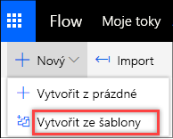
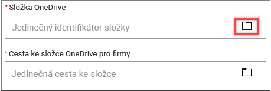
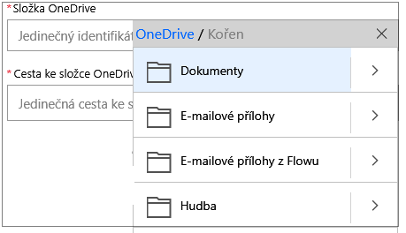

Většina z nás musí občas kopírovat soubory z jedné služby úložiště do jiné.At some point, most of us have needed to copy files from one storage service to another. Microsoft Flow umožňuje snadné automatické přesouvání a kopírování souborů mezi dvěma službami, jako jsou Microsoft OneDrive a Google Drive.Microsoft Flow makes it easy to automatically move and copy files between two services, like Microsoft OneDrive and Google Drive.

V této lekci použijete šablonu toku ke kopírování souborů z osobního OneDrivu do Microsoft OneDrivu pro firmy.In this unit, you'll use a flow template to copy files from your personal OneDrive to Microsoft OneDrive for Business. Aby to šlo, musí mít Microsoft Flow oprávnění k vašim složkám OneDrivu.Microsoft Flow must have permissions to your OneDrive folders to do this.

## Vytvoření toku, který kopíruje souboryCreate a flow that copies files

1. Přihlaste se k [Microsoft Flow](https://ms.flow.microsoft.com) pomocí účtu své organizace.Sign in to [Microsoft Flow](https://ms.flow.microsoft.com) by using your organizational account.
1. Vyberte **Moje toky**.Select **My flows**.
1. Vyberte **Nový** a pak **Vytvořit ze šablony**.Select **New**, and then select **Create from template**.

    

1. Posuňte se dolů a vyberte **Kopírování souborů do OneDrivu pro firmy, když se přidají do OneDrivu**.Scroll down, and select **Copy files to OneDrive for Business when they're added to OneDrive**.

    Tuto šablonu můžete rychle najít také tak, že do vyhledávacího pole zadáte *OneDrive pro firmy*.You can also quickly find this template by entering *OneDrive for Business* in the search field.

1. Vyberte **Pokračovat**.Select **Continue**.
1. V poli **Složka OneDrivu** vyberte tlačítko složky.In the **OneDrive Folder** field, select the folder button.

    

1. Vyberte složku OneDrivu, ze které se mají soubory kopírovat.Select the OneDrive folder that files should be copied from.

    

1. V poli **Cesta ke složce OneDrivu pro firmy** vyberte tlačítko složky a pak vyberte složku, do které se mají soubory kopírovat.In the **OneDrive for Business Folder Path** field, select the folder button, and then select the folder that files should be copied to.
1. Vyberte **Vytvořit tok**.Select **Create Flow**.
1. Pokud chcete tok změnit, vyberte **Upravit tok**.To change the flow, select **Edit flow**.

Kdykoli bude do vybrané složky na OneDrivu umístěn soubor, zkopíruje se do vybrané složky na OneDrivu pro firmy.Now, whenever a file is put in the selected folder on OneDrive, it will be copied to the selected folder on OneDrive for Business.
