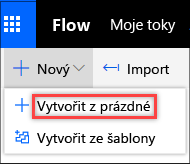
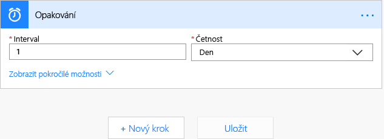
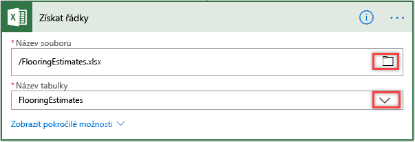
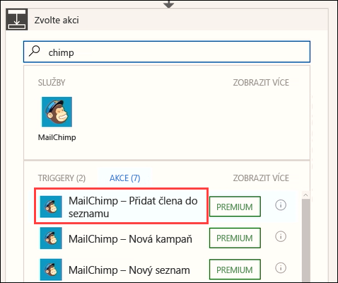
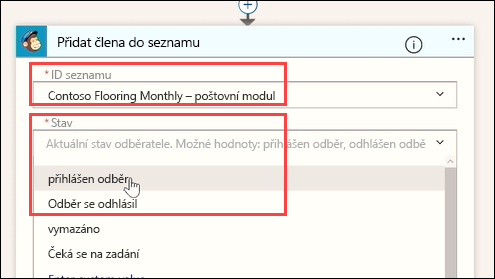
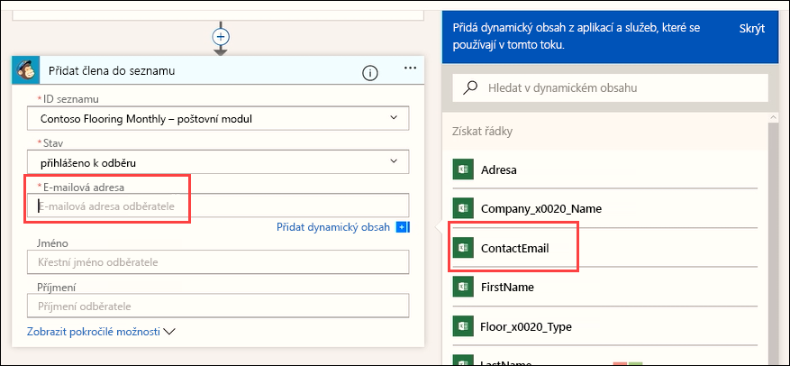
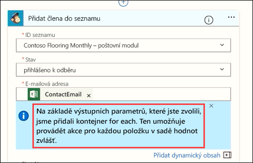
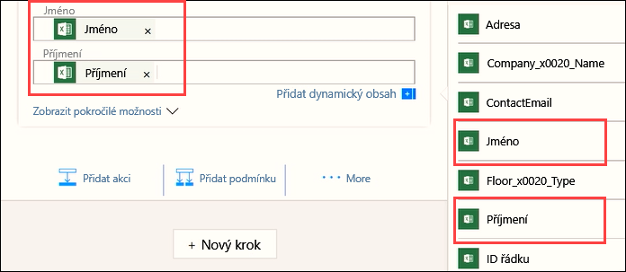

V této lekci se naučíte vytvářet předem naplánované toky pomocí aktivační události s názvem *opakování*.In this unit, you'll learn how to build prescheduled flows by using a trigger called *recurrence*. Vytvoříte tok pro marketingový tým Contoso, který z excelového sešitu na Microsoft OneDrivu automaticky načte e-mailové adresy zákazníků.You'll build a flow for the Contoso marketing team that automatically pulls customer email addresses from a Microsoft Excel workbook on Microsoft OneDrive. Potom tok nastavíte tak, aby se jednou za den do seznamu zákazníků ve službě MailChimp přidaly nové e-mailové adresy, které do sešitu přibyly.You'll then set up the flow so that, once a day, any new email addresses that were added to the workbook are added to a MailChimp customer list.

## Vytvoření plánovaného tokuCreate a scheduled flow

1. Přihlaste se k [Microsoft Flow](https://ms.flow.microsoft.com) pomocí účtu své organizace.Sign in to [Microsoft Flow](https://ms.flow.microsoft.com) by using your organizational account.
1. Vyberte **Moje toky**.Select **My flows**.
1. Vyberte **Nový** a pak vyberte **Vytvořit z prázdné**.Select **New**, and then select **Create from blank**.

    

1. Vyberte **Prohledejte stovky konektorů a aktivačních událostí**.Select **Search hundreds of connectors and triggers**.
1. Do vyhledávacího pole zadejte *plán*, vyberte službu **Plán** a pak vyberte aktivační událost **Plán – Opakování**.In the search field, enter *schedule*, select the **Schedule** service, and then select the **Schedule – Recurrence** trigger.
1. Pole **Frekvence** nastavte na *Den* a pole **Interval** na *1*.Set the **Frequency** field to *Day* and the **Interval** field to *1*. Pak přidejte akci – tak, že vyberete **Nový krok**.Then select **New step**, to add an action.

    

1. Do vyhledávacího pole zadejte *excel*, vyberte službu **Excel** a pak vyberte akci **Excel – Získat řádky**.In the search field, enter *excel*, select the **Excel** service, and then select the **Excel – Get rows** action.

    > [!NOTE]
    > Dejte pozor, abyste vybrali akci **Získat řádky**, ne akci **Získat řádek**.Be sure to select **Get rows**, not **Get row**.

1. V poli **Název souboru** vyberte tlačítko složky a pak vyberte požadovaný excelový soubor.In the **File name** field, select the folder button, and then select the Excel file to use.
1. V poli **Název tabulky** vyberte šipku rozevíracího seznamu a pak vyhledejte a vyberte požadovaný list.In the **Table name** box, select the drop-down arrow, and then browse to and select the worksheet to use.

    

1. Vyberte **Nový krok** a pak vyberte **Přidat akci**.Select **New step**, and then select **Add an action**. 
1. Do vyhledávacího pole zadejte *chimp*, vyberte službu **MailChimp** a pak vyberte akci **MailChimp – Přidat člena do seznamu**.In the search field, enter *chimp*, select the **MailChimp** service, and then select the **MailChimp - Add member to list** action.

    

    > [!NOTE] 
    > MailChimp je prémiový konektor.MailChimp is a premium connector. V závislosti na vaší licenci Microsoft Flow se možná budete muset zaregistrovat ke zkušební verzi, abyste mohli tento konektor používat.Depending on your Microsoft Flow license, you might need to sign up for a trial to use this connector.

1. V poli **ID seznamu** vyberte požadovaný seznam adresátů služby MailChimp.In the **List Id** field, select the desired MailChimp mailing list. V poli **Stav** vyberte *odebíráno*.In the **Status** field, select *subscribed*.

    

1. V poli **E-mailová adresa** pomocí funkce dynamického obsahu přidejte pole **ContactEmail**.In the **Email Address** field, use the dynamic content feature to add the **ContactEmail** field.

    

    Všimněte si, že tok automaticky vytvoří další krok.Notice that the flow automatically creates an additional step. Tok zjistí, že nastavujete akci, která vyžaduje další akci.Flow detects that you're setting up an action that requires an additional action. Kdykoli tok přečte novou e-mailovou adresu, vytvoří také pro každý řádek novou akci.Whenever the flow reads a new email address, it will also create a new action for each row.

    

1. Pomocí funkce dynamického obsahu vyplňte pole **Jméno** a **Příjmení**.Use the dynamic content feature to fill in the **First name** and **Last name** fields.

    

A máte to!And there you have it!

Tento tok poběží jednou denně, získá nové řádky z excelového listu, z každého řádku vezme e-mailovou adresu a jméno a vloží tyto údaje do seznamu adresátů služby MailChimp společnosti Contoso. Ušetříte tak čas i peníze.This flow will now run once a day, get the new rows from the Excel worksheet, grab the email address and name from each row, and enter the email address and name in the Contoso MailChimp mail list, saving you both time and money.
