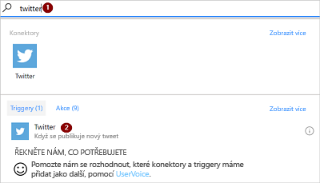
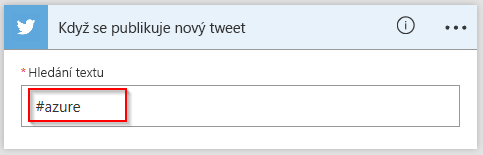
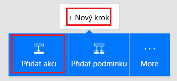
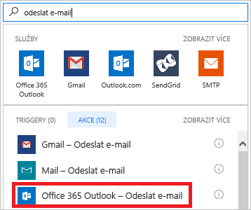
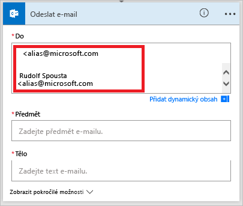
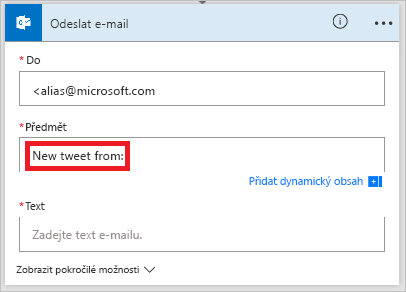
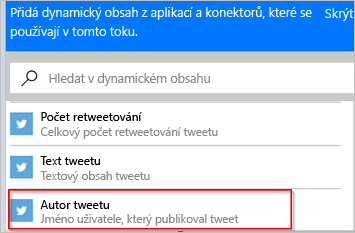

Můžete vytvořit tok, který po svém spuštění nějakou událostí automaticky provede jednu nebo více akcí.You can create a flow that automatically performs one or more actions after it's triggered by an event. Tok vám například může e-mailem oznámit, že někdo publikoval tweet obsahující určité klíčové slovo.For example, the flow can notify you by email when someone posts a tweet that includes a keyword that you specify. Publikování tweetu je událost (označovaná také jako *aktivační událost*) a odeslání e-mailového oznámení je akce.In this example, posting a tweet is the event (also known as a *trigger*), and sending an email notification is the action. V této lekci se dozvíte, jak takový příklad toku vytvořit.In this unit, which you'll learn how to create this example flow.

## PožadavkyPrerequisites

* Účet na [flow.microsoft.com](https://flow.microsoft.com)An account on [flow.microsoft.com](https://flow.microsoft.com)
* Účet na TwitteruA Twitter account
* Microsoft Office 365Microsoft Office 365

## Zadání události pro spuštění tokuSpecify an event to start the flow

Nejdřív musíte vybrat aktivační událost, která bude tok spouštět.First, you must select the trigger (event) that starts the flow.

1. Přihlaste se k [Microsoft Flow](https://flow.microsoft.com) pomocí účtu své organizace.Sign in to [Microsoft Flow](https://flow.microsoft.com) by using your organizational account.
1. Vyberte **Moje toky**.Select **My flows**.
1. Vyberte **Nový** a pak vyberte **Vytvořit z prázdné**.Select **New**, and then select **Create from blank**.

    

1. Vyberte **Prohledejte stovky konektorů a aktivačních událostí**.Select **Search hundreds of connectors and triggers**.
1. Do vyhledávacího pole zadejte *twitter*, vyberte konektor **Twitter** a pak vyberte aktivační událost **Twitter – Když se publikuje nový tweet**.In the search field, enter *twitter*, select the **Twitter** connector, and then select the **Twitter - When a new tweet is posted** trigger.

    

1. Pokud jste zatím nepřipojili svůj účet na Twitteru k Microsoft Flow, vyberte **Přihlásit se k Twitteru** a zadejte svoje přihlašovací údaje.If you haven't already connected your Twitter account to Microsoft Flow, select **Sign in to Twitter**, and then enter your credentials.
1. Do pole **Hledaný text** zadejte klíčové slovo, které se má hledat.In the **Search text** box, enter the keyword to find.

    

## Zadání akceSpecify an action

1. Vyberte **Nový krok** a pak vyberte **Přidat akci**.Select **New step**, and then select **Add an action**.

    

1. Do vyhledávacího pole zadejte *odeslání e-mailu* a pak vyberte akci **Office 365 Outlook – Odeslání e-mailu**.In the search field, enter *send email*, and then select the **Office 365 Outlook - Send an email** action.

    

1. Pokud se zobrazí výzva k přihlášení, klikněte na tlačítko pro přihlášení a zadejte svoje přihlašovací údaje.If you're prompted to sign in, select the sign-in button, and then enter your credentials.
1. Do pole **Komu** zadejte nebo vložte svoji e-mailovou adresu a pak v seznamu kontaktů vyberte svoje jméno.In the **To** field, enter or paste your email address, and then select your name in the list of contacts that appears.

    

1. Do pole **Předmět** zadejte text **Nový tweet od:** a přidejte mezeru.In the **Subject** field, enter **New tweet from:** followed by a space.

    

1. V seznamu dynamického obsahu vyberte token **Autor tweetu** a přidejte tak jeho zástupný symbol.In the list of dynamic content, select the **Tweeted by** token to add a placeholder for it.

    

1. Vyberte pole **Text**. Potom v seznamu dynamického obsahu vyberte token **TextTweetu** a přidejte tak jeho zástupný symbol.Select the **Body** field, and then, in the list of dynamic content, select the **Tweet text** token to add a placeholder for it.
1. Volitelné: Přidejte do textu e-mailu další tokeny, další obsah nebo obojí.Optional: Add more tokens, other content, or both to the body of the email.
1. Uložte tok výběrem možnosti **Uložit**.Select **Save** to save the flow.
1. Publikujte tweet obsahující zadané klíčové slovo nebo počkejte, až takový tweet publikuje někdo jiný.Post a tweet that includes the keyword that you specified, or wait for someone else to post such a tweet.

    Chvilku po publikování tweetu vám e-mailová zpráva oznámí nový tweet.Within a minute after the tweet is posted, an email message will notify you of the new tweet.
