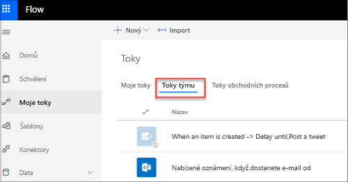
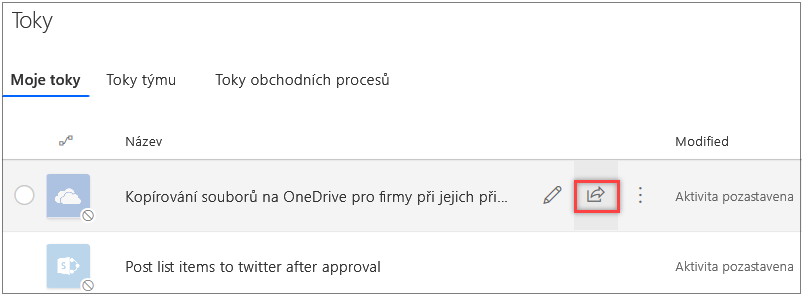
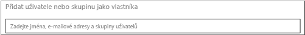
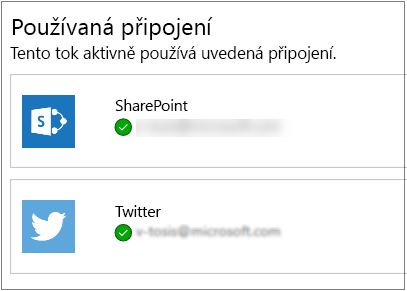

Týmové toky rozšiřují schopnosti služby Microsoft Flow na skupiny lidí.Team flows extend the power of Microsoft Flow to groups of people. Proč by koneckonců přednosti automatizace pracovního prostředí měla využívat jenom jedna osoba?After all, why should just one person enjoy the benefits of increased automation in his or her work environment?

Tady jsou některé výhody týmových toků:Here are some advantages of team flows:

- Tok může vlastnit a spravovat několik lidí společně.Multiple people can own and manage a flow together.
- Když tvůrce týmového toku opustí organizaci, ostatní vlastníci toku můžou tok dál spouštět.If the creator of a team flow leaves the organization, the other owners of the flow can continue to run it.
- Všichni vlastníci týmového toku můžou zobrazit jeho historii, spravovat jeho vlastnosti, upravit ho (nebo odstranit) a přidávat a odebírat vlastníky.All owners of a team flow can view its history, manage its properties, edit it, add and remove owners, and delete it.

Pokud jste tvůrce nebo vlastník týmového toku, najdete ho v [Microsoft Flow](https://flow.microsoft.com) na kartě **Toky týmu**.If you're the creator or an owner of a team flow, you'll find it listed on the **Team flows** tab in [Microsoft Flow](https://flow.microsoft.com).

> [!NOTE]
> - Sdílená připojení se dají používat jenom v toku, ve kterém byla vytvořená.Shared connections can be used only in the flow that they were created in.
> - Vlastníci můžou používat služby v toku, nemůžou ale měnit přihlašovací údaje pro připojení vytvořené jiným vlastníkem.Owners can use services in a flow, but they can't change the credentials for a connection that another owner created.

## PožadavkyPrerequisites

Abyste mohli vytvářet týmové toky, musíte mít [placený plán Microsoft Flow](https://flow.microsoft.com/pricing/).To create a team flow, you must have a [paid Microsoft Flow plan](https://flow.microsoft.com/pricing/). Kromě toho platí, že pokud chcete k týmovému toku přidat další vlastníky nebo je z něho odebrat, musíte být jeho tvůrcem nebo vlastníkem.Additionally, to add other owners to a team flow or remove owners from it, you must be the creator or an owner.

## Vytvoření týmového tokuCreate a team flow

Týmový tok vytvoříte tak, že k existujícímu toku přidáte další vlastníky.You create a team flow by adding other owners to an existing flow. Po přidání nových vlastníků se tok zobrazí na kartě **Toky týmu**.After new owners are added to a flow, the flow will appear on the **Team flows** tab.

1. Přihlaste se k [Microsoft Flow](https://flow.microsoft.com) pomocí účtu své organizace.Sign in to [Microsoft Flow](https://flow.microsoft.com) by using your organizational account.
1. Vyberte **Moje toky**.Select **My flows**.
1. Vyberte tlačítko **Pozvat dalšího vlastníka** pro tok, který chcete změnit.Select the **Invite another owner** button for the flow that you want to change.

    

1. Zadejte jméno, e-mailovou adresu nebo název skupiny té osoby nebo skupiny, kterou chcete přidat jako vlastníka.Enter the name, email address, or group name of the person or group that you want to add as an owner.

    

1. V seznamu, který se zobrazí, vyberte uživatele nebo skupinu.In the list that appears, select the user or group.

    Tento uživatel nebo skupina se stane vlastníkem toku.The user or group becomes an owner of the flow.

Mějte na paměti, že když vytvoříte týmový tok, zobrazí se na kartě **Toky týmu**. Tok se už nebude zobrazovat na kartě **Moje toky**.Keep in mind that when you create a team flow, it appears on the **Team flows** tab. It no longer appears on the **My flows** tab.

## Přidání sharepointového seznamu jako spoluvlastníka tokuAdd a SharePoint list as a co-owner of a flow

Seznamy Microsoft SharePointu můžete přidávat jako spoluvlastníky toků.You can add Microsoft SharePoint lists as co-owners of a flow. Každý, kdo má přístup pro úpravy k seznamu, tak automaticky získá přístup pro úpravy k toku.In that way, everyone who has edit access to the list automatically gets edit access to the flow. Po nasdílení toku stačí distribuovat odkaz na tok.After the flow is shared, you can just distribute a link to it.

## Omezení změn tokůRestrictions on changes to flows

Každý vlastník týmového toku může přispívat připojeními k toku.Any owner of a team flow can contribute connections to a flow. Další osoba, která získá k toku přístup, může používat libovolná připojení v tomto toku, ale jenom v rozsahu tohoto toku.After another person has access to the flow, that person can use any connections in it, but only within the scope of that flow.

Například Honza vytvoří pomocí svého účtu tok, který aktualizuje položky v SharePointu, a nasdílí ho Marii.For example, John creates a flow that updates items in SharePoint with his account, and he shares the flow with Mary. Marie bude moct změnit použití SharePointu uvnitř tohoto toku, ale ne v žádném ze svých osobních toků.In this case, Mary will be able to change the use of SharePoint inside that flow, but not in any of her personal flows. Marie také může tok změnit, aby používal její připojení k SharePointu, ale Honza nebude moct toto nové připojení k SharePointu použít v žádném ze svých toků.Likewise, Mary can change the flow so that it uses her SharePoint connection, but John still won't able to use that new SharePoint connection in any of his flows. 

Pokud chcete zobrazit všechna připojení používaná tokem, vyberte tlačítko **Pozvat dalšího vlastníka** a prohlédněte si seznam vložených připojení.To view all the connections that are used by a flow, select the **Invite another owner** button, and inspect the list of embedded connections.

## Odebrání vlastníkaRemove an owner

> [!IMPORTANT]
> Pokud odeberete vlastníka, jehož přihlašovací údaje se používají pro přístup ke službám Microsoft Flow, je nutné aktualizovat přihlašovací údaje pro tato připojení, aby tok dál správně fungoval.If you remove an owner whose credentials are used to access Microsoft Flow services, be sure to update the credentials for those connections, so that the flow continues to work correctly.

1. Na kartě **Toky týmu** vyberte tlačítko **Pozvat dalšího vlastníka** pro tok, který chcete změnit.On the **Team flows** tab, select the **Invite another owner** button for the flow that you want to change.

    

1. Vyberte tlačítko **Odstranit**  pro vlastníka, kterého chcete odebrat.Select the **Delete** button  for the owner that you want to remove.

## Vložená připojení a další připojeníEmbedded and other connections

Připojení, která se používají v tocích, se dělí do dvou kategorií:The connections that are used in a flow fall into two categories:

* **Vložená připojení:** Tato připojení jsou v toku použitá.**Embedded**: These connections are used in the flow.
* **Další připojení:** Tato připojení jsou pro tok definovaná, ale nejsou v něm použitá.**Other**: These connections have been defined for the flow, but they aren't used in it.

Pokud přestanete připojení v toku používat, zobrazí se toto připojení v seznamu **Další připojení**.If you stop using a connection in a flow, that connection appears in the **Other** connections list. Připojení v tomto seznamu zůstane, dokud ho vlastník znovu nezahrne do toku.It will remain there until an owner includes it in the flow again.

Pokud chcete zobrazit seznam připojení, změňte týmový tok.To view the list of connections, change the team flow.

- Na kartě **Toky týmu** vyberte tlačítko **Pozvat dalšího vlastníka** pro tok, který chcete změnit.On the **Team flows** tab, select the **Invite another owner** button for the flow that you want to change.

    Ve vlastnostech toku se pod seznamem vlastníků zobrazí seznam připojení.The list of connections appears under the list of owners in the flow's properties.

    
