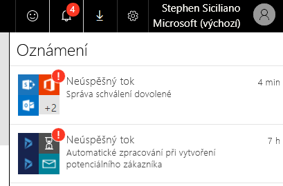
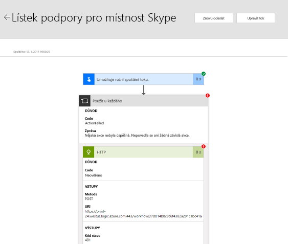
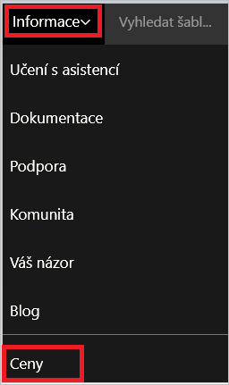
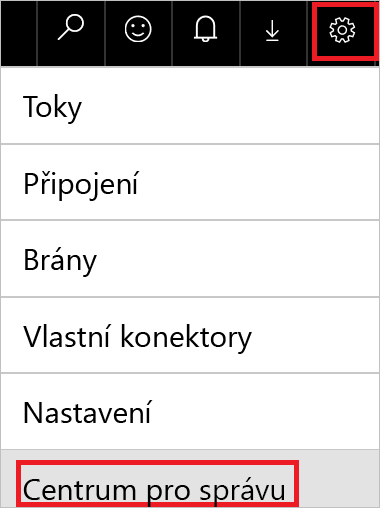

V této lekci se dozvíte, jak řešit běžné problémy, ke kterým může docházet u spouštěných toků.In this unit, you'll learn how to troubleshoot common issues that might occur while you run your flows.

## Identifikace chybyIdentify the error

Abyste mohli tok opravit, musíte nejdřív zjistit, proč selhal.Before you can fix a flow, you must identify why it failed. Každý týden vám přijde e-mail se seznamem chyb.You will get an email with a list of failures each week.

1. Vyberte tlačítko **Oznámení** (symbol zvonku) v horní části webového portálu (nebo vyberte kartu **Aktivita** v mobilní aplikaci) a pak v zobrazeném seznamu vyberte příslušný tok.Select the **Notifications** button (the bell symbol) at the top of the web portal (or select the **Activity** tab in the mobile app), and then select your flow in the list that appears.

    

2. Zobrazí se podrobnosti o toku – nejméně u jednoho kroku je symbol červeného vykřičníku (!).Details about the flow appear, and at least one step has a red exclamation point (!) symbol. Tento krok otevřete a zkontrolujte chybovou zprávu.Open that step, and review the error message.

    

## Chyby ověřováníAuthentication failures

Toky v mnoha případech selžou v důsledku chyby ověřování.In many cases, flows fail because of an authentication error. Pokud dojde k tomuto typu chyby, obsahuje chybová zpráva slova „neautorizovaný“ nebo „nebyl autorizovaný“ nebo se zobrazí kód chyby 401 nebo 403.If this type of error occurs, the error message includes the word "Unauthorized," or an error code of 401 or 403 appears. Chyby ověřování se obvykle dají opravit aktualizací připojení.You can usually fix authentication errors by updating the connection.

1. V horní části webového portálu vyberte tlačítko **Nastavení** (symbol ozubeného kola) a potom v nabídce vyberte **Připojení**.At the top of the web portal, select the **Settings** button (the gear symbol), and then select **Connections** on the menu.
2. Posuňte se k připojení, u kterého se zobrazila chybová zpráva se slovy „neautorizovaný“ nebo „nebyl autorizovaný“.Scroll to the connection that you saw the "Unauthorized" error message for.
3. Vedle připojení – ve zprávě s informací, že připojení nebylo ověřeno – vyberte odkaz **Ověřit heslo**.Next to the connection, select the **Verify password** link in the message that states that the connection hasn't been authenticated.
4. Podle zobrazených pokynů ověřte svoje přihlašovací údaje.Verify your credentials by following the instructions that appear. Pak se vraťte k příslušné chybě běhu toku a vyberte **Znovu odeslat** (Znovu spustit).Then return to your flow-run failure, and select **Resubmit**.

Tok by teď měl běžet podle očekávání.The flow should now run as expected.

## Problémy s konfigurací akcíAction configuration issues

Toky někdy selžou, když nastavení v některé z akcí toku nefunguje podle očekávání.Flows sometimes fail if a setting in one of the flow's actions doesn't work as expected. Chybová zpráva v takovém případě obsahuje frázi „neplatný požadavek“ nebo „nebyl nalezen“ nebo se zobrazí kód chyby 400 nebo 404.In this case, the error message includes the phrase "Bad request" or "Not found," or an error code 400 or 404 appears.

Chybová zpráva by měla naznačovat, jak chybu opravit.The error message should indicate how to fix the failure.

1. Vyberte tlačítko **Upravit** a pak opravte problémy v definici toku.Select the **Edit** button, and then fix the issues inside the flow definition.
1. Aktualizovaný tok uložte a pak zkuste spustit tok znovu s aktualizovanou konfigurací – vyberte **Znovu odeslat** (Znovu spustit).Save the updated flow, and then select **Resubmit** to try to run the flow again with the updated configuration.

## Dočasné problémyTemporary issues

Pokud se zobrazí kód chyby 500 nebo 502, je chyba dočasná nebo přechodná.If error code 500 or 502 appears, the failure is temporary or transient.

- Zkuste spustit tok znovu – vyberte **Znovu odeslat** (Znovu spustit).Select **Resubmit** to try to run the flow again.

## Problémy s cenovým plánemIssues with your pricing plan

Toky se někdy můžou chovat neočekávaně, protože nepoužíváte správný plán.Sometimes your flows might behave unexpectedly because you aren't using the correct plan.

- Váš plán zobrazíte tak, že v Microsoft Flow vyberete **Další informace** a potom **Ceny**.To view your plan, in Microsoft Flow, select **Learn**, and then select **Pricing**.

    

Přečtěte si další informace [o cenách a přepínání mezi plány](https://flow.microsoft.com/pricing/).Learn more about [pricing and how to switch plans](https://flow.microsoft.com/pricing/).

## Problémy s čerpáním datIssues with data usage

Je možné, že vyčerpáte data, která můžete použít.You might have run out of data that you can use.

- Pokud máte bezplatný nebo zkušební plán, vyberte tlačítko **Nastavení** (symbol ozubeného kola) a podívejte se na vaše aktuální využití dat vzhledem k plánu.If you're on a free plan or a trial plan, select the **Settings** button (the gear symbol) to show your current usage against your plan.

    

- Pokud máte placený plán, na bězích se podílejí všichni uživatelé ve vaší organizaci.If you're on a paid plan, runs are pooled across all users in your organization. Pracujeme na funkcích, které zobrazí informace o dostupných kvótách a čerpání dat napříč organizací.We're working on features that will show information about available quotas and usage across an organization.

> [!IMPORTANT]
> Pokud datový limit překročíte, Microsoft Flow vám omezí spouštění toků.If you exceed your data limit, Microsoft Flow throttles your flow runs.

Přečtěte si další informace [o limitech použití](https://flow.microsoft.com/pricing/).Learn more about [usage limits](https://flow.microsoft.com/pricing/).

## Možná spouštíte toky příliš častoYou might be running flows too often

Váš plán určuje, jak často se můžou vaše toky spouštět.Your plan determines how often your flows run. Pokud máte například bezplatný plán, můžou se vaše toky spouštět po 15 minutách.For example, your flows might run every 15 minutes if you're on the free plan. Pokud se tok aktivuje po kratší době než po 15 minutách od jeho posledního běhu, je tok umístěný ve frontě, dokud neuplyne 15 minut.If a flow is triggered less than 15 minutes after its last run, it's queued until 15 minutes have passed.

Kdykoli je tok aktivovaný, ať je to automatickou aktivační událostí nebo ručním spuštěním, počítá se takto akce jako spuštění.Whenever a flow is triggered, whether by an automatic trigger or because you manually start it, the action counts as a run. Zjišťování nových dat se jako spuštění nepočítá.Checks for new data don't count as runs.

Přečtěte si další informace [o limitech použití](https://flow.microsoft.com/pricing/).Learn more about [usage limits](https://flow.microsoft.com/pricing/).

## Možná používáte nesprávný účetYou might be using an incorrect account

Pokud se přihlásíte pomocí účtu Microsoft (například pomocí účtu, který má na konci *@outlook.com* nebo *@gmail.com*), můžete používat jenom bezplatný plán.If you sign in by using a Microsoft account (for example, an account that ends with *@outlook.com* or *@gmail.com*), you can use only the free plan. Jestli chcete využívat funkce placeného plánu, přihlaste se pomocí účtu své organizace nebo školní e-mailové adresy.To take advantage of the features of the paid plan, sign in by using your organizational account or school email address.

Pokud chcete upgradovat, použijte účet organizace nebo školní účet nebo vytvořte [zkušební účet Microsoft Office 365](https://powerbi.microsoft.com/documentation/powerbi-admin-signing-up-for-power-bi-with-a-new-office-365-trial/).To upgrade, use an organizational account or a school account, or create a [Microsoft Office 365 trial account](https://powerbi.microsoft.com/documentation/powerbi-admin-signing-up-for-power-bi-with-a-new-office-365-trial/).

## Některé toky běží častěji, než očekáváteSome flows run more often than expected

Některé toky můžou běžet častěji, než očekáváte.Some flows might run more often than you expect. Vytvoříte například tok, který vám pošle nabízené oznámení, kdykoli vám od nadřízeného přijde e-mail.For example, you create a flow that sends you a push notification whenever your manager sends you an email. Tento tok se musí spustit při příchodu jakéhokoliv e-mailu, protože musí zkontrolovat, jestli e-mail přišel od vašeho nadřízeného.That flow must run every time you get an email from anyone, because the flow must check whether the email came from your manager. Tato akce se počítá jako spuštění.This action counts as a run.

## Další problémy související s limity a omezenímiOther issues that are based on limits, and caveats

Můžete mít problémy, které souvisejí s dalšími limity:You might have issues that are based on other limits:

* Každý účet může mít až:Each account can have up to:

    * 250 toků250 flows.
    * 15 vlastních konektorů15 custom connectors.
    * 20 připojení na každé rozhraní API a 100 připojení celkem20 connections per application programming interface (API) and 100 connections total.

* Bránu můžete nainstalovat jenom ve výchozím prostředí.You can install a gateway only in the default environment.
* Některé externí konektory, jako třeba Twitter, implementují omezování připojení pro řízení kvality služby.Some external connectors, like Twitter, implement connection throttling to control the quality of service. Když je omezování v činnosti, můžou vaše toky selhat.Your flows might fail when throttling is in effect. Pokud vaše toky selhávají, zkontrolujte v historii spuštění podrobnosti běhu toku.If your flows are failing, review the details of the run that failed in the flow's run history.
