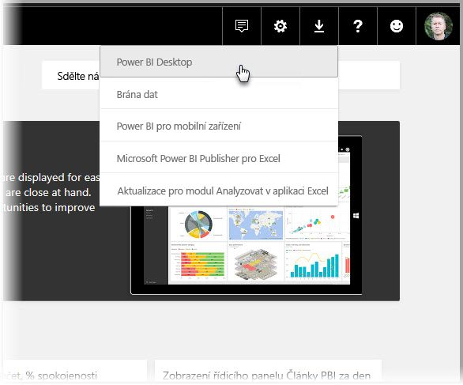
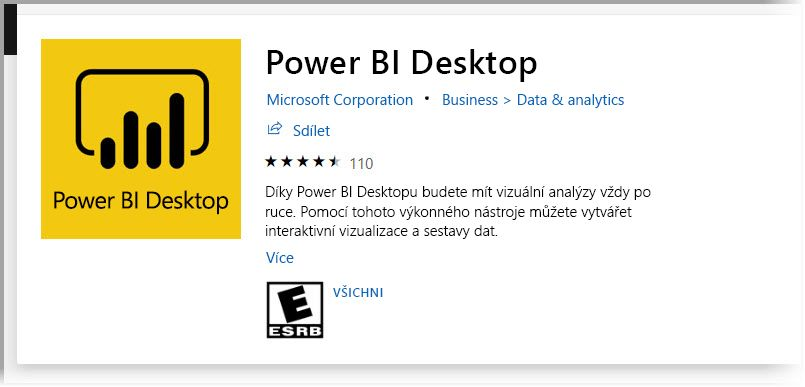
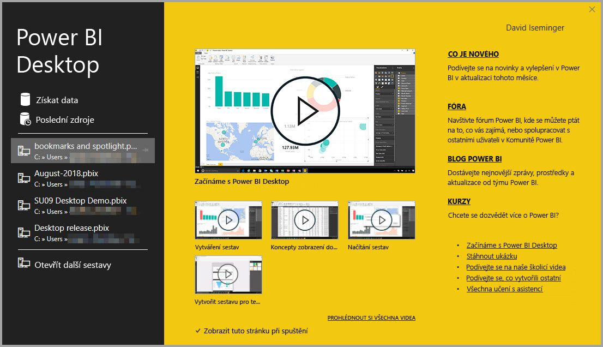
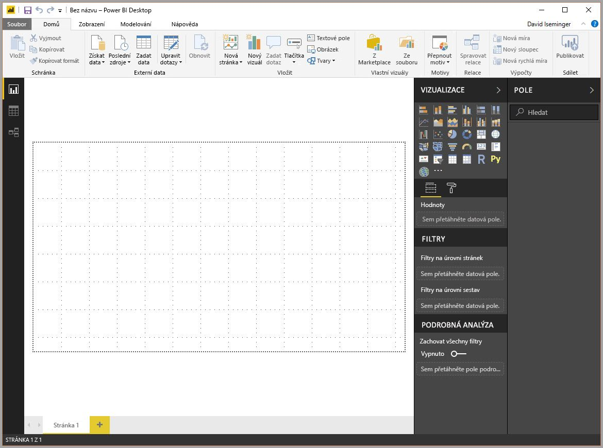
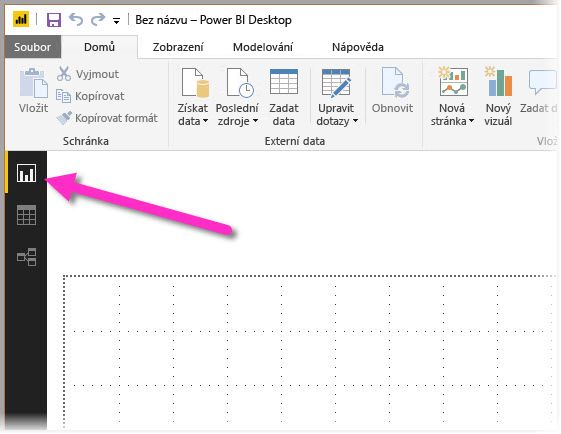

Vítá vás učební modul navržený tak, aby vám pomohl začít pracovat s **Microsoft Power BI Desktopem**.Welcome to the learning module designed to get you up and running with **Microsoft Power BI Desktop**. V tomto modulu se dozvíte, jak se v Power BI Desktopu orientovat, jak se připojit k datům, vytvářet vizuály a sestavy a jak tyto sestavy publikovat ve **službě Power BI**.In this module, you'll learn how to get around in Power BI Desktop, connect to data, create visuals and reports, and publish those reports to the **Power BI service**.

Power BI Desktop umožňuje vytvářet kolekce dotazů, datová připojení a sestavy, které jde jednoduše sdílet s ostatními.Power BI Desktop lets you create a collection of queries, data connections, and reports that can easily be shared with others. Power BI Desktop integruje osvědčené technologie Microsoftu – výkonný stroj Microsoft Power Query pro Excel, modelování dat a vizualizace – a hladce spolupracuje s online [**službou Power BI**](https://app.powerbi.com/).Power BI Desktop integrates proven Microsoft technologies—the powerful Microsoft Power Query for Excel engine, data modeling, and visualizations—and works seamlessly with the online [**Power BI service**](https://app.powerbi.com/).

Pomocí kombinace **Power BI Desktopu** (kde analytici a jiní uživatelé můžou vytvořit výkonná datová připojení, modely a sestavy) a [**služby Power BI**](https://app.powerbi.com/) (kde jde sdílet sestavy Power BI Desktopu, takže je uživatelé můžou zobrazit a pracovat s nimi) jde nové poznatky ze světa dat lépe modelovat, sestavovat, sdílet a rozšiřovat.Through the combination of **Power BI Desktop** (where analysts and others can create powerful data connections, models, and reports) and the [**Power BI service**](https://app.powerbi.com/) (where Power BI Desktop reports can be shared, so that users can view and interact with them), new insights from the world of data are easier to model, build, share, and extend.

Datoví analytici zjistí, že Power BI Desktop je výkonný, flexibilní a velmi dostupný nástroj umožňující připojení do světa dat, jeho formování, vytváření robustních modelů a sestrojování dobře strukturovaných sestav.Data analysts will find Power BI Desktop a powerful, flexible, and a highly accessible tool for connecting with and shaping the world of data, building robust models, and crafting well-structured reports.

## Fungování Power BI DesktopuHow Power BI Desktop works
Prostřednictvím Power BI Desktopu se *připojíte k datům* (obvykle více zdrojům dat), *budete tato data formovat* (pomocí dotazů, které sestavují přehledné a poutavé datové modely) a *vytvářet sestavy* (které můžou ostatní využívat, stavět na nich a sdílet je).With Power BI Desktop, you *connect to data* (usually multiple data sources), *shape that data* (through queries that build insightful, compelling data models), and use that model to *create reports* (which others can use, build upon, and share).

Po dokončení kroků (připojení, formování a generování sestav) k vaší spokojenosti můžete práci uložit ve formátu souborů Power BI Desktopu, který má příponu .pbix.When these steps—connect, shape, and report—are finished to your satisfaction, you can save your work in the Power BI Desktop file format, which uses the .pbix extension. Soubory Power BI Desktopu se dají sdílet jako jakýkoli jiný soubor, ale nejšikovnějším způsobem jejich sdílení je nahrát je do [**služby Power BI**](https://preview.powerbi.com/).Power BI Desktop files can be shared like any other file, but the most compelling way to share them is to upload them to the [**Power BI service**](https://preview.powerbi.com/). 

Power BI Desktop centralizuje, zjednodušuje a zefektivňuje proces návrhu a vytváření úložišť a sestav Business Intelligence, který může být jinak roztříštěný, nepropojený a namáhavý.Power BI Desktop centralizes, simplifies, and streamlines what can otherwise be a scattered, disconnected, and arduous process of designing and creating business intelligence repositories and reports.

Jste připravení vyzkoušet ho?Ready to give it a try? Pusťme se tedy do toho.Then let's get started.

## Instalace a spuštění Power BI DesktopuInstall and run Power BI Desktop
Power BI Desktop si můžete stáhnout ze **služby Power BI** tak, že vyberete ikonu šipky pro stažení a pak vyberete **Power BI Desktop**.You can download Power BI Desktop from the **Power BI service** by selecting the download arrow icon and then selecting **Power BI Desktop**.

Můžete také **Power BI Desktop** nainstalovat jako aplikaci z **Microsoft Storu**.You can also install **Power BI Desktop** as an app from **Microsoft Store**.

Power BI Desktop se nainstaluje jako aplikace a běží na vaší ploše.Power BI Desktop is installed as an application and runs on your desktop. Při spuštění Power BI Desktopu se zobrazí **úvodní** obrazovka.When you start Power BI Desktop, a **Welcome** screen is shown.

Je možné **získat data**, zobrazit **poslední zdroje** nebo **otevřít další sestavy** přímo z **úvodní** obrazovky – pomocí odkazů v levém podokně.You can **get data**, see **recent sources**, or **open other reports** directly from the **Welcome** screen, by using the links in the left pane. Pokud **úvodní** obrazovku zavřete (výběrem **X** v pravém horním rohu), zobrazí se zobrazení **Sestava** Power BI Desktopu.If you close the **Welcome** screen (by selecting the **X** in the upper-right corner), the **Report** view of Power BI Desktop is shown.

Tři ikony v levé části okna odpovídají třem zobrazením, která jsou dostupná v Power BI Desktopu: **Sestava**, **Data** a **Relace** (shora dolů).Three icons along the left edge of the window correspond to the three views that are available in Power BI Desktop: **Report**, **Data**, and **Relationships** (from top to bottom). Zobrazení můžete měnit výběrem ikon.You can change views by selecting the icons. Aktuální zobrazení označuje žlutý pruh nalevo od ikony.The current view is indicated by a yellow bar to the left of the icon. Na následujícím obrázku se například aktuálně zobrazuje zobrazení **Sestava**.For example, in the following image, the **Report** view is currently shown.

Power BI Desktop obsahuje také **editor Power Query**, který se spouští v samostatném okně.Power BI Desktop also includes **Power Query Editor**, which starts in a separate window. V **editoru Power Query** můžete vytvářet dotazy a transformovat data a pak načíst takový upřesněný datový model do Power BI Desktopu a vytvářet sestavy.In **Power Query Editor**, you can build queries and transform data, load that refined data model into Power BI Desktop, and create reports.

S nainstalovaným Power BI Desktopem teď budete připravení připojit se k datům, formovat data a vytvářet sestavy (obvykle v tomto pořadí).Now that Power BI Desktop is installed, you're ready to connect to data, shape data, and build reports (usually in that order). V následujících lekcích projdeme postupně každou z těchto činností.In the following units, we'll take a tour through each of those activities in turn.
