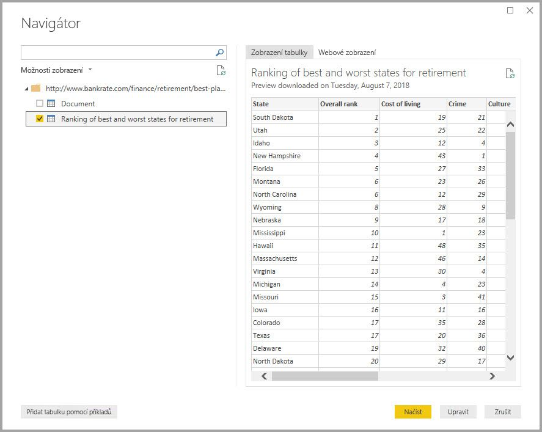

S nainstalovaným Microsoft Power BI Desktopem jste teď připravení se připojit k neustále se zvětšujícímu světu dat.Now that Microsoft Power BI Desktop is installed, you're ready to connect to the ever-expanding world of data. Existují *nejrůznější* zdroje dat, které jsou dostupné v okně Microsoft Power Query pro Excel.There are *all sorts* of data sources available in the Microsoft Power Query for Excel window. Následující obrázek ukazuje, jak se připojit k datům výběrem karty **Domů** na pásu karet a následně výběrem možností **Získat data \> Více**.The following image shows how to connect to data by selecting the **Home** tab on the ribbon and then selecting **Get Data \> More**.

V této jednotce se připojíme k několika různým **webovým** zdrojům dat.In this unit, we'll connect to a couple different **Web** data sources.

Představte si, že odcházíte do důchodu – chcete žít někde, kde je hodně slunce, nízká kriminalita a dobrá zdravotní péče – nebo jste třeba datoví analytici a chcete tyto informace zjistit pro své zákazníky.Imagine you’re retiring – you want to live where there’s lots of sunshine, low crime rates, and good health care – or perhaps you’re a data analyst, and you want that information to help your customers. Možná chcete pomoct například vašemu prodejci slunečních brýlí se zacílením prodeje tam, kde nejčastěji svítí slunce.For example, maybe you want to help your sunglasses retailer target sales where the sun shines most frequently.

V obou případech obsahuje následující webový prostředek zajímavá data o těchto tématech a mnohem víc:Either way, the following web resource has interesting data about those topics, and more:

<a href="https://go.microsoft.com/fwlink/?linkid=2050811" target="_blank">Pořadí států, kde je nejlepší trávit důchod</a><a href="https://go.microsoft.com/fwlink/?linkid=2050811" target="_blank">Best places to retire state rank</a>  

Vyberte **Načíst data \> Web** a vložte tuto adresu.Select **Get Data \> Web**, and paste the address.

Když vyberete **OK**, začne fungovat funkce **dotazu** Power BI Desktopu.When you select **OK**, the **Query** functionality of Power BI Desktop goes to work. Dotaz zkontaktuje webový prostředek a okno **Navigátor** zobrazí výsledky nalezené na dané webové stránce.Query contacts the web resource, and the **Navigator** window shows what it found on that webpage. V tomto případě našel tabulku (*Table 0*) a celý webový dokument.In this case, it finds a table (*Table 0*) and the overall web document. Nás zajímá tabulka, takže ji vyberte v seznamu.We're interested in the table, so select it in the list. V okně **Navigátor** se zobrazí náhled.The **Navigator** window shows a preview.

V tomto okamžiku můžete před načtením tabulky dotaz upravit výběrem **Upravit** v dolní části okna.At this point, you can edit the query before loading the table, by selecting **Edit** at the bottom of the window. Nebo můžete tabulku rovnou načíst.Or, you can just load the table.

Když vyberete **Upravit**, spustí se editor Power Query a zobrazí se reprezentativní zobrazení tabulky.When you select **Edit**, Power Query Editor starts, and a representative view of the table is shown. Zobrazí se podokno **Nastavení dotazů** (pokud ne, vyberte na pásu karet kartu **Zobrazení** a pak vyberte **Zobrazit \> Nastavení dotazů**).The **Query Settings** pane appears (if it doesn't, select the **View** tab on the ribbon, then select **Show \> Query Settings**). Takhle to vypadá.Here's what it looks like.

V Power BI Desktopu se můžete připojit k více zdrojům dat a zkombinovat je, aby bylo možné provádět zajímavé věci.In Power BI Desktop, you can connect to multiple data sources and combine them to do interesting things. 

V další jednotce upravíme data přesně podle našich potřeb.In the next unit, we'll adjust the data to make it meet our needs. Procesu úprav připojených dat se říká *formování*.The process of adjusting connected data is called *shaping*.