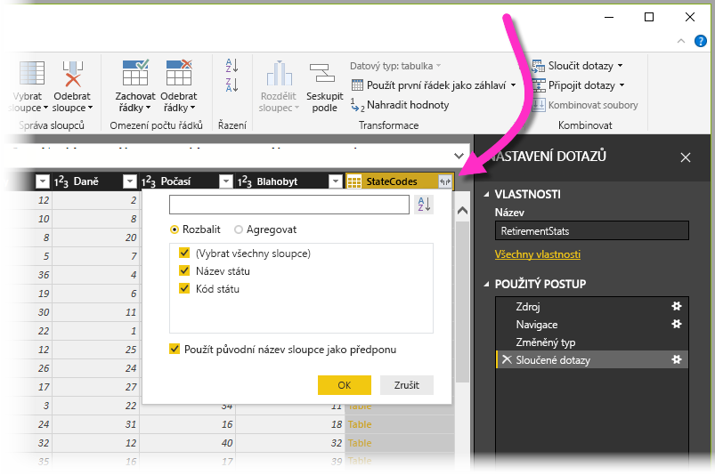

Když jsme teď připojení ke zdroji dat pomocí **Microsoft Power BI Desktopu**, potřebujeme data upravit tak, aby odpovídala našim požadavkům.Now that we've connected to a data source by using **Microsoft Power BI Desktop**, we must adjust the data to meet our needs. Úprava někdy znamená *transformaci* dat, jako je přejmenování sloupců nebo tabulek, převod textu na čísla, odebrání řádků nebo nastavení prvního řádku jako záhlaví.Sometimes, adjusting means *transforming* the data by, for example, renaming columns or tables, changing text to numbers, removing rows, or setting the first row as a header.

**Editor Power Query** v Power BI Desktopu má úlohy dostupné na pásu karet a navíc hojně využívá místní nabídky (také se jim říká nabídky zobrazované po kliknutí pravým tlačítkem nebo kontextové nabídky).**Power Query Editor** in Power BI Desktop makes extensive use of shortcut menus (also known as right-click or context menus), in addition to having tasks available on the ribbon. Většina toho, co můžete vybrat na kartě **Transformace** na pásu karet, je taká dostupná po kliknutí pravým tlačítkem na položku (jako je sloupec) a potom vybráním příkazu z místní nabídky, která se zobrazí.Most of what you can select on the **Transform** tab on the ribbon is also available by right-clicking an item (like a column) and then selecting a command on the shortcut menu that appears.

## Formování datShape data
Když *formujete* data v **editoru Power Query**, poskytujete podrobné pokyny, které **editor Power Query** provede za vás k úpravě dat při jejich načítání a prezentování.When you *shape* data in **Power Query Editor**, you're providing step-by-step instructions that **Power Query Editor** will carry out to adjust the data as it loads and presents it. Původní zdroj dat není ovlivněn.The original data source isn't affected. Pouze toto zobrazení dat se upravuje (neboli *formuje*).Only this particular view of the data is adjusted, or *shaped*.

Kroky, které zadáte (třeba přejmenování tabulky, transformace datového typu nebo odstranění sloupců), jsou zaznamenány **editorem Power Query**.The steps you specify (for example, rename a table, transform a data type, or delete columns) are recorded by **Power Query Editor**. Tyto kroky se pak provádějí pokaždé, když je dotaz připojen ke zdroji dat, aby byla data vždy formována způsobem, který zadáte.Those steps are then carried out each time the query connects to the data source, so that the data is always shaped the way you specify. Tento proces se provádí při každém použití dotazu v Power BI Desktopu nebo vždy, když někdo jiný použije váš sdílený dotaz (například ve službě **Power BI**).This process occurs whenever you use the query in Power BI Desktop, or whenever anyone else uses your shared query (for example, in the **Power BI service**). Tyto kroky se zaznamenávají v zadaném pořadí v podokně **Nastavení editoru Power Query** v seznamu **Použitý postup**.The steps are captured sequentially under **Applied Steps** in the **Power Query Settings** pane.

Na následujícím obrázku vidíme podokno **Nastavení dotazů** pro dotaz, který byl formován.The following image shows the **Query Settings** pane for a query that has been shaped. V několika dalších odstavcích si projdeme jednotlivé kroky.We'll go through each of the steps in the next few paragraphs.

Teď se vraťme zpátky k našim důchodovým datům, která jsme našli připojením k **webovému** zdroji dat, a pojďme tato data formovat podle potřeby.Let's return to the retirement data that we found by connecting to a **Web** data source, and let's shape that data to fit our needs.

Pro začátek: většina hodnocení byla přenesena do **editoru Power Query** jako celá čísla, ale některá ne.For starters, most of the ratings were brought into **Power Query Editor** as whole numbers, but some weren't. Protože jeden sloupec obsahoval text a čísla, nebyl automaticky převeden.Because one column had text and numbers, it wasn't automatically converted. Power BI často tyto změny zjistí a automaticky provede změnu datového typu.Power BI often detects these changes and automatically changes the data type. 

Potřebujeme, aby data měla číselnou podobu.We need the data to be numbers. Žádný problém: když budete chtít datový typ změnit, stačí pravým tlačítkem myši kliknout na záhlaví sloupce a vybrat \*\*Změnit typ \*\* Celé číslo\>.No problem: just right-click the column header, and then select **Change Type \> Whole Number** to change the data type. Pokud potřebujete změnit více než jeden sloupec, vyberte jeden z nich a při výběru dalších sousedících sloupců podržte klávesu **Shift**.If you must change more than one column, select one of them, and then hold down the **Shift** key while you select additional adjacent columns. Potom pravým tlačítkem myši klikněte na záhlaví sloupce, aby se všechny vybrané sloupce změnily.Then right-click a column header to change all the selected columns. Můžete také použít **Ctrl** k výběru nesousedících sloupců.You can also use the **Ctrl** key to select non-adjacent columns.

> [!NOTE]
> Power Query často detekuje, že sloupec textu by měl mít číselnou podobu, a při přenesení tabulky do editoru Power Query za vás datový typ automaticky změní.Often, Power Query will detect that a column of text should be numbers, and will automatically change the data type when it brings the table into Power Query Editor. V tomto případě krok ze seznamu **Použitý postup** identifikuje, co editor Power Query udělal za vás.In this case, a step under **Applied steps** identifies what Power Query did for you.

Tyto sloupce také můžete změnit nebo *transformovat* na záhlaví použitím karty **Transformace** na pásu karet.You can also change, or *transform,* those columns from text to header by using the **Transform** tab on the ribbon. Následující obrázek ukazuje kartu **Transformace**. Šipka ukazuje na tlačítko **Datový typ**, které umožňuje transformovat aktuální datový typ na jiný.The following image shows the **Transform** tab. The arrow points to the **Data Type** button, which lets you transform the current data type to another.

Všimněte si, že seznam **Použitý postup** v podokně **Nastavení dotazů** odráží všechny provedené změny.Notice that the **Applied Steps** list in the **Query Settings** pane reflects all the changes that were made. Pokud chcete z postupu formování nějaký krok odebrat, stačí ho vybrat a potom nalevo od něj vybrat **X**.To remove any step from the shaping process, just select it, and then select the **X** to the left of it.

## Připojení k datůmConnect to data
Data o různých státech jsou zajímavá a budou užitečná při vytváření dalších analýz a dotazů.That data about different states is interesting, and will be useful for building additional analysis efforts and queries. Ale je tu problém: většina dat tady nepoužívá plný název státu, ale jenom jeho dvoupísmennou zkratku.But there's one problem: most data out there uses a two-letter abbreviation for state codes, not the full name of the state. Proto potřebujeme způsob, jak ke zkratkám států přidružit jejich plný název.Therefore, we need some way to associate state names with their abbreviations.

Máme štěstí. Existuje jiný veřejný zdroj dat, který dělá právě to, ale než ho budeme moct připojit k naší důchodové tabulce, je potřeba ho ještě dost upravit.We're in luck: there's another public data source that does just that, but it needs a fair amount of shaping before we can connect it to our retirement table. Tady je webový prostředek pro zkratky států na webu:Here's the web resource for state abbreviations:

<http://en.wikipedia.org/wiki/List_of_U.S._state_abbreviations>

V **editoru Power Query** vyberte na kartě **Domů** na pásu karet **Nový zdroj \> Web**.In **Power Query Editor**, on the **Home** tab on the ribbon, select **New Source \> Web**. Pak zadejte adresu a vyberte **OK**.Then enter the address, and select **OK**. Okno **Navigátor** zobrazí, co na webové stránce našlo.The **Navigator** window shows what it found on that webpage.

Vyberte tabulku **Kódy a zkratky...** (Codes and abbreviations), protože zahrnuje požadovaná data. Ale vyfiltrování dat si vyžádá hodně formování.Select the **Codes and abbreviations...** table, because it includes the data we want, although it's going to take quite a bit of shaping to pare down that data. 

Výběrem **OK** přeneseme data do **editoru Power Query**, abychom je mohli formovat.Select **OK** to bring the data into **Power Query Editor** so that we can shape it. Potom postupujte podle těchto kroků:Then follow these steps:

* **Odeberte první tři řádky** – Tyto řádky odpovídají tomu, jak byla tabulka na webové stránce vytvořena, a k ničemu je nepotřebujeme.**Remove the top three rows** – Those rows are a result of the way the webpage's table was created, and we don't need them. Pokud je chcete odebrat, vyberte na kartě **Domů** na pásu karet **Odebrat řádky \> Odebrat horní řádky**.To remove them, on the **Home** tab on the ribbon, select **Remove rows \> Remove Top Rows**. V dialogovém okně, které se zobrazí, zadejte *3* jako počet řádků, které chcete odebrat.In the dialog box that appears, enter *3* as the number of rows to remove.

    

* **Odeberte dolních 26 řádků** – Tyto řádky představují všechna teritoria, která nepotřebujeme zahrnout.**Remove the bottom 26 rows** – Those rows are all for territories, which we don't need to include. Postup je stejný, jenom tentokrát vyberete **Odebrat řádky \> Odebrat dolní řádky** a jako počet řádků k odebrání zadáte *26*.The process is the same, but this time, select **Remove rows \> Remove Bottom Rows**, and enter *26* as the number of rows to remove.

    

* **Vyfiltrujte Washington DC** – Tabulka důchodových statistik nezahrnuje DC, takže tento stát z našeho seznamu vyřadíme.**Filter out Washington, DC** – The retirement stats table doesn't include Washington, DC, so we'll exclude it from our list. Vyberte šipku rozevíracího seznamu vedle sloupce **Název a stav regionu2** a potom zrušte zaškrtnutí pro zaškrtávací políčko**Federální kraj**.Select the drop-down arrow beside the **Name and status of region2** column, and then clear the **Federal district** check box. 

    

* **Odeberte pár nepotřebných sloupců** – Potřebujeme jenom mapování států na dvoupísmenné zkratky a tyto informace nám poskytne druhý a pátý sloupec.**Remove a few unneeded columns** – We just need the mapping of each state to its official two-letter abbreviation, and that information is given in the second and fifth columns. Proto potřebujeme zachovat jen tyto dva sloupce a všechny ostatní můžeme odebrat.Therefore, we just need to keep those two columns and can remove all the others. Vyberte první sloupec, který se má odebrat, při výběru ostatních sloupců k odebrání podržte klávesu Ctrl (tento postup umožňuje vybrat několik vzájemně nesousedících sloupců).Select the first column to remove, and then hold down the Ctrl key while you select the other columns to remove (this lets you select multiple, non-adjacent columns). Potom na kartě **Domů** na pásu karet vyberte **Odebrat sloupce \> Odebrat sloupce**.Then, on the **Home** tab on the ribbon, select **Remove Columns \> Remove Columns**.

    

* **Použijte první řádek jako záhlaví** – Protože jsme odebrali první tři řádky, je aktuální horní řádek požadovaným záhlavím.**Use the first row as headers** – Because we removed the top three rows, the current top row is the header we want. Vyberte tlačítko **Použít první řádek jako záhlaví**.Select the **Use first row as headers** button.

    

    > [!NOTE]
    > Teď je vhodné ukázat si, že *pořadí* použitých kroků v **editoru Power Query** je důležité a může ovlivnit výsledné naformování dat.This is a good time to point out that the *sequence* of applied steps in **Power Query Editor** is important and can affect how the data is shaped. Je také důležité vzít v úvahu, jak jeden krok může ovlivnit jiný následující krok.It's also important to consider how one step might affect another subsequent step. Pokud odeberete krok ze seznamu **Použitý postup**, následné kroky nemusí fungovat tak, jak jste původně zamýšleli, a to kvůli pořadí kroků v rámci dotazu.If you remove a step from the **Applied Steps** list, subsequent steps might not behave as originally intended, because of the impact of the query's sequence of steps.

* **Přejmenujte sloupce a samotnou tabulku** – Jako obvykle existuje několik způsobů, jak přejmenovat sloupec.**Rename the columns and the table itself** – As usual, there are a couple ways to rename a column. Můžete použít, jaký způsob chcete.You can use whichever way you prefer. Pojďme je přejmenovat na *Název státu* a *Kód státu*.Let's rename them *State Name* and *State Code*. Pokud chcete tabulku přejmenovat, stačí zadat požadovaný název do pole **Název** v podokně **Nastavení dotazů**.To rename the table, just enter the name in the **Name** field in the **Query Settings** pane. Celou tabulku nazveme *StateCodes* (KódyStátů).Let's call this table *StateCodes*.

    

## Kombinování datCombine data

Když je teď tabulka **StateCodes** (KódyStátů) naformovaná, můžeme naše dvě tabulky zkombinovat do jedné.Now that the **StateCodes** table is shaped, we can combine our two tables into one. Protože tabulky, které teď máme, jsou výsledkem dotazů, které jsme použili na data, říká se jim často *dotazy*.Because the tables that we now have are a result of the queries we applied to the data, they're often referred to as *queries*.

Existují dva základní způsoby kombinování tabulek: *sloučení* a *připojení*.There are two primary ways of combining queries: *merging* and *appending*.

Když máte jeden nebo více sloupců, které chcete přidat k jinému dotazu, pak tyto dotazy **sloučíte**.When you have one or more columns that you want to add to another query, you **merge** the queries. Pokud máte další řádky dat, které chcete přidat ke stávajícímu dotazu, pak tento dotaz **připojíte**.When you have additional rows of data to add to an existing query, you **append** the query.

V tomto případě chceme dotazy sloučit.In this case, we want to merge the queries. Abyste mohli začít, vyberte dotaz, *se kterým* se má druhý dotaz sloučit.To get started, select the query to merge the other query *into*. Potom na kartě **Domů** na pásu karet vyberte **Sloučit dotazy**.Then, on the **Home** tab on the ribbon, select **Merge Queries**. Jako první chceme vybrat náš důchodový dotaz.We want to select our retirement query first. Když už u něj jsme, pojďme tento dotaz přejmenovat na *RetirementStats*.While we're at it, let's rename that query *RetirementStats*.

Zobrazí se dialogové okno **Sloučit** s výzvou, abychom vybrali tabulku, kterou chceme sloučit s vybranou tabulkou, a potom sloupce, na základě kterých se má sloučení provést.The **Merge** dialog box appears, prompting us to select the table to merge into the selected table, and the matching columns to use for the merge. 

Vyberte **State** (Stát) z tabulky (dotazu) **RetirementStats** a pak vyberte dotaz **StateCodes** (KódyStátů).Select **State** from the **RetirementStats** table (query), and then select the **StateCodes** query. (V tomto případě je volba snadná, protože existuje jenom jeden další dotaz.(In this case, the choice is easy, because there's only one other query. Ale když se připojíte k mnoha zdrojům dat, bude mnoho dotazů na výběr.) Když vyberete správné odpovídající sloupce – **State** (Stát) z **RetirementStats** a **State Name** (Název státu) z **StateCodes** (KódyStátů) – dialogové okno **Sloučit** bude vypadat takto a tlačítko **OK** se zpřístupní.But when you connect to many data sources, there will be many queries to choose from.) After you select the correct matching columns—**State** from **RetirementStats** and **State Name** from **StateCodes**—the **Merge** dialog box will look like this, and the **OK** button will become available.

Na konci dotazu se vytvoří **NewColumn** a je to obsah tabulky (dotazu), který se sloučil se stávajícím dotazem.A **NewColumn** is created at the end of the query and is the contents of the table (query) that was merged with the existing query. V **NewColumn** jsou zhuštěné všechny sloupce ze sloučeného dotazu, ale můžete tabulku **rozbalit** a zahrnout sloupce, které chcete.All columns from the merged query are condensed into the **NewColumn**, but you can **expand** the table and include whichever columns you want. Pokud chcete rozbalit sloučenou tabulku a vybrat sloupce, které se mají zahrnout, vyberte ikonu rozbalení ().To expand the merged table and select the columns to include, select the expand icon (). Zobrazí se dialogové okno **Rozbalit**.The **Expand** dialog box appears.

V tomto případě chceme jen sloupec **Kód státu**.In this case, we just want the **State Code** column. Proto vyberte pouze ten sloupec a pak vyberte **OK**.Therefore, select only that column, and then select **OK**. Můžete také zrušit zaškrtnutí políčka **Používat původní název sloupce jako předponu**.You can also clear the **Use original column name as prefix** check box. Pokud je necháte zaškrtnuté, bude sloučený sloupec pojmenován *NewColumn.Kód státu* (původní název sloupce nebo *NewColumn*, potom tečka a pak název sloupce, který se má přenést do dotazu).If you leave it selected, the merged column will be named *NewColumn.State Code* (the original column name, or *NewColumn*, then a dot, and then the name of the column that's being brought into the query).

> [!NOTE]
> Pokud chcete, můžete si pohrát s tím, jak bude tabulka **NewColumn** přenesena.If you want, you can play around with how the **NewColumn** table is brought in. Pokud se vám výsledky nelíbí, stačí odstranit krok **Rozbalit** ze seznamu **Použitý postup** v podokně **Nastavení dotazů**.If you don't like the results, just delete the **Expand** step from the **Applied Steps** list in the **Query Settings** pane. Dotaz se vrátí do stavu, ve kterém se nacházel před použitím tohoto kroku.Your query will return to the state it was in before you applied that step. Je to jako bezplatná předělávka, kterou můžete udělat, kolikrát chcete, dokud proces rozbalení nebude vypadat tak, jak chcete.It's like a free do-over that you can do as many times as you want, until the expand process looks the way you want.

Teď máme jeden dotaz (tabulku) kombinující dva zdroje dat, které byly oba formované tak, aby vyhovovaly našim potřebám.We now have a single query (table) that combines two data sources, each of which has been shaped to meet our needs. Tento dotaz může sloužit jako základ pro spoustu dalších zajímavých datových připojení, jako jsou třeba statistika nákladů na bydlení, demografické údaje nebo pracovní příležitosti v libovolném státu.This query can serve as a basis for lots of additional, interesting data connections, like housing cost statistics, demographics, or job opportunities in any state.

Pokud chcete změny v **editoru Power Query** použít a načíst je do Power BI Desktopu, vyberte možnost **Zavřít a použít** na kartě **Domů** na pásu karet.To apply the changes in **Power Query Editor** and load them into Power BI Desktop, select **Close & Apply** on the **Home** tab on the ribbon.

Teď jsou data ve vašem modelu připravená k dalšímu zpracování.The data in your model is now ready to work with. V dalším kroku vytvoříme pro vaši sestavu nějaké vizuály.Next, we'll create some visuals for your report.

Prozatím máte dostatek dat pro vytvoření několika zajímavých sestav, a to všechno v rámci Power BI Desktopu.For now, we have enough data to create a few interesting reports, all in Power BI Desktop. Protože se jedná o milník, pojďme tento soubor Power BI Desktopu uložit.Because this is a milestone, let's save this Power BI Desktop file. Výběrem možností **Soubor \> Uložit** na kartě **Domů** na pásu karet sestavu uložte – nazveme ji **Začínáme s Power BI Desktopem**.Select **File \> Save** on the **Home** tab on the ribbon to save the report—we'll call it **Getting Started with Power BI Desktop**.

Výborně!Great! A teď můžeme přejít k další jednotce, kde vytvoříme pár zajímavých vizuálů.Now on to the next unit, where we'll create some interesting visuals.
