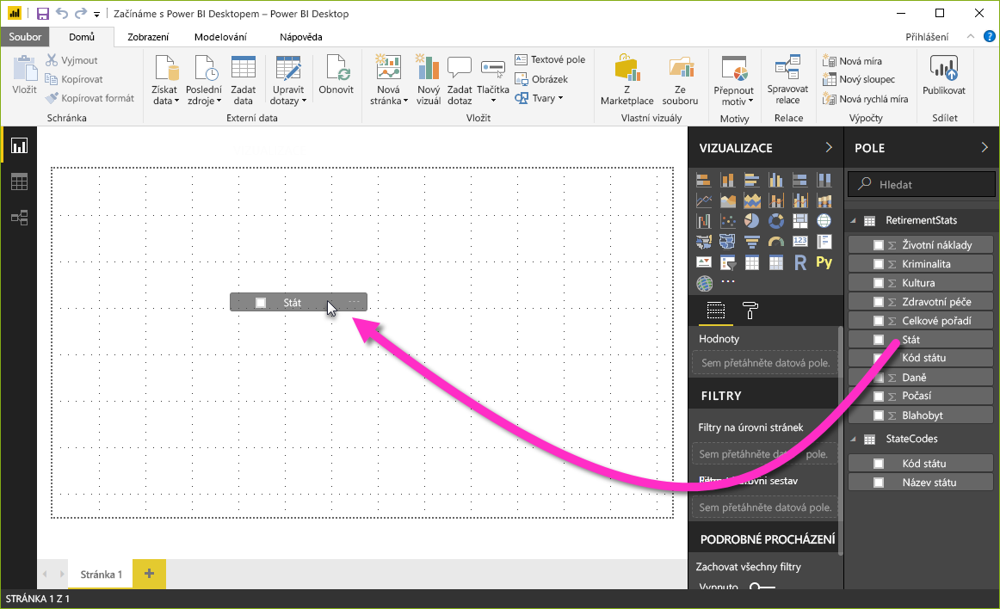

V předchozí lekci jsme propojili dva samostatné zdroje dat a pak jsme je libovolně upravili a zkombinovali.In the previous unit, we connected two separate data sources, and then shaped and combined those data sources as we wanted. To znamená, že teď máme **datový model**, který můžeme použít jako základ pro vytváření sestav.As a result, we now have a **data model** that we can use as a basis for creating reports. 

Neznamená to ale, že bychom u tohoto datového modelu museli zůstat napořád.That doesn't mean we're stuck with that data model forever. Další změny se dají v editoru Power Query udělat po načtení modelu, který můžete znovu načíst, aby se uplatnily provedené změny.Additional changes can be made in Power Query Editor after the model is loaded, and you can reload a model to apply any changes you make. Ale prozatím nám tento model bude stačit.But for now, this model will do just fine. 

S vytvářením sestav na základě tohoto datového modelu, který jsme si vytvořili, začneme tak, že v Microsoft Power BI Desktopu přejdeme do zobrazení **Sestava**.To get started creating a report with the data model we created, open the **Report** view in Microsoft Power BI Desktop.

Zobrazení **Sestava** má pět hlavních oblastí:The **Report** view has five main areas:

1. Pás karet, kde se zobrazují běžné úlohy spojené se sestavami a vizualizacemiThe ribbon, which shows common tasks associated with reports and visualizations
2. Zobrazení **Sestava** nebo plátno, kde se vytvářejí a uspořádávají vizualizaceThe **Report** view, or canvas, where visualizations are created and arranged
3. Oblast karty **Stránky** v dolní části, kde se dá vybrat nebo přidat stránka sestavyThe **Pages** tab area along the bottom, which lets you select or add report pages
4. Podokno **Vizualizace**, ve kterém můžete měnit vizualizace, přizpůsobovat barvy nebo osy, používat filtry, přetahovat pole atd.The **Visualizations** pane, where you can change visualizations, customize colors or axes, apply filters, drag fields, and more
5. Podokno **Pole**, ve kterém se filtry nebo elementy dotazu dají přetáhnout do zobrazení **Sestava** nebo do oblasti **Filtry** v podokně **Vizualizace**The **Fields** pane, from which query elements and filters can be dragged either onto the **Report** view or into the **Filters** area of the **Visualizations** pane

Podokna **Vizualizace** a **Pole** se dají pomocí malé šipky na okraji sbalit tak, aby pro zobrazení **Sestava** zůstalo víc místa pro sestavení působivých vizualizací.The **Visualizations** and **Fields** pane can be collapsed by selecting the small arrow along the edge, providing more space in the **Report** view to build cool visualizations.

## Vytváření vizuálůCreate visuals
Pokud chcete vytvořit vizualizaci, stačí přetáhnout pole ze seznamu **Pole** do zobrazení **Sestava**.To create a visualization, just drag a field from the **Fields** list onto the **Report** view. V tomto případě přetáhneme pole **State** (Stát) z **RetirementStats** a uvidíme, co se stane.In this case, let's drag the **State** field from **RetirementStats** and see what happens.

Podívejme: Power BI Desktop automaticky vytvořil vizualizaci mapy, protože rozpoznal, že pole **State** (Stát) obsahuje data o geografické poloze.Look at that: Power BI Desktop automatically created a map-based visualization, because it recognized that the **State** field has geolocation data.

Všimněte si, že v podokně **Vizualizace** můžete vybrat různé typy vizualizací.Notice that you can select different types of visualizations in the **Visualizations** pane. Potom můžete v oblasti pod těmito ikonami přetáhnout pole do různých oblastí a použít tak legendu nebo měnit vizualizace jinými způsoby.Then, in the area below those icons, you can drag fields to different areas to apply a legend or change the visualization in other ways. 

Teď na této první stránce sestavy vytvoříme pár vizuálů a uvidíme, co se stane.Let's create a few visuals on this first report page and see what happens.

Typ libovolného vizuálu se dá změnit jednoduše tak, že se vybere na plátně a v podokně **Vizualizace** se klikne na jinou dlaždici.You can change the type of any visual by selecting it on the canvas and then selecting a different tile in the **Visualizations** pane. Pojďme to tedy udělat.Let's do that. Místo dlaždice **Mapa** (dlaždice s ikonou glóbusu) vybereme **Kartogram** (další dlaždice, která vypadá jako různobarevná mapa).Instead of **Map** (the tile with a globe icon), select **Filled Map** (the next tile, which looks like states in different colors).

**První vizuál****First visual**

V podokně **Vizualizace** vyberte kartu **Formát** (vypadá jako malířský váleček), rozbalte **Barva dat** a vyberte možnost **Pokročilé ovládací prvky**.In the **Visualizations** pane, select the **Format** tab (looks like a paint roller), and then expand **Data color**, and select the **Advanced controls** option.

V části **Na základě pole** rozbalte tabulku *RetirementStates* a vyberte **Overall rank** (Celkové pořadí).In the **Based on field** section, expand the *RetirementStates table* and select **Overall rank**. Uložte změny kliknutím na **OK**.Save changes by clicking **OK**.

Pokud chcete upravit barvy použité v mapě, vyberte požadovanou barvu v polích **Minimum** a **Maximum**.To adjust the colors used in the map, select the desired color in the **Minimum** and **Maximum** fields. 

Velikost vizuálu můžete změnit tak, že přetáhnete jeho rohy nebo strany.You can adjust the size of a visual by dragging its corners or sides. Pojďme tento vizuál před vytvořením dalšího vizuálu přesunout.Let's move this visual to the upper left before creating the next visual.

Vyberte libovolné prázdné místo na plátně, aby nebyl vybrán žádný vizuál.Select any blank area of the canvas, so that no visual is selected. Teď můžete začít přetahovat pole a vytvořit další vizuál.You're now ready to drag fields and create the next visual.

**Druhý vizuál****Second visual**

Přetáhněte pole **State** (Stát) z **RetirementStats** do prázdné oblasti plátna.Drag **State** from **RetirementStats** onto a blank area of the canvas. Potom na stejný vizuál přetáhněte pole **Overall rank** (Celkové pořadí), **Health care quality** (Kvalita zdravotnické péče) a **Well-being** (Blahobyt).Then drag the **Overall rank** field, then the **Health care quality** field, and then the **Well-being** field onto that visual. Teď vybráním příslušné dlaždice v podokně **Vizualizace** změníme tento vizuál na **spojnicový a skupinový sloupcový graf**.Now let's change the visual to a **Line and clustered column chart** visual by selecting the appropriate tile in the **Visualizations** pane.

Už jste téměř hotovi.We're almost done. Na kartě **Pole** přetáhněte pole **Well-being** (Blahobyt) na kontejner **Hodnoty řádků**.On the **Fields** tab, move the **Well-being** field to the **Line values** well. Následující obrázek ukazuje, jak by teď měl vizuál vypadat.The following image shows what your visual should now look like. Všimněte si, že se pořadí polí v jednotlivých kbelících změní způsob zobrazení vizuálu.Note that the order of the fields in each bucket will change how a visual appears. Jak je například znázorněno na následujícím obrázku, **Health care quality** (Kvalita zdravotnické péče) je nad položkou **Overall rank** (Celkové pořadí) v kbelíku **Hodnoty sloupců**.For example, **Health care quality** is above **Overall rank** in the **Column values** bucket, shown in the following image. 

Můžete s těmito vizuály experimentovat, jak se vám zachce – měnit typ vizuálu, přidávat pole, měnit barvy a měnit uspořádání vizuálu na plátně.You can experiment with these visuals as much as you want: change the visual type, add fields, change the colors, or arrange the visual on the canvas. Provádění těchto změn je zábavné, snadno se vrátí zpět a rychle se projeví.All these changes are fun to do, easy to undo, and quick to take effect.

Teď se posuneme o něco dopředu a podíváme se, jak zobrazení **Sestava** vypadá po přidání několika dalších vizualizací a nových stránek sestavy.Let's fast-forward a bit and see what the **Report** view looks like after a handful of visualizations and a few report pages have been added. Nedělejte si starosti, můžete si tuto sestavu prohlédnout jako první.Don't worry: you can see this report first-hand. Souhrnná jednotka pro tento modul obsahuje odkaz ke stažení finálního souboru .pbix.The summary unit for this module includes a link to download the final .pbix file. Můžete načíst sestavu do vaší místní verze Power BI Desktopu a zjistit, jak se to povedlo.You can then load the report into your local version of Power BI Desktop and see exactly how things came together. 

První stránka sestavy poskytuje náhled na data na základě *celkového pořadí*.The first report page provides a perspective of the data that's based on *overall rank*. Když vyberete jednu z vizualizací, ukazuje podokno **Pole a filtry**, která pole jsou vybraná, a také strukturu příslušné vizualizace (která pole se použijí pro nastavení **Sdílená osa**, **Hodnoty sloupců** a **Hodnoty řádků**).When you select one of the visualizations, the **Fields and Filters** pane shows which fields are selected and the structure of the visualization (that is, which fields are applied to **Shared Axis**, **Column Values**, and **Line Values**).

Tato sestava obsahuje šest **stránek**, z nichž každá vizualizuje konkrétní elementy vašich dat:There are six **pages** in this report, each visualizing specific elements of our data:

1. První stránka, kterou vidíte na předchozím obrázku, zobrazuje všechny státy na základě *celkového pořadí*.The first page, shown in the preceding image, shows all states, based on *overall rank*.
2. Druhá stránka se soustředí na prvních deset států na základě *celkového pořadí*.The second page shows on the top 10 states, based on *overall rank*.
3. Třetí stránka zobrazuje 10 nejlepších států z hlediska životních nákladů (a přidružených dat).The third page shows the top 10 states for cost of living (and associated data).
4. Čtvrtá stránka se zaměřuje na počasí a je na ní vyfiltrováno 15 nejslunnějších států.The fourth page focuses on weather and is filtered to show the 15 sunniest states.
5. Na páté stránce se zobrazí nejlepších 15 států z hlediska blahobytu občanů.The fifth page shows the top 15 states for community well-being.
6. Šestá stránka se zaměřuje na statistiku kriminality – zobrazuje 10 nejlepších a 10 nejhorších států.The sixth page focuses on crime statistics, showing the 10 best and 10 worst states.

Takhle vypadá stránka, která se zaměřuje na životní náklady.Here's what the page that focuses on cost of living looks like.

Vytvořit můžete celou řadu zajímavých sestav a vizualizací.There are all sorts of interesting reports and visualizations you can create. Ale nejlepší na vytváření sestav je možnost sdílet je s ostatními.But what's best about creating reports is sharing them with others. V další jednotce uvidíte, jak snadné je sdílet sestavy Power BI.In the next unit, we'll see just how easy it is to share Power BI reports.

## Přidání stránek sestavyAdding report pages

Všechny sestavy mají pro začátek nejméně jednu prázdnou stránku.All reports have at least one blank page to begin with. Stránky se v podokně navigace zobrazují nalevo od plátna.Pages appear in the navigation pane just to the left of the canvas. 

Na stránky se dají přidat nejrůznější vizualizace, ale důležité je to nepřehnat.You can add all sorts of visualizations to a page, but it's important not to overdo it. Příliš mnoho vizualizací na stránce může vypadat nepřehledně a může potom být těžké najít požadované informace.Too many visualizations on a page will make it look busy and will also make the correct information difficult to find.

Pokud si chcete do sestavy přidat stránku, stačí vybrat kartu **Nová stránka** na pásu karet nebo vybrat tlačítko plus (**+**) vedle poslední stránky sestavy.To add a page to your report, just select **New Page** on the ribbon, or select the plus sign (**+**) next to the last report page.

Tak a máte sestavu, i když obsahuje jenom pár vizuálů.Okay, even with just a couple of visuals, you have a report. Přejdeme k další lekci a ukážeme si, jak tyto přehledné sestavy můžeme sdílet s ostatními.Let's move on to the next unit and learn how we can share these insight-filled reports with others.