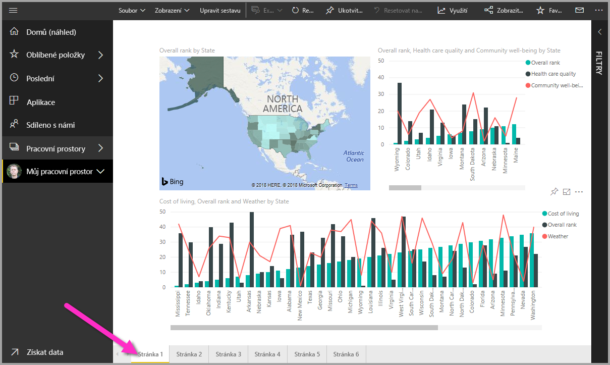
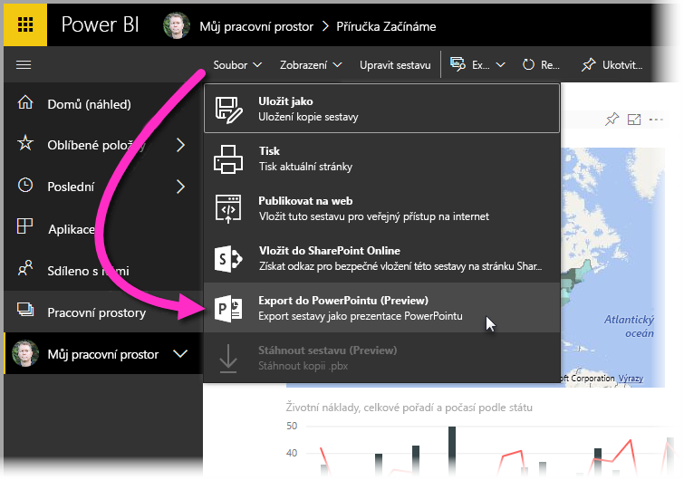

Když teď máme sestavu Microsoft Power BI Desktopu, která je přiměřeně úplná (nebo aspoň připravená pro další práci), můžeme ji sdílet s ostatními pomocí **služby Power BI**.Now that we have a Microsoft Power BI Desktop report that's reasonably complete (or at least ready to move ahead with), we can share it with others by using the **Power BI service**. Existuje několik způsobů, jak sdílet práci v Power BI Desktopu.There are a few ways to share your work in Power BI Desktop. Můžete publikovat do **služby Power BI**, nahrát soubor .pbix přímo ze služby Power BI nebo soubor .pbix uložit a odeslat ho jako jakýkoli jiný soubor.You can publish to the **Power BI service**, upload the .pbix file directly from the Power BI service, or save the .pbix file and send it like any other file. Můžete také exportovat sestavu do souboru Microsoft PowerPointu a dokonce vytvořit soubor PDF vaší sestavy.You can also export a report to a Microsoft PowerPoint file, and can even create a PDF file of your report.

## Publikování do služby Power BIPublish to the Power BI service
Nejprve se podívejme na publikování do **služby Power BI** přímo z Power BI Desktopu.First, let's look at publishing directly from Power BI Desktop to the **Power BI service**. Na pásu karet vyberte na kartě **Domů** tlačítko **Publikovat**.On the **Home** tab on the ribbon, select **Publish**.

Mohla by se zobrazit výzva k přihlášení k Power BI.You might be prompted to sign in to Power BI.

Další okno, které se zobrazí, vás vyzve k zadání cílového místa publikované sestavy.The next window that appears asks for a destination for your published report. Můžete publikovat sestavu do pracovního prostoru, který je přístupný pro celou organizaci (a sdílet tak tuto sestavu se všemi uživateli ve vaší organizaci), nebo ji můžete publikovat do jiných dostupných pracovních prostorů.You can publish a report to a workspace that's accessible to your entire organization (and therefore share your report with everyone in your organization), or you can publish it to other available workspaces. To, které pracovní prostory se zobrazí, bude záviset na tom, které pracovní prostory jsou vám a vaší organizaci dostupné.The workspaces you see depend on the workspaces that are available to you and your organization.

Můžete také jednoduše sdílet sestavu ve vašem vlastním pracovním prostoru (s názvem *Můj pracovní prostor*).You can also share the report just in your own workspace (called *My Workspace*). Odtud s ní pak můžete dál pracovat ve službě Power BI (včetně jejího širšího sdílení).From there, you can do more with it in the Power BI service (including sharing it more broadly). V našem případě vybereme **Můj pracovní prostor**.In our case, we'll select **My Workspace**.

Po přihlášení a dokončení procesu publikování se zobrazí následující dialogové okno.When you've signed in and the publish process is finished, you'll see the following dialog box.

Po přihlášení k Power BI uvidíte soubor Power BI Desktopu, který jste právě načetli, v částech **Řídicí panely**, **Sestavy** a **Datové sady** služby.When you sign in to Power BI, you'll see the Power BI Desktop file you just loaded in the **Dashboards**, **Reports**, and **Datasets** sections of the service.

Další možností sdílení práce je její načtení z prostředí **služby Power BI**.Another way to share your work is to load it from within the **Power BI service**. Následující odkaz otevře službu **Power BI** v prohlížeči:The following link opens the **Power BI service** in a browser:

<https://app.powerbi.com>

Výběrem **Získat data** zahájíte proces načítání sestavy Power BI Desktopu.Select **Get Data** to start the process of loading your Power BI Desktop report.

Na stránce **Získat data**, která se zobrazí, můžete vybrat, odkud se data načtou.On the **Get Data** page that appears, you can select where to get your data from. V našem případě vybereme v poli **Soubory** možnost **Získat**.In our case, we'll select **Get** in the **Files** box.

Zobrazí se zobrazení **Soubory**.The **Files** view appears. V našem případě vybereme **Místní soubor**.In our case, we'll select **Local File**.

Když vyberete soubor, Power BI ho nahraje.After you select the file, Power BI uploads it.

Po nahrání můžete soubor vybrat.After the file is uploaded, you can select it. Ve službě Power BI vyberte v levém podokně **Můj pracovní prostor** a pak výběrem karty **sestavy** zobrazte všechny svoje sestavy.In the Power BI service, select **My Workspace** in the left pane, and then select the **Reports** tab to show all your reports.

Když vyberete sestavu (výběrem jejího názvu), zobrazí služba **Power BI** její první stránku.When you select the report (by selecting its name), the **Power BI service** shows the first page of it. V dolní části stránky můžete pomocí karet zobrazit další stránky sestavy.Along the bottom of the page, you can select any tab to view that page of the report.

Ve službě **Power BI** můžete provádět změny sestavy tak, že v horní části plátna sestavy vyberete **Upravit sestavu**.You can change a report in the **Power BI service** by selecting **Edit Report** at the top of the report canvas.

Pokud chcete sestavu uložit, vyberte ve službě **Soubor \> Uložit jako**.To save your report, select **File \> Save As** in the service. 

## Uložení jako soubor PowerPointuSave as PowerPoint file

Sestavu Power BI Desktopu můžete také vyexportovat jako powerpointovou prezentaci.You can also export your Power BI Desktop report as a PowerPoint deck. Tímto způsobem ji pak můžete sdílet s ostatními během prezentování.That way, you can share your report with others during a PowerPoint presentation. 

Ve službě Power BI po načtení sestavy vyberte **Soubor \> Exportovat do PowerPointu (Preview)**.In the Power BI service, after the report is loaded, select **File \> Export to PowerPoint (Preview)**.

Po dokončení exportu vám Power BI řekne, kam byl powerpointový soubor uložen, a také vás informuje, že je připravený k nasdílení ostatním.After the export process is finished, Power BI tell you where the PowerPoint file was saved and lets you know that it's ready to be shared with others.

Teď, když víte, jak vytvářet a sdílet sestavy, můžete použít svou představivost, vytvářet s daty různé scénáře a sdílet je s celou vaší organizací.Now that you know how to create and share reports, you can use your imagination to tell stories with data and share them with your entire organization.

Pojďme k další lekci, kde poznatky z tohoto modulu shrneme.Let's head to the next unit, where we'll wrap things up for this module.