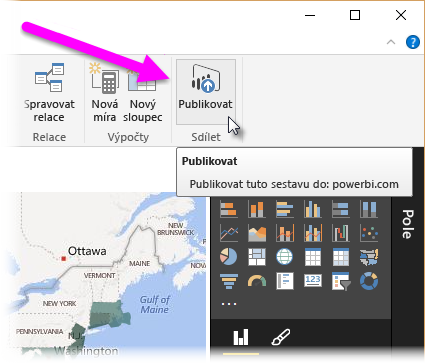

Blahopřejeme!Congratulations! Právě jste prošli procesem vytváření sestavy Microsoft Power BI od začátku a nasdílení vaší práce ostatním.You've just gone through the process of creating a Microsoft Power BI report from scratch and sharing your work with others. Abychom si to shrnuli – pojďme se podívat, co jste se naučili.To review, let's take a look at what you learned.

V **Power BI Desktopu** se můžete připojit k nejrůznějším zdrojům dat.In **Power BI Desktop**, you can connect to all sorts of data sources. Stačí vybrat **Získat data** na pásu karet a zobrazí se různé možnosti konektorů.You just have to select **Get Data** on the ribbon, and then a multitude of connector options appears. 

Také jste se naučili, že připojení k více než jednomu zdroji dat je stejně jednoduché jako vytvoření druhého připojení **Získat data**.You also learned that connecting to more than one data source is as easy as making a second **Get Data** connection. Můžete také v rámci **editoru Power Query** použít tlačítko **Nový zdroj**.You can also use the **New Source** button in **Power Query Editor**. Okno **Navigátor** v **editoru Power Query** nabízí náhled dat.The **Navigator** window in **Power Query Editor** provides a preview of the data.

Vybraná data můžete libovolně formovat odebráním sloupců/řádků nebo sloučením připojení do jednoho **datového modelu**, který můžete použít v sestavě.After you select data, you can shape it the way you want by removing columns and rows, or by merging connections into a single **data model** that you can use in your report.

Naučili jste se, že vytvářet vizuály je velmi jednoduché – stačí přetáhnout pole na plátno sestavy.You learned that creating visuals is as easy as dragging fields onto the report canvas. Pak tyto vizuály můžete podle potřeby měnit a experimentovat s nimi tak dlouho, dokud nebudou vypadat přesně tak, jak chcete.You can then change those visuals however you want, experimenting until you get them looking just the way you want.

A jakmile máte celou sestavu hotovou, můžete ji nasdílet někomu ve vaší organizaci, a to tak, že ji publikujete ve službě Power BI.And after your report is all done, you can share it with others in your organization by publishing it to the Power BI service.

Skvělá práce!Great work! Jak si asi pamatujete, prošli jsme několik vizuálů, ale pak bylo potřeba jít dál se slibem, že hotová zpráva bude dostupná pomocí odkazu v tomto shrnutí.As you might remember, we went through a few visuals but then had to move on, promising that the finished report would be available from a link in this summary. Tak tedy tady ji máte.Well, here we are, and here it is. Pokud chcete stáhnout hotovou sestavu Power BI Desktopu, použijte následující odkaz:To download the finished Power BI Desktop report, use the following link:

* Hotová sestava Power BI Desktopu – [Začínáme s Power BI Desktopem](https://go.microsoft.com/fwlink/?linkid=2021059)Completed Power BI Desktop report - [Getting Started with Power BI Desktop](https://go.microsoft.com/fwlink/?linkid=2021059)

Skvělá práce!Great work! Existují další věci, které je možné se o Power BI a Power BI Desktopu dozvědět, proto vyhledejte další moduly, které vaše vědomosti ještě rozšíří.There's more to learn about Power BI, and Power BI Desktop, so look for more modules that will take your learning even further. 
