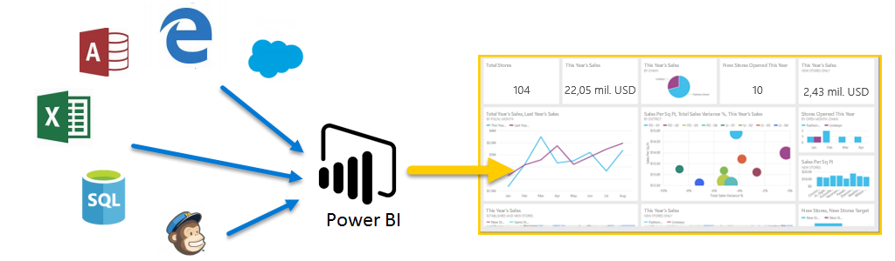
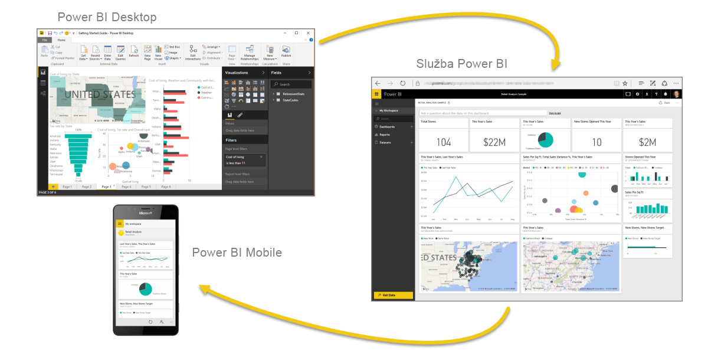

**Microsoft Power BI** je kolekce softwarových služeb, aplikací a konektorů, které spolupracují, aby přeměnily vaše nesouvisející zdroje dat na koherentní, vizuálně zajímavé interaktivní přehledy.**Microsoft Power BI** is a collection of software services, apps, and connectors that work together to turn your unrelated sources of data into coherent, visually immersive, and interactive insights. Ať vaše data tvoří jednoduchý sešit Microsoft Excelu, nebo kolekce cloudových a místních hybridních datových skladů, **Power BI** umožňuje snadné připojení ke zdrojům dat, vizualizaci (nebo zjištění) toho důležitého a sdílení výsledků s kýmkoli, nebo s vybranými uživateli.Whether your data is a simple Microsoft Excel workbook, or a collection of cloud-based and on-premises hybrid data warehouses, **Power BI** lets you easily connect to your data sources, visualize (or discover) what's important, and share that with anyone or everyone you want.

Řešení **Power BI** může být jednoduché a rychlé. Dokáže obratem vytvořit přehledy z excelového sešitu nebo místní databáze.**Power BI** can be simple and fast, capable of creating quick insights from an Excel workbook or a local database. Ale **Power BI** je také robustní a na podnikové úrovni a připravené nejen k objemnému modelování a analýze v reálném čase, ale i k vlastnímu vývoji.But **Power BI** is also robust and enterprise-grade, ready not only for extensive modeling and real-time analytics, but also for custom development. Může to proto být váš osobní nástroj pro sestavy a vizualizace, ale současně může sloužit jako analytický a rozhodovací modul při analýze a rozhodování pro skupinové projekty, divize nebo celé společnosti.Therefore, it can be your personal report and visualization tool, but can also serve as the analytics and decision engine behind group projects, divisions, or entire corporations.

Pokud jste v Power BI **začátečník**, pomůže vám tento modul posunout se dál.If you're a **beginner** with Power BI, this module will get you going. Pokud jste už v Power BI **veteránem**, tento modul vám ukáže souvislosti a doplní mezery.If you're a Power BI **veteran**, this module will tie concepts together and fill in the gaps.

## Součásti Power BIThe parts of Power BI
Power BI se skládá z desktopové aplikace Microsoft Windows, která se jmenuje **Power BI Desktop**, online služby SaaS (*software jako služba*) s názvem **služba Power BI** a mobilních **aplikací** Power BI, které jsou k dispozici na telefonech a tabletech s Windows a také na zařízeních se systémy Apple iOS a Google Android.Power BI consists of a Microsoft Windows desktop application called **Power BI Desktop**, an online SaaS (*Software as a Service*) service called the **Power BI service**, and mobile Power BI **apps** that are available on Windows phones and tablets, and also on Apple iOS and Google Android devices.

Tyto tři prvky, **Desktop**, **služba** a **Mobile**, jsou navržené tak, aby uživatelům umožňovaly vytvářet, sdílet a využívat obchodní přehledy způsobem, který je pro ně nebo pro jejich roli nejefektivnější.These three elements—**Desktop**, the **service**, and **Mobile** apps—are designed to let people create, share, and consume business insights in the way that serves them, or their role, most effectively.

## Jak Power BI odpovídá vaší roliHow Power BI matches your role
Způsob používání Power BI by mohl záviset na vaší roli v projektu nebo v týmu.How you use Power BI might depend on your role on a project or a team. A jiní uživatelé, v jiných rolích, mohou Power BI používat jinak, což je zcela v pořádku.And other people, in other roles, might use Power BI differently, which is just fine.

Například můžete zobrazovat sestavy a řídicí panely ve **službě Power BI**, a to by mohlo být všechno, co s Power BI děláte.For example, you might view reports and dashboards in the **Power BI service**, and that might be all you do with Power BI. Ale váš kolega, který zpracovává čísla a vytváří obchodní sestavy, může intenzivně používat **Power BI Desktop** (a publikovat sestavy Power BI Desktopu do služby Power BI, kterou pak použijete k jejich zobrazení).But your number-crunching, business-report-creating coworker might make extensive use of **Power BI Desktop** (and publish Power BI Desktop reports to the Power BI service, which you then use to view them). A další kolegyně v prodejním oddělení bude možná používat hlavně aplikaci Power BI ve svém telefonu, pomocí které bude sledovat plnění prodejních kvót a zobrazovat podrobné informace o nových potenciálních zákaznících.And another coworker, in sales, might mainly use her Power BI phone app to monitor progress on her sales quotas and drill into new sales lead details.

Můžete také použít každý prvek **Power BI** v různou dobu, v závislosti na tom, čeho se snažíte dosáhnout nebo jaká je vaše role pro daný projekt nebo cíl.You also might use each element of **Power BI** at different times, depending on what you're trying to achieve, or what your role is for a given project or effort.

Možná v řídicím panelu ve službě zobrazujete stav zásob a průběh výroby v reálném čase a také používáte **Power BI Desktop** k tomu, abyste pro váš tým vytvářeli sestavy o statistikách zapojení zákazníků.Perhaps you view inventory and manufacturing progress in a real-time dashboard in the service, and also use **Power BI Desktop** to create reports for your own team about customer engagement statistics. Způsob použití Power BI může záviset na tom, jaká funkce nebo služba Power BI je nejlepším nástrojem pro vaši situaci.How you use Power BI can depend on which feature or service of Power BI is the best tool for your situation. Nicméně všechny součásti Power BI jsou vám k dispozici, což je důvod, proč je to tak flexibilní a atraktivní.But each part of Power BI is available to you, which is why it's so flexible and compelling.

Tyto tři prvky, **Desktop**, **službu** a aplikace **Mobile**, podrobněji probereme později.We discuss these three elements—**Desktop**, the **service**, and **Mobile** apps—in more detail later. V nadcházejících jednotkách a modulech také vytvoříme v Power BI Desktopu sestavy, budeme je ve službě sdílet a nakonec je budeme procházet na vašem mobilním zařízení.In upcoming units and modules, we'll also create reports in Power BI Desktop, share them in the service, and eventually drill into them on our mobile device.

## Postup práce v Power BIThe flow of work in Power BI
Obvyklý pracovní postup v Power BI začíná v **Power BI Desktopu**, kde se vytvoří sestava.A common flow of work in Power BI begins in **Power BI Desktop**, where a report is created. Tato sestava se potom publikuje do **služby Power BI** a nakonec se nasdílí, aby mohli uživatelé aplikací **Power BI Mobile** informace využívat.That report is then published to the **Power BI service** and finally shared, so that users of **Power BI Mobile** apps can consume the information.

Toto není jediný způsob, a to je v pořádku.It doesn't always happen that way, and that's okay. Tento postup ale použijeme, abyste se mohli snadněji seznámit s jednotlivými součástmi Power BI a tím, jak se navzájem doplňují.But we'll use that flow to help you learn the different parts of Power BI and how they complement each another.

Teď, když jsme si tento modul přiblížili, seznámili jsme se s Power BI a hlavními třemi součástmi, pojďme se podívat, jak se **Power BI** používá.Okay, now that we have an overview of this module, what Power BI is, and its three main elements, let's take a look at what it's like to use **Power BI**.

