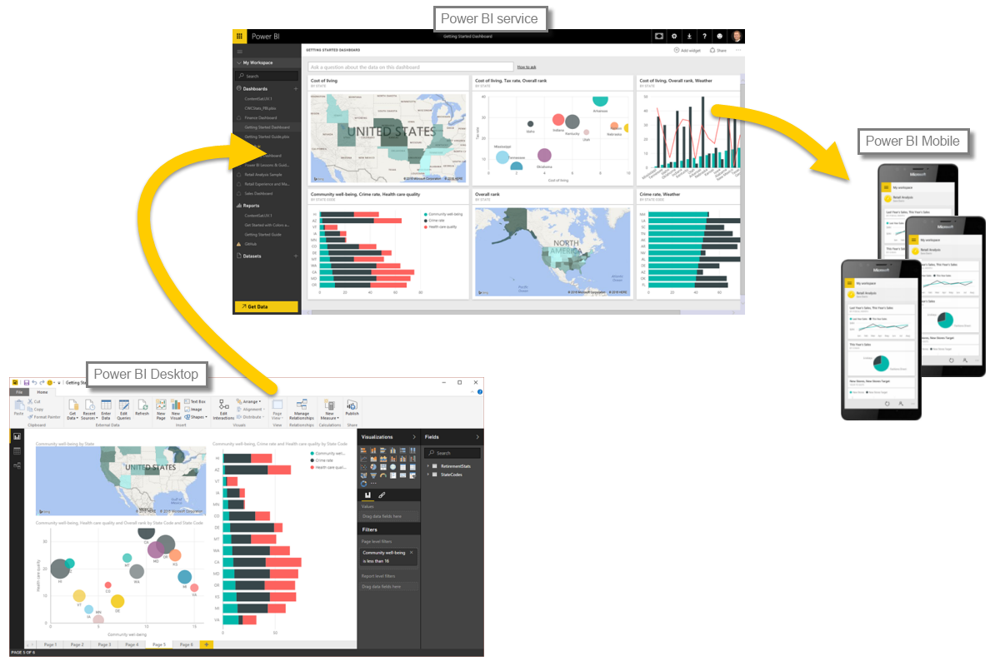

Teď, když znáte základy práce s Microsoft Power BI, se podíváme na některé praktické příklady a vydáme se na prohlídku s průvodcem.Now that you know the basics of Microsoft Power BI, let's jump into some hands-on experiences and a guided tour. 

Během učení, co všechno můžete s Power BI dělat, mějte na paměti, že všechny tyto aktivity a všechny analýzy prováděné s Power BI obvykle sledují obecný postup.As you learn about all the things that can be done with Power BI, keep in mind that all these activities, and all the analysis that's done with Power BI, generally follow a common flow. **Obecný postup** aktivity v Power BI vypadá takto:The **common flow** of activity in Power BI looks like this:

1. Přenesení dat do Power BI Desktopu a vytvoření sestavyBring data into Power BI Desktop, and create a report.
2. Publikování do služby Power BI, kde můžete vytvářet nové vizualizace nebo sestavovat řídicí panelyPublish to the Power BI service, where you can create new visualizations or build dashboards.
3. Sdílení řídicích panelů s ostatními uživateli, zejména s těmi, kteří jsou na cestáchShare dashboards with others, especially people who are on the go.
4. Zobrazení a interakce se sdílenými řídicími panely a sestavami v aplikacích Power BI MobileView and interact with shared dashboards and reports in Power BI Mobile apps.

Jak už bylo uvedeno dříve, můžete strávit všechen svůj čas ve **službě Power BI** zobrazováním vizuálů a sestav vytvořených jinými uživateli.As mentioned earlier, you might spend all your time in the **Power BI service**, viewing visuals and reports that have been created by others. A to je zcela v pořádku.And that's just fine. Někdo jiný z vašeho týmu může strávit veškerý svůj čas v **Power BI Desktopu**, což je také v pořádku.Someone else on your team might spend all her time in **Power BI Desktop**, which is fine too. Abyste lépe pochopili celé spojité prostředí Power BI a jeho přínosy, ukážeme vám všechno.To help you understand the full continuum of Power BI and what it can do, we'll show you all of it. Potom se můžete rozhodnout, jak to co nejlépe využít.Then you can decide how to use it to your best advantage.

Pojďme tedy začít s prohlídkou.So, let's jump in and step through the experience. Nejdříve je potřeba se naučit, co tvoří základní stavební bloky Power BI, které budou poskytovat pevný základ pro seznamování se s tím, jak Power BI převádí data na poutavé sestavy a vizuály.The first order of business is to learn the basic building blocks of Power BI, which will provide a solid basis for learning how Power BI turns data into cool reports and visuals.

