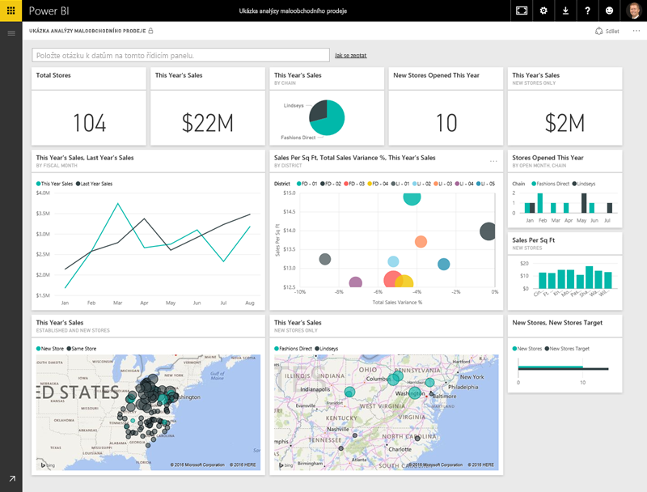

Všechno, co v Microsoft Power BI děláte, se dá rozdělit do několika základních **stavebních bloků**.Everything you do in Microsoft Power BI can be broken down into a few basic **building blocks**. Až těmto stavebním blokům porozumíte, můžete je začít rozšiřovat a vytvářet propracované a komplexní sestavy.After you understand these building blocks, you can expand on each of them and begin creating elaborate and complex reports. I zdánlivě složité věci se nakonec skládají ze základních stavebních bloků.After all, even seemingly complex things are built from basic building blocks. Třeba budovy se staví ze dřeva, oceli, betonu a skla, auta se vyrábějí z kovu, látky a gumy.For example, buildings are created with wood, steel, concrete and glass, and cars are made from metal, fabric, and rubber. Auta i budovy samozřejmě také můžou být jednoduché nebo naopak propracované – závisí to na uspořádání jejich základních stavebních bloků.Of course, buildings and cars can also be basic or elaborate, depending on how those basic building blocks are arranged.

Pojďme se na tyto základní stavební bloky podívat, probereme několik jednoduchých věcí, které s nimi můžete vytvářet, a pak si ukážeme, jak složité věci je také možné vytvořit.Let's take a look at these basic building blocks, discuss some simple things that can be built with them, and then get a glimpse into how complex things can also be created.

Toto jsou základní stavební bloky v Power BI:Here are the basic building blocks in Power BI:

* VizualizaceVisualizations
* Datové sadyDatasets
* SestavyReports
* Řídicí panelyDashboards
* DlaždiceTiles

## VizualizaceVisualizations
**Vizualizace** (někdy se označuje také jako **vizuál**) je vizuální reprezentace dat, například diagram, barevná mapa nebo další zajímavé věci, které můžete vytvořit za účelem vizuální reprezentace vašich dat.A **visualization** (sometimes also referred to as a **visual**) is a visual representation of data, like a chart, a color-coded map, or other interesting things you can create to represent your data visually. Power BI nabízí nejrůznější typy vizualizací a jejich počet se neustále rozrůstá.Power BI has all sorts of visualization types, and more are coming all the time. Následující obrázek ukazuje kolekci různých vizualizací vytvořených ve službě Power BI.The following image shows a collection of different visualizations that were created in the Power BI service.

Vizualizace můžou být jednoduché (například jedno číslo, které představuje něco důležitého) nebo můžou být vizuálně komplexní (například barevná mapa s přechody, která znázorňuje názory voličů na určitý sociální problém nebo otázku).Visualizations can be simple, like a single number that represents something significant, or they can be visually complex, like a gradient-colored map that shows voter sentiment about a certain social issue or concern. Cílem vizuálu je představit data způsobem, který poskytuje kontext a přehled, které by pravděpodobně bylo obtížné vyvodit z obyčejné tabulky čísel nebo textu.The goal of a visual is to present data in a way that provides context and insights, both of which would probably be difficult to discern from a raw table of numbers or text.

## Datové sadyDatasets
**Datová sada** je kolekce dat, která Power BI používá k vytváření vizualizací.A **dataset** is a collection of data that Power BI uses to create its visualizations.

Můžete mít jednoduchou datovou sadu založenou na jediné tabulce ze sešitu Microsoft Excelu, jako je znázorněno na následujícím obrázku.You can have a simple dataset that's based on a single table from a Microsoft Excel workbook, similar to what's shown in the following image.

**Datové sady** můžou být také kombinací mnoha různých zdrojů, jejichž filtrováním a kombinováním můžete vytvářet jedinečné kolekce dat (datové sady) pro použití v Power BI.**Datasets** can also be a combination of many different sources, which you can filter and combine to provide a unique collection of data (a dataset) for use in Power BI.

Datovou sadu můžete vytvořit třeba ze tří polí databáze, jedné webové tabulky, excelové tabulky a online výsledků e-mailové marketingové kampaně.For example, you can create a dataset from three database fields, one website table, an Excel table, and online results of an email marketing campaign. Taková jedinečná kombinace se stále považuje za **datovou sadu**, i když je sestavená z mnoha různých zdrojů.That unique combination is still considered a single **dataset**, even though it was pulled together from many different sources.

Když budete data před tím, než je přivedete do Power BI, filtrovat, umožní vám to zaměřit se na data, na kterých vám záleží.Filtering data before bringing it into Power BI lets you focus on the data that matters to you. Databázi kontaktů můžete třeba filtrovat tak, aby do datové sady byli zahrnutí jenom zákazníci, kteří obdrželi e-maily z marketingové kampaně.For example, you can filter your contact database so that only customers who received emails from the marketing campaign are included in the dataset. Na základě této podmnožiny (vyfiltrované kolekce) zákazníků, kteří byli součástí kampaně, pak můžete vytvářet vizuály.You can then create visuals based on that subset (the filtered collection) of customers who were included in the campaign. Filtrování vám umožní soustředit data – i úsilí.Filtering helps you focus your data—and your efforts.

Zcela zásadní součástí Power BI je velké množství **konektorů** dat, které obsahuje.An important and enabling part of Power BI is the multitude of data **connectors** that are included. Požadovaná data můžou být v Excelu nebo databázi Microsoft SQL Serveru, v Azure nebo Oracle nebo ve službě jako Facebook, Salesforce nebo MailChimp. Power BI obsahuje integrované konektory dat, které vám umožní snadno se k těmto datům připojit, v případě potřeby je filtrovat a přivést je do vaší datové sady.Whether the data you want is in Excel or a Microsoft SQL Server database, in Azure or Oracle, or in a service like Facebook, Salesforce, or MailChimp, Power BI has built-in data connectors that let you easily connect to that data, filter it if necessary, and bring it into your dataset.

Až budete datovou sadu mít, můžete začít vytvářet vizualizace, které různými způsoby zobrazí její různé části, a získávat přehledy založené na tom, co vidíte.After you have a dataset, you can begin creating visualizations that show different portions of it in different ways, and gain insights based on what you see. Tady přicházejí na řadu sestavy.That's where reports come in.

## SestavyReports
**Sestava** v Power BI je kolekce vizualizací, které se zobrazují společně na jedné nebo několika stránkách.In Power BI, a **report** is a collection of visualizations that appear together on one or more pages. Stejně jako jakákoliv jiná sestava, kterou byste mohli vytvořit k prezentaci prodejů nebo jako úkol do školy, je sestava v Power BI kolekce položek, které spolu vzájemně souvisí.Just like any other report you might create for a sales presentation or write for a school assignment, a report in Power BI is a collection of items that are related to each other. Následující obrázek ukazuje **sestavu** v Power BI Desktopu – v tomto případě se jedná o pátou stránku šestistránkové sestavy.The following image shows a **report** in Power BI Desktop—in this case, it's the fifth page in a six-page report. Sestavy můžete vytvářet také ve službě Power BI.You can also create reports in the Power BI service.

Sestavy umožňují vytvářet řadu vizualizací (v případě potřeby i na několika stránkách) a uspořádat je tak, jak je pro váš případ nejvhodnější.Reports let you create many visualizations, on multiple pages if necessary, and let you arrange those visualization in whatever way best tells your story.

Můžete mít sestavu čtvrtletních prodejů, nárůstu produktů v určitém segmentu trhu nebo tras migrace ledních medvědů.You might have a report about quarterly sales, product growth in a particular segment, or migration patterns of polar bears. Ať je vaše téma jakékoli, sestavy vám umožní shromáždit a uspořádat vizualizace na jedné stránce (nebo na více stránkách).Whatever your subject, reports let you gather and organize your visualizations onto one page (or more).

## Řídicí panelyDashboards
Až budete připraveni sdílet jednu stránku sestavy nebo kolekci vizualizací, vytvoříte **řídicí panel**.When you're ready to share a single page from a report, or a collection of visualizations, you create a **dashboard**. Podobně jako přístrojová deska auta je **řídicí panel** Power BI kolekce vizuálů z jedné stránky, kterou můžete sdílet s ostatními.Much like the dashboard in a car, a Power BI **dashboard** is a collection of visuals from a single page that you can share with others. Často se jedná o vybranou skupinu vizuálů, které poskytují rychlý přehled o datech nebo o příběhu, který chcete prezentovat.Often, it's a selected group of visuals that provide quick insight into the data or story you're trying to present.

Řídicí panel se musí vejít na jednu stránku, která se často označuje jako plátno (plátno je prázdné pozadí v Power BI Desktopu nebo ve službě Power BI, kam umísťujete vizualizace).A dashboard must fit on a single page, often called a canvas (the canvas is the blank backdrop in Power BI Desktop or the service, where you put visualizations). Můžete si ho představit jako malířské plátno – pracovní prostor, kde můžete vytvářet, kombinovat a přepracovávat zajímavé a poutavé vizuály.Think of it like the canvas that an artist or painter uses—a workspace where you create, combine, and rework interesting and compelling visuals.
Řídicí panely můžete sdílet s ostatními uživateli nebo skupinami uživatelů, kteří pak můžou s vašimi řídicími panely pracovat ve službě Power BI nebo na mobilním zařízení.You can share dashboards with other users or groups, who can then interact with your dashboards when they're in the Power BI service or on their mobile device.

## DlaždiceTiles
**Dlaždice** v Power BI je jedna vizualizace v sestavě nebo na řídicím panelu.In Power BI, a **tile** is a single visualization on a report or a dashboard. Je to obdélníkové pole, které obsahuje jednotlivý vizuál.It's the rectangular box that holds an individual visual. Na následujícím obrázku vidíte jednu dlaždici (zvýrazněnou rámečkem), kolem které jsou také další dlaždice.In the following image, you see one tile (highlighted by a bright box), which is also surrounded by other tiles.

Při *vytváření* sestavy nebo řídicího panelu v Power BI můžete dlaždice libovolně přesouvat nebo uspořádávat, jak potřebujete.When you're *creating* a report or a dashboard in Power BI, you can move or arrange tiles however you want. Můžete je zvětšovat, měnit jejich výšku nebo šířku a připojovat je k jiným dlaždicím.You can make them bigger, change their height or width, and snuggle them up to other tiles.

Když řídicí panel nebo sestavu *prohlížíte* neboli *využíváte* – to znamená, že nejste tvůrce ani vlastník, ale sestavu nebo řídicí panel vám někdo nasdílel – můžete s řídicím panelem nebo se sestavou pracovat, ale nemůžete měnit velikost ani uspořádání dlaždic.When you're *viewing*, or *consuming*, a dashboard or report—which means you're not the creator or owner, but the report or dashboard has been shared with you—you can interact with it, but you can't change the size of the tiles or their arrangement.

## Teď všechno pohromaděAll together now
Toto jsou základy Power BI a stavebních bloků.Those are the basics of Power BI and its building blocks. Krátce si to zopakujme.Let's take a moment to review.

Power BI je kolekce služeb, aplikací a konektorů, které vám umožní připojit se k datům, ať jsou uložená kdekoli, v případě potřeby je filtrovat a pak je přenést do Power BI a tam z nich vytvářet poutavé vizualizace, které můžete sdílet s ostatními.Power BI is a collection of services, apps, and connectors that lets you connect to your data, wherever it happens to reside, filter it if necessary, and then bring it into Power BI to create compelling visualizations that you can share with others.

Když jste teď získali informace o několika základních stavebních blocích Power BI, mělo by být jasné, že můžete vytvářet datové sady, které *vám* dávají smysl, a vytvářet vizuálně poutavé sestavy, které vypráví váš příběh.Now that you've learned about the handful of basic building blocks of Power BI, it should be clear that you can create datasets that make sense *to you* and create visually compelling reports that tell your story. Příběhy vyprávěné s využitím Power BI nemusí být složité ani komplikované, a přitom můžou být poutavé.Stories told with Power BI don't have to be complex, or complicated, to be compelling.

Pro některé lidi bude neuvěřitelně hodnotným využitím Power BI, když v datové sadě použijí jedinou excelovou tabulku a pak budou se svým týmem sdílet řídicí panel.For some people, using a single Excel table in a dataset and then sharing a dashboard with their team will be an incredibly valuable way to use Power BI.

Pro ostatní uživatele bude přínos Power BI v tom, že budou moct v reálném čase používat tabulky Azure SQL Data Warehouse a ty pak kombinovat s dalšími databázemi a zdroji v reálném čase a vytvářet si okamžité datové sady.For others, the value of Power BI will be in using real-time Azure SQL Data Warehouse tables that combine with other databases and real-time sources to build a moment-by-moment dataset.

Postup je u obou skupin stejný: vytvoření datových sad, sestavení poutavých vizuálů a jejich sdílení s ostatními.For both groups, the process is the same: create datasets, build compelling visuals, and share them with others. A u obou skupin je stejný i výsledek: využití neustále se zvětšujícího množství dat a jejich přeměna na užitečné přehledy.And the result is also the same for both groups: harness your ever-expanding world of data, and turn it into actionable insights.

Ať už vaše přehledy dat vyžadují jednoduché nebo složité datové sady, Power BI vám pomůže rychle začít, může se rozšiřovat podle vašich potřeb a poskytovat takovou komplexnost, jakou vaše data potřebují.Whether your data insights require straightforward or complex datasets, Power BI helps you get started quickly and can expand with your needs to be as complex as your world of data requires. A protože je Power BI produktem Microsoftu, můžete se spolehnout na jeho robustnost, rozšiřitelnost, podporu Microsoft Office a připravenost pro velké organizace.And because Power BI is a Microsoft product, you can count on it being robust, extensible, Microsoft Office–friendly, and enterprise-ready.

Pojďme se podívat, jak to funguje.Now let's see how this works. Začneme rychlým přehledem služby Power BI.We'll start by taking a quick look at the Power BI service.

