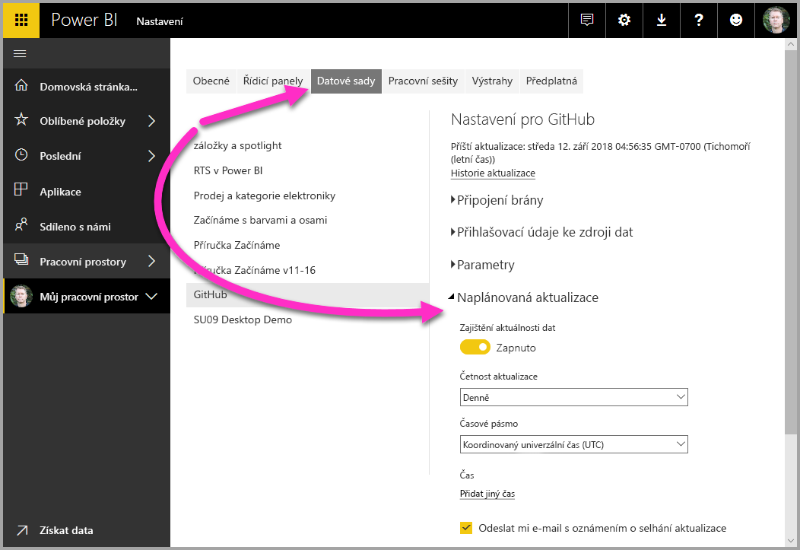

Jak jsme se dozvěděli v předchozí lekci, obecný postup práce v Microsoft Power BI zahrnuje vytvoření sestavy v Power BI Desktopu, její publikování do služby Power BI a následné sdílení s ostatními, aby si ji mohli v mobilní aplikaci nebo ve službě zobrazit.As we learned in the previous unit, the common flow of work in Microsoft Power BI is to create a report in Power BI Desktop, publish it to the Power BI service, and then share it with others, so that they can view it in the service or on a mobile app.

Ale protože někteří uživatelé ve službě Power BI začínají, tak se na to rychle podíváme a naučíme se snadný a oblíbený způsob rychlého vytváření vizuálů v Power BI: *aplikace*.But because some people begin in the Power BI service, let's take a quick look at that first, and learn about an easy and popular way to quickly create visuals in Power BI: *apps*.

**Aplikace** je kolekce předem nakonfigurovaných a připravených vizuálů a sestav, které jsou sdílené s celou organizací.An **app** is a collection of preset, ready-made visuals and reports that are shared with an entire organization. Použití aplikace se podobá ohřátí večeře v mikrovlnce nebo objednání jídla z rychlého občerstvení: stačí jenom stisknout pár tlačítek nebo napsat pár komentářů a rychle se vám nabídne řada chodů navržených tak, aby spolu šly dohromady, to vše v úhledném balíčku připravenému ke konzumaci.Using an app is like microwaving a TV dinner or ordering a fast-food value meal: you just have to press a few buttons or make a few comments, and you're quickly served a collection of entrees designed to go together, all presented in a tidy, ready-to-consume package.

Pojďme se rychle podívat na aplikace, službu a na to, jak to funguje.So, let's take a quick look at apps, the service, and how it works. V nadcházejících modulech se o aplikacích (a službě) dozvíme více podrobností, ale tohle můžete brát jako ochutnávku.We'll go into more detail about apps (and the service) in upcoming modules, but you can think of this as a taste to whet your appetite.

## Vytváření připravených řídicích panelů s cloudovými službamiCreate out-of-box dashboards with cloud services
S Power BI je připojování k datům snadné.With Power BI, connecting to data is easy. Ve službě Power BI můžete jednoduše v levém dolním rohu domovské obrazovky vybrat tlačítko **Získat data**.From the Power BI service, you can just select the **Get Data** button in the lower-left corner of the home page.

*Plátno* (oblast uprostřed služby Power BI) vám ukazuje dostupné zdroje dat ve službě Power BI.The *canvas* (the area in the center of the Power BI service) shows you the available sources of data in the Power BI service. Kromě běžných zdrojů dat, jako jsou soubory Microsoft Excelu, databáze nebo data Microsoft Azure, se může Power BI stejně snadno připojit k celé řadě **softwarových služeb** (nazývaných také poskytovatelé SaaS nebo cloudové služby): Salesforce, Facebook, Google Analytics a další.In addition to common data sources like Microsoft Excel files, databases, or Microsoft Azure data, Power BI can just as easily connect to a whole assortment of **software services** (also called SaaS providers or cloud services): Salesforce, Facebook, Google Analytics, and more.

Pro tyto softwarové služby **služba Power BI** poskytuje kolekci připravených vizuálů, předem uspořádaných v řídicích panelech a sestavách pro vaši organizaci.For these software services, the **Power BI service** provides a collection of ready-made visuals that are pre-arranged on dashboards and reports for your organization. Tato kolekce vizuálů se nazývá **aplikace**.This collection of visuals is called an **app**. Aplikace vám pomůžou rychle začít pracovat s daty a řídicími panely, které pro vás vaše organizace vytvořila.Apps get you up and running quickly, with data and dashboards that your organization has created for you. Pokud například používáte aplikaci GitHub, Power BI se připojí k vašemu účtu GitHub (po zadání přihlašovacích údajů) a pak naplní předdefinovanou kolekci vizuálů a řídicích panelů v Power BI.For example, when you use the GitHub app, Power BI connects to your GitHub account (after you provide your credentials) and then populates a predefined collection of visuals and dashboards in Power BI.

Existují aplikace pro celou řadu různých online služeb.There are apps for all sorts of online services. Následující obrázek ukazuje stránku aplikací, které jsou k dispozici pro různé online služby (v abecedním pořadí).The following image shows a page of apps that are available for different online services, in alphabetical order. Tato stránka se zobrazí po výběru tlačítka **Získat** v poli **Služby** (viz předchozí obrázek).This page is shown when you select the **Get** button in the **Services** box (shown in the previous image). Jak je vidět na následujícím obrázku, na výběr je celá řada aplikací.As you can see from the following image, there are many apps to choose from.

Pro naše účely zvolíme **GitHub**.For our purposes, we'll choose **GitHub**. GitHub je aplikace pro online správu zdrojového kódu.GitHub is an application for online source control. Když vyberete tlačítko **Get it now** (Získat) v poli aplikace GitHub, zobrazí se dialogové okno **Connect to GitHub** (Připojit ke GitHubu).When you select the **Get it now** button in the box for the GitHub app, the **Connect to GitHub** dialog box appears. Upozorňujeme, že GitHub nepodporuje Internet Explorer. Použijte jiný prohlížeč.Note that Github does not support Internet Explorer, so make sure you are working in another browser.

Po zadání informací a přihlašovacích údajů pro aplikaci GitHub se začne aplikace instalovat.After you enter the information and credentials for the GitHub app, installation of the app begins.

Po načtení dat se zobrazí předdefinovaný řídicí panel aplikace GitHub.After the data is loaded, the predefined GitHub app dashboard appears.

Kromě **řídicího panelu** aplikace je k dispozici **sestava**, která se vygenerovala (jako součást aplikace GitHub) a která byla použita k vytvoření řídicího panelu, spolu s **datovou sadou** (kolekce dat získaná z GitHubu), která se vytvořila při importu dat a která se použila k vytvoření sestavy GitHub.In addition to the app **dashboard**, the **report** that was generated (as part of the GitHub app) and used to create the dashboard is available, as is the **dataset** (the collection of data pulled from GitHub) that was created during data import and used to create the GitHub report.

Na řídicím panelu můžete vybrat kterýkoli z vizuálů a pracovat s nimi.On the dashboard, you can select any of the visuals and interact with them. Když to uděláte, zareagují všechny ostatní vizuály na stránce.As you do so, all the other visuals on the page will respond. Když se například vybere panel **Květen 2018** ve vizuálu **Žádosti o přijetí změn (měsíčně)**, ostatní vizuály na stránce se upraví tak, aby odrážely tento výběr.For example, when the **May 2018** bar is selected in the **Pull Requests (by month)** visual, the other visuals on the page adjust to reflect that selection.

## Aktualizace dat ve službě Power BIUpdate data in the Power BI service
Můžete se také rozhodnout **aktualizovat** datové sady pro aplikaci nebo jiná data, která v Power BI používáte.You can also choose to **update** the dataset for an app, or other data that you use in Power BI. Pro nastavení aktualizace vyberte ikonu plán aktualizace, aby se datová sada aktualizovala, a pak použijte nabídku, která se zobrazí.To set update settings, select the schedule update icon for the dataset to update, and then use the menu that appears. Datovou sadu také můžete aktualizovat okamžitě výběrem ikony aktualizace (kroužek s šipkou) vedle ikony plánu aktualizace.You can also select the update icon (the circle with an arrow) next to the schedule update icon to update the dataset immediately.

Na stránce **Nastavení**, která se zobrazí, bude vybrána karta **Datové sady**.The **Datasets** tab is selected on the **Settings** page that appears. V pravém podokně vyberte šipku vedle části **Naplánovaná aktualizace**, aby se rozbalila.In the right pane, select the arrow next to **Scheduled refresh** to expand that section. Na plátně se zobrazí dialogové okno **Nastavení**, kde můžete podle potřeby upravit nastavení aktualizace.The **Settings** dialog box appears on the canvas, letting you set the update settings that meet your needs.

To pro náš rychlý přehled služby Power BI stačí.That's enough for our quick look at the Power BI service. Existuje mnoho dalších věcí, které můžete se službou dělat, a ty si probereme později v tomto a následujících modulech.There are many more things you can do with the service, and we'll cover these later in this module and in upcoming modules. Nezapomeňte také, že existuje mnoho různých typů dat, ke kterým se můžete připojit, a mnoho druhů aplikací, přičemž jejich počet neustále roste.Also, remember that there are many types of data you can connect to, and all sorts of apps, with more of both coming all the time.

