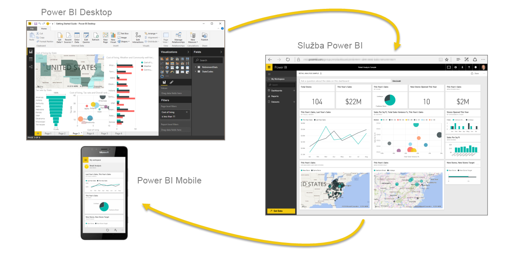

Pojďme si rychle zopakovat, co jste se v tomto modulu dozvěděli.Let's do a quick review of what we covered in this module.

**Microsoft Power BI** je kolekce softwarových služeb, aplikací a konektorů, které spolupracují, aby přeměnily vaše data na interaktivní přehledy.**Microsoft Power BI** is a collection of software services, apps, and connectors that work together to turn your data into interactive insights. Můžete použít data z jednotlivých základních zdrojů, jako je například sešit Microsoft Excelu, nebo načítat data z několika databází a cloudových zdrojů, abyste vytvořili komplexní datové sady a sestavy.You can use data from single basic sources, like a Microsoft Excel workbook, or pull in data from multiple databases and cloud sources to create complex datasets and reports. Řešení Power BI může být tak jednoduché, jak chcete, nebo tak připravené pro velké organizace, jak to složité globální podnikání vyžaduje.Power BI can be as straightforward as you want or as enterprise-ready as your complex global business requires.

Power BI tvoří tři hlavní prvky – **Power BI Desktop**, **služba Power BI** a **Power BI Mobile**, které spolupracují, abyste mohli vytvářet, zpracovávat, sdílet a využívat data, jak potřebujete.Power BI consists of three main elements—**Power BI Desktop**, the **Power BI service**, and **Power BI Mobile**—which work together to let you create, interact with, share, and consume your data the way you want.

Také jsme probírali základní stavební bloky v Power BI:We also discussed the basic building blocks in Power BI:

* **Vizualizace** – vizuální znázornění dat, kterým se také říká vizuály**Visualizations** – A visual representation of data, sometimes just called visuals
* **Datové sady** – kolekce dat, které Power BI používá k vytváření vizualizací**Datasets** – A collection of data that Power BI uses to create visualizations
* **Sestavy** – kolekce vizuálů z datové sady, které pokrývají jednu nebo více stránek**Reports** – A collection of visuals from a dataset, spanning one or more pages
* **Řídicí panely** – jednostránková kolekce vizuálů, která je vytvořená ze sestavy**Dashboards** – A single-page collection of visuals built from a report
* **Dlaždice** – jedna vizualizace nacházející se v sestavě nebo řídicím panelu**Tiles** – A single visualization on a report or dashboard

Ve **službě Power BI** jsme nainstalovali **aplikaci** jen několika málo kliknutími.In the **Power BI service**, we installed an **app** in just a few clicks. Tato **aplikace** – předem připravená kolekce vizuálů a sestav – umožňuje snadno se připojit k **softwarové službě**, aby se aplikace naplnila a data oživila.That **app**, a ready-made collection of visuals and reports, let us easily connect to a **software service** to populate the app and bring that data to life.

Nakonec jsme sestavili **plán aktualizace** pro naše data, abychom měli jistotu, že když se ke službě Power BI vrátíme, budou data aktuální.Finally, we set up a **refresh schedule** for our data, so that we know the data will be fresh when we go back to the Power BI service.

## Další krokyNext steps
**Blahopřejeme!****Congratulations!** Dokončili jste první modul **studijního programu** pro Power BI.You've finished the first module of the **learning path** for Power BI. Teď máte pevné základy znalostí a můžete přejít k dalšímu modulu, který vás provede kroky k vytvoření první sestavy.You now have a firm foundation of knowledge for when you move on to the next module, which walks through the steps to create your first report. 

Už jsme to zmínili, ale je to lepší zopakovat: V tomto studijním programu se utvářejí vaše znalosti sledováním obecného postupu práce v Power BI:We mentioned this before, but it's worth restating: this learning path builds your knowledge by following the common flow of work in Power BI:

* Přenesení dat do **Power BI Desktopu** a vytvoření sestavyBring data into **Power BI Desktop**, and create a report.
* **Publikování** do služby Power BI, kde se vytvářejí nové vizualizace nebo sestavují řídicí panely**Publish** to the Power BI service, where you create new visualizations or build dashboards.
* **Sdílení** řídicích panelů s ostatními uživateli, zejména s těmi, kteří jsou na cestách**Share** your dashboards with others, especially people who are on the go.
* Zobrazení a interakce se sdílenými řídicími panely a sestavami v aplikacích **Power BI Mobile**View and interact with shared dashboards and reports in **Power BI Mobile** apps.

Nemusíte dělat všechno sami – někteří uživatelé budou pouze prohlížet řídicí panely, které vytvořil někdo jiný, a budou pouze využívat službu.You might not do all that work yourself—some people will only view dashboards that were created by someone else, and they'll just use the service. To je v pořádku a brzy budeme mít speciální modul, ve kterém si ukážeme, jak lze snadno procházet **službu Power BI** a používat ji k zobrazování sestav a aplikací a také k práci s nimi.That's fine, and we'll soon have a module dedicated to showing how you can easily navigate and use the **Power BI service** to view and interact with reports and apps.

Následující modul je ale věnovaný postupu práce v Power BI a ukážeme si v něm, jak vytvořit sestavu a tuto sestavu publikovat ve službě Power BI.But the next module follows the flow of work in Power BI, showing you how to create a report and publish it to the Power BI service. Dozvíte se, jak se tyto sestavy a řídicí panely vytvářejí a jak se propojují s daty.You'll learn how those reports and dashboards are created and how they connected to the data. Můžete si dokonce vytvořit vlastní sestavu nebo řídicí panel.You might even decide to create a report or dashboard of your own.

Na shledanou v dalším modulu!See you in the next module!

