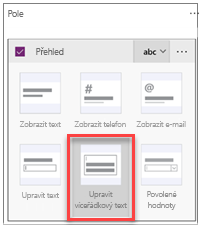

V předchozí lekci jste vygenerovali aplikaci Flooring Estimates a začali zkoumat její výchozí návrh.In a previous unit, you generated the Flooring Estimates app and started to explore its default design. Aplikace, které Microsoft PowerApps vygeneruje, můžete hned začít používat, ale často si asi také budete chtít vygenerovanou aplikaci přizpůsobit podle svých potřeb.Apps that Microsoft PowerApps generates are useful out of the box, but you'll often want to customize a generated app to suit your needs.

V této jednotce si projdeme základní změny na jednotlivých obrazovkách v aplikaci.In this unit, we'll walk you through some basic changes for each screen in the app. Aplikace si můžete přizpůsobovat mnoha různými způsoby, ale nejlepší postup, jak se to naučit, je vzít nějakou vygenerovanou aplikaci a provést běžné úpravy.You can do a lot more to customize an app, but the best way to start learning is to take any generated app and make common customizations.

## Obrazovka pro procházeníBrowse screen
Začneme na obrazovce pro procházení.We'll start on the browse screen. Aplikace už pro každý produkt zobrazuje obrázek a nějaký text, ale rozložení by mohlo být lepší.The app already shows an image and some text for each product, but the layout could be better. Pojďme s tím něco udělat.Let's work on that.

1. V podokně **Obrazovky** na levé straně vyberte **BrowseGallery1**.In the **Screens** pane on the left, select **BrowseGallery1**.

    Rámeček výběru okolo galerie potvrdí vaši volbu.The selection box around the gallery confirms your choice.

    

1. V pravém podokně klikněte na odkaz u položky **Rozložení**. Otevře se podokno **Data**.In the right pane, open the **Data** pane by selecting the link next to **Layout**.

    

1. Vyberte jiné rozložení, například to, ve kterém se zobrazuje obrázek, název a titulek, ale ne text.Select a different layout, such as the one that shows the image, the title, and the subtitle but not the body.

    

1. V horní části galerie vyberte kategorii položky.Select the category of the item at the top of the gallery.

    

1. Na řádku vzorců změňte **ThisItem.Category** na **ThisItem.Name**.Change **ThisItem.Category** to **ThisItem.Name** in the formula bar.

1. Opakujte předchozí dva kroky, ale změňte druhý ovládací prvek **Popisek** tak, aby zobrazoval cenu jednotlivých položek.Repeat the previous two steps, but change the other **Label** control to show the price of each item.

    

Změna rozložení galerie a typů dat, která zobrazuje, je opravdu takto snadná.It's that easy to change the layout of a gallery and the types of data that it shows. A třeba zjistíte, že je to i zábava.And you might find that it's fun too!

## Obrazovka s podrobnostmiDetails screen

Na obrazovce s podrobnostmi chceme změnit pořadí polí.On the details screen, we want to change the order of the fields. Ovládací prvky na této obrazovce se liší od ovládacích prvků na obrazovce pro procházení, takže se i trochu liší postup pro jejich změnu.The controls on this screen differ from the controls on the browse screen, so the process for changing them is also a little different.

1. V podokně **Obrazovky** na levé straně vyberte **DetailScreen1** > **DetailForm1**.On the **Screens** pane on the left, select **DetailScreen1** > **DetailForm1**.

1. V pravém podokně vyberte text, který zobrazuje počet vybraných polí.In the right pane, select the text that shows the number of selected fields.

    

1. Přetáhněte pole **Name** v seznamu polí nahoru a pole **Image** dolů.Drag the **Name** field to the top of the list of fields, and drag the **Image** field to the bottom.

    

## Obrazovka pro úpravy nebo vytvořeníEdit/create screen

Nakonec chceme na obrazovce, kde uživatel upravuje a vytváří položky, usnadnit zadávání informací do textového pole.Finally, on the screen where your user edits and creates entries, we want to make it easier to enter information in a text box.

1. V podokně **Obrazovky** na levé straně vyberte **EditScreen1** > **EditForm1**.On the **Screens** pane on the left, select **EditScreen1** > **EditForm1**.

1. V pravém podokně vyberte text, který zobrazuje počet vybraných polí.In the right pane, select the text that shows the number of selected fields.

1. Vyberte rozevírací šipku pro seznam **Overview** a pak vyberte **Upravit víceřádkový text**.Select the drop-down arrow for the **Overview** list, and then select **Edit multi-line text**.

    Díky ovládacímu prvku pro víceřádkové úpravy půjde do tohoto pole snadněji zadat více než jenom pár slov.A multi-line edit control will make it easier to add more than a few words in this field.

    

Viděli jste, jak můžete pomocí několika jednoduchých kroků přispět ke zlepšení vzhledu a způsobu práce s aplikací.You've seen how a few basic steps can do a lot to improve the appearance and experience of using an app. V tomto modulu jsme se zaměřili na PowerApps Studio, které poskytuje mnoho možností pro přizpůsobení aplikací.In this unit, we focused on PowerApps Studio, which provides lots of options for customizing apps. V další lekci prozkoumáme podrobněji ovládací prvky v aplikaci.In the next unit, we'll explore the controls in the app in greater detail.