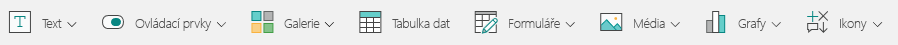
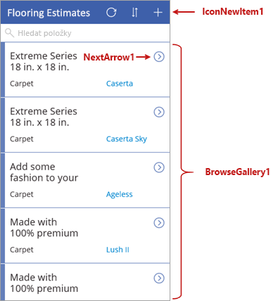
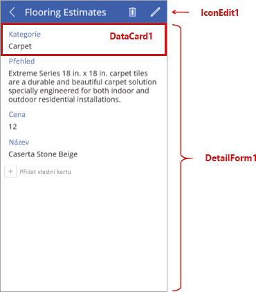
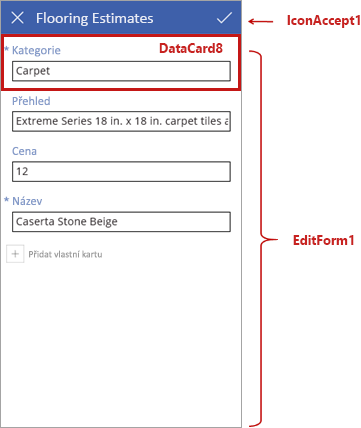

Teď se podrobněji podíváme na obrazovky a další ovládací prvky, které definují chování aplikací generovaných v Microsoft PowerApps Studiu.We're now going to look more closely at the screens and other controls that define the behavior of apps that Microsoft PowerApps generates. Nebudeme zabíhat do všech podrobností, ale když budete něco vědět o tom, jak tyto aplikace fungují, pomůže vám to při vytváření vlastních aplikací.We won't go through all the details, but knowing more about how these apps work will help you build your own apps.

## Princip ovládacích prvků v PowerAppsUnderstand controls in PowerApps
Ovládací prvek je prvek uživatelského rozhraní, který provádí nějakou akci nebo zobrazuje informace.A control is just a UI element that produces an action or shows information. Mnoho ovládacích prvků v PowerApps je úplně stejných jako ovládací prvky, které používáte v jiných aplikacích: popisky, vstupní textová pole, rozevírací seznamy, navigační prvky atd.Many of the controls in PowerApps are just like controls that you've used in other apps: labels, text-input boxes, drop-down lists, navigation elements, and so on.

Kromě těchto obvyklých ovládacích prvků má PowerApps také zvláštní ovládací prvky, které můžete najít na kartě **Vložit**.In addition to these typical controls, PowerApps has more specialized controls, which you can find on the **Insert** tab.

Tady jsou některé ovládací prvky, se kterými budou vaše aplikace zajímavější a působivější:Here are just a few of the controls that can add interest and impact to your apps:

- **Galerie:** Tyto ovládací prvky jsou kontejnery rozložení, ve kterých jsou sady ovládacích prvků zobrazujících data ze zdroje dat.**Galleries**: These controls are layout containers that hold a set of controls that show data from a data source.
- **Formuláře:** Tyto ovládací prvky zobrazují podrobnosti o vašich datech a umožňují vytvářet a upravovat položky.**Forms**: These controls show details about your data and let you create and edit items.
- **Média:** Těmito ovládacími prvky můžete přidat obrázky na pozadí, tlačítko fotoaparátu (aby uživatelé mohli v aplikaci fotit) nebo čtečku čárových kódů pro rychlé snímání identifikačních údajů.**Media**: These controls let you add background images and include a camera button (so that users can take pictures from the app) and a barcode reader for quickly capturing identification information.
- **Grafy:** Těmito ovládacími prvky můžete přidat grafy, aby uživatelé mohli na cestách rychle provádět analýzy.**Charts**: These controls let you add charts so that users can do instant analysis while they're on the road.

Pokud se chcete podívat na dostupné ovládací prvky, vyberte kartu **Vložit** a postupně vyberte různé možnosti.To see what's available, select the **Insert** tab, and then select each option in turn.

## Seznámení s obrazovkou pro procházeníExplore the browse screen

Každá obrazovka v aplikaci obsahuje několik ovládacích prvků, ale jeden ovládací prvek zabírá většinu prostoru na obrazovce.Each screen in the app has multiple controls, but one control takes up most of the screen space. První obrazovka v aplikaci je obrazovka pro procházení, která má ve výchozím nastavení název **BrowseScreen1**.The first screen in the app is the browse screen, which is named **BrowseScreen1** by default.

Tady jsou některé ovládací prvky, se kterými se seznámíte na obrazovce pro procházení:Here are some of the controls that you'll want to become familiar with for the browse screen:

- **BrowseGallery1:** Tento ovládací prvek zabírá většinu obrazovky a zobrazuje data z vašeho zdroje dat.**BrowseGallery1**: This control takes up most of the screen and shows data from your data source.
- **NextArrow1:** Po výběru tohoto ovládacího prvku se otevře obrazovka s podrobnostmi.**NextArrow1**: When this control is selected, it opens the details screen.
- **IconNewItem1:** Po výběru tohoto ovládacího prvku se otevře obrazovka pro úpravy nebo vytvoření položky.**IconNewItem1**: When this control is selected, it opens the edit/create screen.

## Prozkoumání obrazovky s podrobnostmiExplore the details screen
Další obrazovkou je obrazovka s podrobnostmi, která má ve výchozím nastavení název **DetailScreen1**.Next is the details screen, which is named **DetailScreen1** by default. Tady jsou některé z jejích ovládacích prvků:Here are some of its controls:

- **DetailForm1:** Tento ovládací prvek obsahuje další ovládací prvky.**DetailForm1**: This control contains other controls.
- **DataCard1:** Toto je ovládací prvek karty.**DataCard1**: This is a card control. V tomto případě zobrazuje kategorii podlah z tabulky Flooring Estimates, kterou jste mohli vidět v předchozí lekci.In this case, it shows a flooring category from the Flooring Estimates table, as seen in the previous unit.
- **IconEdit1:** Po výběru tohoto ovládacího prvku se otevře obrazovka pro úpravy/vytvoření položky, aby uživatel mohl upravit aktuální položku.**IconEdit1**: When this control is selected, it opens the edit/create screen so that the user can edit the current item.

## Prozkoumání obrazovky pro úpravy nebo vytvářeníExplore the edit/create screen
Třetí obrazovkou v aplikaci je **EditScreen1**.The third screen in the app is **EditScreen1**. Tady jsou některé z jejích ovládacích prvků:Here are some of its controls:

- **EditForm1**: Tento ovládací prvek obsahuje další ovládací prvky.**EditForm1**: This control contains other controls.
- **DataCard8:** Toto je další ovládací prvek karty, který zobrazuje kategorii podlah z tabulky Flooring Estimates, kterou jste mohli vidět v předchozí lekci.**DataCard8**: This is another card control that shows a flooring category from the Flooring Estimates table, as seen in the previous unit.
- **IconAccept1:** Po výběru tohoto ovládacího prvku se uloží změny provedené uživatelem.**IconAccept1**: When this control is selected, it saves the user's changes.

Doufáme, že jste v této lekci získali dobrou představu o ovládacích prvcích na jednotlivých obrazovkách této aplikace.Hopefully, this unit gives you a good idea of what controls are on each screen of this app.