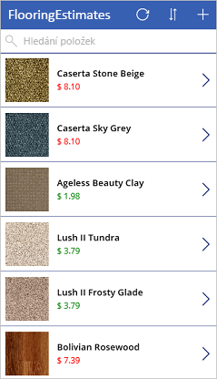
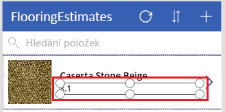
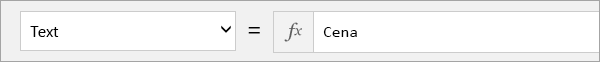
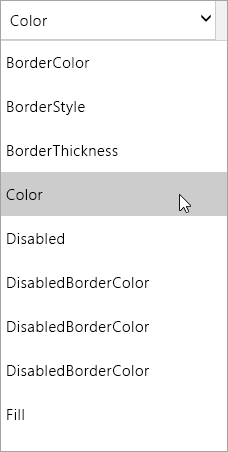

Při používání Microsoft PowerApps nemusíte psát složitý kód aplikace, jako to dělají tradiční vývojáři.When you use Microsoft PowerApps, you don't have to write complicated application code the way a traditional developer does. Přesto ale musíte v aplikaci vyjádřit logiku a ovládat její navigaci, filtrování, řazení a další funkce.But you still must express logic in an app and control its navigation, filtering, sorting, and other functionality. Tady přicházejí ke slovu vzorce.This is where formulas come in.

Pokud jste někdy používali funkce Microsoft Excelu, měl by vám být postup v PowerApps povědomý.If you've used Microsoft Excel functions, you should recognize the approach that PowerApps takes. V tomto modulu si ukážeme některé základní vzorce pro formátování textu a pak si projdeme tři vzorce, které služba PowerApps zahrnuje do vygenerované aplikace.In this unit, we'll show a couple of basic formulas for text formatting and then walk through three of the formulas that PowerApps includes when it generates an app. Uděláte si představu o tom, co vzorce dokážou, a zkusíte také napsat vlastní vzorec.You'll get a taste of what formulas can do and also start to write your own.

## Začínáme se vzorci a vlastnostmiGet started with formulas and properties
V předchozím modulu jsme prozkoumali ovládací prvky na všech třech obrazovkách aplikace, kterou vygenerovala služba PowerApps.In the previous unit, we explored controls in all three screens of an app that PowerApps generated. V tomto modulu naformátujeme cenu, kterou jsme dříve přidali na obrazovku pro procházení.In this section, we'll format the price that we added to the browse screen earlier.

Ve výchozím nastavení se cena zobrazuje jako obyčejné číslo bez symbolu měny.By default, the price appears as a plain number without a currency symbol. Řekněme, že chceme přidat znak dolaru a měnit barvu textu v závislosti na ceně položky (například použít červenou při ceně nad 5 USD, ale jinak zelenou).But suppose that we want to add a dollar sign and change the text color based on the item's cost (for example, red if it's more than $5 but green otherwise). Tento obrázek ukazuje očekávaný výsledek.This graphic shows the expected result.

Napřed naformátujeme měnu.Let's start with the currency formatting. PowerApps ve výchozím nastavení jenom zobrazí cenu každé položky.By default, PowerApps just pulls in a price value for each item. Popisek, který zobrazuje cenu, má tuto hodnotu nastavenou jako vlastnost **Text**.This value is set as the **Text** property of the label that shows the price.

1. Na obrazovce **BrowseScreen1** vyberte cenu první položky.In **BrowseScreen1**, select the price of the first item.

    

1. V rozevíracím seznamu vlastností vyberte **Text**.In the drop-down list of properties, select **Text**.

    

1. Pokud chcete přidat symbol měny amerického dolaru, nastavte vlastnost **Text** na tento vzorec:To add the currency symbol for US dollars, set the **Text** property to this formula:

    `Text(Price; "[$-en-US]$ ##.00")`

Funkce **Text** určuje způsob formátování čísla.The **Text** function specifies how to format the number. Vzorec se podobá excelové funkci, ale vzorce PowerApps místo buněk v sešitu odkazují na ovládací a další prvky aplikace.The formula is like an Excel function, but PowerApps formulas refer to controls and other app elements instead of cells in a workbook.

Pokud vyberete ovládací prvek a otevřete rozevírací seznam vlastností, zobrazí se seznam vlastností, které jsou pro daný prvek relevantní.If you select a control and then open the property drop-down list, you'll see a list of properties that are relevant to the control. Tady například vidíte část seznamu vlastností pro ovládací prvek **Popisek**.For example, here is a partial list of the properties for a **Label** control. Některé vlastnosti jsou relevantní pro velký počet ovládacích prvků, zatímco jiné jenom pro specifický ovládací prvek.Some properties are relevant across a wide range of controls, but others are relevant only for a specific control.

Pokud chcete nastavit podmíněné formátování barvy ceny, nastavte vlastnost **Barva** ovládacího prvku **Popisek** ceny na tento vzorec:To conditionally format the price's color, set the **Color** property of the price's **Label** control to this formula:

`If(Price > 5, Color.Red, Color.Green)`

## Vzorce zahrnuté do vygenerované aplikaceFormulas included in the generated app
Teď víte, jak používat vzorce ve spojení s vlastnostmi. Dále se podíváme na pár vzorců, které PowerApps používá v každé vygenerované aplikaci.Now that you understand how to use formulas in conjunction with properties, we'll look at a couple of formulas that PowerApps uses in every app it generates. Oba příklady jsou z obrazovky pro procházení a pracují s vlastností **OnSelect**.Both the examples are from the browse screen and work with the **OnSelect** property. Tato vlastnost definuje, co se stane, když uživatel vybere ovládací prvek (například kliknutím myší).This property defines what happens when a user selects a control (for example, by clicking it with a mouse).

* První vzorec je spojený s ovládacím prvkem **IconNewItem1**. Jde o .The first formula is associated with the **IconNewItem1** control . Výběrem tohoto ovládacího prvku se otevře obrazovka pro úpravy a vytváření, kde můžete vytvořit položku.You select this control to open the edit/create screen where you can create an item. Vzorec je:The formula is:

    `NewForm(EditForm1);Navigate(EditScreen1, ScreenTransition.None)`

    Vzorec vytvoří instanci formuláře pro úpravy na obrazovce pro úpravy a vytváření, aby uživatelé mohli vytvářet položky.The formula instantiates an edit form on the edit/create screen so that users can create an item. Hodnota `ScreenTransition.None` znamená, že mezi obrazovkami není žádný přechod (třeba prolnutí).A value of `ScreenTransition.None` means there's no transition, such as a fade, between screens.

* Druhý vzorec je přidružený k ovládacímu prvku **IconSortUpDown1**. Jde o .The second formula is associated with the **IconSortUpDown1** control . Výběrem tohoto ovládacího prvku se seřadí položky v galerii.You select this control to sort the items in the gallery. Vzorec je:The formula is:

    `UpdateContext({SortDescending1: !SortDescending1})`

    Vzorec pomocí funkce `UpdateContext` aktualizuje proměnnou s názvem `SortDescending1`.The formula uses `UpdateContext` to update a variable called `SortDescending1`. Hodnota proměnné se výběrem ovládacího prvku přepíná tam a zpět.The value of the variable switches back and forth as you select the control. Tato proměnná tak dává galerii na této obrazovce pokyn, jak seřadit položky.This variable tells the gallery on this screen how to sort the items.

V aplikaci je mnoho dalších vzorců. Věnujte proto chvilku tomu, že budete vybírat ovládací prvky a podíváte se, jaké vzorce jsou u různých vlastností nastavené.There are many other formulas in the app, so take some time to select controls and see what formulas are set for various properties.

Další informace o těchto a dalších funkcích najdete v [referenčních informacích ke vzorcům](https://docs.microsoft.com/powerapps/maker/canvas-apps/formula-reference).For more information about these and other functions, see the [formula reference](https://docs.microsoft.com/powerapps/maker/canvas-apps/formula-reference).

## Závěrečné shrnutíWrapping it all up
Tady náš průzkum vygenerované aplikace končí. Podívali jsme se do zákulisí obrazovek, ovládacích prvků, vlastností a vzorců, které zajišťují fungování aplikace a určují její charakter.This brings us to the end of our exploration of the generated app and our behind-the-scenes look at the screens, controls, properties, and formulas that give the app its capabilities—and even its personality. Pokud jste nás sledovali až sem, měli byste lépe rozumět tomu, jak funguje vygenerovaná aplikace.If you've followed along, you should have a better understanding of how a generated app works. Teď můžete získané vědomosti použít k vytvoření vlastní aplikace.You can now take this understanding and use it to create your own app.