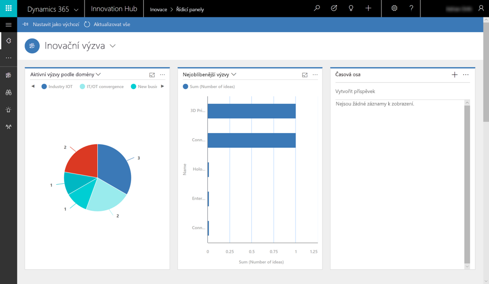
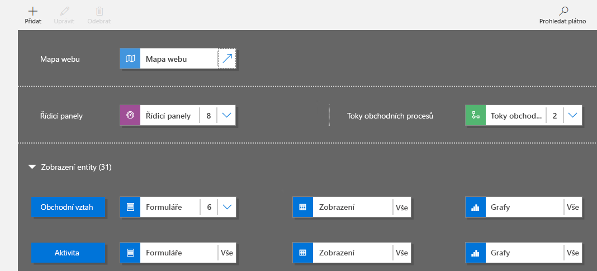

Návrh modelem řízené aplikace je přístup, který se zaměřuje na přidávání řídicích panelů, formulářů, zobrazení a grafů do aplikací.Model-driven app design is an approach that focuses on adding dashboards, forms, views, and charts to your apps. Bez kódu nebo jen s minimem kódu tak můžete sestavit aplikace, které jsou jednoduché nebo velmi složité.With no code, or very little, you can build apps that are simple or very complex.

V aplikacích plátna má návrhář úplnou kontrolu nad rozložením aplikace.In canvas apps, the designer has total control over the app layout. V modelem řízených aplikacích je na druhé straně rozložení určené přidanými komponentami.In model-driven apps, on the other hand, much of the layout is determined by the components you add. Důraz se klade hlavně na rychlé zobrazení obchodních dat a rozhodování, než na komplikovaný návrh aplikace.The emphasis is more on quickly viewing your business data and making decisions than on intricate app design.

Zde jsou některé z výhod modelem řízených aplikací:Here are some of the benefits of model-driven apps:

- Vytváření plnohodnotných prostředí zaměřených na komponentyCreate rich, component-focused environments.
- Není zapotřebí žádný (nebo téměř žádný) kód.No code (or very little) is needed. 
- Můžete vytvářet komplexní responzivní aplikace, které vypadají skvěle na různých zařízeních, a vyvíjet je v jediném prostředí.Create complex responsive apps that look great on a variety of devices while developing them in one environment.
- Možnosti návrhu se podobají tomu, co je k dispozici na platformě Microsoft Dynamics 365 Customer Engagement.Design capabilities are similar to what's available in the Microsoft Dynamics 365 Customer Engagement platform.
- Aplikaci je možné distribuovat jako řešení.Your app can be distributed as a solution.

## Přístup k vytváření modelem řízených aplikacíThe approach to making model-driven apps
Modelem řízené aplikace mají tři fáze návrhu:Model-driven apps have three design phases:

1. Modelování obchodních datModel your business data.
1. Definování obchodních procesůDefine your business processes.
1. Sestavení aplikaceBuild the app.

### Modelování obchodních datModel your business data
Modelem řízený návrh využívá metadaty řízenou architekturu, aby návrháři mohli aplikace přizpůsobit bez psaní kódu.Model-driven design uses metadata-driven architecture so that designers can customize apps without writing code. Při modelování obchodních dat určíte, jaká data bude aplikace potřebovat a jak tato data budou souviset s jinými daty.To model business data, you determine what data the app will need and how that data will relate to other data. Metadata jsou *data o datech* a definují strukturu dat uložených ve službě Common Data Service pro aplikace.Metadata means *data about data* and it defines the structure of the data stored in Common Data Service for Apps.

### Definování obchodních procesůDefine your business processes
Definování a prosazování konzistentních obchodních procesů je klíčovým aspektem návrhu modelem řízené aplikace.Defining and enforcing consistent business processes is a key aspect of model-driven app design. Konzistentní procesy pomáhají zajistit, že se uživatelé vaší aplikace můžou soustředit na práci a nemusí si pamatovat sadu ručně prováděných kroků.Consistent processes help ensure that your app users can focus on their work and not worry about having to remember to perform a set of manual steps. Procesy můžou být jednoduché nebo složité a v průběhu času se často mění.Processes can be simple or complex, and they often change over time.

### Sestavení aplikaceBuild the app
Po modelování dat a definování procesů sestavíte aplikaci výběrem a nastavením potřebných komponent v návrháři aplikací.After modeling data and defining processes, you build your app by selecting and setting up the components you need in the App Designer.

