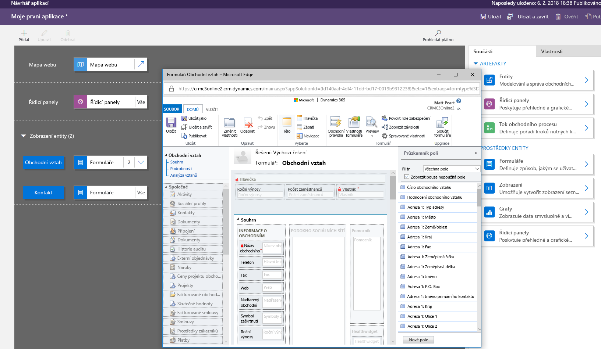
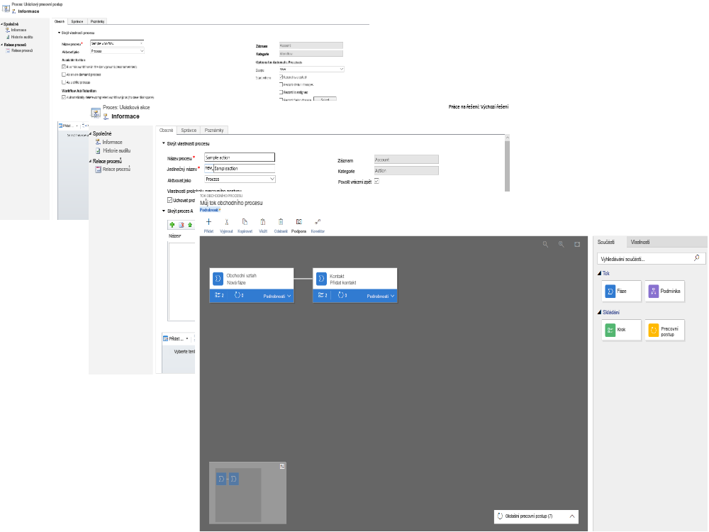
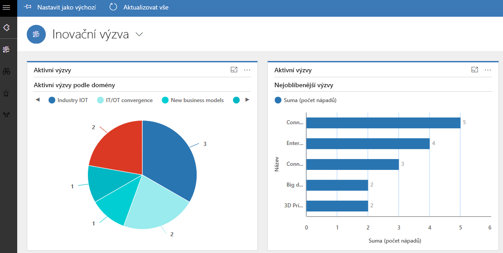
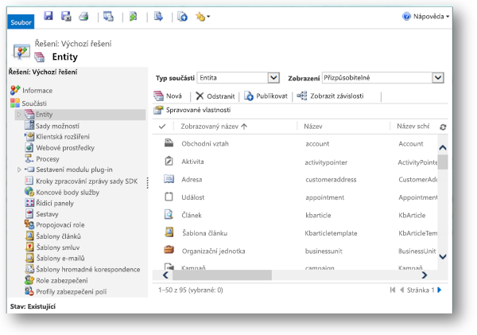

Modelem řízená aplikace sestává z několika komponent, které vyberete pomocí návrháře aplikací.A model-driven app consists of several components that you select by using the App Designer. Z komponent a jejich vlastností se stanou metadata.The components and component properties become the metadata. Pojďme se na tyto komponenty podívat podrobněji.Let's look more closely at these components.

## DataData
Datové komponenty určují, na jakých datech bude aplikace založena.The data components determine what data the app will be based upon.

| KomponentaComponent        | PopisDescription | NávrhářDesigner |
|------------------|-------------|----------|
| EntitaEntity           | Entity jsou položky s vlastnostmi, které sledujete. Mezi příklady patří kontakty a obchodní vztahy.Entities are items with properties that you track. Examples include contacts and accounts. K dispozici je spousta standardních entit.Many standard entities are available. Nesystémovou standardní entitu (nebo produkční entitu) můžete přizpůsobit.You can customize a non-system standard entity (or production entity). Můžete také vytvořit zbrusu novou vlastní entitu.You can also create a custom entity from scratch. | Návrhář entitEntity designer |
| PoleField            | Pole jsou vlastnosti přidružené k entitě, které pomáhají tuto entitu definovat.Fields are properties that are associated with an entity and help define that entity. Pole je definované datovým typem, který určuje typ dat, která je možné zadat nebo vybrat.A field is defined by a data type, which determines the type of data that can be entered or selected. K příkladům datových typů patří text, číslo, datum a čas, měna a vyhledávání (který vytváří relaci s jinou entitou).Examples of data types include text, number, date and time, currency, and lookup (which creates a relationship with another entity). Pole se zpravidla používají na formulářích, v zobrazeních a při hledání.Fields are typically used with forms, views, and searches. | Návrhář entitEntity designer |
| RelaceRelationship     | Relace definují, jak spolu entity navzájem souvisejí.Relationships define how entities can be related to each other. Existují relace typu 1:N, N:1 a N:N.There are 1:N (one-to-many), N:1 (many-to-one), and N:N (many-to-many) relationships. Například při přidání vyhledávacího pole k entitě se mezi těmito dvěma entitami vytvoří nová relace 1:N a umožní přidat toto vyhledávací pole do formuláře.For example, adding a lookup field to an entity creates a new 1:N relationship between the two entities and lets you add that lookup field to a form. | Návrhář entitEntity designer |
| Pole se sadou možnostíOption set field | Tento typ pole zobrazuje ovládací prvek, který uživateli umožňuje výběr z předdefinovaných možností.This type of field shows a control that lets the user select among predefined options. Každá možnost má číselnou hodnotu a popisek.Each option has a number value and a label. Pole se sadou možností mohou vyžadovat buď jednu, nebo několik hodnot.Option set fields can require either a single value or multiple values. | Návrhář entitEntity designer |

## Uživatelské rozhraníUser interface
Komponenty uživatelského rozhraní určují, jak uživatelé budou s aplikací pracovat.The user interface components determine how users will interact with the app.

| KomponentaComponent | PopisDescription | NávrhářDesigner |
|-----------|-------------|----------|
| AplikaceApp       | Aplikace určuje základy aplikace, jako jsou komponenty, vlastnosti, typ klienta a adresu URL.Apps determine the app fundamentals, like components, properties, the client type, and the URL. | Návrhář aplikacíApp designer |
| Mapa webuSite map  | Mapa webu určuje navigaci v rámci aplikace.A site map specifies the navigation for your app. | Návrhář mapy webuSite map designer |
| FormulářForm      | Formuláře obsahují sadu polí pro zadávání dat pro danou entitu.Forms include a set of data entry fields for a given entity. Tato sada polí pro zadávání dat odpovídá položkám, které vaše organizace u této entity sleduje.This set of data entry fields matches the items that your organization tracks for the entity. Jedním z příkladů je sada polí pro zadávání dat, kam uživatelé zadávají relevantní informace ke sledování předchozích objednávek zákazníků spolu s konkrétními požadovanými daty doobjednávek.One example is a set of data entry fields where users enter relevant information to track a customer's previous orders together with specific requested reorder dates. | Návrhář formulářůForm designer |
| ZobrazeníView      | Zobrazení definují, jak seznam záznamů určité entity vypadá v aplikaci.Views define how a list of records for a specific entity appears in your app. Zobrazení definuje zobrazené sloupce, šířku jednotlivých sloupců, chování při řazení a výchozí filtry.A view defines the columns shown, the width of each column, the sort behavior, and the default filters. | Návrhář zobrazeníView designer |

## LogikaLogic
Komponenty logiky určují, jaké obchodní procesy, pravidla a automatizaci bude aplikace obsahovat.The logic components determine what business processes, rules, and automation the app will have. Tvůrci Microsoft PowerApps používají návrhář, který je specifický pro typ procesu nebo pravidla.Microsoft PowerApps makers use a designer that's specific to the type of process or rule.

| Typ logikyType of logic         | PopisDescription | NávrhářDesigner |
|-----------------------|-------------|----------|
| Tok obchodního procesuBusiness process flow | Toky obchodního procesu provádějí uživatele standardním obchodním procesem.Business process flows walk users through a standard business process. Tok obchodního procesu použijte, pokud chcete, aby všichni obsluhovali žádosti služeb zákazníkům stejným způsobem.Use a business process flow if you want everyone to handle customer service requests the same way. Tok obchodního procesu můžete také použít, pokud vyžadujete, aby pracovníci před odesláním objednávky získali schválení faktury.Or you can use a business process flow to require staff to gain approval for an invoice before submitting an order. | Návrhář toků obchodního procesuBusiness process flow designer |
| Pracovní postupWorkflow              | Pracovní postupy automatizují obchodní procesy bez uživatelského rozhraní.Workflows automate business processes without a user interface. Návrháři používají pracovní postupy k zahájení automatizace, která nevyžaduje žádnou interakci s uživatelem.Designers use workflows to initiate automation that doesn't require any user interaction. | Návrhář pracovních postupůWorkflow designer |
| AkceActions               | Akce jsou typem procesu, který vám umožňuje přímo z pracovního postupu ručně vyvolávat akce včetně vlastních akcí.Actions are a type of process that lets you manually invoke actions, including custom actions, directly from a workflow. | Návrhář procesůProcess designer |
| Obchodní pravidloBusiness rule         | Obchodní pravidla uplatňují na formulář pravidla nebo logiku doporučení za účelem nastavení požadavků na pole, skrytí polí, ověření dat atd.Business rules apply rules or recommendation logic to a form to set field requirements, hide fields, validate data, and more. Návrháři aplikací používají jednoduché rozhraní k implementaci a údržbě rychle se měnících a často používaných pravidel.App designers use a simple interface to implement and maintain fast-changing and commonly used rules. | Návrhář obchodních pravidelBusiness rule designer |
| FlowFlow                  | Microsoft Flow je cloudová služba, která vám umožňuje vytvářet automatizované pracovní postupy mezi aplikacemi a službami za účelem získání oznámení, synchronizace souborů, shromažďování dat atd.Microsoft Flow is a cloud-based service that lets you create automated workflows between apps and services to get notifications, sync files, collect data, and more. | Microsoft FlowMicrosoft Flow |

## VizualizaceVisualization
Komponenty vizualizace určují, jaký typ dat a sestav bude aplikace zobrazovat.The visualization components determine what type of data and reporting the app will show.

| KomponentaComponent                   | PopisDescription | NávrhářDesigner |
|-----------------------------|-------------|----------|
|GrafChart                        | Grafy jsou individuální grafické vizualizace, které se mohou objevit v zobrazení nebo formuláři nebo které lze přidat na řídicí panel.Charts are individual graphical visualizations that can appear in a view or a form or that can be added to a dashboard. | Návrhář grafůChart designer |
|Řídicí panelDashboard                    | Řídicí panely zobrazují jeden nebo více grafických vizualizací, které poskytují přehled obchodních dat, na jehož základě mohou uživatelé jednat.Dashboards show one or more graphical visualizations that provide an overview of actionable business data. | Návrhář řídicích panelůDashboard designer |
| Vložená služba Microsoft Power BIEmbedded Microsoft Power BI | Power BI přidává do vaší aplikace vložené dlaždice a řídicí panely Power BI.Power BI adds embedded Power BI tiles and dashboards to your app. Power BI je cloudová služba, která poskytuje přehled business intelligence (BI).Power BI is a cloud-based service that provides business intelligence (BI) insight. | Kombinace návrháře grafů, návrháře řídicích panelů a Power BIA combination of chart designer, dashboard designer, and Power BI |

## Pokročilé modelem řízené aplikaceAdvanced model-driven apps
K tvorbě pokročilých modelem řízených aplikací se používá Průzkumník řešení.Solution Explorer is used to make advanced model-driven apps. Pomocí navigačního podokna v levé části nástroje můžete procházet hierarchii, která se skládá ze všech komponent aplikace.By using the navigation pane on the left side of the tool, you can navigate a hierarchy that consists of all app components.

