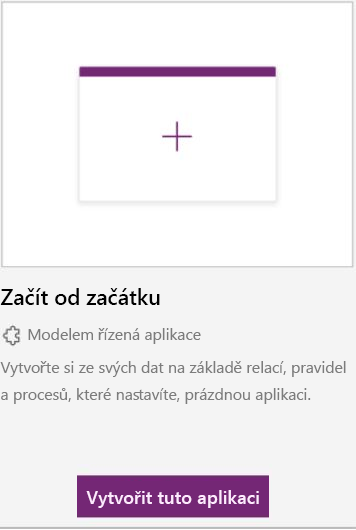
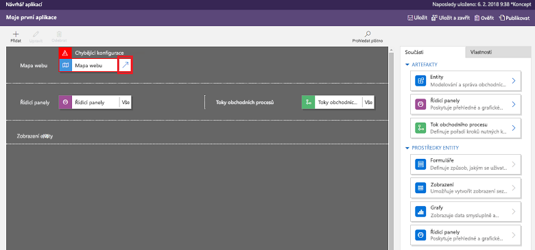
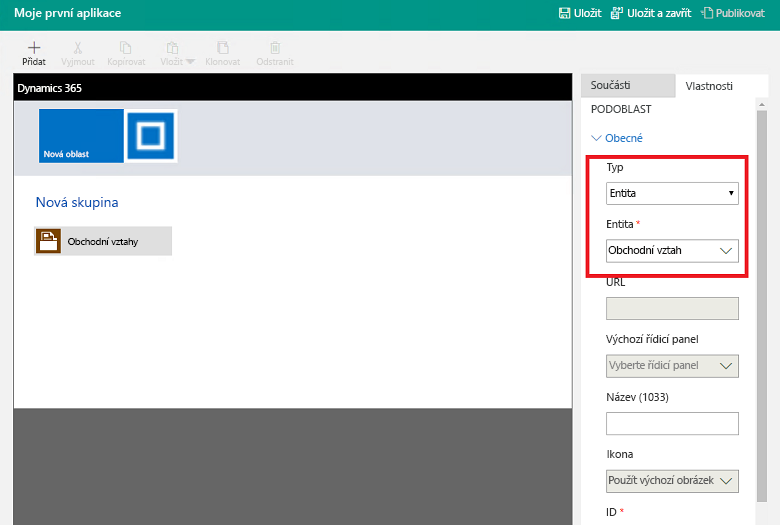
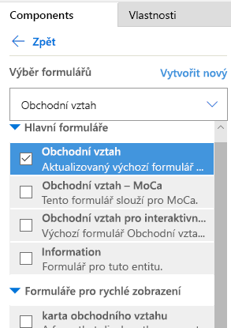
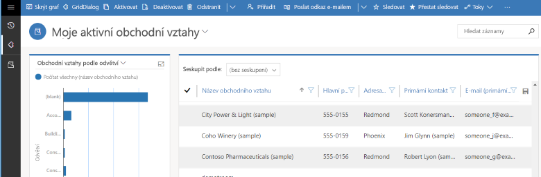

V této lekci vytvoříte modelem řízenou aplikaci pomocí jedné ze standardních entit dostupných ve vašem prostředí Microsoft PowerApps.In this unit, you'll create a model-driven app by using one of the standard entities that's available in your Microsoft PowerApps environment.

## Vytvoření modelem řízené aplikaceCreate a model-driven app

1. Přihlaste se k [PowerApps](https://web.powerapps.com/) pomocí účtu své organizace.Sign in to [PowerApps](https://web.powerapps.com/) by using your organizational account.
1. Vyberte požadované prostředí nebo přejděte na [Centrum pro správu PowerApps](https://admin.powerapps.com/) a vytvořte nové.Select the environment you want, or go to the [PowerApps admin center](https://admin.powerapps.com/) to create a new one.
1. Na stránce **Domů** vyberte **Začít od začátku** pro modelem řízenou aplikaci.On the **Home** page, select the **Start from blank** option for a model-driven app.  

    

    > [!IMPORTANT]
    > Pokud **Modelem řízený** režim návrhu není k dispozici, možná budete muset [vytvořit prostředí](https://docs.microsoft.com/powerapps/administrator/create-environment).If the **Model-driven** design mode isn't available, you might need to [create an environment](https://docs.microsoft.com/powerapps/administrator/create-environment).

1. V levém podokně vyberte **Aplikace** a pak vyberte **Vytvořit aplikaci**.In the left pane, select **Apps**, then select **Create an app**.
1. Na stránce **Vytvořit novou aplikaci** zadejte název a popis aplikace.On the **Create a New App** page, enter a name and description for the app.
1. Vyberte **Hotovo**.Select **Done**. Nová aplikace se zobrazí v návrháři aplikací a teď do ní můžete přidat komponenty.Your new app appears in the App Designer, and you can now add components to it.

## Přidání komponent do aplikaceAdd components to your app
Komponenty se do aplikace přidávají pomocí návrháře aplikací.You add components to your app by using the App Designer.

1. Výběrem šipky **Otevřít návrhář mapy webu** otevřete návrhář mapy webu.Select the **Open the Site Map Designer** arrow to open the site map designer.

    

2. V návrháři mapy webu vyberte **Nová podoblast** a pak v pravém podokně vyberte na kartě **Vlastnosti** následující vlastnosti:In the site map designer, select **New Subarea**, and then, in the right pane on the **Properties** tab, select the following properties:

    - **Typ:** *Entita***Type**: *Entity*
    - **Entita:** *Obchodní vztah***Entity**: *Account*

    

3. Vyberte **Uložit a zavřít**.Select **Save And Close**.
4. V návrháři aplikací vyberte **Formuláře** a pak v pravém podokně v oblasti **Hlavní formuláře** vyberte formulář **Obchodní vztah**.In the App Designer, select **Forms**, and then, in the right pane under **Main Forms**, select the **Account** form.

    

5. V návrháři aplikací vyberte **Zobrazení** a pak vyberte následující vlastnosti:In the App Designer, select **Views**, then select the following properties:

    - Aktivní obchodní vztahyActive Accounts
    - Všechny obchodní vztahyAll Accounts
    - Moje aktivní obchodní vztahyMy Active Accounts

6. V návrháři aplikací vyberte **Grafy** a pak vyberte graf **Obchodní vztahy podle odvětví**.In the App Designer, select **Charts**, then select the **Accounts by Industry** chart.
7. Na panelu nástrojů návrháře aplikací vyberte **Uložit**.On the App Designer toolbar, select **Save**.

<!-- ##  Validate your app
This step checks for component dependencies that are required for the app to work, but haven't yet been added to the app. 

1. On the app designer canvas, select the component that indicates a dependency, such as the **Forms** component. Then, on the right-pane select the **Required** tab, expand **Entity Dependencies** and then select all required dependencies. 

    

2. Select **Add Dependencies**.
3. On the app designer toolbar, select **Save**.  -->

## Publikování aplikacePublish your app
Na panelu nástrojů návrháře aplikací vyberte **Publikovat**.On the App Designer toolbar, select **Publish**.

Po publikování je aplikace připravená ke spuštění nebo sdílení s ostatními.After you publish the app, it's ready for you to run or share with others.

