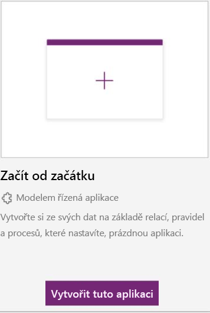

K prozkoumání možností návrhu můžete použít ukázkové aplikace na webu [powerapps.com](https://powerapps.com).On [powerapps.com](https://powerapps.com), you can use a sample app to explore design possibilities. Zároveň přitom objevíte koncepce, které můžete použít při vývoji vlastních aplikací.You'll also discover concepts that you can apply as you develop your own apps. Všechny ukázkové aplikace používají fiktivní data k prezentaci nějakého scénáře z reálného světa.Every sample app uses fictitious data to showcase a real-world scenario.

Další podrobnosti najdete v dokumentaci, která je součástí jednotlivých ukázkových aplikací.For more details, be sure to check out the documentation that's specific to each sample app.

## Získání ukázkových aplikacíGet sample apps

Než si budete moct prohlédnout nebo upravit modelem řízené ukázkové aplikace, musíte je napřed nainstalovat do databáze služby Common Data Service.Before you can play around with or edit the model-driven sample apps, you must set them up in a Common Data Service database. Nejprve vytvořte zkušební prostředí a databázi a nezapomeňte zaškrtnout políčko **Zahrnout ukázkové aplikace a data**.First, create a trial environment and database, and be sure to select the **Include sample apps and data** check box.

> [!IMPORTANT]
> Zaškrtnutím tohoto políčka nainstalujete do databáze všechny dostupné ukázkové aplikace.By selecting this check box, you install all available sample apps in your database. Ukázkové aplikace jsou určené pro vzdělávací a demonstrační účely.Sample apps are for educational and demonstration purposes. Nedoporučujeme je instalovat do produkčních databází.We don't recommend installing them in production databases.

## Přizpůsobení ukázkové aplikaceCustomize a sample app

1. Přihlaste se k webu [powerapps.com](https://powerapps.com) a jako režim návrhu vyberte **Modelem řízený**.Sign in to [powerapps.com](https://powerapps.com), and select **Model-driven** as the design mode.

    

2. Na domovské stránce najeďte myší na ukázkovou aplikaci, například *Fundraiser*, a vyberte **Přizpůsobit**.On the home page, hover over a sample app, such as *Fundraiser* and select **Customize**.

    Otevře se návrhář aplikací, který vám nabídne několik možností pro přizpůsobení aplikace.The App Designer opens, providing multiple options for customizing the app.

## Odebrání ukázkových aplikací a datRemove sample apps and data 
Při odebírání ukázkových aplikací a dat mějte na paměti tyto skutečnosti:Keep these points in mind when removing samples apps and data:

- Odstranění ukázkové aplikace vyžaduje odstranění odpovídajícího [spravovaného řešení](https://docs.microsoft.com/dynamics365/customer-engagement/developer/uninstall-delete-solution).Deleting a sample app requires deleting the corresponding [managed solution](https://docs.microsoft.com/dynamics365/customer-engagement/developer/uninstall-delete-solution).
- Při odstranění řešení se odstraní také všechna ukázková data specifická pro vlastní entity této aplikace.Deleting the solution also deletes any sample data that's specific to the custom entities for the app.
- Pokud byla ukázková aplikace přizpůsobena, můžou existovat [závislosti](https://docs.microsoft.com/dynamics365/customer-engagement/developer/dependency-tracking-solution-components), které je potřeba před odstraněním řešení odebrat.If customizations were made to the sample app, there might be [dependencies](https://docs.microsoft.com/dynamics365/customer-engagement/developer/dependency-tracking-solution-components) that must be removed before the solution can be deleted.

K odebrání ukázkových aplikací a dat použijte následující postup.To remove sample apps and data, follow these steps.

1. Přihlaste se k [portálu pro správu Microsoft PowerApps](https://admin.powerapps.com).Sign in to the [Microsoft PowerApps admin portal](https://admin.powerapps.com).
2. Vyberte prostředí.Select an environment.
3. Vyberte **Centrum pro správu Dynamics 365**.Select **Dynamics 365 Administration Center**.

    

4. V seznamu vyberte svou databázi a pak vyberte **Otevřít**.Select your database in the list, then select **Open**.

    

5. Přejděte na **Nastavení \> Řešení**.Go to **Settings \> Solutions**.
6. Vyberte řešení pro aplikaci, která se musí odstranit, a pak vyberte **Odstranit**.Select the solution for the app that must be deleted, then select **Delete**.

    

Výběrem možnosti **Upřesnit** na portálu tvůrce můžete také přejít na seznam řešení a pak v adrese URL odstranit všechno, co následuje za **.dynamics.com/**.You can also go to the list of solutions by selecting **Advanced** in the maker portal and then deleting everything in the URL after **.dynamics.com/**.

> [!IMPORTANT]
> Neodstraňujte jiná systémová řešení, pokud nevíte, jaký to bude mít vliv.Don't delete other system solutions unless you're aware of the effect.

## Instalace nebo odinstalace ukázkových datInstall or uninstall sample data
1. Přihlaste se k [portálu pro správu PowerApps](https://admin.powerapps.com).Sign in to the [PowerApps admin portal](https://admin.powerapps.com).
1. Vyberte prostředí.Select an environment.
1. Vyberte **Centrum pro správu Dynamics 365**.Select **Dynamics 365 Administration Center**.

    

1. V seznamu vyberte svou databázi a pak vyberte **Otevřít**.Select your database in the list, then select **Open**.

    

1. Přejděte na **Nastavení \> Správa dat \> Ukázková data**.Go to **Settings \> Data Management \> Sample Data**.
1. Pokud jsou ukázková data nainstalovaná, je k dispozici možnost pro jejich odebrání.If sample data is installed, the option to remove it is available. V opačném případě je k dispozici možnost pro instalaci ukázkových dat.Otherwise, the option to install sample data is available.
