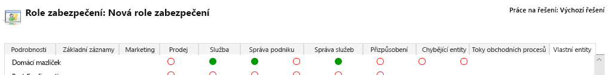
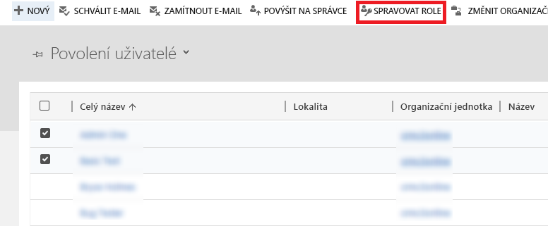
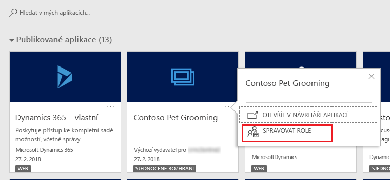
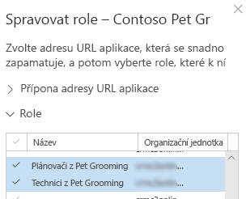
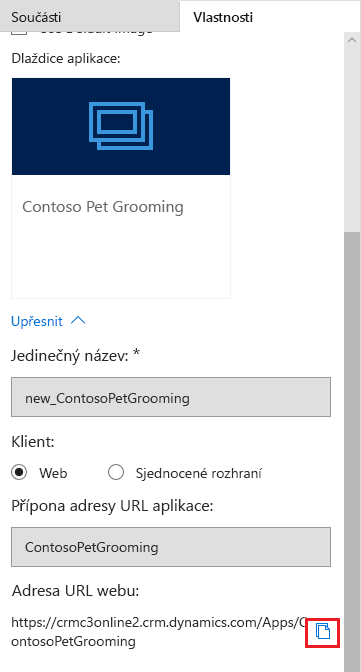

Ke sdílení Microsoft PowerApps používá zabezpečení na základě rolí.Microsoft PowerApps uses role-based security for sharing. Role zabezpečení obsahuje oprávnění definující sadu akcí, které lze provádět v aplikaci.A security role includes privileges that define a set of actions that can be performed in the app. Všichni uživatelé aplikace musí být přiřazeni k jedné nebo několika předdefinovaným nebo vlastním rolím zabezpečení.All app users must be assigned to one or more predefined or custom security roles.

Role lze přiřadit jednotlivým uživatelům nebo týmům.Roles can be assigned to individual users or to teams. Když se uživatel nebo tým přiřadí k roli, udělí se tomuto uživateli nebo všem členům tohoto týmu sada oprávnění přidružených k dané roli.When a user or a team is assigned to a role, that user or all members of that team are granted the set of privileges associated with the role.

V této lekci se naučíte, jak sdílet modelem řízenou aplikaci tak, aby ji mohli používat ostatní.In this unit, you'll learn how to share a model-driven app so that others can use it.

Konkrétně se dozvíte, jak:Specifically, you'll learn how to:

- Vytvořit vlastní roli zabezpečeníCreate a custom security role.
- Přiřadit uživatele k vlastní roli zabezpečeníAssign users to the custom security role.
- Přiřadit roli zabezpečení k aplikaciAssign the security role to an app.

Pokud chcete aplikaci sdílet, musíte mít roli Správce prostředí nebo Správce systému.To share an app, you must have the Environment Admin or System Admin role.

## ScénářScenario
V této jednotce se používá ukázková firma Contoso, která má salón pro domácí mazlíčky, kde se starají o zevnějšek psů a koček.This unit uses the example of a company named Contoso, which has a pet grooming business that services dogs and cats. Aplikace, která má vlastní entitu pro sledování podnikání tohoto salónu, je už vytvořená a publikovaná.An app that has a custom entity for tracking the pet grooming business has already been created and published.

Tato aplikace se musí nasdílet, aby ji mohli používat zaměstnanci salónu.The app must be shared so that the pet grooming staff can use it. Při sdílení aplikace přiřadí správce nebo autor aplikace jednu nebo několik rolí zabezpečení uživatelům a aplikaci.To share the app, an admin or app maker assigns one or more security roles to users and to the app.

## Vytvoření nebo nastavení role zabezpečeníCreate or set up a security role
Prostředí PowerApps obsahuje předdefinované role zabezpečení.The PowerApps environment includes predefined security roles. Do těchto rolí jsou promítnuty běžné uživatelské úlohy, přičemž definované úrovně přístupu se řídí osvědčeným postupem zabezpečení, kdy se poskytuje přístup k minimálnímu množství obchodních dat, který je potřeba k používání aplikace.These roles reflect common user tasks, and the access levels that are defined follow the security best practice of providing access to the minimum amount of business data that's required to use the app.

Uvědomte si, že aplikace salónu Contoso pro domácí mazlíčky je založená na vlastní entitě.Remember that the Contoso pet grooming app is based on a custom entity. Protože tato entita je vlastní, musí se oprávnění explicitně určit, aby s ní mohli uživatelé pracovat.Because the entity is custom, privileges must be explicitly specified before users can work in it. K tomuto účelu můžete použít některý z následujících postupů:To do this, you can use either of the following approaches:

- Rozšiřte některou existující předdefinovanou roli zabezpečení tak, aby zahrnovala oprávnění k záznamům založeným na této vlastní entitě.Expand an existing predefined security role so that it includes privileges on records that are based on the custom entity.
- Vytvořte vlastní roli zabezpečení pro správu oprávnění uživatelů aplikace.Create a custom security role to manage privileges for users of the app.

Protože prostředí, ve kterém se budou udržovat záznamy salónu pro domácí mazlíčky, se používá také v jiných aplikacích, které firma Contoso provozuje, bude vytvořena vlastní role zabezpečení, která je specifická pro aplikaci salónu pro domácí mazlíčky.Because the environment that will maintain the pet grooming records is also used for other apps that the Contoso company runs, a custom security role that's specific to the pet grooming app will be created. Kromě toho se vyžadují dvě různé sady přístupových oprávnění:Additionally, two different sets of access privileges are required:

- Pracovníkům, kteří se zabývají úpravou zevnějšku domácích mazlíčků, stačí číst, aktualizovat a připojovat jiné záznamy.Pet grooming technicians just need to read, update, and attach other records. Jejich role zabezpečení proto bude obsahovat oprávnění ke čtení, zápisu a připojování.Therefore, their security role will have read, write, and append privileges.
- Pracovníci, kteří plánují úpravy zevnějšku domácích mazlíčků, potřebují všechna oprávnění, která mají pracovníci zabývající se úpravou zevnějšku.Pet grooming schedulers need all the privileges that pet grooming technicians have. Navíc musí být schopni vytvářet, připojovat, odstraňovat a sdílet záznamy.In addition, they must be able to create, append to, delete, and share records. Jejich role zabezpečení proto bude obsahovat oprávnění Vytvořit, Číst, Zapisovat, Připojit, Odstranit, Přiřadit, Připojit k a Sdílet.Therefore, their security role will have create, read, write, append, delete, assign, append to, and share privileges.

Další informace o přístupu a rozsahu různých oprávnění najdete v článku [Role zabezpečení](https://docs.microsoft.com/dynamics365/customer-engagement/admin/security-roles-privileges#security-roles).To learn more about access and the scope of the different privileges, see [Security roles](https://docs.microsoft.com/dynamics365/customer-engagement/admin/security-roles-privileges#security-roles).

## Vytvoření vlastní role zabezpečeníCreate a custom security role
1. Přihlaste se k [PowerApps](https://powerapps.microsoft.com/) pomocí účtu své organizace.Sign in to [PowerApps](https://powerapps.microsoft.com/) by using your organizational account. Pokud účet ještě nemáte, vyberte **Začněte zdarma**.If you don't already have an account, select **Get started free**.
1. Na domovské stránce PowerApps vyberte **Modelem řízený**.On the PowerApps home page, select **Model-driven**.
1. Pro vaši novou aplikaci vyberte tlačítko **Další příkazy** (**...**) a pak klikněte na **Sdílet**.For your new app, select the **More Commands** button (**...**), and then click **Share**.
1. V dialogovém okně **Sdílet tuto aplikaci** klikněte v oblasti **Vytvořit roli zabezpečení** na odkaz **Nastavení zabezpečení**.In the **Share this app** dialog box, under **Create a security role**, click the **Security Setting** link.
1. Na stránce **Všechny role** klikněte na **Nová**.On the **All Roles** page, click **New**.
1. Do pole **Název role** zadejte *Pracovníci zabývající se úpravou zevnějšku*.In the **Role Name** box, enter *Pet Grooming Technicians*.
1. V návrháři rolí zabezpečení najděte na kartě **Vlastní entity** entitu **Pet**.In the Security Role designer, on the **Custom Entities** tab, find the **Pet** entity.
1. Na řádku **Domácí mazlíček** klikněte čtyřikrát na oprávnění **Číst**, **Zapisovat** a **Připojit**, abyste nastavili rozsah každého oprávnění na *organizace*, dokud nebude vybraný :On the **Pet** row, click **Read**, **Write**, and **Append** four times, to set the scope for each to *organization*  is selected:

    

1. Aplikace salónu pro domácí mazlíčky má také relaci s entitou account (obchodní vztah).The pet grooming app also has a relationship with the account entity. Na kartě **Základní záznamy** vyberte na řádku **Account** čtyřikrát oprávnění **Číst**, dokud nebude nastavené na rozsah *organizace* .On the **Core Records** tab, on the **Account** row select the **Read** privilege four times until it is set to *organization* scope . 
1. Klikněte na **Uložit a zavřít**.Click **Save and Close**. 
1. V návrháři rolí zabezpečení zadejte do pole **Název role** text *Pracovníci plánující úpravy zevnějšku*.In the Security Role designer, in the **Role Name** box, enter *Pet Grooming Schedulers*. 
1. Na kartě **Vlastní entity** najděte entitu **Pet**.On the **Custom Entities** tab, find the **Pet** entity. 
1. Na řádku **Pet** klikněte čtyřikrát na každé z následujících oprávnění, dokud nebude vybraný rozsah *organizace* : **Vytvořit**, **Číst**, **Zapisovat**, **Odstranit**, **Připojit**, **Připojit k**, **Přiřadit** a **Sdílet**.On the **Pet** row, click each of the following privileges four times, until the *organization* scope  is selected: **Create**, **Read**, **Write**, **Delete**, **Append**, **Append To**, **Assign**, and **Share**.
1. Aplikace salónu pro domácí mazlíčky má také relaci s entitou obchodního vztahu a plánovači musí mít možnost vytvářet a měnit záznamy obchodních vztahů.The pet grooming app also has a relationship with the account entity, and schedulers must be able to create and change account records. Proto na kartě **Základní záznamy** vyberte na řádku **Obchodní vztah** čtyřikrát každé z následujících oprávnění, dokud nebude vybraný rozsah *organizace* : **Vytvořit**, **Číst**, **Zapisovat**, **Odstranit**, **Připojit**, **Připojit k**, **Přiřadit** a **Sdílet**.Therefore, on the **Core Records** tab, on the **Account** row, select each of the following privileges four times, until the *organization* scope  is selected: **Create**, **Read**, **Write**, **Delete**, **Append**, **Append To**, **Assign**, and **Share**.
1. Vyberte **Uložit a zavřít**.Select **Save and Close**.

## Přiřazení rolí zabezpečení uživatelůmAssign security roles to users
Role zabezpečení řídí přístup uživatelů k datům prostřednictvím sady úrovní přístupu a oprávnění.Security roles control a user's access to data through a set of access levels and permissions. Kombinace úrovní přístupu a oprávnění, která jsou součástí určité role zabezpečení, omezuje, jaká data můžou uživatelé prohlížet a s jakými daty můžou provádět interakce.The combination of access levels and permissions that's included in a specific security role sets limits on the user's view of data and interactions with that data.

### Přiřazení role zabezpečení pracovníkům zabývajícím se úpravou zevnějškuAssign a security role to the pet grooming technicians
1. V dialogovém okně **Sdílet tuto aplikaci** vyberte v oblasti **Přiřadit uživatele k roli zabezpečení** možnost **Uživatelé zabezpečení**.In the **Share this app** dialog box, under **Assign users to the security role**, select **Security Users**.
2. V seznamu, který se zobrazí, vyberte pracovníky zabývající se úpravou zevnějšku.In the list that appears, select the pet groomers.
3. Vyberte **Spravovat role**.Select **Manage Roles**.

    

4. V dialogovém okně **Spravovat role uživatelů** vyberte dříve vytvořenou roli zabezpečení **Pracovníci zabývající se úpravou zevnějšku** a pak vyberte **OK**.In the **Manage User Roles** dialog box, select the **Pet Grooming Technicians** security role you created earlier, and then select **OK**.

### Přiřazení role zabezpečení pracovníkům plánujícím úpravy zevnějškuAssign a security role to the pet grooming schedulers
1. V dialogovém okně **Sdílet tuto aplikaci** vyberte v oblasti **Přiřadit uživatele k roli zabezpečení** možnost **Uživatelé zabezpečení**.In the **Share this app** dialog box, under **Assign users to a security role**, select **Security Users**.
2. V seznamu, který se zobrazí, vyberte pracovníky plánující úpravy zevnějšku.In the list that appears, select the pet grooming schedulers.
3. Vyberte **Spravovat role**.Select **Manage Roles**.
4. V dialogovém okně **Spravovat role uživatelů** vyberte dříve vytvořenou roli zabezpečení **Pracovníci plánující úpravy zevnějšku** a pak vyberte **OK**.In the **Manage User Roles** dialog box, select the **Pet Grooming Schedulers** security role you created earlier, and then select **OK**.

## Přidání rolí zabezpečení k aplikaciAdd security roles to the app
Dále se jedna nebo více rolí zabezpečení musí přiřadit aplikaci.Next, one or more security roles must be assigned to the app. Aplikace, které uživatelé můžou používat, závisí na rolích zabezpečení, ke kterým jsou přiřazení.The apps that users can use depends on the security roles they're assigned to.

1. V dialogovém okně **Sdílet tuto aplikaci** vyberte v oblasti **Přidat roli zabezpečení do aplikace** možnost **Moje aplikace**.In the **Share this app** dialog box, under **Add the security role to your app**, select **My Apps**.
2. Na dlaždici vaší aplikace salónu Contoso pro domácí mazlíčky vyberte tlačítko **Další možnosti** (**...**) a pak vyberte **Spravovat role**.On the tile for your Pet Grooming app, select the **More options** button (**...**), and then select **Manage Roles**.

    

3. V oddílu **Role** můžete zvolit, jestli aplikaci dáte přístup ke všem rolím zabezpečení nebo jen k vybraným rolím.In the **Roles** section, you can choose whether to give app access to all security roles or just selected roles. Vyberte role **Pracovníci plánující úpravy zevnějšku** a **Pracovníci zabývající se úpravou zevnějšku**, které jste vytvořili dříve.Select the **Pet Grooming Schedulers** and **Pet Grooming Technicians** roles you created earlier.

    

4. Vyberte **Uložit**.Select **Save**.

## Sdílení odkazu na aplikaciShare the link to your app
1. V dialogovém okně **Sdílet tuto aplikaci** zkopírujte v oblasti **Sdílet odkaz na aplikaci přímo s uživateli** zobrazenou adresu URL.In the **Share this app** dialog box, under **Share the link to your app directly with users**, copy the URL that's shown.
1. Vyberte **Zavřít**.Select **Close**.
1. Vložte tuto adresu URL na místo, ke kterému mají vaši uživatelé přístup.Paste the URL in a location where your users can access it. Adresu URL můžete například zveřejnit na webu Microsoft SharePointu nebo odeslat e-mailem.For example, you can post the URL on a Microsoft SharePoint site or send it in an email.

Adresu URL aplikace najdete také na kartě **Vlastnosti** v návrháři aplikací.You can also find the app URL on the **Properties** tab in the App Designer.

## Informace o předdefinovaných rolích zabezpečeníAbout predefined security roles
V prostředí PowerApps jsou dostupné tyto předdefinované role.The following predefined roles are available with a PowerApps environment. Pokud není uvedeno jinak, mají všechna oprávnění globální rozsah.Unless otherwise noted, all the privileges have global scope.

| Role zabezpečeníSecurity role            | OprávněníPrivileges | PopisDescription |
|--------------------------|------------|-------------|
| Tvůrce prostředíEnvironment Maker        | ŽádnéNone | Uživatelé s touto rolí můžou vytvářet nové prostředky, které jsou přidružené k prostředí, včetně aplikací, připojení, vlastních rozhraní pro programování aplikací (API), bran a toků, které používají Microsoft Flow.Users who have this role can create new resources that are associated with an environment, including apps, connections, custom application programming interfaces (APIs), gateways, and flows that use Microsoft Flow. Tito uživatelé ale nemají přístup k datům v prostředí.But these users can't access the data in an environment. Další informace o prostředích najdete v [oznámeních týkajících se prostředí PowerApps](https://powerapps.microsoft.com/blog/powerapps-environments/).To learn more about environments, see [Announcing PowerApps environments](https://powerapps.microsoft.com/blog/powerapps-environments/). |
| Správce systémuSystem Administrator     | Vytvořit, Číst, Zapisovat, Odstranit, PřizpůsobitCreate, Read, Write, Delete, Customize | Tato role má úplná oprávnění k přizpůsobení nebo správě prostředí včetně vytváření, změny a přiřazování rolí zabezpečení.This role has full permission to customize or administer the environment, including creating, changing, and assigning security roles. Uživatel s touto rolí může zobrazit všechna data v prostředí.User who have this role can view all data in the environment. Další informace najdete v článku o [oprávněních požadovaných k přizpůsobení](https://docs.microsoft.com/dynamics365/customer-engagement/customize/privileges-required-customization).To learn more, see [Privileges required for customization](https://docs.microsoft.com/dynamics365/customer-engagement/customize/privileges-required-customization). |
| Úpravce systémuSystem Customizer        | Vytvořit (vlastní), Číst (vlastní), Zapisovat (vlastní), Odstranit (vlastní), PřizpůsobeníCreate (self), Read (self), Write (self), Delete (self), Customizations | Tato role má úplná oprávnění k přizpůsobení prostředí.This role has full permission to customize the environment. Uživatelé s touto rolí ale můžou zobrazit záznamy jen pro entity prostředí, které vytvoří.But users who have this role can view records only for environment entities that they create. Další informace najdete v článku o [oprávněních požadovaných k přizpůsobení](https://docs.microsoft.com/dynamics365/customer-engagement/customize/privileges-required-customization).To learn more, see [Privileges required for customization](https://docs.microsoft.com/dynamics365/customer-engagement/customize/privileges-required-customization). |
| Uživatel služby Common Data ServiceCommon Data Service User | Číst, Vytvořit (vlastní), Zapisovat (vlastní), Odstranit (vlastní)Read, Create (self), write (self), delete (self) | Uživatelé s touto rolí můžou spustit aplikaci v prostředí a provádět běžné úlohy u záznamů, které vlastní.Users who have this role can run an app in the environment and perform common tasks for the records they own. |
| DelegátDelegate                 | Jednat jménem jiného uživateleAct on behalf of another user | Tato role umožňuje spustit kód jako jiný uživatel nebo zosobnit jiného uživatele.This role lets code run as or impersonate another user. Tato role se zpravidla používá s jinou rolí zabezpečení kvůli poskytnutí přístupu k záznamům.This role is typically used with another security role to provide access to records. Další informace najdete v článku o [zosobnění jiného uživatele](https://docs.microsoft.com/dynamics365/customer-engagement/developer/org-service/impersonate-another-user).To learn more, see [Impersonate another user](https://docs.microsoft.com/dynamics365/customer-engagement/developer/org-service/impersonate-another-user). |
