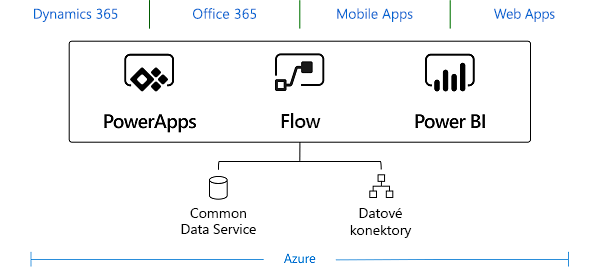
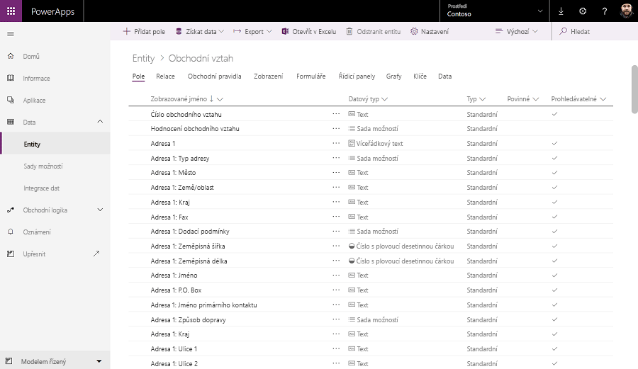

Služba Common Data Service pro aplikace umožňuje bezpečně ukládat a spravovat data využívaná podnikovými aplikacemi.Common Data Service for Apps lets you securely store and manage data used by business applications. 

## EntityEntities
Data v rámci Common Data Service pro aplikace se ukládají do sady záznamů nazývaných entity.Data within Common Data Service for Apps is stored within a set of records called entities. **Entita** je sada záznamů sloužící k ukládání dat, podobně jako tabulka ukládá data v rámci databáze.An **entity** is a set of records used to store data, similar to how a table stores data within a database.

Služba Common Data Service pro aplikace obsahuje základní sadu standardních entit, které podporují běžné obchodní scénáře připojení k datům aplikace Dynamics 365.Common Data Service for Apps includes a base set of standard entities that support common business scenarios that connect to Dynamics 365 application data. Můžete také vytvořit vlastní entity specifické pro vaši organizaci a naplnit je daty, která naimportujete ze seznamů v SharePointu, z Excelu nebo z Power Query.You can also create custom entities specific to your organization and populate them with data that you import from lists in SharePoint, from Excel, or from PowerQuery. Tvůrci aplikací pak můžou pomocí PowerApps vytvářet komplexní aplikace používající tato data.App makers can then use PowerApps to build rich applications using this data.

Aplikace Dynamics 365, včetně aplikací Dynamics 365 for Sales, Service a Talent, také používají Common Data Service pro aplikace k ukládání a zabezpečení dat používaných aplikacemi.Dynamics 365 applications, including Dynamics 365 for Sales, Service, and Talent, use Common Data Service for Apps to store and secure data used by the applications. To znamená, že můžete vytvářet aplikace pomocí PowerApps a Common Data Service pro aplikace přímo nad vašimi základními obchodními daty, která se už používají v Dynamics 365, bez nutnosti ruční integrace.This means you can build apps using PowerApps and Common Data Service for Apps directly against your core business data already used within Dynamics 365 without the need for manual integration.

 > [!NOTE]
 > Dynamics 365 for Finance and Operations a Dynamics 365 for Retail aktuálně vyžadují konfiguraci integrátoru dat, aby vaše obchodní data byla dostupná v rámci služby Common Data Service pro aplikace.Dynamics 365 for Finance and Operations and Dynamics 365 for Retail currently require the configuration of the Data Integrator to make your business data available within Common Data Service for Apps.

Pro většinu organizací je vhodné používat standardní entity a atributy tak, jak se to očekávalo.For most organizations, it's a good idea to use the standard entities and attributes as they were intended. Pokud to ale vaše obchodní potřeby vyžadují, můžete funkce standardních entit rozšířit vytvořením jedné nebo více vlastních entit, abyste uložili informace, které jsou pro vaši organizaci jedinečné.But to meet your business needs, you can extend the functionality of standard entities by creating one or more custom entities to store information that's unique to your organization. 

## Logika a ověřováníLogic and validation
Entity v Common Data Service pro aplikace můžou k zajištění kvality dat využívat komplexní logiku a ověřování na straně serveru.Entities within Common Data Service for Apps can leverage rich server-side logic and validation to ensure data quality. Můžete také omezit opakování kódu v každé aplikaci, která vytváří a používá data v dané entitě.You can also reduce repetitive code in each app that creates and uses data within an entity.

* **Obchodní pravidla:** Obchodní pravidla ověřují data ve více polích a entitách a poskytují upozornění a chybové zprávy bez ohledu na aplikaci použitou k vytvoření těchto dat.**Business rules**: Business rules validate data across multiple fields and entities, and provide warning and error messages, regardless of the app that's used to create the data. 
* **Toky obchodních procesů:** Tyto toky pomáhají zajistit, aby uživatelé zadávali data konzistentně a pokaždé postupovali stejně.**Business process flows**: Business process flows guide users to ensure they enter data consistently and follow the same steps every time. Toky obchodních procesů jsou v tuto chvíli podporované jenom u modelem řízených aplikací.Business process flows are currently supported only for model-driven apps.
* **Pracovní postupy:** Pracovní postupy automatizují obchodní procesy bez nutnosti zásahu uživatele.**Workflows**: Workflows automate business processes without requiring user interaction. 
* **Obchodní logika pomocí kódu:** Obchodní logika podporuje pokročilé vývojářské scénáře, které rozšiřují možnosti aplikace přímo prostřednictvím kódu.**Business logic with code**: Business logic supports advanced developer scenarios that extend the application directly through code. 

## ZabezpečeníSecurity
Data ve službě Common Data Service pro aplikace jsou bezpečně uložená a uživatelé je můžou zobrazit jenom v případě, že jim udělíte přístup.Data in Common Data Service for Apps is securely stored so that users can see it only if you grant them access. Zabezpečení na základě rolí, založené na systému Dynamics 365, umožňuje řídit přístup k entitám pro různé uživatele v rámci vaší organizace.Role-based security, based on the Dynamics 365 system allows you to control access to entities for different users within your organization.
