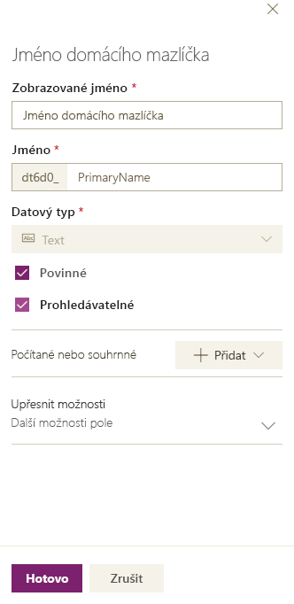
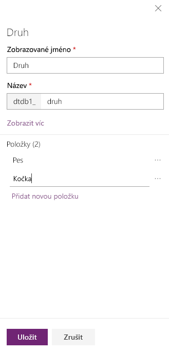
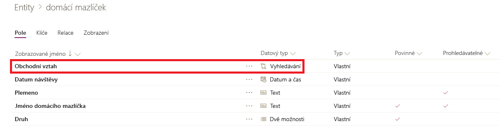
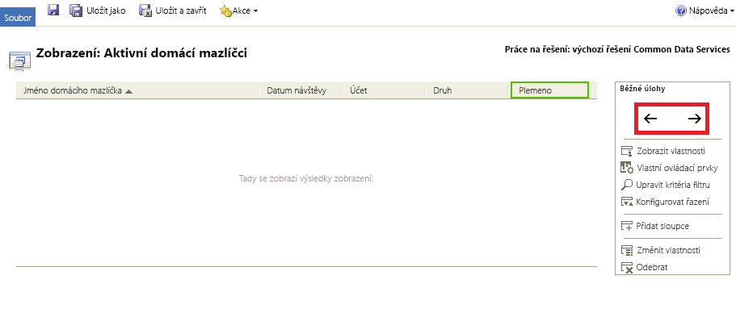
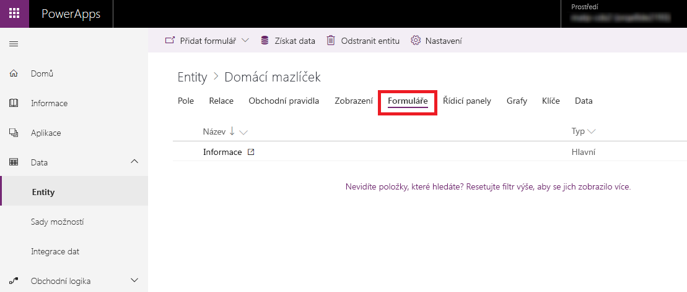
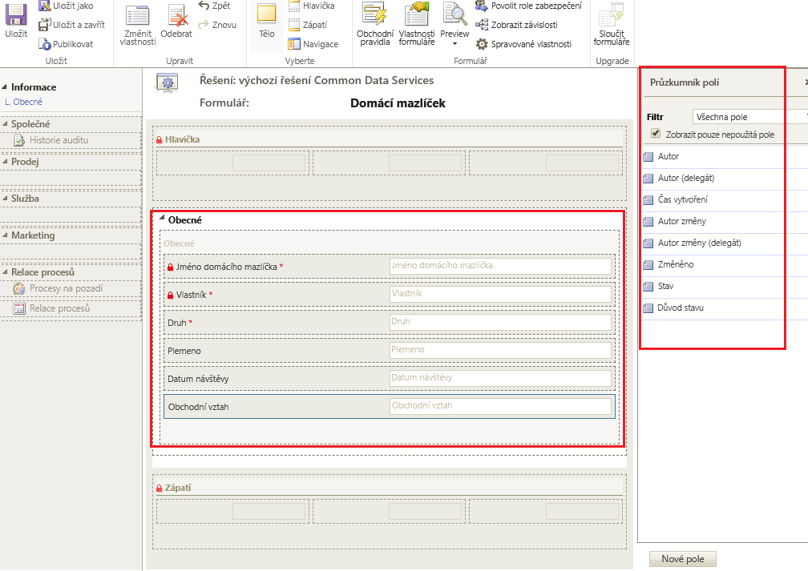

V této lekci vytvoříte entitu a pak upravíte klíčové komponenty, jako jsou pole, relace, zobrazení a formuláře.In this unit, you'll create an entity and then customize key components, like fields, relationships, views, and forms. Dozvíte se, jak provést tyto akce:You'll learn how to:

- Vytvoření vlastní entityCreate a custom entity.
- Přidání vlastních polí do entityAdd custom fields to your entity.
- Přidání relace entityAdd an entity relationship.
- Přizpůsobení zobrazeníCustomize a view.
- Přizpůsobení formulářeCustomize a form.

Tento kurz sleduje společnost Contoso, která se zabývá péčí o domácí mazlíčky a věnuje se úpravám zevnějšku psů a koček.The tutorial follows the Contoso company, which is a pet grooming business that grooms dogs and cats. Contoso potřebuje aplikaci pro sledování klientů a domácích mazlíčků, kterou můžou využívat zaměstnanci na různých zařízeních.Contoso needs an app for client and pet tracking that can be used by employees on a variety of devices.

## Vytvoření vlastní entityCreate a custom entity

1. V levém navigačním podokně rozbalte **Data**, vyberte **Entity** a pak vyberte **Nová entita**.In the left navigation pane, expand **Data**, select **Entities**, and then select **New entity**.

2. Zadejte tyto hodnoty:Enter the following values:

    - **Zobrazovaný název:** *Domácí mazlíček***Display name**: *Pet*
    - **Popis:** *Vlastní entita sloužící ke sledování služeb pro domácí mazlíčky***Description**: *Custom entity to track pet services*

3. Vyberte **Další** a pak po zobrazení výchozích polí vyberte **Uložit entitu**.Select **Next**, and then, after the default fields are shown, select **Save Entity**.

## Přidání a přizpůsobení políAdd and customize fields

1. V seznamu entit vyberte entitu **Domácí mazlíček**, kterou jste vytvořili v předchozí části.In the list of entities, select the **Pet** entity that you created in the previous section.
2. Na kartě **Pole** vyberte pole **Domácí mazlíček**.On the **Fields** tab, select the **Pet** field.
3. V pravém podokně proveďte následující změny pole **Zobrazovaný název**:In the right pane, make the following changes to the **Display name** field:

    - Změňte hodnotu **Zobrazovaný název** z hodnoty *Domácí mazlíček* na *Jméno domácího mazlíčka*.Change the **Display name** value from *Pet* to *Pet Name*.
    - Vyberte **Prohledávatelné**.Select **Searchable**.

    > 

3. Vyberte **Hotovo**.Select **Done**.
4. Na kartě **Pole** na panelu nástrojů návrháře entit vyberte **Přidat pole**.On the **Fields** tab, on the entity designer toolbar, select **Add field**.
5. V podokně **Vlastnosti pole** zadejte následující hodnoty:In the **Field properties** pane, enter the following values:

    - **Zobrazovaný název:** *Druh***Display name**: *Species*
    - **Datový typ:** *Sada možností***Data type**: *Option Set*
    - **Sada možností:** *Nová sada možností***Option set**: *New option set*

6. Vytvoření sady možností:Create the option set:

    1. Vyberte **Přidat novou položku**.Select **Add new item**.
    2. Nahraďte *Nová možnost* hodnotou *Pes*.Replace *New option* with *Dog*.
    3. Vyberte **Přidat novou položku**.Select **Add new item**.
    4. Nahraďte *Nová možnost* hodnotou *Kočka*.Replace *New option* with *Cat*.
    5. Vyberte **Uložit**.Select **Save**.

    > [!div class="mx-imgBorder"]
    > 

7. Vyberte **Prohledávatelné** a pak vyberte **Hotovo**.Select **Searchable**, and then select **Done**.
8. Na panelu nástrojů návrháře entit vyberte **Přidat pole**.On the entity designer toolbar, select **Add field**.
9. V podokně **Vlastnosti pole** zadejte následující hodnoty a pak vyberte **Hotovo**:In the **Field properties** pane, enter the following values, and then select **Done**:

    - **Zobrazovaný název:** *Plemeno***Display name**: *Breed*
    - **Datový typ:** *Text***Data type**: *Text*
    - **Prohledávatelné:** *Ano***Searchable**: *Yes*

10. Na panelu nástrojů návrháře entit vyberte **Přidat pole**.On the entity designer toolbar, select **Add field**.
11. V podokně **Vlastnosti pole** zadejte následující hodnoty a pak vyberte **Hotovo**:In the **Field properties** pane, enter the following values, and then select **Done**:

    - **Zobrazovaný název:** *Datum návštěvy***Display name**: *Appointment date*
    - **Datový typ:** *Datum a čas***Data type**: *Date and time*

12. Vyberte **Uložit entitu**.Select **Save Entity**.

## Přidání relaceAdd a relationship

1. Na kartě **Relace** na panelu nástrojů návrháře entit vyberte **Přidat relaci** a pak vyberte **N:1**.On the **Relationships** tab, on the entity designer toolbar, select **Add relationship**, and then select **Many-to-one**.
2. V pravém podokně v seznamu **Související** vyberte **Obchodní vztah**.In the right pane, in the **Related** list, select **Account**.
3. Vyberte **Hotovo**.Select **Done**.
4. Vyberte **Uložit entitu**.Select **Save Entity**.

    Všimněte si, že když přidáte relaci N:1, na kartu **Pole** se automaticky přidá pole **Účet** s datovým typem **Vyhledávání**.Notice that when you add a many-to-one relationship, an **Account** field of the **Lookup** data type is automatically added to your list of fields on the **Fields** tab.

    > [!div class="mx-imgBorder"]
    > 

## Přizpůsobení zobrazeníCustomize a view

1. Na kartě **Zobrazení** vyberte **Aktivní domácí mazlíčci**.On the **Views** tab, select the **Active Pets** view. Pokud zobrazení **Aktivní domácí mazlíčci** není uvedené, vyberte **Odebrat filtr**.If you don't see the **Active Pets** view, select **Remove filter**.
2. V návrháři zobrazení vyberte **Přidat sloupce**, vyberte následující sloupce a pak vyberte **OK**:In the view designer, select **Add Columns**, select the following columns, and then select **OK**:

    - ÚčetAccount
    - Datum návštěvyAppointment date
    - PlemenoBreed
    - DruhSpecies

3. Vyberte sloupec **Vytvořeno**, vyberte **Odebrat** a pak potvrďte odebrání sloupce výběrem **OK**.Select the **Created On** column, select **Remove**, and then select **OK** to confirm the column removal.
4. Pokud chcete sloupce uspořádat, vyberte sloupec, který chcete přesunout, a potom používejte tlačítka se šipkami (**\<-** a **-\>**), dokud zobrazení nevypadá takto.To arrange the columns, select the column to move, and then use the arrow buttons (**\<-** and **-\>**) until your view looks like this.

    > [!div class="mx-imgBorder"]
    > 

5. Na panelu nástrojů návrháře zobrazení vyberte **Uložit a zavřít**.On the view designer toolbar, select **Save and Close**.

## Přizpůsobení hlavního formulářeCustomize the main form

1. V PowerApps vyberte v levém navigačním podokně **Modelem řízený**.In PowerApps, in the left navigation pane, select **Model-driven**.
2. V levém navigačním podokně rozbalte **Data**, vyberte **Entity** a pak vyberte **Domácí mazlíček**.In the left navigation pane, expand **Data**, select **Entities**, and then select **Pet**.
3. Na kartě **Formuláře** vyberte **Informace** vedle typu formuláře **Hlavní** a otevřete editor formulářů.On the **Forms** tab, select **Information** next to the **Main** form type to open the form editor.

    > [!div class="mx-imgBorder"]
    > 

4. V editoru formulářů přetáhněte pole **Druh**, **Plemeno**, **Datum návštěvy** a **Účet** z podokna **Průzkumník polí** do části plátna formuláře **Obecné**, aby formulář vypadal takto.In the form editor, drag the **Species**, **Breed**, **Appointment date**, and **Account** fields from the **Field Explorer** pane to the **General** section of the form canvas, so that the form looks like this.

    > [!div class="mx-imgBorder"]
    > 

5. Vyberte **Uložit**.Select **Save**.
6. Vyberte **Publikovat**.Select **Publish**.
7. Výběrem **Uložit a zavřít** zavřete návrhář formulářů.Select **Save and close** to close the form designer.
