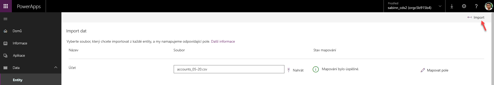

Data můžete importovat do databáze Common Data Service pro aplikace hromadně z Microsoft Excelu nebo ze souborů CSV.You can import data into your Common Data Service for Apps database in bulk from Microsoft Excel or CSV files. 

Každá entita obsahuje povinná pole, která musí ve vstupním souboru existovat.Every entity has required fields that must exist in your input file. Doporučujeme vytvořit šablonu.We recommend that you create a template. Šablona vám ušetří čas a úsilí.A template will save you time and effort. Nejprve vyexportujte data z entity.First, export data from the entity. Stejný soubor (aktualizovaný vašimi daty) pak použijete pro import dat do entity.You'll use the same file (updated with your data) to import data into the entity.

## Vytvoření šablony souboruCreate a file template
Můžete provést jednorázový export dat ze standardní entity nebo vlastní entity nebo můžete data exportovat z několika entit najednou.You can do a one-time data export from a standard entity or a custom entity, and you can export data from more than one entity at a time. Pokud exportujete data z více než jedné entity, každá entita se exportuje do vlastního souboru Microsoft CSV.If you export data from more than one entity, each entity is exported into its own Microsoft CSV file. V tomto příkladu vytvoříte šablony pro entity **Domácí mazlíček** a **Obchodní vztah**.In this example, you'll create templates for both the **Pet** and **Account** entities.

1. Na webu [powerapps.com](https://web.powerapps.com/) v seznamu **Entity** vyberte napravo ikonu **dalších příkazů** (\*\* ... \*\*) a potom vyberte **Exportovat data**.On [powerapps.com](https://web.powerapps.com/), in the **Entities** list, select the **More commands** icon (\*\* ... \*\*) on the right, and then select **Export data**.
1. Vyberte entity **Obchodní vztah** a **Domácí mazlíček** a pak vyberte **Exportovat data**.Select the **Account** and **Pet** entities, and then select **Export data**.
1. Po dokončení exportu vyberte **Stáhnout exportovaná data** a uložte soubory.After the export is finished, select **Download exported data**, and save the files.

## Kopírování dat do šablonyCopy data into your template
Při přidání dat do souboru šablony se musíte ujistit, že jsou data jedinečná.When you add data to a template file, you must make sure the data is unique. Můžete použít buď *primární klíče* nebo *alternativní klíče*.You can use either *primary keys* or *alternate keys*.

1. Otevřete soubory CSV, které jste vytvořili v předchozí části.Open the CSV files that you created in the previous section.
1. Přidejte aspoň jeden řádek nových dat.Add at least one new row of data.
1. Soubor uložte.Save the file.

## Import souboruImport the file
1. V levém navigačním podokně rozbalte **Data** a pak vyberte **Entity**.In the left navigation pane, expand **Data**, and then select **Entities**.
1. Vyberte entitu **Domácí mazlíček**, vyberte **Získat data** a pak vyberte **Získat data z Excelu**.Select the **Pet** entity, select **Get Data**, and then select **Get data from Excel**.
1. Vyberte soubor, který jste vytvořili.Select the file that you created.
1. Po nahrání souboru a když pole **Stav mapování** označuje, že mapování bylo úspěšné, vyberte v pravém horním rohu **Importovat**.After the file is uploaded, and the **Mapping status** field indicates that mapping was successful, select **Import** in the upper-right corner.

   
    

1. Po úspěšném importu se zobrazí celkový počet vložení a aktualizací.After the import is successful, you'll see the total number of inserts and updates.
