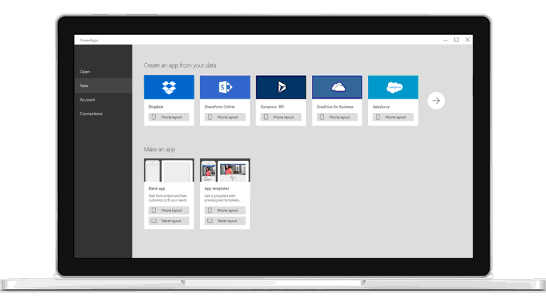

Vítá vás Microsoft PowerApps.Welcome to Microsoft PowerApps. Tento online modul vám pomůže vytvářet aplikace úplně od začátku. Můžete ho procházet vlastním tempem.This self-paced online module helps you build apps from the ground up.

 V tomto modulu:In this module, you will:
  - Prozkoumáte, jak může PowerApps zvýšit efektivitu vaší firmy.Explore how PowerApps can make your business more efficient.
  - Seznámíte se s tím, které technologie využít pro provádění úloh v PowerApps.Understand which technologies to use to perform tasks in PowerApps.
  - Uvidíte různé způsoby, jak se v PowerApps vytvářejí aplikace.Understand the different ways to build an app in PowerApps.
  - Vytvoříte si svou první aplikaci z dat v sešitu Microsoft Excelu.Create your first app from data in a Microsoft Excel workbook.

V tomto úvodním modulu se naučíte vytvořit aplikaci z dat v sešitu Microsoft Excelu.In this introductory module, you'll learn how to create an app from data in a Microsoft Excel workbook. Předpokladem je, že si stáhnete sešit, který obsahuje ukázková data.As a prerequisite, you'll download a workbook that contains sample data. Potom tento sešit nahrajete do Microsoft OneDrivu pro firmy, kde můžete data sdílet s ostatními uživateli.Then you'll upload the workbook to Microsoft OneDrive for Business, where you can share the data with others. Potom vytvoříte aplikaci bez použití tradičního programovacího jazyka, jako je C#.Then you'll build the app without using a traditional programming language such as C#.

V PowerApps můžete:With PowerApps, you can:

- Rychle vytvořit aplikaci s využitím dovedností, které už máte.Quickly build an app by using the skills that you already have.
- Připojit se ke cloudovým službám a zdrojům dat, které už používáte.Connect to the cloud services and data sources that you're already using.
- Ihned sdílet aplikace se svými spolupracovníky ve společnosti nebo ve světě, aby je mohli používat na svých telefonech a tabletech.Instantly share your apps so that co-workers across the company or across the world can use them on their phones and tablets.

Nabízí se bezpočet možností, jak použít PowerApps k různým úkolům nebo k informování ostatních.The sky's the limit when it comes to using PowerApps to get things done and keep people informed. Tyto příklady vás můžou inspirovat, jak můžete při provozu firmy používat aplikaci místo tradičních papírových poznámek:These examples can help you think about how to use an app, instead of traditional paper notes, to run your business:

- **Zařízení v terénu:** Zástupci společnosti, kteří navštěvují zákazníky v terénu, s sebou často nosí složky s bloky, do kterých si ručně zapisují plánovaná data výměny dílů.**Equipment in the field**: Often, company representatives who visit customers in the field carry clipboards to help guarantee a paper trail of parts with scheduled replacement dates. S aplikací na tabletu si můžou zástupci vyhledat zařízení zákazníka, podívat se na obrázek dílu, otestovat a analyzovat ho a pak objednat nové díly.By running an app on a tablet, reps can look up the customer's equipment, see a picture of a part, test and analyze the part, and then order new parts. Zástupci můžou tyto úkoly provést přímo na místě, aniž by museli opouštět zákazníkův sklad.Reps can perform these tasks on-site instead of leaving the customer's warehouse.
- **Řízení zaměstnanců restaurace:** Zaměstnanci velkých restaurací někdy musí vyplňovat pracovní rozvrhy a žádosti o dovolenou na papíru, který visí na zdi.**Restaurant employee management**: Employees of a large restaurant might fill out work schedules and vacation requests on paper that's stapled to a wall. Pokud mají všichni zaměstnanci na smartphonu aplikaci PowerApps, stačí ji kdekoli a kdykoli otevřít a zadat tyto informace.With PowerApps running on everyone's smartphone, employees now just open the app to record the same information, anywhere, any time. Aplikace může dokonce posílat připomenutí o začátku další směny.The app can even send reminders for the start of the next day's shift.

Pokud s PowerApps teprve začínáte, pomůže vám tento modul rychle začít.If you're a beginner with PowerApps, this module gets you going quickly. Pokud PowerApps znáte, tento modul propojí již známé koncepty a vyplní případné mezery.If you're familiar with PowerApps, it ties concepts together and fills in the gaps.

## Stavební bloky PowerAppsPowerApps building blocks
PowerApps je kolekce služeb, aplikací a konektorů, které spolupracují a nabízejí mnohem více možností než prosté zobrazování dat.PowerApps is a collection of services, apps, and connectors that work together to let you do much more than just view your data. S daty můžete pracovat a aktualizovat je kdekoliv a na jakémkoliv zařízení.You can act on your data and update it anywhere and from any device.

Pokud chcete vytvářet, sdílet a spravovat aplikace, použijte tyto weby:To create, share, and administer apps, you'll use these sites:

1. [web.powerapps.com](https://web.powerapps.com): Na tomto webu můžete otevírat aplikace, zadat typ aplikace, kterou chcete vytvořit, a vytvářet datová připojení a toky.[web.powerapps.com](https://web.powerapps.com) In this site, you can open apps, specify the type of app that you want to create, and create data connections and flows. Abyste mohli tento web používat, musíte se přihlásit pomocí účtu své organizace.To use this site you'll need to log in using your organizational account.
1. [PowerApps Studio:](https://aka.ms/powerappswin) Na tomto webu můžete sestavovat aplikace a konfigurovat prvky uživatelského rozhraní a vzorce jako v Excelu.[PowerApps Studio](https://aka.ms/powerappswin): In this site, you build apps by configuring user interface (UI) elements and Excel-like formulas.
1. [Centrum pro správu PowerApps:](https://admin.powerapps.com/) Na tomto webu budete definovat prostředí a zásady pro data.[PowerApps admin center](https://admin.powerapps.com/): In this site, you'll define environments and data policies.

> [!NOTE]
> Abyste mohli tyto weby používat, musíte se přihlásit pomocí účtu své organizace.To use these sites you'll need to sign in using your organizational account.

Až budete mít všechno hotové, můžete své aplikace spustit v prohlížeči (z Microsoft Dynamics 365) nebo v PowerApps Mobile (k dispozici pro tablety s Windows, zařízení s iOSem a Androidem).When you're done with all that, you can run your apps in a browser (from Microsoft Dynamics 365) or in PowerApps Mobile (available for Windows tablets, iOS devices, and Android devices).

V této jednotce jste získali přehled o tom, co můžete s PowerApps dělat.In this unit, you got an overview of what you can do with PowerApps. V další lekci se podíváme podrobněji na součásti PowerApps.In the next unit, you'll look more closely at PowerApps components.
