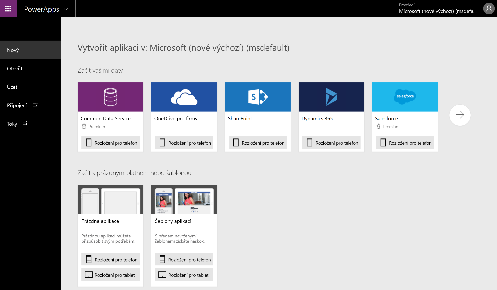
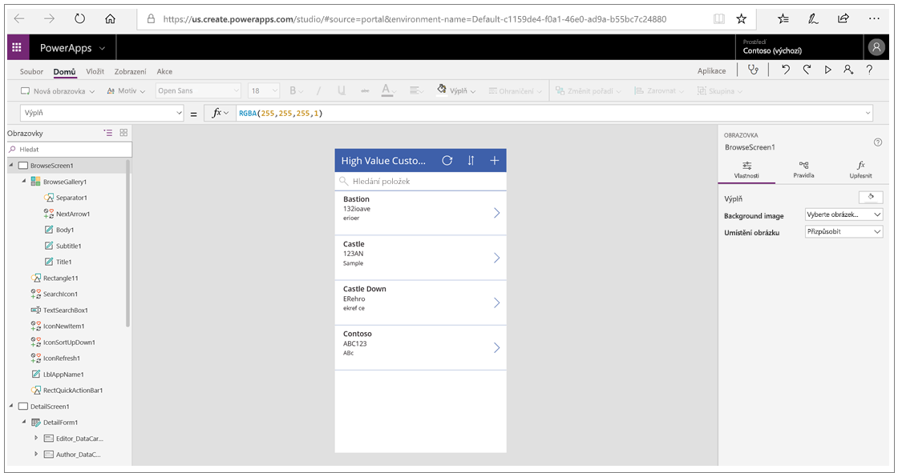
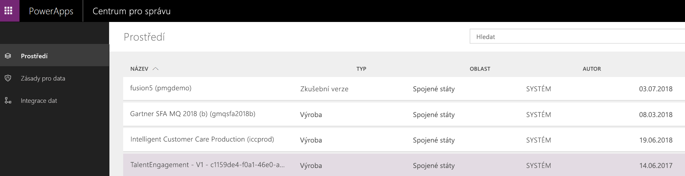

V první lekci jste se naučili hlavní části Microsoft PowerApps.In the first unit, you learned about the main parts of Microsoft PowerApps. Teď se na každou část podíváme podrobněji.We're now going to dive deeper into each part. Součásti PowerApps:The PowerApps components are:

* **web.powerapps.com:** Tady se spouštějí aplikace. Nezáleží přitom, jestli jste je vytvořili z dat, ukázkové aplikace nebo prázdné obrazovky.**web.powerapps.com**: Apps start here, whether you build them from data, a sample app, or a blank screen.
* **PowerApps Studio:** Tady můžete aplikace snadno připojit k datům, přidat a uspořádat prvky uživatelského rozhraní (takzvané ovládací prvky) a sestavovat vzorce.**PowerApps Studio**: Flesh out your apps by easily connecting to data, adding and arranging user interface (UI) elements (known as controls), and building formulas.
* **PowerApps Mobile:** Aplikace můžete spouštět na zařízeních se systémy Microsoft Windows, Apple iOS a Google Android.**PowerApps Mobile**: Run your apps on Microsoft Windows, Apple iOS, and Google Android devices.
* **Centrum pro správu PowerApps:** Umožňuje spravovat prostředí PowerApps a další součásti.**PowerApps admin center**: Manage PowerApps environments and other components.

## web.powerapps.comweb.powerapps.com
Pokud vytváříte aplikaci, začnete tady.If you are building an app, you'll start here. Aplikace můžete vytvářet z ukázkových aplikací, ze šablon nebo z prázdné obrazovky.You can build apps from sample apps, from templates, or from a blank screen. Na tomto portálu se zobrazí všechny aplikace, které jste vytvořili, společně se všemi aplikacemi, které vytvořili jiní uživatelé a vám je nasdíleli.All the apps that you've built appear here, along with any apps that others have created and shared with you.

## PowerApps StudioPowerApps Studio
V nástroji PowerApps Studio dolaďujete svoje aplikace, aby se z nich staly účinnější obchodní nástroje a aby byly atraktivnější.PowerApps Studio is where you flesh out your apps to make them more effective as a business tool and to make them more attractive. PowerApps Studio má tři podokna, díky kterým se tvorba aplikací podobá vytváření prezentace v Microsoft PowerPointu:PowerApps Studio has three panes that make creating apps feel more like building a slide deck in Microsoft PowerPoint:

- V levém podokně se zobrazuje hierarchická struktura všech ovládacích prvků na jednotlivých obrazovkách nebo miniatury jednotlivých obrazovek v aplikaci.Left pane, which shows a hierarchical view of all the controls on each screen or a thumbnail for each screen in your app.
- V prostředním podokně se zobrazuje aplikace, na které pracujete.Middle pane, which shows the app that you're working on.
- V pravém podokně nastavujete možnosti, jako jsou rozložení a zdroje dat pro určité ovládací prvky.Right pane, where you set options such as the layout and data sources for certain controls.

## PowerApps MobilePowerApps Mobile
PowerApps Mobile pro zařízení s Windows, iOSem nebo Androidem nabízí prostředí, kde najdete své aplikace a můžete je používat.PowerApps Mobile for Windows, iOS, and Android devices provides an environment where you can find and use your apps. Když chcete používat aplikace, které jste vytvořili a které s vámi sdílí jiní uživatelé, nemusíte otevírat samostatné obchody s aplikacemi.You don't need to open separate app stores to use all the apps that you've created and that others have shared with you. Pokud používáte aplikace v PowerApps Mobile, můžete maximálně využít možnosti svého zařízení, například ovládání fotoaparátu, poloha GPS a další funkce.When you use apps in PowerApps Mobile, you get the most out of your device's capabilities: camera controls, GPS location, and more.

## Centrum pro správuAdmin center
Centrum pro správu PowerApps je společným místem pro správu PowerApps v organizaci.The PowerApps admin center is the centralized place for managing PowerApps for an organization. Na tomto webu můžete definovat různá prostředí, do kterých se umísťují aplikace.On this site, you define different environments that house the apps. Můžete také definovat datová připojení a další prvky.You also define data connections and other elements. V centru pro správu také spravujete oprávnění a datová pravidla.The admin center is also where you manage permissions and data policies.

V další lekci se seznámíte se skupinou příbuzných technologií, které spolupracují s PowerApps, a společně tvoří účinný ekosystém pro vývoj aplikací.In the next unit, you'll learn about the set of related technologies that PowerApps works with to make a powerful ecosystem for app development.