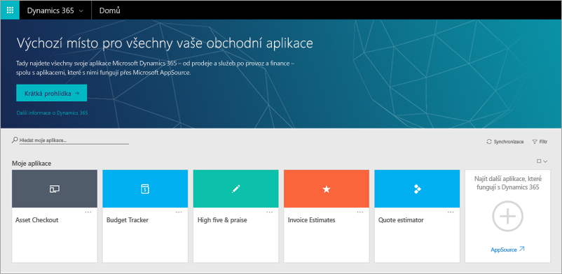
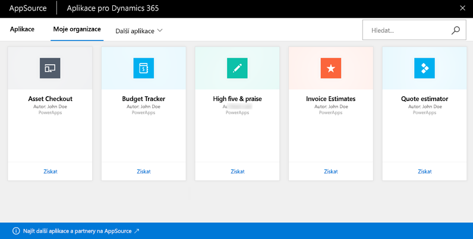
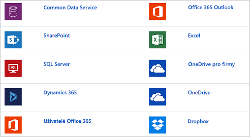

Microsoft PowerApps spolupracuje s dalšími technologiemi a společně vám pomáhají vytvářet a sdílet aplikace v organizaci.Microsoft PowerApps works with other technologies to help you build and share apps across your organization. Pojďme se na některé tyto technologie podívat:Let's take a look at some of these technologies:

- **Microsoft Dynamics 365:** Dynamics 365 je základem všech podnikových aplikací, jako je Microsoft Power BI, Microsoft Flow, Dynamics 365 for Talent a řada dalších.**Microsoft Dynamics 365**: Dynamics 365 is the home for all your business apps: Microsoft Power BI, Microsoft Flow, Dynamics 365 for Talent, and many others.
- **Microsoft AppSource:** V AppSource můžete sdílet aplikace a stahovat další aplikace, které mohou být pro vaši firmu užitečné.**Microsoft AppSource**: AppSource is where you share apps and download other apps that might be useful to your business.
- **Zdroje dat:** Firma nemůže být bez dat.**Data sources**: Without data, you don't have a business. Zdroje dat přinášejí do vašich aplikací cloudová a místní data.Data sources bring cloud and on-premises data into your apps. K datům získáváte přístup pomocí předdefinovaných připojení, vlastních konektorů a bran.You access data through built-in connections, custom connectors, and gateways.

## Dynamics 365Dynamics 365
Domovská stránka Dynamics 365 představuje jednotné místo, ze kterého můžete spouštět všechny své obchodní aplikace bez ohledu na to, jestli pocházejí od tvůrců aplikací ve vaší organizaci, z Microsoftu nebo z externích společností.The Dynamics 365 home page provides one place to run all your business apps, whether they come from app makers in your organization, Microsoft, or external companies.

## AppSourceAppSource
V AppSourcu můžete vyhledávat a vyhodnocovat aplikace od vašich spolupracovníků, Microsoftu a jeho partnerů.AppSource is the place to find and evaluate apps from your colleagues, from Microsoft, and from our partners. V PowerApps sdílíte aplikace do AppSourcu.In PowerApps, you share apps to AppSource. Uživatelé můžou tyto aplikace zobrazit a spustit v Dynamics 365 nebo na mobilních zařízeních.Users can then view and run those apps in Dynamics 365 or on mobile devices. V AppSourcu můžete nastavit aplikace jako dostupné veřejnosti nebo jenom lidem ve vaší organizaci.In AppSource, you can make your apps available to the public or just to people in your organization.

## Zdroje dat, připojení a brányData sources, connections, and gateways
V PowerApps můžete do svých aplikací přidat mnoho zdrojů dat prostřednictvím předdefinovaných nebo vlastních konektorů.In PowerApps, you can add many data sources to your apps through built-in or custom connectors. Tady jsou některé z nejoblíbenějších zdrojů dat.These data sources are some of the most popular.

Mnoho zdrojů dat jsou cloudové služby, třeba Salesforce.Many data sources are cloud services, like Salesforce. Zdrojem dat může být i Twitter, pokud například sledujete hashtagy své společnosti.Even Twitter can be a data source if, for example, you're tracking your company's hashtags. Konektory možná nepůsobí jako nejatraktivnější součást vývoje aplikací.Connectors might not feel like the coolest part of app development. Jsou ale nezbytné pro práci s daty, na kterých záleží vám, vašim kolegům a vašim zákazníkům.However, they're essential when you work with data that you, your colleagues, and your customers care about. A když aplikace poprvé zobrazí váš zdroj dat, najednou zjistíte, že jsou bezva.And when an app shows up with your data source for the first time, you'll suddenly find they're very cool!

Pokud data nejsou uložená v cloudu ale místně, můžete PowerApps spolehlivě připojit ke zdroji dat prostřednictvím brány.For data that's stored on-premises instead of in the cloud, you use a gateway to provide a reliable connection between PowerApps and your data source. Brána je na místním počítači a komunikuje s PowerApps.The gateway sits on an on-premises computer and communicates with PowerApps.

Teď víte více o všech částech PowerApps a souvisejících technologiích.You now know a little more about all the parts of PowerApps and related technologies. Při procházení tohoto modulu si dále prohloubíte své znalosti o každé části.As you go through this module, you'll continue to deepen your knowledge about each part.
