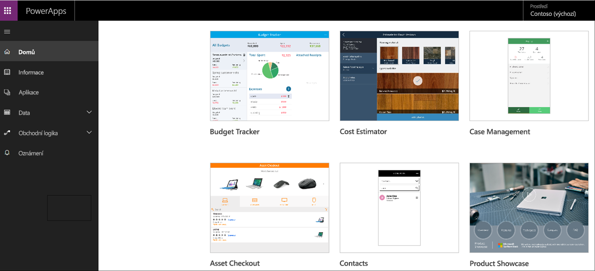
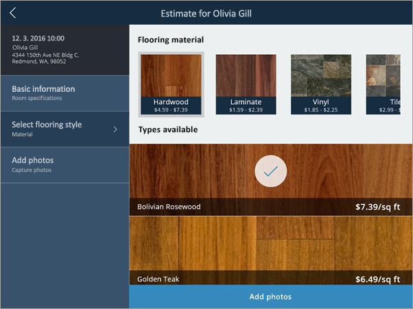
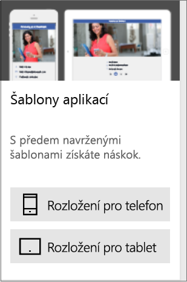
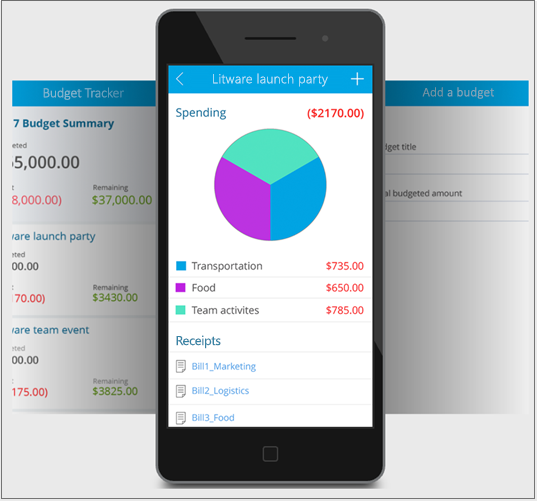
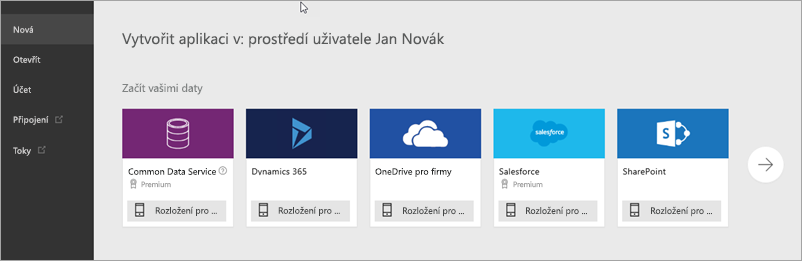
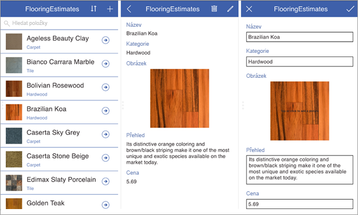

Když teď znáte základní informace, pusťme se do vytváření aplikace v Microsoft PowerApps.Now that you know the basics, let's get to building an app in Microsoft PowerApps.

## Způsoby vytváření PowerAppsWays to build PowerApps
V této lekci se podíváme na to, jak vytvořit aplikaci z ukázkové aplikace, šablony, sdílené aplikace nebo zdroje dat.In this unit, we'll look at how to create an app from a sample app, a template, a shared app, or a data source. Více praktických zkušeností s vytvářením aplikací získáme v další lekci.In the next unit, we'll get more hands-on with app creation.

### Vyzkoušení několika ukázkových aplikacíCheck out some sample apps
Na [https://web.powerapps.com](https://web.powerapps.com) najdete několik ukázkových aplikací, které můžete použít ve webovém prohlížeči.On [https://web.powerapps.com](https://web.powerapps.com), you'll be greeted with several sample apps that you can use in your web browser. Prozkoumejte je, abyste si rychle udělali představu, co může PowerApps přinést vaší firmě.Explore these apps to quickly get a sense of what's possible and how PowerApps can help your business.

Ukázkové aplikace zobrazíte tak, že kliknete na funkci **Vytvořit** v **nabídce**. Když se posunete dolů, uvidíte všechny dostupné ukázkové aplikace.To view sample apps, click on the **Create** function from the **Menu**, and scroll down to see al available sample apps.

Každá ukázková aplikace je navržená pro určitý účel, například:Each sample app is designed for a specific purpose, such as:

- Správa rozpočtuManaging a budget.
- Kontrola lokalityInspecting a site.
- Sledování lístků službyTracking service tickets.

Tyto ukázky také obsahují ukázková data pro vaši inspiraci.These samples also contain sample data to inspire your thinking. Třeba následující aplikace může obchodním zástupcům podlahářské firmy umožnit přesné a okamžité odhadování konečné ceny při návštěvách zákazníků.For example, this app can help service representatives for a flooring company give accurate and immediate cost estimates when they visit customer locations.

### Vytvoření aplikace ze šablonyCreate an app from a template
Dalším dobrým způsobem, jak vytvořit aplikaci, je začít ze šablony.Another good way to create an app is to start from a template. Šablony používají ukázková data, abyste získali představu, co je možné.Templates use sample data to help you get a sense of what's possible. Když je otevřete v PowerApps Studiu, můžete praktickým způsobem zjistit, jak je aplikace sestavená.By opening them in PowerApps Studio, you can learn hands-on how an app is built.

Například pomocí šablony pro sledování rozpočtu můžete vytvořit aplikaci, která vám pomůže sledovat rozpočet projektů a událostí, s vlastními kategoriemi, snadným zadáváním dat a vizuálními prvky, které zvýrazní výdaje kvůli snadnější kontrole.For example, you can use the Budget Tracker template to create an app that helps you track the budget for projects and events with custom categories, easy data entry, and visuals that highlight expenditures for easy inspection.

### Použití sdílených aplikacíUse shared apps
Pokud váš tým už začal používat PowerApps, možná už vám ostatní uživatelé nějaké aplikace nasdíleli.If your team has started to use PowerApps, others might have shared apps with you already. Pokud vám tvůrce aplikace udělil oprávnění k jejím úpravám, zobrazí se na web.powerapps.com, kde ji můžete otevřít, přizpůsobit a sdílet.If the app maker gave you permission to edit the app, it appears on web.powerapps.com, where you can open, customize, and share the app.

### Vytvoření aplikace ze zdroje datCreate an app from a data source
Skvělý způsob, jak začít, je vygenerovat aplikaci z vlastních dat.A great way to get started is to generate an app from your own data. Stačí nasměrovat PowerApps na požadovaný zdroj dat (třeba seznam na Microsoft SharePointu) a pak sledovat, jak PowerApps automaticky vytvoří tříobrazovkovou aplikaci.Just point PowerApps at the data source of your choice (for example, a list in Microsoft SharePoint), and watch as PowerApps automatically builds a three-screen app.

Tato aplikace byla vytvořena ze sharepointového seznamu a umožňuje procházet položky v seznamu, zobrazovat jejich podrobnosti a vytvářet a upravovat položky.This app was created from a SharePoint list and lets you browse items in the list, view item details, and create and edit items. Jakmile PowerApps aplikaci vygeneruje, můžete ji přizpůsobit, aby vypadala a chovala se přesně tak, jak chcete.After PowerApps generates an app, you can customize it to make it look and behave exactly the way you want.

### Vytvoření od začátkuBuild from the ground up
Můžete také vytvořit aplikaci úplně od začátku a postupně přidat všechny součásti.You can also build an app from scratch and add all the pieces as you go. Pak své pokusy můžete rozšířit a popustit uzdu fantazii.You can then branch out and let your imagination run wild. Dále v tomto modulu k tomu bude spousta příležitostí.There will be plenty of that later in this module!

Nejjednodušší způsob, jak se o PowerApps něco dozvědět, je začít s ukázkovou aplikací, otevřít šablonu nebo se připojit ke zdroji dat a nechat PowerApps vygenerovat aplikaci za vás.The easiest way to learn about PowerApps is to start with a sample app, open a template, or connect to your data source and have PowerApps generate the app for you.

V další lekci se dozvíte, jak vygenerovat aplikaci z dat.In the next unit, you'll learn how to generate an app from data.
